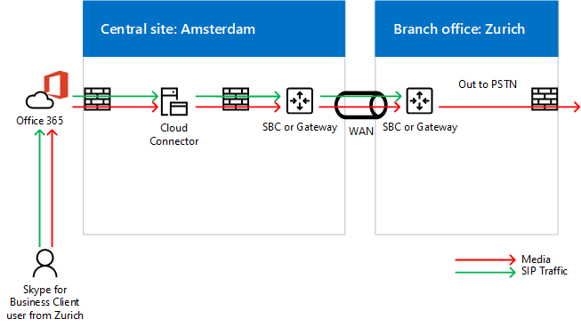

# Pianificare il bypass multimediale in Cloud Connector Edition
 
Leggere questo argomento per esaminare le considerazioni sulla pianificazione per l'implementazione di bypass multimediale con Cloud Connector Edition versione 2,0 e successive. Per informazioni sulla distribuzione di bypass multimediale, vedere [distribuire il bypass multimediale in Cloud Connector Edition](deploy-media-bypass-in-cloud-connector.md).
  
Il bypass multimediale consente a un client di inviare elementi multimediali direttamente alla rete PSTN (Public Switched Telephone Network) Next Hop, ovvero un gateway o un border controller (SBC), ed eliminare il componente cloud Connector Edition dal percorso multimediale.
  
Il bypass multimediale può migliorare la qualità della voce riducendo la latenza, la possibilità di perdita di pacchetti e il numero di punti di potenziale errore. L'eliminazione dell'elaborazione multimediale per le chiamate bypassate riduce il connettore load on cloud, che consente un numero maggiore di chiamate simultanee e può migliorare la scalabilità. 
  
 La liberazione del connettore cloud dalle attività di elaborazione multimediale può ridurre il numero di appliance di connessione Cloud necessarie per l'infrastruttura, quindi è consigliabile abilitare il bypass multimediale ogni volta che è possibile.
  
## Come l'esclusione media influenza i percorsi multimediali e di segnalazione

Mentre la segnalazione ha lo stesso percorso con o senza bypass multimediale, il flusso multimediale sarà diverso. I diagrammi seguenti mostrano percorsi multimediali e di segnalazione nelle topologie con e senza bypass multimediale. 
  
Ad esempio, nella topologia seguente, che non usa il bypass multimediale, un client Skype for business effettua una chiamata PSTN a un numero esterno, la segnalazione SIP passa a Office 365 e Office 365 quindi indirizza il traffico di segnalazione in base alla voce dell'utente finale criteri. Per gli utenti di Cloud Connector, il criterio vocale indirizza il traffico di segnalazione al server Edge del Cloud Connector, che indirizza il traffico di segnalazione a un SBC o a un gateway di sessione PSTN tramite Cloud Connector Mediation Server. I flussi multimediali dal client Skype for business al Cloud Connector Mediation Server e quindi a SBC o gateway, come illustrato nel diagramma seguente:
  
**Percorsi multimediali e di segnalazione senza bypass multimediale**

  
Una chiamata in ingresso dalla rete PSTN usa lo stesso percorso di segnalazione nella direzione inversa. Per gli utenti interni, i contenuti multimediali continueranno a fluire tra il client Skype for business e il Cloud Connector Mediation Server e quindi l'SBC o il gateway.
  
Nella prossima topologia, che consente di usare il bypass multimediale, la segnalazione ha lo stesso percorso, ma i flussi multimediali sono diretti direttamente tra il client Skype for business e il SBC o il gateway, come illustrato nel diagramma seguente:
  
**Percorsi multimediali e di segnalazione con bypass multimediale**

  
## Scenario multisito e bypass multimediale

Il bypass multimediale è utile anche quando si vuole che i servizi di telefonia vengano forniti a più siti usando un singolo accessorio per il Cloud Connector. Dato che Cloud Connector non può instradare le chiamate in base a numeri di origine o di destinazione, la maggior parte delle aziende distribuisce un SBC o un gateway dietro il Cloud Connector per prendere decisioni L'esclusione multimediale in questo scenario elimina l'hop tra il client e l'SBC centrale o il gateway, come illustrato nel diagramma seguente:
  
**Applicazione multisito**

  
1. Il traffico SIP scorre dall'utente di Zurigo a Office 365.
    
2. Il traffico viene quindi indirizzato all'appliance Cloud Connector di Amsterdam, come specificato nel criterio di routing vocale dell'utente.
    
3. L'appliance Cloud Connector di Amsterdam invia il traffico SIP al gateway centrale di Amsterdam.
    
4. Il gateway centrale di Amsterdam prende le opportune decisioni di routing e quindi invia il traffico a un SBC o a un gateway di Zurigo, mentre l'elemento multimediale passa direttamente tra il client Skype for business e il SBC o il gateway di Amsterdam.
    
   Questo approccio consente di servire più utenti per una distribuzione di Cloud Connector in cui è centralizzato Cloud Connector. Anche se il connettore Cloud viene eliminato dal percorso multimediale, in un supporto di scenario multisito centralizzato potrebbe essere ancora possibile attraversare la WAN due volte per passare attraverso il gateway o SBC centralizzato.
  
Se un client si trova all'esterno della rete aziendale che effettua una chiamata in uscita, il traffico multimediale passa attraverso i server Edge e Mediation of Cloud Connector e WAN link tra Zurigo e Amsterdam, come illustrato nel diagramma seguente:
  

  
## Client supportati per il bypass multimediale

Con la prima versione di bypass multimediale, l'unico client supportato è il client Windows Skype for business 2016 che fa parte di Office 365 ProPlus, versione 16.0.7870.2020 o successiva. I clienti possono usare qualsiasi canale: deferred Current, Deferred o First release. 
  
> [!NOTE]
> Se si usa una soluzione VPN client in combinazione con il client Skype for business, il bypass multimediale è supportato solo con una configurazione con tunnel separati VPN. 
  
Per altre informazioni sui canali di rilascio, vedere [Panoramica dei canali di aggiornamento per Office 365 ProPlus](https://support.office.com/en-us/article/Overview-of-update-channels-for-Office-365-ProPlus-9ccf0f13-28ff-4975-9bd2-7e4ea2fefef4?ui=en-US&amp;rs=en-US&amp;ad=US).
  
Per la versione di rilascio corrente dei client in canali diversi, vedere [rilasciare informazioni per gli aggiornamenti a Office 365 ProPlus](https://docs.microsoft.com/officeupdates/release-notes-office365-proplus). 
  
## Considerazioni sulla capacità del connettore Cloud con il bypass multimediale

Senza bypass multimediale e, a seconda dell'hardware, un dispositivo Cloud Connector può gestire da 50 a 500 chiamate simultanee che richiedono il supporto per l'attraversamento di un Mediation Server. Per altre informazioni, Vedi [piano per Skype for Business Cloud Connector Edition](https://technet.microsoft.com/en-us/library/mt605227.aspx). 
  
Con il bypass multimediale abilitato, i client interni della versione supportata non usano il Mediation Server, quindi il numero di client interni può aumentare in modo significativo. 
  
Come indicato in precedenza, i client esterni o i client non supportati useranno il Edge Connector cloud e i Mediation Server per gli elementi multimediali. Quando si calcola il numero di appliance di connettori cloud da inserire in un sito, è necessario considerare il traffico di utenti e utenti esterni nei client non supportati.
  
## Cloud Connector supporta sempre la modalità bypass

Cloud Connector supporta sempre la modalità di bypass. In ambienti locali esistono due opzioni: Ignora sempre e usa le informazioni sul sito e le aree geografiche.
  
Ignora sempre significa che il bypass multimediale verrà tentato per tutte le chiamate PSTN con client interni come punto di origine o di destinazione. Per determinare se il client è interno o esterno, viene usato un sito Web nella macchina virtuale Mediation Server. Se il client può raggiungere il sito, viene considerato interno e viene usato il bypass multimediale. Se il client non riesce a raggiungere il sito, ad esempio il client si trova in una rete domestica, non viene usato il bypass multimediale. 
  
Il bypass richiede sempre la connettività senza ostacoli tra gli utenti e i gateway PSTN all'interno di un sito PSTN. 
  
Per altre informazioni, Vedi [piano per Skype for Business Cloud Connector Edition](https://technet.microsoft.com/en-us/library/mt605227.aspx). 
  
Ad esempio, nel diagramma seguente gli utenti europei devono essere ben connessi ai tre session border controller (SBCs) di Amsterdam, mentre gli utenti occidentali degli Stati Uniti devono essere ben connessi alle due SBCs di Seattle. La connessione corretta indica che si trovano nello stesso sito di rete di SBCs o gateway oppure su collegamenti WAN con larghezza di banda appropriata.
  

  
> [!NOTE]
> Se un utente di Zurigo si reca all'ufficio di Seattle e si vuole usare la rete interna per distribuire il traffico multimediale tra l'utente e i gateway in Europa (invece di passare a Internet), è necessario verificare che l'ufficio di Seattle e l'Amsterdam Office in cui si trovano i SBCs o i gateway europei qualificati e connessi. 
  
## Codec usati nel bypass multimediale

Con il bypass multimediale abilitato, il traffico multimediale tra un client e un SBC o un gateway usa il codec G. 711. 
  
## Vedere anche

[Distribuire il bypass multimediale in Cloud Connector Edition](deploy-media-bypass-in-cloud-connector.md)
