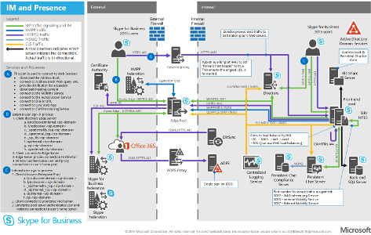

# Diagrammi tecnici per Skype for Business Server

**Riepilogo:** Esaminare questi poster in base alle esigenze durante la pianificazione, l'implementazione o la gestione Skype for Business Server.

Queste risorse sono disponibili in Visio (.vsdx) (Visio 2015) e in formato PDF. Per informazioni su come stampare documenti, vedere Suggerimenti [per la stampa di poster di grandi dimensioni.](technical-diagrams.md#tips)

Per visualizzare questi file potrebbe essere necessario software aggiuntivo. Per ulteriori informazioni, vedere la tabella seguente.

|Tipo file|Software|
|:--- |:--- |
|.vsd |Visio 2010, Visio 2013 o il visualizzatore [Visio gratuito](https://go.microsoft.com/fwlink/p/?LinkId=393676)   Se si utilizza il Visualizzatore di Visio, fare clic con il pulsante destro del mouse sul collegamento VSD, scegliere **Salva oggetto con nome**, salvare il file nel computer in uso e quindi aprire il file da tale computer. |
|.pdf |Qualsiasi visualizzatore di file PDF, ad esempio [Adobe Reader](https://go.microsoft.com/fwlink/p/?LinkId=393675) |
|.zip |Qualsiasi utilità di compressione file. Windows 7 e versioni successive questi file vengono aperti in modo nativo. |

## Poster

Questi poster trattano in dettaglio un'area tecnica specifica e devono essere utilizzati con gli articoli o i contenuti corrispondenti disponibili nell'area download.

Per ulteriori informazioni sull'utilizzo di Microsoft Teams, vedere Microsoft Teams [poster sull'architettura IT](/MicrosoftTeams/teams-architecture-solutions-posters)e sulle soluzioni di telefonia.

|Titolo|Descrizione|
|:---|:---|
|**Skype for Business Server Carichi di lavoro protocollo**   [Versione PDF](https://go.microsoft.com/fwlink/p/?LinkId=550989) (ideale per dispositivi mobili o tablet)   [Visio (ideale](https://go.microsoft.com/fwlink/p/?LinkId=550991) per gli utenti con Visio) |Scaricare questo poster per comprendere meglio i requisiti dei Skype for Business e dei client con diversi livelli di complessità del servizio.    Dimensioni: 11 per 17 pollici (più fogli, con dimensioni convenienti per la stampa nella maggior parte delle stampanti per ufficio)     Questo poster è stato creato Visio 2015. Non è necessario apportare alcuna modifica per un ambiente specifico. |
|**Skype for Business Metodologia di qualità delle chiamate**   [versione PDF](https://go.microsoft.com/fwlink/p/?LinkId=617899) (ideale per dispositivi mobili o tablet computer)   [Visio (ideale](https://go.microsoft.com/fwlink/p/?LinkId=617900) per gli utenti con Visio) |Scaricare questo poster per informazioni su CQM, la metodologia di qualità delle chiamate per Skype for Business Server 2015 che consente di individuare ed eliminare i problemi che influiscono sulla qualità delle chiamate e sull'esperienza utente per le implementazioni che includono funzionalità vocali aziendali.     Usa la [pagina dei dettagli del](https://go.microsoft.com/fwlink/p/?LinkId=617898) download per ottenere le carte e le regole stampabili se vuoi giocare come gioco da tavolo. Utilizzare questo poster con [la scorecard CQM.](https://go.microsoft.com/fwlink/p/?LinkId=617904)    Dimensioni: 34 per 44 pollici     Questo poster è stato creato Visio 2015. Non è necessario apportare alcuna modifica per un ambiente specifico. |
|**Skype for Business Soluzioni vocali**      [Versione PDF](https://go.microsoft.com/fwlink/?linkid=869123) (ideale per dispositivi mobili o tablet)   [Visio (ideale](https://go.microsoft.com/fwlink/?linkid=869124) per gli utenti con Visio) |Microsoft offre un'ampia gamma di opzioni per consentire agli utenti di chiamare telefoni fissi e telefoni cellulari tramite la rete PSTN (Public Switched Telephone Network), indipendentemente dal fatto che gli account siano presenti in Microsoft 365 o Office 365 in Skype for Business Online o nella distribuzione di Skype for Business Server 2015 locale. In questo poster vengono descritte le diverse offerte vocali Microsoft e vengono fornite indicazioni sulle opzioni più utili, a seconda dello stato corrente dell'organizzazione e dei piani futuri.     Dimensioni: 34 per 44 pollici    Questo poster è stato creato Visio 2015. Non è necessario apportare alcuna modifica per un ambiente specifico. |
|**Skype for Business Modelli architettonici**      [Versione PDF](https://go.microsoft.com/fwlink/?linkid=869125) (ideale per dispositivi mobili o tablet)   [Visio (ideale](https://go.microsoft.com/fwlink/?linkid=869126) per gli utenti con Visio) |Questa serie di poster è destinata al pubblico del Pro IT per aumentare la consapevolezza dei diversi modelli architettonici fondamentali attraverso i quali è possibile utilizzare Skype for Business Online e Skype for Business Server 2015 in locale. Iniziare con la configurazione più adatta alle esigenze dell'organizzazione e ai piani futuri. Valutare e utilizzare le altre secondo necessità. Ad esempio, è consigliabile considerare l'integrazione con Exchange e SharePoint o una soluzione che sfrutta l'offerta Cloud PBX di Microsoft.    Dimensioni: 11 per 17 pollici    Questo poster è stato creato Visio 2010. Non è necessario apportare alcuna modifica per un ambiente specifico. |

## Asset visivi

Se si desidera creare diagrammi di Visio personalizzati utilizzando i nuovi Skype for Business, [scaricare gli stencil](https://go.microsoft.com/fwlink/p/?LinkId=550985).

## Suggerimenti per la stampa di poster di grandi dimensioni

Se si dispone di un plotter, è possibile stampare poster di grandi dimensioni. Se non si dispone di un plotter, eseguire la procedura seguente per stampare su carta più piccola, ad esempio 11"x17". La stampa di un poster di grandi dimensioni su carta più piccola può rendere il testo difficile o impossibile da leggere.

### Stampare poster su carta di dimensioni più piccole

1. Aprire il poster in Visio.
2. Scegliere **Imposta pagina** dal menu **File**.
3. Nella sezione **Formato carta stampante** della scheda **Imposta stampante** selezionare il formato carta su cui stampare.
4. Nella sezione **Proporzioni** della scheda **Imposta stampante** fare clic su **Adatta a** e quindi specificare **1 pagine di larghezza per 1 di altezza**.
5. Nella scheda **Dimensioni** fare clic su **Adatta a contenuto del disegno** e quindi su **OK**.
6. Scegliere **Apri** dal menu **File**.