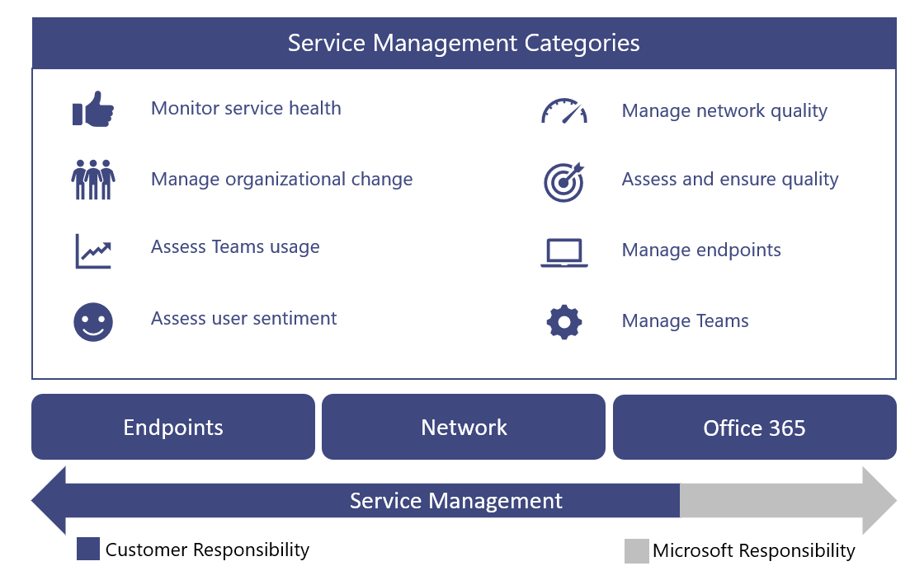

# Gestire il servizio

Questo articolo offre una panoramica dei requisiti per il corretto funzionamento dei servizi vocali cloud per l'organizzazione. Grazie al corretto funzionamento dei servizi vocali cloud, si può essere certi di offrire un'esperienza affidabile e di alta qualità per l'organizzazione.

## Introduzione alla Guida operativa

La Guida operativa offre una panoramica di tutte le attività e le attività necessarie nell'ambito della funzione di gestione dei servizi per Microsoft Teams.

La gestione dei servizi è un argomento generale che illustra le operazioni quotidiane del servizio Microsoft Teams dopo che è stato distribuito e abilitato per gli utenti. Il Teams include Microsoft 365 o Office 365 e i componenti dell'infrastruttura distribuiti in locale, ad esempio la rete.

La nozione di gestione dei servizi non è probabilmente un nuovo concetto per la maggior parte delle organizzazioni. È possibile che siano già stati implementati processi e attività associati a servizi esistenti. Detto questo, è probabile che sia possibile aumentare i processi correnti quando si pianifica oggi stesso la gestione dei servizi per supportare Teams in futuro.

La gestione dei servizi include tutte le attività e i processi coinvolti nella gestione dei Teams end-to-end. Come illustrato in precedenza, alcuni componenti della gestione dei servizi, ovvero l'infrastruttura di cui è costituito il servizio Microsoft 365 o Office 365 stesso, sono responsabilità di Microsoft, mentre l'utente, il cliente, è responsabile per gli utenti di gestire i vari aspetti di Teams, la rete e gli endpoint forniti.

Le attività e le attività di questa guida sono raggruppate in otto categorie, come illustrato nel diagramma seguente. Ognuna di queste categorie verrà espansa nelle sezioni seguenti.

<table>
<tr><td>  Punti decisionali</td><td><ul><li>Decidere come verranno implementate le operazioni per Teams.</li></ul></td></tr>
<tr><td> Passaggi successivi</td><td><ul><li>Esaminare la Guida operativa per intero.</li><li>Implementare una strategia operativa in linea con gli obiettivi dell'organizzazione per garantire la qualità e l'affidabilità dei carichi di lavoro vocali nel cloud.</li><li>Controllare [la qualità delle chiamate di Monitor](monitor-call-quality-qos.md).</li><li> Implementare una strategia operativa per eseguire regolarmente le revisioni della qualità dell'esperienza per assicurarsi che la distribuzione vocale nel cloud funzioni al massimo delle funzionalità.</li></ul></td></tr>
</table>

### Mapping dei ruoli operativi

La pianificazione avviata per le operazioni durante la fase di Envision è fondamentale, perché le attività operative iniziano quando sono abilitati i primi utenti pilota. Questa guida elenca le attività e le attività che devono essere eseguite su base giornaliera, settimanale, mensile o necessaria per mantenere una distribuzione di Teams qualità elevata. Questa guida fornisce informazioni e indicazioni su come eseguire queste attività e attività critiche.

Un componente fondamentale di una distribuzione riuscita è garantire che la pianificazione eseguita all'inizio della fase di Envision includa la determinazione degli utenti responsabili dell'esecuzione di attività specifiche. Dopo aver compreso quali attività e attività si applicano alla distribuzione, è necessario comprenderle e seguirle con i gruppi o gli utenti assegnati.

Ogni team identificato deve rivedere e concordare le attività e le responsabilità identificate e iniziare la preparazione. Questo può includere formazione e preparazione, fornendo aggiornamenti al piano di personale o verificando che i provider esterni siano pronti per la distribuzione.

Le attività e i ruoli definiti in questa guida devono essere validi nella maggior parte degli scenari, ma ogni Teams distribuzione è univoca. Pertanto, è possibile usare questa guida come punto di partenza per personalizzare le attività e i ruoli predefiniti in base alle proprie esigenze.

Assicurarsi che ogni team che si è in grado di eseguire il servizio abbia una buona conoscenza delle attività necessarie. È fondamentale che ogni team accetti e disdegni la responsabilità nell'organizzazione prima dell'inizio del primo progetto pilota.

Dopo aver raggiunto un accordo, i team corrispondenti dovrebbero iniziare a mettere in funzione i loro ruoli.

<table>
<tr><td> Passaggi successivi</td>
<td><ul><li>Usare questo documento per facilitare l'esercizio di mappatura dei ruoli operativi.</li><li>Incontrarsi con i rispettivi team di supporto per assegnare nomi a ogni elemento nell'elenco delle attività richieste.</li><li>Ottenere l'accettazione o la disconnessione per i ruoli assegnati.</li><li>Assicurarsi che i team corrispondenti siano in grado di disporre della formazione, della preparazione e delle risorse appropriate per completare le attività necessarie.</li></ul></td></table>

### Teams dei servizi

Microsoft Teams riunisce tecnologie in Microsoft 365 o Office 365 per fornire un hub per il lavoro in team. Di seguito sono riportati alcuni esempi:

-   Azure Active Directory (Azure AD) fornisce servizi di autenticazione e autorizzazione per Teams.

-   Exchange Online funzionalità avanzate come il blocco legale e l'individuazione elettronica.

-   SharePoint Online offre la possibilità di condividere file nei canali e OneDrive for Business un meccanismo per la condivisione di file all'interno di una chat privata.

Le organizzazioni possono anche sfruttare gli investimenti esistenti nell'infrastruttura locale. Ad esempio, gli account di Active Directory locali esistenti possono essere usati per l'autenticazione usando azure AD Connessione. Alcune versioni di Exchange Server possono essere usate al posto di Exchange Online.

Queste tecnologie si uniscono per offrire agli utenti una suite di comunicazioni ricca, collaborativa e intelligente. Questa stretta integrazione è un vantaggio fondamentale per Teams, ma è anche un requisito per la gestione dei servizi in queste tecnologie.

Questa guida illustra le aree principali di interesse per la gestione del Teams servizio. È molto probabile che siano disponibili piani di gestione dei servizi per le tecnologie di supporto da Teams dipende. In caso contrario, sarà necessario definire piani di gestione dei servizi adeguati anche per questi componenti tecnologici (sia locali che online). In questo modo gli utenti potranno usufruire di un'esperienza affidabile e di alta qualità con Teams.

#### Riferimenti 

[Panoramica delle Microsoft Teams](teams-overview.md)

[Interazione tra Exchange e Microsoft Teams](exchange-teams-interact.md)

[Modalità di interazione di SharePoint Online e OneDrive for Business con Microsoft Teams](sharepoint-onedrive-interact.md)

[Microsoft Teams e Skype for Business coesistenza e interoperabilità](teams-and-skypeforbusiness-coexistence-and-interoperability.md)

<!--ENDOFSECTION-->

## Attività della Guida operativa

Le sezioni seguenti offrono una panoramica delle attività necessarie per il corretto funzionamento del Microsoft Teams servizio. Includono riferimenti a strumenti, informazioni contestuali e altri contenuti che consentono di comprendere l'attività e di agevolare le iniziative di conformità.

<!--ENDOFSECTION-->

## Monitorare l'integrità dei servizi

È importante comprendere l'integrità generale del servizio Microsoft Teams in modo da avvisare in modo proattivo gli altri utenti dell'organizzazione di qualsiasi evento che influisca sul servizio. Come descritto in precedenza, Teams dipende da altri servizi di Microsoft 365 o Office 365, ad esempio Azure Active Directory, Exchange Online, SharePoint Online e OneDrive for Business. Per questo è altrettanto importante monitorare l'integrità dei servizi dipendenti.

Incorporare questa attività nel processo di gestione degli incidenti per informare in modo proattivo gli utenti, l'helpdesk e i team delle operazioni per prepararsi a gestire le escalation degli utenti.

Le sezioni seguenti descrivono gli strumenti  che è possibile usare per monitorare gli eventi imprevisti del servizio che influiscono sul Teams servizio. Nella tabella seguente è incluso un riepilogo dei vantaggi di ogni strumento e quando è consigliabile usarli.

| Strumento di monitoraggio                       | Vantaggi                                            | Quando usare                                                                                  |
|---------------------------------------|-----------------------------------------------------|----------------------------------------------------------------------------------------------|
| interfaccia di amministrazione di Microsoft 365                     | Disponibile da qualsiasi dispositivo con un browser supportato. | Da usare quando non sono necessarie notifiche in tempo reale.                                          |
| Microsoft 365 o Amministrazione di Office 365 app                  | Fornisce notifiche push al dispositivo mobile.  | Da usare quando è necessario ricevere una notifica degli incidenti del servizio mentre si è in viaggio.                  |
| Microsoft System Center               | Integrazione con Microsoft System Center.           | Da usare quando sono necessarie funzionalità di monitoraggio avanzate e supporto delle notifiche.                       |
| Microsoft 365 o Office 365 Service Communications API | Accesso a livello di programmazione Microsoft 365 o Office 365 integrità dei servizi.   | Da usare quando è necessaria l'integrazione con uno strumento di monitoraggio di terze parti o si vuole creare una soluzione personalizzata. |

> [!NOTE]
> Solo gli utenti a cui è assegnato **il ruolo di amministratore globale** o amministratore del **servizio** possono visualizzare l'integrità del servizio.

### Monitoraggio con il interfaccia di amministrazione di Microsoft 365

Il [interfaccia di amministrazione di Microsoft 365](https://portal.office.com/) fornisce un [dashboard integrità](https://portal.office.com/adminportal/home#/servicehealth) dei servizi in cui è possibile visualizzare l'integrità corrente del servizio Teams oltre ai servizi dipendenti.

### Monitoraggio con l'app per dispositivi mobili

L Microsoft 365 o Amministrazione di Office 365 app è disponibile in Apple iOS, Android e Windows (PC e dispositivi mobili). L'app fornisce agli amministratori del servizio informazioni sull'integrità dei servizi e sulle modifiche imminenti. L'app supporta le notifiche push che possono avvisare l'utente quasi immediatamente dopo che è stato pubblicato un avviso. In questo modo è possibile rimanere sempre al corrente dello stato, dell'integrità e delle eventuali modifiche imminenti al servizio. Il supporto delle notifiche lo rende lo strumento di monitoraggio consigliato per gli amministratori. Per ulteriori informazioni, vedere:

[Amministrazione di Office 365 App per dispositivi mobili](https://support.office.com/article/Office-365-Admin-Mobile-App-e16f6421-2a1a-4142-bf9d-9846600a060a)

[Scaricare l'app Amministrazione di Office 365 per dispositivi mobili](https://products.office.com/business/manage-office-365-admin-app)

### Monitoraggio con Microsoft System Center

Microsoft System Center è una piattaforma di gestione integrata che consente di gestire data center, dispositivi client e ambienti IT cloud ibridi. Office 365 amministratori che usano System Center ora hanno la possibilità di importare il Management Pack di Office 365, che consente loro di visualizzare tutte le comunicazioni dei servizi all'interno di Operations Manager in System Center. Questo strumento consente di accedere allo stato dei servizi sottoscritti, agli incidenti di servizio attivi e risolti e alle comunicazioni del Centro messaggi (modifiche imminenti). Per altre informazioni, vedere il post di [blog seguente.](https://blogs.office.com/2014/07/29/new-office-365-admin-tools/?eu=true)

Se si usa System Center per monitorare l'integrità dei servizi Teams (e i servizi dipendenti), è possibile personalizzare ulteriormente il Management Pack in modo da avvisare o inviare notifiche a gruppi o utenti specifici identificati per reagire agli eventi imprevisti.
Questi gruppi possono includere proprietari di servizi, helpdesk, gruppi di supporto di secondo livello e di terzo livello e responsabili degli incidenti nell'organizzazione.

### Monitoraggio per scenari avanzati

È possibile monitorare l'integrità dei servizi e le modifiche imminenti sfruttando l'API Office 365 Service Communications per accedere Office 365 l'integrità dei servizi e le modifiche a livello di programmazione. Usare questa API per creare uno strumento di monitoraggio personalizzato o connettere gli strumenti di monitoraggio esistenti alle comunicazioni dei servizi Office 365, semplificando potenzialmente il modo in cui si monitora l'ambiente. Per altre informazioni, vedere Office 365 [per Enterprise sviluppatori.](https://developer.microsoft.com/office)

### Attività giornaliere/settimanali/mensili/necessarie

| Attività               | Descrizione                                                                                                                                                                                                               | Cadenza   | Team assegnato |
|------------------------|---------------------------------------------------------------------------------------------------------------------------------------------------------------------------------------------------------------------------|-----------|---------------|
| Monitorare l'integrità dei servizi | Monitorare in modo proattivo Microsoft Teams dell'integrità dei servizi (e dei servizi dipendenti) usando gli strumenti disponibili. I servizi dipendenti includono: Exchange Online, SharePoint Online, OneDrive for Business, Azure Active Directory. | In tempo reale |               |
| Notifica degli eventi imprevisti  | Notificare agli stakeholder interni gli eventi che influiscono sul Teams servizio. Gli stakeholder interni possono includere utenti, helpdesk e responsabili degli incidenti.                                                                          | In base alle esigenze |               |

### Riferimenti 

[Come verificare l'integrità Office 365 servizio](https://support.office.com/article/How-to-check-Office-365-service-health-932AD3AD-533C-418A-B938-6E44E8BC33B0)

[Verificare l'integrità del servizio per Microsoft Teams](service-health.md)

[Integrità e continuità dei servizi](/office365/servicedescriptions/office-365-platform-service-description/service-health-and-continuity)

<!--ENDOFSECTION-->

## Gestire le modifiche dell'organizzazione

Microsoft Teams è un servizio basato sul cloud. In questo modo viene fornita la possibilità di fornire nuove funzionalità e funzionalità a un ritmo rapido. L'innovazione continua offre un vantaggio evidente alle organizzazioni, ma queste modifiche devono essere gestite in modo appropriato all'interno dell'organizzazione per evitare la resistenza degli utenti o le escalation all'helpdesk.

Gli aggiornamenti Teams vengono installati automaticamente per gli utenti. Gli utenti avranno sempre a disposizione il client e le funzionalità più recenti nel Teams servizio. Non è possibile gestire l'implementazione degli aggiornamenti Teams per gli utenti, quindi è fondamentale gestire il cambiamento attraverso programmi efficaci di comunicazione, formazione e adozione. Se gli utenti sono a conoscenza del cambiamento, sono informati sui vantaggi e hanno il potere di sfruttare le nuove funzionalità, saranno in grado di adattarsi più rapidamente e di accogliere con favore &mdash; il cambiamento.

### Monitoraggio delle modifiche

Il primo passaggio nella gestione delle modifiche consiste nel monitorare le modifiche pianificate per Teams. La fonte migliore per il monitoraggio di queste modifiche è la roadmap di [Office 365](https://products.office.com/business/office-365-roadmap), che elenca le caratteristiche attualmente in fase di sviluppo, che sono state estense ai clienti o che sono state completamente avviate. È possibile cercare Teams specifiche usando il filtro fornito oppure scaricare la roadmap in un file Excel per un'ulteriore analisi. Per ogni caratteristica, la roadmap fornisce una breve descrizione, insieme alla data di rilascio prevista.

Nel [blog Microsoft Teams](https://techcommunity.microsoft.com/t5/Microsoft-Teams-Blog/bg-p/MicrosoftTeamsBlog)informazioni sulle procedure consigliate, le tendenze e le notizie sugli aggiornamenti Teams prodotto. Aspettatevi di trovare gli aggiornamenti principali delle funzionalità Teams verranno annunciati qui. È anche possibile sottoscrivere il blog tramite un feed RSS. È quindi possibile aggiungere [il feed RSS](https://techcommunity.microsoft.com/gxcuf89792/rss/board?board.id=MicrosoftTeamsBlog) direttamente in un canale Teams, in modo che tutte le notizie importanti vengono recapitate direttamente all'interno di Teams.

Tutte le funzionalità rilasciate sono documentate nelle note sulla versione [per Microsoft Teams](https://support.office.com/article/Release-notes-for-Microsoft-Teams-d7092a6d-c896-424c-b362-a472d5f105de).
Ecco un elenco delle funzionalità rilasciate per dispositivi desktop, Web e dispositivi mobili. Lo stesso set di note sulla versione è disponibile anche **nella** scheda Novità della [Guida.](get-help-in-microsoft-teams.md)

Acquisire familiarità con le risorse disponibili e assicurarsi di assegnare i proprietari applicabili per il monitoraggio delle modifiche.

### Pianificazione della modifica

Ora che si è a conoscenza delle prossime modifiche al servizio Teams, il passaggio successivo consiste nel preparare e pianificare di conseguenza. Valutare ogni modifica per determinare quali modifiche richiedono la comunicazione agli utenti, le campagne di consapevolezza, la formazione per i team di supporto o gli utenti oppure le campagne di valutazione e adozione delle caratteristiche. Questo è il ruolo principale di un team di gestione delle modifiche nell'organizzazione. Di seguito è riportata una raccolta di tabelle di esempio che consentono di pianificare le modifiche.

#### Caratteristica: Registrazione cloud (data di rilascio: gennaio 2018)

**Traccia generale**

| Modificare la conformità | Stato   | Note/passaggi successivi | Proprietario |
|----|----|----|-----|
| Revisione legale   | Completato     | Questa caratteristica è un prerequisito per l'onboarding del team di formazione. | Project team  |

**Gestione delle modifiche tecniche**

|       Modificare la conformità       | Stato |                      Note/passaggi successivi                      |    Proprietario     |
|------------------------------|--------|------------------------------------------------------------|--------------|
|     Modifiche IT obbligatorie      |  Sì   | L'amministratore deve abilitare la registrazione solo per gli utenti identificati. | Team di supporto |
| Conformità tecnica completata |  Sì   |                                                            | Team di supporto |
|                              |        |                                                            |              |

**Gestione delle modifiche degli utenti** 

| Modificare la conformità | Stato   | Note/passaggi successivi | Proprietario |
|----|----|----|-----|
| Impatto dell'utente                  | Bassa                  |                                                                 |                        |
| Conformità dell'utente richiesta      | Sì                  |                                                                 |                        |
| Pronto per le comunicazioni         | No                   | L'e-mail di comunicazione è stata redatta, ovvero una revisione in sospeso.            | Team di comunicazione    |
| Pronto per la formazione               | Sì                  | La formazione farà leva sul video Microsoft esistente.                | Team di formazione          |

**Traccia di stato**

| Modificare la conformità | Stato   | Note/passaggi successivi | Proprietario |
|----|----|----|-----|
| Stato rilascio               | in corso          | Revisione in sospeso da parte dello sponsor esecutivo.               | Team di gestione delle modifiche |
| Rilascio della disconnessione             |                      |                                                                 |                        |
| Data di rilascio                 |                      |                                                                 |                        |

Per altre informazioni sulla pianificazione della gestione delle modifiche con Teams, vedere Creare una strategia di gestione delle modifiche [per Microsoft Teams](change-management-strategy.md).

### Attività giornaliere/settimanali/mensili/necessarie

| Attività               | Descrizione                                                                                                                                                                                                                | Cadenza   | Team assegnato |
|------------------------|----------------------------------------------------------------------------------------------------------------------------------------------------------------------------------------------------------------------------|-----------|---------------|
| Monitorare la modifica     | Monitorare le modifiche imminenti al Microsoft Teams servizio.                                                                                                                                                                   | Tutti i giorni     |               |
| Pianificazione della modifica    | Valutare e pianificare nuove caratteristiche e funzionalità, inclusi piani di comunicazione, campagne di sensibilizzazione e formazione.                                                                                                     | In base alle esigenze |               |
| Conformità dell'utente             | Eseguire campagne mirate di comunicazione, consapevolezza o formazione per assicurarsi che gli utenti siano pronti per la prossima modifica.                                                                                                        | In base alle esigenze |               |
| Conformità del team di supporto | Eseguire campagne mirate di comunicazione, consapevolezza o formazione per assicurarsi che il team di supporto sia pronto. I team di supporto possono includere il team dei "guanti bianchi", gli helpdesk, il supporto di livello 2 o di livello 3, i partner esterni e così via. | In base alle esigenze |               |

<!--ENDOFSECTION-->

## Valutare l Teams di utilizzo

Dopo l'inizio del progetto pilota iniziale, è fondamentale stabilire una cadenza regolare per misurare l'Teams effettivo. In questo modo l'organizzazione può ottenere informazioni approfondite sull'allineamento dell'utilizzo effettivo all'utilizzo previsto durante la fase di Envision. Anche se questa sezione è incentrata sull Teams di utilizzo, questo dovrebbe essere parte di uno sforzo più ampio per misurare e valutare l'Office 365 generale.

La revisione frequente dell'utilizzo nelle prime fasi della distribuzione offre l'opportunità di:

-   Verificare se gli utenti usano Teams.

-   Identificare le potenziali sfide di adozione prima che creino problemi critici all'interno dell'organizzazione.

-   Verificare se esistono discrepanze tra i requisiti della fase di Envision e l'utilizzo effettivo.

Se l'utilizzo non è quello previsto, il problema potrebbe essere dovuto a un problema di distribuzione o a un'esecuzione non corretta del piano di adozione o a un altro problema. A seconda del motivo effettivo alla base del basso utilizzo, l'amministratore del servizio deve collaborare con i team correlati per rimuovere le barriere di utilizzo.

### Misurazione dell'utilizzo con il interfaccia di amministrazione di Microsoft 365

I dati di utilizzo Teams sono disponibili nel dashboard di report. Teams dati di utilizzo sono disponibili in tre report diversi. Il primo report offre una visualizzazione inter-prodotto del modo in cui gli utenti comunicano e collaborano usando i vari servizi in Office 365. Questo report è disponibile qui: report Office 365 [utenti attivi](https://support.office.com/article/Office-365-Reports-in-the-Admin-Center-Active-Users-FC1CF1D0-CD84-43FD-ADB7-A4C4DFA8112D)

Gli altri due report sono Teams specifici e forniscono ulteriori dettagli sull'utilizzo Teams dal punto di vista dell'utente e del dispositivo. Entrambi i report sono disponibili qui:

[Microsoft Teams utilizzo dei dispositivi](https://support.office.com/article/Office-365-Reports-in-the-Admin-Center-Microsoft-Teams-device-usage-917b3e1d-203e-4439-8539-634e80196687)

[Microsoft Teams attività utente](https://support.office.com/article/Office-365-Reports-in-the-Admin-Center-Microsoft-Teams-user-activity-07f67fc4-c0a4-4d3f-ad20-f40c7f6db524)

#### Autorizzazioni obbligatorie

I report sull'utilizzo nell'interfaccia di amministrazione sono  accessibili agli utenti a cui è stato assegnato un ruolo di amministratore globale o a un ruolo di amministratore specifico del prodotto ( amministratore **di Exchange** **,** Skype for Business amministratore , SharePoint **amministratore**).

Inoltre, il ruolo **di lettore** report è disponibile per gli utenti che richiedono l'accesso ai report, ma non eseguono attività che richiedono autorizzazioni a livello di amministratore. È possibile assegnare questo ruolo per fornire report sull'utilizzo a tutti gli stakeholder, per monitorare e guidare l'adozione. Per altre informazioni sui diversi ruoli disponibili, vedere Informazioni [sui Office 365 di amministratore.](https://support.office.com/article/About-Office-365-admin-roles-da585eea-f576-4f55-a1e0-87090b6aaa9d)

### Valutazione dell'utilizzo

Dopo aver usato il dashboard report per misurare l'utilizzo, è importante confrontare l'utilizzo misurato con gli indicatori di successo chiave definiti durante la fase envision del progetto. È possibile definire un KSI che può essere definito come utilizzo attivo o collegato indirettamente all'utilizzo attivo.

È importante identificare eventuali varianze tra l'utilizzo effettivo e quello pianificato prima di riprendere l'implementazione ad altri siti o utenti. Probabilmente si identificheranno le risorse didattiche dell'organizzazione nell'ambito di questa attività che è possibile sfruttare per assicurarsi che il batch successivo di siti o utenti non si verifichino gli stessi problemi.

Prima di tutto, stabilire se si tratta di un problema tecnico o di adozione. Iniziare esaminando gli elementi seguenti, in ordine, per determinare dove si trova il problema.

1.  Convalidare la qualità eseguendo una verifica della qualità dell'esperienza (vedere Migliorare e monitorare [la](monitor-call-quality-qos.md) qualità delle chiamate Teams per maggiori dettagli).

2.  Collaborare con il team dell'helpdesk per verificare che non siano presenti problemi tecnici di tendenza che impediscono agli utenti di accedere o usare il servizio. Se esistono tendenze dei problemi, usare la sezione relativa alla risoluzione dei problemi degli [endpoint](#endpoint-troubleshooting) più avanti in questo articolo per provare a risolvere il problema prima di coinvolgere il supporto.

3.  Collaborare con il team di formazione e adozione  per raccogliere il feedback diretto degli utenti (vedere Valutare il clima di fiducia degli utenti più avanti in questo articolo) e verificare l'efficacia delle attività di consapevolezza e adozione.

### Attività giornaliere/settimanali/mensili/necessarie

| Attività                         | Descrizione                                                                                                                      | Cadenza   | Team assegnato |
|----------------------------------|----------------------------------------------------------------------------------------------------------------------------------|-----------|---------------|
| Misurare l'utilizzo (fase di abilitazione) | Misurare e valutare Teams'utilizzo dei siti mentre i siti continuano a essere onboarded durante la fase di abilitazione. Risolvere i problemi di utilizzo in base alle esigenze. | Settimanale    |               |
| Misurare l'utilizzo (fase del valore dell'unità)                           | Misurare e valutare Teams'utilizzo nella fase Drive Value (dopo il completamento della distribuzione). Risolvere i problemi di utilizzo in base alle esigenze. | Bisettimanale  |               |
| Aggiornare il piano di adozione             | Aggiornare il piano di adozione in base al confronto tra l'utilizzo misurato e gli obiettivi di pianificazione.                                         | In base alle esigenze |               |

### Riferimenti 

[Informazioni sulla interfaccia di amministrazione di Microsoft 365](https://support.office.com/article/About-the-Office-365-admin-center-758befc4-0888-4009-9f14-0d147402fd23)

[Report attività nel interfaccia di amministrazione di Microsoft 365](https://support.office.com/article/Activity-Reports-in-the-Office-365-admin-center-0d6dfb17-8582-4172-a9a9-aed798150263)

<!--ENDOFSECTION-->

## Valutare il sentiment degli utenti

Comprendere il clima di fiducia degli utenti può fungere da indicatore chiave per la valutazione del successo della distribuzione Teams utenti. Il feedback degli utenti può guidare le modifiche all'interno dell'organizzazione; ciò potrebbe includere modifiche ai piani di comunicazione, ai programmi di formazione o al modo in cui offri supporto agli utenti.

È importante ottenere il feedback in anticipo e continuare a valutare il clima di fiducia degli utenti per tutto il ciclo di vita del progetto e non solo. Usare le indicazioni seguenti per determinare l'intervallo in cui l'organizzazione cercherà il feedback:

-   **Inizio del** progetto: valutando il clima di fiducia degli utenti all'inizio del progetto, è possibile ottenere una visione anticipata del modo in cui gli utenti sentono la loro esperienza Teams utente.

-   **Dopo le attività cardine** principali: raccogliendo feedback per tutto il ciclo di vita del progetto, è possibile valutare il clima di fiducia degli utenti in modo continuo e apportare modifiche in base alle esigenze. Questo è particolarmente utile dopo le principali attività cardine.

-   **Project conclusione:** la valutazione del clima di fiducia degli utenti alla fine di un progetto indica quanto è stato fatto e dove è ancora necessario lavorare e consente di confrontare i risultati con il sondaggio precedente.

-   **In corso:** continuare a misurare il clima di fiducia degli utenti a tempo indeterminato. Le modifiche al clima di fiducia degli utenti potrebbero essere dovute a modifiche nell'ambiente dell'organizzazione o a modifiche nel servizio Teams utenti. La valutazione del clima di fiducia degli utenti a intervalli regolari consente di comprendere le prestazioni dei team di gestione dei servizi e le risposte dell'organizzazione alle modifiche del servizio Teams servizio.

Il sentiment degli utenti può essere valutato con molti metodi diversi. Possono includere sondaggi tramite posta elettronica, colloqui di persona o telefonici o semplicemente la creazione di un canale di feedback in Teams o Yammer. Per altre informazioni, vedere [Procedure consigliate per i metodi di feedback degli utenti in Microsoft Teams](best-practices-feedback.md).

È anche possibile usare un approccio a livello di settore per valutare il clima di fiducia degli utenti, denominato net promotor score (NPS), descritto nella sezione seguente.

### Server dei criteri di rete 

Il net promoter score (NPS) è una metrica di fidelizzazione dei clienti a livello di settore e un buon approccio da usare per valutare il clima di fiducia degli utenti. I criteri di rete possono essere calcolati ponendo due domande: "È probabile che consiglii Teams a un collega?", seguita dalla domanda a mano libera "Perché?".

Server dei criteri di rete è un indice, compreso tra –100 e 100, che misura la disponibilità del cliente a consigliare il prodotto o il servizio di un'azienda. Server dei criteri di rete si basa su un sondaggio anonimo che viene recapitato agli utenti tramite posta elettronica o altri mezzi elettronici. Server dei criteri di rete misura la fedeltà tra un provider e un consumatore. Consiste in una sola domanda, che chiede agli utenti di valutare la propria esperienza da 1 a 10, con la possibilità di fornire commenti aggiuntivi. Gli utenti vengono quindi classificati in base alle valutazioni seguenti:

-   9 o 10 sono promoter: appassionati fedeli che promuovono il tuo servizio e alimentano gli altri.

-   7 o 8 sono passivi: soddisfatti ma poco esenti, vulnerabili a un altro servizio o offerta.

-   Da 1 a 6 sono detrattori: clienti infelici che possono danneggiare il servizio e ostacolare la crescita.

Anche se il numero di server dei criteri di rete di base è utile, si otterrà il massimo dall'analisi dei commenti degli utenti. Ti aiuteranno a capire perché l'utente consiglierebbe o meno di Teams ad altri utenti. Questi commenti possono fornire feedback utili per aiutare i team di gestione del progetto o del servizio a comprendere le modifiche necessarie per fornire un servizio di qualità.

Per fornire sondaggi NPS all'organizzazione, è possibile sfruttare lo strumento di sondaggio online preferito.

### Attività giornaliere/settimanali/mensili/in base alle esigenze

| Attività              | Descrizione                                                                                                                                                                         | Cadenza   | Team assegnato |
|-----------------------|-------------------------------------------------------------------------------------------------------------------------------------------------------------------------------------|-----------|---------------|
| Valutare il sentiment degli utenti | Acquisire e valutare il sentiment degli utenti usando sondaggi o interviste oppure tramite un canale di feedback in Teams o Yammer.                                                                 | In base alle esigenze |               |
| Aggiornare i piani di adozione | Guidare il cambiamento nell'organizzazione in base al feedback degli utenti; può includere modifiche ai piani di comunicazione, ai programmi di formazione o al modo in cui si offre supporto agli utenti. | In base alle esigenze |               |

### Riferimenti 

[Net Promoter Score](https://en.wikipedia.org/wiki/Net_Promoter)

[Uso di Yammer per raccogliere commenti e suggerimenti](https://techcommunity.microsoft.com/t5/Yammer-Blog/The-Microsoft-Teams-team-uses-Yammer/ba-p/55210)

[Procedure consigliate per il feedback degli utenti](best-practices-feedback.md)

<!--ENDOFSECTION-->

## Gestire la qualità della rete

Molti elementi principali della pianificazione sono l'ottimizzazione, il ridimensionamento corretto e la correzione dell'infrastruttura di rete per garantire un percorso efficiente e di alta qualità per il Microsoft Teams servizio. Le attività e i requisiti di pianificazione sono trattati nelle indicazioni [sulla conformità della](3-envision-evaluate-my-environment.md#network-readiness) rete. Le reti spesso si evolvono nel tempo a causa di aggiornamenti, espansioni o altri requisiti aziendali. È importante tenere conto dei requisiti per l'Teams nelle attività di pianificazione della rete.

Anche se la pianificazione della rete è un aspetto fondamentale di una distribuzione di Teams, è altrettanto importante garantire che la rete rimanga integra e rimanga sempre attuale, in base alla modifica dei requisiti aziendali o tecnici.

Per garantire l'integrità della rete, è necessario eseguire una serie di attività operative a intervalli regolari.

### Attività giornaliere/settimanali/mensili/necessarie

| Attività                                                       | Descrizione                                                                                                                                                                                                                                                                                                                                                                 | Cadenza                | Team assegnato |
|----------------------------------------------------------------|-----------------------------------------------------------------------------------------------------------------------------------------------------------------------------------------------------------------------------------------------------------------------------------------------------------------------------------------------------------------------------|------------------------|---------------|
| Monitorare Office 365 IP e URL                                | Monitorare le modifiche agli [URL Office 365](/microsoft-365/enterprise/urls-and-ip-address-ranges) e agli intervalli di indirizzi IP usando il [feed RSS](https://go.microsoft.com/fwlink/p/?linkid=236301) fornito e avviare una richiesta di modifica ai gruppi di rete applicabili.                                                                                                                                | Tutti i giorni                  |               |
| Aggiornare la rete in base alle modifiche apportate Office 365 INDIRIZZI IP e URL | Apportare aggiornamenti ai componenti di rete applicabili (firewall, server proxy, VPN, firewall lato client e così via) per riflettere le modifiche apportate agli URL Office 365 e agli intervalli di indirizzi [IP.](/microsoft-365/enterprise/urls-and-ip-address-ranges)                                                                                                                                                              | In base alle esigenze              |               |
| Fornire i dati dell'edificio                                          | Fornire informazioni aggiornate sulla subnet al campione qualitativo (o agli stakeholder interessati) per assicurarsi che le definizioni degli edifici [in CQD](/SkypeForBusiness/using-call-quality-in-your-organization/turning-on-and-using-call-quality-dashboard#upload-building-information) siano aggiornate. | In base alle esigenze              |               |
| Implementare la modifica                                               | Implementare modifiche nella rete per supportare la modifica Teams aziendali e tecnici. Gli elementi di rete possono includere:<ul><li>Firewall</li><li>VPN</li><li>Reti cablate e Wi-Fi rete</li><li>Connettività Internet ed ExpressRoute</li><li>DNS</li></ul>     | In base alle esigenze              |               |
| Monitoraggio e creazione di report di rete                               | Monitorare l'end-to-end della rete per individuare le tendenze di disponibilità, utilizzo e capacità usando gli strumenti di gestione della rete di terze parti esistenti e le funzionalità di creazione di report disponibili dai provider di rete. Usare i dati di tendenza per la pianificazione della capacità di rete.                                                                                                            | Giornaliero, settimanale, mensile |               |
| Pianificazione della capacità                                              | Collaborare con i proprietari dei Teams per comprendere la modifica dei requisiti aziendali e tecnici che potrebbero guidare altre modifiche alla capacità.                                | In base alle esigenze              |               |
| Risoluzione dei problemi di rete e correzione                        | Assiste gli Teams, i proprietari dei servizi e gli stakeholder principali per risolvere e risolvere i problemi correlati alla connettività, all'affidabilità o alla qualità Teams di rete. Gli elementi di rete possono includere:<ul><li>Firewall</li><li>VPN</li><li>Reti cablate e Wi-Fi rete</li><li>Connettività Internet ed ExpressRoute</li><li>DNS</li></ul>    | In base alle esigenze              |               |
| Ripristino di emergenza e test di disponibilità elevata                | Eseguire regolarmente test di disponibilità elevata e ripristino di emergenza nell'infrastruttura di rete per assicurarsi che soddisfi gli obiettivi del livello di servizio (SLA) o i contratti di servizio (SLA) indicati per il servizio Teams servizio.                                                                                                                                                  | Mensile                |               |

### Riferimenti 

[URL e intervalli di indirizzi IP per Office 365](/microsoft-365/enterprise/urls-and-ip-address-ranges)

[Creazione dello schema di dati](/SkypeForBusiness/using-call-quality-in-your-organization/turning-on-and-using-call-quality-dashboard#tenant-data-file-format-and-building-data-file-structure)

<!--ENDOFSECTION-->

## Valutare e garantire la qualità 

Tutte le organizzazioni hanno bisogno di un gruppo o di un individuo per essere in grado di essere in grado di fare la qualità. Questo è il ruolo più importante nella gestione dei servizi. Il ruolo Di campione della qualità viene assegnato a una persona o un gruppo che è appassionata dell'esperienza degli utenti.
Questo ruolo richiede le competenze necessarie per identificare le tendenze nell'ambiente e la sponsorizzazione per collaborare con altri team per guidare la correzione. Il miglior candidato per il campione di qualità è in genere il proprietario del servizio clienti. A seconda delle dimensioni e della complessità dell'organizzazione, può trattarsi di qualsiasi persona o gruppo con la passione per garantire un'esperienza utente di alta qualità.

Il campione della qualità sfrutta gli strumenti esistenti e i processi documentati, ad esempio Call Quality Dashboard (CQD), per monitorare l'esperienza utente, identificare le tendenze qualitative e guidare la correzione dove necessario.
Il campione della qualità dovrebbe collaborare con i rispettivi team per guidare le azioni di correzione e segnalare a un comitato direttivo lo stato di avanzamento e gli eventuali problemi aperti.

Leggere [Migliorare e monitorare la](monitor-call-quality-qos.md)qualità delle chiamate per Teams , che descrive le attività che valutano e forniscono indicazioni per la correzione nelle aree chiave che hanno l'impatto maggiore sul miglioramento dell'esperienza utente. Le indicazioni fornite in questo articolo sono incentrate sull'uso di CQD come strumento principale per segnalare e analizzare ogni area, con particolare attenzione all'audio per ottimizzare l'adozione e l'impatto. Tutte le ottimizzazioni apportate alla rete per migliorare l'esperienza audio si tradurranno anche direttamente in miglioramenti nella condivisione di video e desktop.

È consigliabile nominare il campione di qualità in anticipo. Dopo essere stati nominati, dovrebbero iniziare a familiarizzare con monitora la qualità delle chiamate [e](monitor-call-quality-qos.md) i materiali di formazione associati.

### Attività giornaliere/settimanali/mensili/necessarie

| Attività                               | Descrizione                                                                                                                                                                                                                                                                                                 | Cadenza                             | Team assegnato |
|----------------------------------------|-------------------------------------------------------------------------------------------------------------------------------------------------------------------------------------------------------------------------------------------------------------------------------------------------------------|-------------------------------------|---------------|
| Nominare e formare campioni di qualità | Nominare e formare un campione di qualità.                                                                                                                                                                                                                                                                   | In base alle esigenze                           |               |
| Eseguire revisioni della qualità dell'esperienza (QER)     | Eseguire un QER per identificare le tendenze in termini di qualità e affidabilità, esaminare gli obiettivi definiti e segnalare i principali stakeholder dell'organizzazione.                                                                                                                            | Mensile (settimanale durante le distribuzioni) |               |
| Risoluzione dei problemi dell'unità                      | Coordinare le attività di correzione in tutta l'organizzazione in base alle valutazioni e ai risultati del QER.                                                                                                                                                                                                           | In base alle esigenze                           |               |
| Aggiornare i dati dell'edificio in CQD            | Aggiornare o aggiungere nuove definizioni di edificio in CQD quando vengono apportate modifiche alla rete (vedere Upload [informazioni sull'edificio).](/SkypeForBusiness/using-call-quality-in-your-organization/turning-on-and-using-call-quality-dashboard#upload-building-information) | In base alle esigenze                           |               |
| Ricos fill the Quality Champion role      | Responsabilità end-to-end per la qualità nell'organizzazione. Sono inclusi:<ul><li>Assicurarsi che il QER venga eseguito regolarmente.</li><li>Segnalare ai principali stakeholder lo stato qualitativo.</li><li>Verificare che le definizioni dei dati dell'edificio siano aggiornate.</li><li>Coordinare le attività di correzione in tutta l'organizzazione per garantire agli utenti un'esperienza di alta qualità con Teams.</li></ul>          | Tutti i giorni                               |               |

### Riferimenti 

[Upload tenant e edificio in CQD](CQD-upload-tenant-building-data.md)

[Migliorare e monitorare la qualità delle chiamate per Teams](monitor-call-quality-qos.md)

<!--ENDOFSECTION-->

## Gestire gli endpoint

Microsoft Teams endpoint possono essere definiti come qualsiasi PC, Mac, tablet o dispositivo mobile (o qualsiasi altro) dispositivo che esegue Teams client. Il termine *endpoint* non comprende solo il dispositivo stesso, ma anche il modo in cui un utente si connette al dispositivo, ad esempio usando il microfono o l'altoparlante incorporato del dispositivo, gli auricolari o un auricolare ottimizzato. Dopo la distribuzione, gli endpoint non devono essere dimenticati. Gli Teams devono essere continuamente curati e manutenzione. Le sezioni seguenti descrivono aree specifiche su cui concentrarsi.

### Requisiti degli endpoint

Uno dei vantaggi principali di Teams è che il cliente viene aggiornato automaticamente. I client nel PC e nel Mac vengono aggiornati usando un processo in background che controlla la presenza di nuove build e scarica il nuovo client quando l'app è inattiva. Le Teams per dispositivi mobili vengono mantenute correnti nei rispettivi app store.

Il Teams client ha requisiti minimi in termini di piattaforma software sottostante. Questi requisiti potrebbero cambiare nel tempo e quindi è importante monitorarli per le modifiche. Ad esempio, il client Teams ha una versione minima di iOS. Se il client usa un browser Internet, è necessario mantenere anche il browser corrente. Un elenco delle piattaforme supportate è disponibile in [Ottenere i client per Microsoft Teams](get-clients.md).

### Firewall endpoint

I firewall lato client possono avere un impatto significativo sull'esperienza utente.
I firewall sul lato client possono influire sulla qualità delle chiamate e persino impedire che venga stabilita una chiamata. Dopo aver configurato le esclusioni appropriate nel firewall client, è necessario mantenere aggiornate le esclusioni in base alle informazioni contenute negli URL Office 365 e negli intervalli [di indirizzi IP.](/microsoft-365/enterprise/urls-and-ip-address-ranges) Il fornitore di terze parti avrà indicazioni specifiche su come aggiornare le esclusioni.

### Wi-Fi driver

Wi-Fi driver potrebbero essere problematici. Ad esempio, un driver potrebbe avere comportamenti di roaming molto aggressivi tra i punti di accesso che possono indurre un cambio di punto di accesso non necessario, con una qualità di chiamata scarsa. Un driver di Wi-Fi prestazioni scadente potrebbe essere individuato tramite  una verifica della qualità dell'esperienza (vedere Migliorare e monitorare la qualità delle chiamate Teams per maggiori dettagli). È essenziale implementare un processo basato sulla qualità che monitori i nuovi driver Wi-Fi e ne garantisca il test prima di essere distribuito alla popolazione di utenti generici.

### Gestione degli endpoint

Dovrebbe essere disponibile e gestito un catalogo di endpoint e dispositivi di interfaccia supportati, ad esempio le cuffie. Questo catalogo includerà un elenco di dispositivi approvati selezionati e convalidati nell'ambito delle fasi Envision e Onboard. In genere, per ogni tipo di persona dell'organizzazione vengono selezionati dispositivi specifici per soddisfare le esigenze degli attributi di tale persona. Tutti gli endpoint hanno un ciclo di vita ed è necessario gestire i contratti fornitore, la garanzia, la sostituzione, la distribuzione e i criteri di riparazione associati a questi dispositivi.

### Risoluzione dei problemi relativi agli endpoint

Anche se hai seguito le indicazioni precedenti, gli utenti dell'organizzazione potrebbero comunque insodd di problemi con Teams. Anche se il problema potrebbe non riguardare l'endpoint stesso, i sintomi del problema vengono in genere estinti dal client all'utente. Le indicazioni seguenti sono destinate a fornire le procedure generali che è possibile eseguire per risolvere il problema. non è destinato a essere una guida completa per la risoluzione dei problemi. I passaggi vengono forniti in un ordine specifico, ma non devono essere seguiti esplicitamente e potrebbero non essere applicabili, a seconda della natura del problema.

1.  **Convalidare l'integrità del servizio:** Il problema che un utente potrebbe riscontrare può essere correlato a un evento che influisce negativamente sul servizio Teams o sui servizi dipendenti. Come primo passaggio, è consigliabile verificare che non siano presenti problemi di servizio attivi. Vedere [Come verificare l'integrità Office 365 servizio.](https://support.office.com/article/How-to-check-Office-365-service-health-932AD3AD-533C-418A-B938-6E44E8BC33B0)
    Ricordarsi di verificare lo stato dei servizi dipendenti, ad esempio Exchange, SharePoint, OneDrive for Business). Il monitoraggio dell'integrità dei servizi è illustrato in dettaglio nella sezione precedente Monitorare [l'integrità dei servizi.](#monitor-service-health)

2.  **Convalidare la connettività del client:** I problemi di connettività causano problemi di funzionalità o di accesso Teams. È consigliabile convalidare la connettività al servizio, in particolare per i nuovi siti o posizioni. Assicurarsi che per [ogni sito siano](/microsoft-365/enterprise/urls-and-ip-address-ranges) Office 365 url e intervalli di indirizzi IP seguenti. È possibile usare lo [Strumento di](https://www.microsoft.com/download/details.aspx?id=53885) valutazione della rete Microsoft per eseguire un test di connettività per verificare che le porte multimediali siano state aperte correttamente per le funzionalità vocali cloud. I passaggi dettagliati su come eseguire i test di connettività sono disponibili nelle indicazioni [sulla conformità della](3-envision-evaluate-my-environment.md#network-readiness) rete.

3.  **Controllare l'elenco dei problemi noti:** Consultare [Teams risoluzione dei](/MicrosoftTeams/troubleshoot/teams) problemi per determinare se l'utente è stato influenzato negativamente da uno di questi problemi. Seguire la soluzione alternativa fornita (se disponibile) per risolvere il problema.

4.  **Visita la community Microsoft Teams:** La [Microsoft Teams community](https://techcommunity.microsoft.com/t5/Microsoft-Teams/ct-p/MicrosoftTeams) offre spazi dedicati per Teams. La Teams community fornisce un elenco di discussione, post di blog e annunci centrati su Teams. È possibile pubblicare una domanda o cercare nelle discussioni precedenti soluzioni al problema.

5.  **Contattare il supporto tecnico Microsoft:** È possibile contattare il supporto Tecnico Microsoft per problemi Teams online o per telefono. Per informazioni, vedere [Contattare il supporto per i prodotti aziendali.](/microsoft-365/admin/contact-support-for-business-products)
    Per i clienti Premier, le richieste di supporto possono essere avviate seguendo le indicazioni disponibili in Contattare il supporto [per Microsoft Teams (clienti Premier).](https://support.microsoft.com/premier/contacts)

### Attività giornaliere/settimanali/mensili/necessarie

| Attività                 | Descrizione                                                                                                                                                                                                                                                                                                                                                                     | Cadenza   | Team assegnato |
|--------------------------|---------------------------------------------------------------------------------------------------------------------------------------------------------------------------------------------------------------------------------------------------------------------------------------------------------------------------------------------------------------------------------|-----------|---------------|
| Requisiti degli endpoint    | Assicurarsi che l'endpoint Teams continui a soddisfare tutti i requisiti software per i Teams elencati in Ottenere [i client per Microsoft Teams](get-clients.md).                                                                                                                                                                                       | Mensile   |               |
| Firewall endpoint       | Mantenere le esclusioni appropriate nel firewall dell'endpoint in base alle informazioni contenute negli URL Office 365 e negli intervalli [di indirizzi IP.](/microsoft-365/enterprise/urls-and-ip-address-ranges) Il fornitore di terze parti avrà indicazioni specifiche su come gestire le esclusioni. Sottoscrivere [il feed RSS](https://support.office.com/o365ip/rss) per ricevere automaticamente una notifica delle modifiche. | In base alle esigenze |               |
| Wi-Fi driver            | Testare e aggiornare Wi-Fi driver nel PC. Convalidare i risultati usando CQD ( Migliorare e monitorare la qualità[delle chiamate per Teams](monitor-call-quality-qos.md)).                                                                                                                                                                                                                                                                   | In base alle esigenze |               |
| Gestione degli endpoint      | Gestire il catalogo degli endpoint e dei dispositivi di interfaccia supportati, ad esempio gli auricolari. Gestire i contratti fornitore, la garanzia, la distribuzione, la sostituzione e i criteri di riparazione.                                                                                                                                                                                                        | Mensile   |               |
| Risoluzione dei problemi relativi agli endpoint | Le attività di risoluzione dei problemi possono includere la verifica della connettività, la consultazione dell'elenco dei problemi noti, la raccolta di log, l'analisi e l'escalation al supporto Microsoft o a fornitori di terze parti.                                                                                                                                                                                               | In base alle esigenze |               |

### Riferimenti 

[URL e intervalli di indirizzi IP per Office 365](/microsoft-365/enterprise/urls-and-ip-address-ranges)

[Ottenere i client per Microsoft Teams](get-clients.md)

[Microsoft Teams community](https://techcommunity.microsoft.com/t5/Microsoft-Teams/ct-p/MicrosoftTeams)

[Risoluzione dei problemi di Teams](/MicrosoftTeams/troubleshoot/teams)

[Verificare l'integrità del servizio per Microsoft Teams](service-health.md)

[Contattare il supporto tecnico per i prodotti per le aziende - Guida dell'amministratore](/microsoft-365/admin/contact-support-for-business-products)

[Contattare il supporto premier](https://support.microsoft.com/premier/contacts)

[Risoluzione dei Teams video](https://www.youtube.com/watch?v=4O4d_7uZTQY)

<!--ENDOFSECTION-->

## Gestire Teams

Dopo aver distribuito Microsoft Teams servizio, è necessario eseguire diverse attività relative alla relativa amministrazione. Le attività variano dall'amministrazione del servizio e dei singoli utenti alla pianificazione della capacità e al provisioning delle licenze e dei numeri di telefono. Le sezioni seguenti illustrano alcune di queste attività di amministrazione comuni.

### Amministrazione dei servizi

Il Teams ha più impostazioni che possono essere configurate a livello di tenant.
Le modifiche apportate alle impostazioni del tenant influiscono su tutti gli utenti abilitati per Teams. Per un elenco dettagliato di queste impostazioni, vedere Gestire le Microsoft Teams [per l'organizzazione.](enable-features-office-365.md)

### Amministrazione utenti

Per supportare gli utenti, un'organizzazione potrebbe richiedere un numero qualsiasi di attività correlate, ovvero le attività specifiche variano da un'organizzazione all'altra. In definitiva, queste attività devono essere gestite da un team di supporto a cui sono state assegnate queste funzioni operative. Le attività seguenti sono in genere necessarie per supportare gli utenti in Teams.

#### Attività generali

[Gestire l'accesso degli utenti Microsoft Teams](user-access.md)

#### Attività comuni per Sistema telefonico

[Assegnare, modificare o rimuovere il numero di telefono di un utente](./assign-change-or-remove-a-phone-number-for-a-user.md)

[Assegnare o modificare l'indirizzo per gli interventi di emergenza di un utente](/skypeforbusiness/what-are-calling-plans-in-office-365/assign-or-change-an-emergency-address-for-a-user)

[Aggiungere, modificare o rimuovere una posizione di emergenza per l'organizzazione](/skypeforbusiness/what-are-calling-plans-in-office-365/add-change-or-remove-an-emergency-location-for-your-organization)

[Creare e impostare dial plan](create-and-manage-dial-plans.md)

#### Attività comuni per le audioconferenze

[Modificare le impostazioni per un bridge per audioconferenza](change-the-settings-for-an-audio-conferencing-bridge.md)

[Cambiare i numeri di telefono del bridge per i servizi di audioconferenza](change-the-phone-numbers-on-your-audio-conferencing-bridge.md)

[Gestire le impostazioni di audioconferenza per un utente](manage-the-audio-conferencing-settings-for-a-user-in-teams.md)

[Reimpostare il PIN di audioconferenza](reset-the-audio-conferencing-pin-in-teams.md)

### Gestione delle licenze

Man mano che l'organizzazione cresce o si contrae, è importante pianificare le licenze per le esigenze attuali e future. È disponibile una licenza di base Teams, oltre alle licenze per le funzionalità vocali cloud ([Sistema telefonico](here-s-what-you-get-with-phone-system.md) e [audioconferenza](https://products.office.com/skype-for-business/audio-conferencing)).

Per Teams, Sistema telefonico licenze per i piani di [chiamata](calling-plan-landing-page.md) associate. La licenza piano chiamate consente di effettuare e ricevere chiamate telefoniche nazionali e/o internazionali. Questi piani sono basati sull'utilizzo e hanno pool di minuti associati. I [Crediti comunicazioni di](what-are-communications-credits.md) provisioning assicurano che il servizio non si eserciti mai.

L'audioconferenza consente servizi di conferenza telefonica con accesso esterno a pedaggio e servizi di conferenza telefonica con accesso esterno nazionali. I servizi di conferenza telefonica con accesso esterno a pagamento o gli scenari di chiamata in uscita non nazionali potrebbero comportare costi aggiuntivi per i quali sono necessari [crediti](what-are-communications-credits.md) comunicazioni.

I crediti comunicazioni possono integrare sia le licenze per il piano chiamate che per le audioconferenze. Sia le licenze del piano per le chiamate che i Crediti comunicazioni sono basati sull'utilizzo e quindi devono essere monitorati e di conseguenza ne è necessario il provisioning.

È possibile usare il [report sull'utilizzo PSTN](/skypeforbusiness/skype-for-business-online-reporting/pstn-usage-report) per monitorare l'utilizzo dei minuti del piano chiamate e dei crediti comunicazioni. In base ai risultati di questa attività, è possibile modificare le licenze di conseguenza. A breve, ti offriremo un report sui pool di minuti [PSTN](/skypeforbusiness/skype-for-business-online-reporting/pstn-minute-pools-report) per facilitare in modo più efficace questa attività.

### Gestione dei numeri di telefono

Esistono due metodi per acquisire numeri in Teams: è possibile effettuare il trasferimento dei numeri di telefono da un altro provider oppure effettuare il provisioning dei numeri direttamente dall'inventario dei numeri di Microsoft. Entrambi i metodi sono descritti in [Ottenere numeri di telefono per gli utenti.](getting-phone-numbers-for-your-users.md)

Esiste un limite al numero di numeri di telefono di cui è possibile eseguire il provisioning dall'inventario dei numeri di Microsoft. I limiti sono determinati da una serie di fattori dettagliati in Quanti numeri di [telefono è possibile ottenere?](how-many-phone-numbers-can-you-get.md).
I limiti dipendono dal tipo di numeri, ovvero numeri di servizio a numero verde, numeri di servizio a numero verde e numeri di abbonamento (utente). Ognuno ha i propri limiti e deve essere gestito in modo indipendente. Se si sta per raggiungere il limite (o se è stato raggiunto il limite), è possibile applicare un incremento al limite. Questo processo è descritto nell'articolo del paragrafo precedente.

In alcuni casi, il provisioning di un numero potrebbe non essere disponibile in un'area geografica in cui il servizio è disponibile. Per informazioni sul processo di richiesta di numeri, vedere [Gestire i numeri di telefono per l'organizzazione.](/skypeforbusiness/what-are-calling-plans-in-office-365/manage-phone-numbers-for-your-organization/manage-phone-numbers-for-your-organization)

### Creazione del team (facoltativo)

Per impostazione predefinita, tutti gli utenti con una cassetta postale Exchange Online autorizzazioni per creare gruppi Microsoft 365 e, di conseguenza, un team in Microsoft Teams. Se si vuole avere un controllo più stretto e limitare la creazione di nuovi team [(e](assign-roles-permissions.md#permissions-to-create-teams) quindi la creazione di nuovi gruppi di Microsoft 365), è possibile delegare i diritti di creazione e gestione dei gruppi a un set di amministratori. Se l'organizzazione vuole seguire questa opzione, vedere il processo descritto in questo articolo per consentire agli utenti di inviare richieste elaborate da un team assegnato.

### Attività giornaliere/settimanali/mensili/necessarie

| Attività                    | Descrizione                                                                                                                                                                                                                                                                                                                                                                                                             | Cadenza   | Team assegnato |
|-----------------------------|-------------------------------------------------------------------------------------------------------------------------------------------------------------------------------------------------------------------------------------------------------------------------------------------------------------------------------------------------------------------------------------------------------------------------|-----------|---------------|
| Amministrazione dei servizi      | Amministrazione delle impostazioni Teams tenant.                                                                                                                                                                                                                                                                                                                                                                           | In base alle esigenze |               |
| Amministrazione utenti         | Amministrazione delle impostazioni basate sull'utente e delle licenze in Teams.                                                                                                                                                                                                                                                                                                                                                           | In base alle esigenze |               |
| Gestione delle licenze          | Pianificare le esigenze attuali e future sia per le licenze basate sull'utente che sul consumo (Piani per chiamate e Crediti comunicazioni) sfruttando il report sull'utilizzo [PSTN](/skypeforbusiness/skype-for-business-online-reporting/pstn-usage-report) e il report pool di minuti [PSTN.](/skypeforbusiness/skype-for-business-online-reporting/pstn-minute-pools-report) | Settimanale    |               |
| Gestione dei numeri di telefono | Gestire i numeri di telefono disponibili per la crescita futura e regolare i livelli di inventario in base alle esigenze dell'organizzazione.                                                                                                                                                                                                                                                                                                | Settimanale    |               |
| Creazione del team (facoltativo)    | Esaminare ed elaborare le richieste di creazione del team.                                                                                                                                                                                                                                                                                                                                                                          | In base alle esigenze |               |

<!--ENDOFSECTION-->

## Migliorare e monitorare la qualità delle chiamate

[Migliorare e monitorare](monitor-call-quality-qos.md) la qualità delle chiamate per Teams include una serie di attività che valutano e forniscono indicazioni per la correzione nelle aree chiave che hanno l'impatto maggiore sul miglioramento dell'esperienza utente, come illustrato di seguito.

Valutando e correndo continuamente le aree descritte nella guida, è possibile ridurne il potenziale per influire negativamente sull'esperienza utente. La maggior parte dei problemi di esperienza utente riscontrati in una distribuzione può essere raggruppata nelle categorie seguenti:

-   Configurazione incompleta del firewall o del proxy

-   Copertura Wi-Fi scarsa

-   Larghezza di banda insufficiente

-   VPN

-   Uso di dispositivi audio non supportati o incorporati

-   Subnet o dispositivi di rete problematici

Le indicazioni fornite in Migliorare e monitorare la qualità delle chiamate per [Teams](monitor-call-quality-qos.md) sono incentrate sull'uso di Call Quality Dashboard (CQD) Online come strumento principale per segnalare e analizzare ogni area descritta, concentrando l'attenzione sull'audio per massimizzare l'adozione e l'impatto. Tutte le ottimizzazioni apportate alla rete per migliorare l'esperienza audio si tradurranno anche direttamente in miglioramenti nella condivisione di video e desktop.

È consigliabile nominare il campione di qualità in anticipo. Dopo essere stati nominati, dovrebbero iniziare a familiarizzare con il contenuto in Migliorare e monitorare [la](monitor-call-quality-qos.md)qualità delle chiamate per Teams .

<!--ENDOFSECTION-->