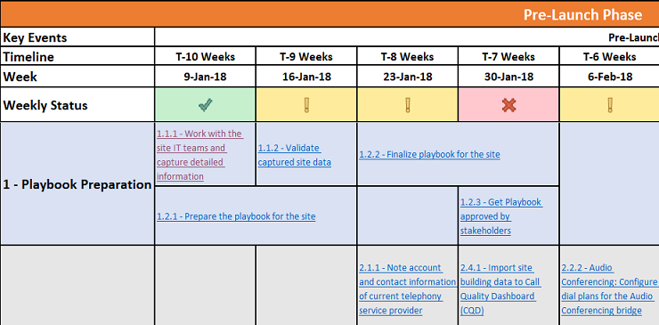

# Implementare il servizioDeploy my service

Questo articolo offre una panoramica dei requisiti per la distribuzione corretta di servizi Voice cloud.This article gives an overview of the requirements for properly deploying cloud voice services. Seguendo le indicazioni prescrittivi per la distribuzione dei servizi cloud Voice, è possibile verificare che tutti i requisiti vengano convalidati e fornire risultati ripetibili.By following prescriptive guidance for deploying cloud voice services, you can make sure you successfully account for all requirements and deliver repeatable results.

## PlayBook per l'abilitazione del sito per i carichi di lavoro vocali di Microsoft TeamsSite enablement playbook for Microsoft Teams voice workloads

Usa questo PlayBook per aiutare l'organizzazione a pianificare ed eseguire correttamente l'implementazione delle funzionalità vocali di Microsoft teams in base al sito.Use this playbook to help your organization successfully plan and execute the rollout of Microsoft Teams voice features on a site-by-site basis.

Includendo tutte le attività richieste, le sequenze temporali consigliate e i collegamenti alle linee guida corrispondenti per ogni attività, questo PlayBook include le indicazioni finali per garantire una distribuzione vocale di teams di successo per un sito specifico, concentrandosi su fattori importanti per l'utente.Including all required activities, recommended timelines, and links to corresponding guidance for each activity, this playbook covers end-to-end guidance to help ensure a successful Teams voice deployment for a given site, focusing on factors that are important to the user.

Completando le attività in questo PlayBook, l'organizzazione può:By completing the activities in this playbook, your organization can:

-   Pianificare e pianificare efficacemente l'implementazione del team.Effectively plan and schedule your Teams rollout.

-   Accelerare e ottimizzare l'adozione degli utenti.Accelerate and optimize user adoption.

-   Ridurre le esigenze di supporto e aumentare la soddisfazione degli utenti.Reduce support needs and increase user satisfaction.

> [!NOTE]
> Questo articolo e il PlayBook associato non sono progettati per descrivere ogni passaggio di configurazione tecnica necessario per l'abilitazione del servizio o per fornire un tono di chiamata a un sito specifico.This article and the associated playbook aren’t intended to describe every technical configuration step required for service enablement or providing dial tone to a specific site. Si occupano invece delle attività e delle attività consigliate per gli utenti a bordo in modo semplice e consentono di iniziare a usare i carichi di lavoro vocali di teams attraverso una transizione veloce e fluida con un tasso di adozione elevato, riducendo al minimo i requisiti di supporto.Instead, they focus on activities and tasks recommended to onboard users easily and have them start consuming Teams voice workloads through a fast and smooth transition with a high adoption rate, while minimizing support requirements. Per informazioni tecniche su come configurare al meglio l'ambiente per i team Voice, vedere gli elenchi di controllo onboarding per [configurare i carichi di lavoro vocali di teams](onboarding-checklist-configure-cloud-voice-workloads-in-Microsoft-Teams.md), [configurare il routing diretto in team](onboarding-checklist-configure-direct-routing-in-Microsoft-Teams.md), [funzionalità di base di teams](onboarding-checklist-configure-microsoft-teams-core-capabilities.md), [networking per Teams](onboarding-checklist-configure-networking.md)e l' [Abilitazione di Office 365](onboarding-checklist-enable-office-365.md).For technical guidance on how to best configure your environment for Teams voice, see the onboarding checklists for [configuring Teams voice workloads](onboarding-checklist-configure-cloud-voice-workloads-in-Microsoft-Teams.md), [configuring Direct Routing in Teams](onboarding-checklist-configure-direct-routing-in-Microsoft-Teams.md), [Teams core capabilities](onboarding-checklist-configure-microsoft-teams-core-capabilities.md), [networking for Teams](onboarding-checklist-configure-networking.md), and [enabling Office 365](onboarding-checklist-enable-office-365.md).

<!--ENDOFSECTION-->

## Aree di interesse di PlayBookPlaybook focus areas

Lo scopo del PlayBook è quello di affrontare i fattori che influenzano la percezione dell'utente di una distribuzione vocale di teams.The focus of the playbook is to address the factors that influence the user’s perception of a Teams voice deployment. Le attività e le attività sono raggruppate nelle aree di interesse seguenti:Activities and tasks are grouped into the following focus areas:

-   Convalida della disponibilità del servizioValidation of service readiness
    - AudioconferenzaAudio Conferencing
    - Piani di chiamataCalling Plans
    - Routing direttoDirect Routing

-   Abilitazione dell'utenteUser enablement

-   EndpointEndpoints

-   Uso e qualitàUsage and quality

-   AdozioneAdoption

Il [sito Web Enablement PlayBook for Voice (PlayBook)](https://github.com/MicrosoftDocs/OfficeDocs-SkypeForBusiness/blob/live/Teams/downloads/site-enablement-playbook-for-voice-(playbook).xlsx?raw=true) è una cartella di lavoro di Microsoft Excel.The [Site Enablement Playbook for Voice (Playbook)](https://github.com/MicrosoftDocs/OfficeDocs-SkypeForBusiness/blob/live/Teams/downloads/site-enablement-playbook-for-voice-(playbook).xlsx?raw=true) is a Microsoft Excel workbook. Ognuna di queste cinque aree di interesse è un foglio separato nella cartella di lavoro e ogni attività di distribuzione è raggruppata su uno di questi fogli.Each of these five focus areas is a separate sheet in the workbook, and each deployment task and activity is grouped onto one of these sheets.

> [!NOTE]
> Creerai un'istanza distinta del PlayBook per ogni sito in ambito per l'implementazione del team.You’ll create a separate instance of the playbook for each site in scope for your Teams rollout.

<!--ENDOFSECTION-->

## Come usare il PlayBookHow to use the playbook

Indipendentemente dalle dimensioni e dalla complessità della posizione, l'abilitazione di ogni sito richiede la pianificazione di attività e attività abbastanza presto, nonché l'esecuzione in ordine ottimale, prima, durante e dopo l'implementazione effettiva del servizio.Regardless of the size and complexity of the location, enabling each site requires that you plan your tasks and activities early enough—and execute them in optimal order—before, during, and after the actual service rollout. Ti consigliamo di seguire questa procedura mentre pianifichi ed Esegui il tuo viaggio a Microsoft teams Voice.We recommend that you follow these steps as you plan and execute your own journey to Microsoft Teams voice.

1. Scaricare il [sito Enablement PlayBook for Voice (PlayBook)](https://github.com/MicrosoftDocs/OfficeDocs-SkypeForBusiness/blob/live/Teams/downloads/site-enablement-playbook-for-voice-(playbook).xlsx?raw=true) per Microsoft teams Voice.Download the [Site Enablement Playbook for Voice (Playbook)](https://github.com/MicrosoftDocs/OfficeDocs-SkypeForBusiness/blob/live/Teams/downloads/site-enablement-playbook-for-voice-(playbook).xlsx?raw=true) for Microsoft Teams Voice.

2. Creare una copia separata del PlayBook per ogni sito.Create a separate copy of the playbook for each site.

3. Nella scheda del foglio denominato **PlayBook per {nomesito-codice}** sostituire **{nomesito-codice}** con il nome del sito e/o il codice del sito attinente.On the tab for the sheet named **Playbook for {SiteName-Code}**, replace **{SiteName-Code}** with the relevant site name and/or site code.

4. Immettere il **nome del sito, il codice del sito**e la **Data di avvio pianificata**, come illustrato di seguito.Enter the **Site name, Site code**, and **Planned launch date**, as illustrated below. Questo è un passaggio cruciale, perché regola le scadenze consigliate per ogni attività nel PlayBook.This is a critical step, because it adjusts the recommended deadlines for every activity in the playbook.

   

5. Esaminare ogni attività, eseguire le azioni necessarie e aggiornare lo stato man mano che si cammina nella sequenza temporale.Review each activity, take necessary actions, and update the status as you walk through the timeline. Lo stato è rappresentato graficamente, come descritto di seguito:Status is represented graphically, as described below:
  
   -  di spunta verde **Sì o non applicabile (verde):** l'attività è stata completata oppure non è applicabile per il sito e non è necessaria alcuna ulteriore azione. **Yes, or not applicable (green):** The activity has been completed, or it’s not applicable for this site, and no further action is needed.</li>
   -  esclamativo giallo <strong>l'attività non è ancora stata completata (giallo):</strong> l'attività non è ancora stata completata e deve essere aggiornata a Sì o no nella programmazione. <strong>The activity isn’t completed yet (yellow):</strong> The activity hasn’t been completed yet, and must be updated to Yes or No on its schedule.</li>
   -  No <strong>No (rosso):</strong> l'attività non può essere completata a causa di un problema e deve essere eseguita nella riunione dello stato del progetto. <strong>No (red):</strong> The activity can’t be completed because of an issue and must be carried to the project status meeting.</li></ul>

6. Lo stato viene arrotolato all'interno di ogni sezione e l'intestazione di sezione è formattata con uno di questi indicatori di stato.The status is rolled up within each section, and the section heading is formatted with one of these status indicators. Anche **lo stato settimanale** viene aggiornato automaticamente.**Weekly status** is also updated automatically.

> [!TIP]
> Ripetere i passaggi descritti sopra per tutte le posizioni presenti.Repeat the steps above for all the locations you have.

> [!IMPORTANT]
> Alcuni passaggi potrebbero non essere applicabili a tutte le posizioni e i siti.Some steps might not be applicable to all locations and sites. Se un'attività specifica non è pertinente per un sito, è necessario selezionare **non applicabile** per questa attività.If a specific activity isn’t relevant to a site, you must select **Not applicable** for this activity. Non **eliminare** righe nel PlayBook; in questo caso, le formule per il rollup dello stato non funzionano.**DO NOT DELETE** any rows in the playbook; if you do, the status roll-up formulas won’t work.  
Prestare attenzione alle attività che potrebbero richiedere più tempo del previsto, ad esempio la portabilità dei numeri e le attività di approvvigionamento.Pay attention to activities that might take more time than you planned for, such as number porting and procurement activities. Queste attività possono influire negativamente sulla sequenza temporale di distribuzione del sito.These activities can negatively affect the site deployment timeline. Assicurarsi di rivedere e aggiornare l'elenco attività e la sequenza temporale associata ogni settimana e presentarle alle [riunioni del comitato direttivo](https://docs.microsoft.com/MicrosoftTeams/envision-steering-committee-complete-guide) per verificare che gli stakeholder siano a conoscenza dello stato di ogni sito e delle eventuali deviazioni dalla pianificazione della distribuzione.Be sure to review and update the activity list and the associated timeline weekly, and present them at [steering committee meetings](https://docs.microsoft.com/MicrosoftTeams/envision-steering-committee-complete-guide) to ensure that stakeholders are aware of the status of each site and any possible deviations from the deployment schedule.

<table>
<tr><td>  Punti decisionaliDecision points</td><td><ul><li>Decidere se il PlayBook per l'attivazione del sito è necessario per la distribuzione.Decide if the Site Enablement Playbook is required for your deployment.</li><li>Decidere chi sarà responsabile della personalizzazione del sito Web Enablement PlayBook per Microsoft teams per ogni sito che verrà distribuito.Decide who will be responsible for customizing the Site Enablement Playbook for Microsoft Teams for every site you’ll deploy.</li></ul></td></tr>
<tr><td> Passaggi successiviNext steps</td><td><ul><li><a href="https://github.com/MicrosoftDocs/OfficeDocs-SkypeForBusiness/blob/live/Teams/downloads/site-enablement-playbook-for-voice-(playbook).xlsx?raw=true" data-raw-source="[Download the Site Enablement Playbook](https://github.com/MicrosoftDocs/OfficeDocs-SkypeForBusiness/blob/live/Teams/downloads/site-enablement-playbook-for-voice-(playbook).xlsx?raw=true)">Scaricare il PlayBook per l'abilitazione del sito</a>.<a href="https://github.com/MicrosoftDocs/OfficeDocs-SkypeForBusiness/blob/live/Teams/downloads/site-enablement-playbook-for-voice-(playbook).xlsx?raw=true" data-raw-source="[Download the Site Enablement Playbook](https://github.com/MicrosoftDocs/OfficeDocs-SkypeForBusiness/blob/live/Teams/downloads/site-enablement-playbook-for-voice-(playbook).xlsx?raw=true)">Download the Site Enablement Playbook</a>.</li><li>Personalizzare il PlayBook per l'abilitazione del sito per il primo sito.Customize the Site Enablement Playbook for your first site.</li><li>Ripetere le richieste per altri siti.Repeat as needed for additional sites.</li></ul></td></tr>
</table>

<!--ENDOFSECTION-->