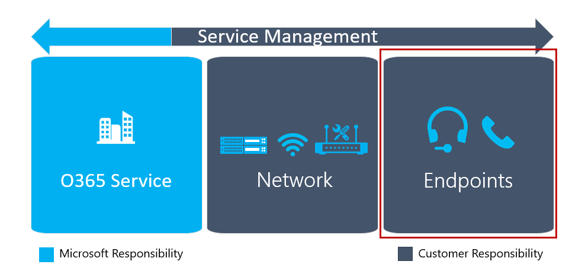

# Pianificare l'esperienza degli utentiPlan my users’ experience

Questo articolo offre una panoramica dei requisiti per identificare correttamente gli elementi della distribuzione di servizi vocali cloud che influiscono direttamente sull'esperienza degli utenti.This article gives an overview of the requirements for properly identifying the elements of your cloud voice services deployment that directly affect your users’ experience. La preparazione di questi elementi prima della distribuzione aumenta le possibilità di offrire agli utenti un'esperienza affidabile e di alta qualità.By preparing for these items before deployment, you’ll increase your chances of successfully delivering a high-quality, reliable experience for users. 

## Distribuzione clientClient deployment

Microsoft Teams ha clienti disponibili per web, desktop (Windows e Mac) e per dispositivi mobili (Android e iOS).Microsoft Teams has clients available for web, desktop (Windows and Mac), and mobile (Android and iOS). Per altre informazioni sulla modalità di installazione dei client desktop (Windows e Mac) e per dispositivi mobili, vedere [Ottenere client per Microsoft Teams](./get-clients.md).For additional details about how the desktop (Windows and Mac) and mobile clients are installed, see [Get clients for Microsoft Teams](./get-clients.md).

## Aggiornamenti del clientClient updates

Uno dei vantaggi principali di Teams è che il cliente viene aggiornato automaticamente.One of the key benefits of Teams is that the client is kept up to date automatically. I client nel PC e nel Mac vengono aggiornati usando un processo in background che controlla la presenza di nuove build e scarica il nuovo client quando l'app è inattiva.The clients on the PC and Mac are updated by using a background process that checks for new builds and downloads the new client when the app is idle.

<!--ENDOFSECTION-->

## Pianificare la qualità dell'endpointPlan for endpoint quality

Come si può vedere dal diagramma seguente, gli endpoint sono un importante elemento fondamentale per offrire agli utenti un'esperienza di qualità.As you can see from the diagram below, endpoints are an important building block in providing a quality experience for users.

Gli endpoint di Teams possono essere eseguiti su molti dispositivi, tra cui PC, Mac, tablet e dispositivi mobili.Teams endpoints can run on many devices, including PCs, Macs, tablets, and mobile devices. Parte dell'esperienza non riguarda solo il dispositivo, ma anche il modo in cui un utente si connette al dispositivo, ad esempio usando il microfono/altoparlante incorporato del dispositivo, auricolari o un auricolare ottimizzato.Part of the experience not only encompasses the device, but how a user connects to the device—for example, using the device’s built-in mic/speaker, earbuds, or an optimized headset. L'uso di un auricolare ottimizzato può arricchire l'esperienza utente generale.Using an optimized headset can enrich the overall user experience.

Le indicazioni seguenti sulla pianificazione degli endpoint consentono di garantire all'organizzazione un'esperienza di onboarding efficace con Teams.The following guidance on endpoint planning will help you ensure your organization has a successful onboarding experience with Teams.

## Funzionalità dell'endpointEndpoint capability

La prima parte della pianificazione è garantire che tutti i PC e gli altri dispositivi dell'organizzazione possano eseguire Teams.The first part of planning is to ensure all the PCs and other devices in your organization can run Teams. Questo implica non solo la ricerca dei requisiti hardware, ma anche la comprensione delle altre attività del PC in background.This involves not just looking at the hardware requirements, but also understanding what else the PC is doing in the background. Molte organizzazioni eseguono altri software, tra cui sistemi di rilevamento delle intrusioni e software antimalware, che possono influire sulle prestazioni di base di un dispositivo.Many organizations run other software, including intrusion detection systems and antimalware software, which can affect the base performance of a device.

Per informazioni sui requisiti software per i client di Teams in ogni piattaforma (Web, desktop e dispositivi mobili), vedere [Ottenere client per Microsoft Teams](./get-clients.md).For information about the software requirements for Teams clients on each platform (web, desktop, and mobile), see [Get clients for Microsoft Teams](./get-clients.md).

## Firewall endpointEndpoint firewalls

I firewall lato client possono avere un impatto significativo sull'esperienza utente.Client-side firewalls can have a significant impact on the user experience.
I firewall sul lato client possono influire sulla qualità delle chiamate, oltre a impedire che venga stabilita una chiamata.Client-side firewalls can affect call quality in addition to preventing a call from being established. Configurare le esclusioni appropriate nel firewall client in base alle informazioni contenute negli URL e negli intervalli di indirizzi IP di [Microsoft 365 o Office 365.](/microsoft-365/enterprise/urls-and-ip-address-ranges)Configure the appropriate exclusions on the client firewall based on the information in [Microsoft 365 or Office 365 URLs and IP address ranges](/microsoft-365/enterprise/urls-and-ip-address-ranges). Il fornitore di terze parti avrà indicazioni specifiche su come creare le esclusioni.Your third-party vendor will have specific guidance on how to create the exclusions.

>[!NOTE]
> Microsoft Teams aggiornerà automaticamente Windows Firewall con una configurazione del firewall appropriata.Microsoft Teams will automatically update the Windows Firewall with an appropriate firewall configuration.

## Wi-Fi per gli endpointWi-Fi recommendations for endpoints

È necessario pianificare in modo significativo la distribuzione di una rete Wi-Fi ottimizzata per supportare carichi di lavoro in tempo reale in Microsoft Teams.It takes significant planning to deploy an optimized Wi-Fi network to support real-time workloads in Microsoft Teams. Le sezioni seguenti forniscono alcune indicazioni generali che consentono di evitare insidie comuni durante la pianificazione degli endpoint.The following sections provide some general guidance that can help you avoid common pitfalls when planning for endpoints.

### Wi-Fi driverWi-Fi drivers

Alcuni Wi-Fi driver possono essere problematici.Some Wi-Fi drivers can be problematic. Ad esempio, un driver potrebbe avere comportamenti di roaming molto aggressivi tra i punti di accesso, causando una scarsa qualità delle chiamate.As an example, a driver might have very aggressive roaming behaviors between access points, causing poor call quality.
Non si tratta di un'occorrenza comune, ma è importante assicurarsi che i driver Wi-Fi nel PC siano stati aggiornati e testati prima della distribuzione.This isn’t a common occurrence, but it’s important to ensure that Wi-Fi drivers on the PC have been updated and tested prior to deployment.

### Wi-Fi bandeWi-Fi bands

Esistono principalmente due tipi di bande usate nelle apparecchiature Wi-Fi oggi, 2,4 GHz e 5,0 GHz.There are primarily two types of bands used in Wi-Fi equipment today, 2.4 GHz and 5.0 GHz. Se l'organizzazione fornisce entrambe le bande, è consigliabile configurare le impostazioni del driver in modo da preferire la banda da 5,0 GHz.If your organization provides both bands, you should configure your driver settings to prefer the 5.0 GHz band. Questa banda è molto più densa in termini di velocità effettiva ed è meno influenzata dalle interferenze osservate nella banda da 2,4 GHz.This band is much denser in terms of throughput and is less affected by the interference seen in the 2.4 GHz band.
Questa raccomandazione presuppone che la banda di rete da 5,0 GHz sia stata ottimizzata correttamente.This recommendation assumes that you’ve properly optimized the 5.0 GHz network band.

### Wi-Fi radioWi-Fi radio type

Pianificare i dispositivi che supportano i tipi di radio Wi-Fi più recente.Plan for devices that support the newer Wi-Fi radio types. Se si usa 802.11ac o versione più recente nei dispositivi di cui si effettua il provisioning, è possibile ottenere prestazioni ottimali Wi-Fi prestazioni ottimali.You can get very good Wi-Fi performance if you leverage 802.11ac or newer on the devices you provision.

### Evitamento wirelessWireless avoidance

Alcune organizzazioni preferiscono evitare di Wi-Fi del tutto.Some organizations prefer to avoid Wi-Fi altogether. A volte queste indicazioni vengono fornite tramite un suggerimento agli utenti per connettersi direttamente a una rete cablata.Sometimes this guidance is provided through a recommendation to users to connect directly to a wired network. In alcuni casi, l'ordine di associazione della rete potrebbe avere la connessione wireless preferita e continuare a usarla anche se il PC è connesso alla connessione cablata.In some cases, the network binding order might have the wireless connection preferred and continue to use that connection even though the PC is connected to the wired connection. Per evitare questo comportamento indesiderato, configurare l'ordine di associazione per evitare questo scenario.To avoid this unintended behavior, configure the binding order to avoid this scenario.

### Protocollo Power Save 802.11802.11 Power Save protocol

Se l'organizzazione usa punti di accesso wireless o router che non supportano il protocollo Power Save 802.11, è possibile che si verifichino chiamate perse o scarsa qualità delle chiamate in Microsoft Teams in esecuzione su dispositivi Windows.If your organization uses wireless access points or routers that don’t support the 802.11 Power Save protocol, you might experience dropped calls or poor call quality in Microsoft Teams running on Windows devices. Se non è possibile aggiornare il punto di accesso wireless o i router, è consigliabile aggiornare le impostazioni di Windows Power Plan nei dispositivi che eseguono l'alimentazione a batteria.If it’s not possible to upgrade your wireless access point or routers, you should update Windows Power Plan settings on devices that run on battery power. Ulteriori informazioni dettagliate e indicazioni sulla configurazione sono disponibili nell'articolo del [supporto tecnico seguente.](https://support.microsoft.com/help/928152/you-may-experience-connectivity-issues-or-performance-issues-when-you)Further detail and configuration guidance is provided in the following [support article](https://support.microsoft.com/help/928152/you-may-experience-connectivity-issues-or-performance-issues-when-you).

<table>
<tr><td>  Punti decisionaliDecision points</td><td><ul><li>Quali client di Teams verranno distribuiti nell'organizzazione?What Teams clients will be deployed in your organization?</li><li>Come si distribuiranno inizialmente i client di Teams agli utenti?How will you initially deploy Teams clients to your users?</li><li>Chi è responsabile della valutazione di endpoint e dispositivi per verificare che soddisfino i requisiti di Teams per un'esperienza di qualità?Who is responsible for evaluating endpoints and devices to validate they meet Teams requirements for a quality experience?</li></ul></td></tr>
<tr><td> Passaggi successiviNext steps</td><td><ul><li>Documentare il processo che verrà seguito per distribuire i client di Teams.Document the process that will be followed to deploy Teams clients.</li><li>Valutare endpoint e dispositivi ed eseguire e correggere i problemi necessari.Evaluate endpoints and devices and perform and remediation required.</li></ul></td></tr>
</table>

<!--ENDOFSECTION-->

## Dispositivi per TeamsDevices for Teams

Microsoft Teams può essere usato per le riunioni o come sistema telefonico.Microsoft Teams can be used for meetings or as a phone system. Quando si usano queste funzionalità, il dispositivo di interfaccia usato per Teams svolge un ruolo importante nell'esperienza utente.When using these features, the interface device that is used for Teams plays an important role in the user experience.

L'uso di un altoparlante e di un microfono predefiniti per PC potrebbe sembrare accettabile per l'utente che ha questa configurazione.Using a built-in PC speaker and microphone might sound acceptable to the user who has that configuration. In genere, tuttavia, questi dispositivi non sono ottimizzati per l'annullamento del rumore e qualsiasi tipo di rumore ambiente può avere un impatto a valle sugli altri utenti della chiamata.But typically, those devices aren’t optimized for noise cancellation, and any type of ambient noise can have a downstream impact on others on the call. L'uso di dispositivi ottimizzati per questi scenari consente di garantire un'esperienza di alta qualità.Leveraging devices optimized for these scenarios will help ensure a high-quality experience.

Ogni dispositivo deve soddisfare le esigenze degli utenti.Each device needs to meet the needs of your users. È necessario personalizzare i dispositivi, ad esempio le cuffie, per i diversi utenti e i casi di utilizzo dell'organizzazione.You’ll need to tailor devices such as headsets for the different personas and use cases in your organization.
Nell'ambito del processo di pianificazione, è necessario completare un esercizio di mappatura persona-dispositivo.A persona-to-device mapping exercise should be completed as part of the planning process.

Dopo aver selezionato i dispositivi, includerli nel piano di test pilota per la convalida finale.After you’ve selected the devices, include them in the pilot test plan for final validation. Sfruttare i sondaggi durante il progetto pilota per raccogliere feedback per assicurarsi che la strategia del dispositivo sia ottimale.Leverage surveys during the pilot to collect feedback to ensure your device strategy is optimal.

> [!NOTE]
> Al momento, è consigliabile usare dispositivi audio certificati tramite il programma di certificazione Skype for Business.At this time, we recommend using audio devices that were certified through the Skype for Business Certification program. Per trovare i dispositivi certificati in questo programma, vedere i dispositivi [Microsoft Teams](https://products.office.com/microsoft-teams/across-devices/devices) e i dispositivi audio e [video USB.](/SkypeForBusiness/certification/devices-usb-devices)To find devices certified under this program, see the [Microsoft Teams devices](https://products.office.com/microsoft-teams/across-devices/devices) and [USB audio and video devices](/SkypeForBusiness/certification/devices-usb-devices).

<table>
<tr><td>  Punti decisionaliDecision points</td><td><ul><li>Decidere la strategia generale dei dispositivi dell'organizzazione per le esperienze utente e delle sale riunioni.Decide on your organization’s overall device strategy for user and meeting room experiences.</li></ul></td></tr>
<tr><td> Passaggi successiviNext steps</td><td><ul><li>Completare un esercizio di mapping persona-dispositivo per l'organizzazione.Complete a persona-to-device mapping exercise for your organization.</li><li>Documentare il processo per ottenere dispositivi per utenti e sale riunioni.Document the process for obtaining devices for users and meeting rooms.</li><li>Documentare il processo di distribuzione e configurazione dei dispositivi per utenti e sale riunioni.Document the process for deploying and configuration devices for users and meeting rooms.</li><li>Procurarsi i dispositivi iniziali per avviare la distribuzione.Procure initial devices to begin your deployment.</li></ul></td></tr>
</table>

<!--ENDOFSECTION-->