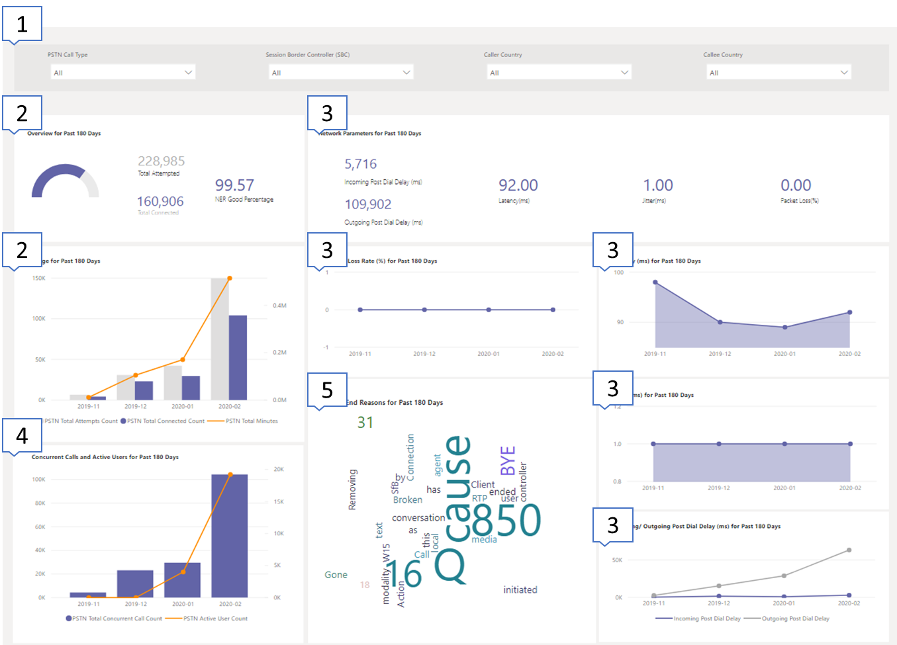
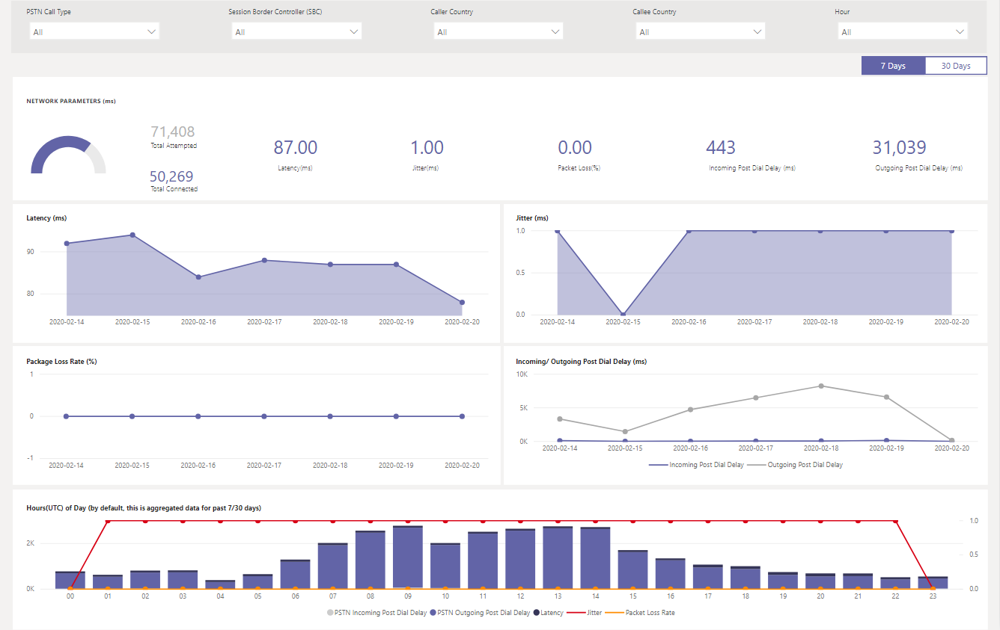

# Uso del report di routing diretto PSTN di Call Quality dashboardUsing the CQD PSTN Direct Routing report

Novità di marzo 2020 è stato aggiunto un report di routing diretto PSTN di Microsoft teams Call Quality Dashboard (Call Quality Dashboard) ai [modelli di query di Power bi scaricabili per Call Quality dashboard](https://github.com/MicrosoftDocs/OfficeDocs-SkypeForBusiness/blob/live/Teams/downloads/CQD-Power-BI-query-templates.zip?raw=true).New in March 2020, we've added a Microsoft Teams Call Quality Dashboard (CQD) PSTN Direct Routing report to our downloadable [Power BI query templates for CQD](https://github.com/MicrosoftDocs/OfficeDocs-SkypeForBusiness/blob/live/Teams/downloads/CQD-Power-BI-query-templates.zip?raw=true). 

Il report routing diretto PSTN di Call Quality Dashboard (Call Quality dashboard PSTN Direct routing report. PBIT) consente di comprendere i modelli di utilizzo e la qualità dei servizi PSTN.The CQD PSTN Direct Routing report (CQD PSTN Direct Routing Report.pbit) helps you understand the usage patterns and quality of your PSTN services. Questo report consente di monitorare l'utilizzo del servizio, le informazioni relative a session border controller (SBC), il servizio di telefonia, i parametri di rete e i dettagli del rapporto di efficacia della rete.Use this report to monitor service usage, information about your Session Border Controller (SBC), the telephony service, network parameters, and Network Effectiveness Ratio details. Queste informazioni consentono di identificare i problemi, incluso il motivo per cui sono state eliminate le chiamate.This information can help you identify issues, including the reason for dropped calls. Ad esempio, potrai vedere quando il volume scende o il numero di chiamate che vengono influenzate e per quale motivo.For example, you'll be able to see when volume drops, or how many calls get affected and for what reason.

Il report routing diretto PSTN di Call Quality dashboard include quattro sezioni:The CQD PSTN Direct Routing Report has four sections:

  - [Panoramica PSTNPSTN Overview](#pstn-overview)

  - [Dettagli del servizioService Details](#service-details)

  - [Rapporto efficacia di reteNetwork Effectiveness Ratio](#network-effectiveness-ratio)

  - [Parametri di reteNetwork Parameters](#network-parameters)

## EvidenziaHighlights

1. Analizzare per tipo di chiamata, SBC, chiamante e paese chiamatoAnalyze by call type, SBC, caller and callee country

   Il report routing diretto PSTN di Call Quality dashboard aggrega le metriche di affidabilità e utilizzo per tutti i SBCs del tenant per gli ultimi 7, 30 o 180 giorni (6 mesi).The CQD PSTN Direct Routing report aggregates reliability and usage metrics for all SBCs on your tenant for the last 7, 30, or 180 days (6 months). È possibile analizzare i dati per tipo di chiamata, SBC, chiamante e paese chiamato.You can analyze data by call type, SBC, caller and callee country. Se si è interessati a un determinato SBC o a un paese, sarà possibile identificare le modifiche nelle tendenze nell'intervallo di tempo selezionato.If you're interested in a particular SBC or country, you'll be able to identify changes in trends over the selected time range.
   :::image type="content" source="media/CQD-PSTN-report8.png" alt-text="Screenshot dei filtri disponibili nel report di routing diretto PSTN di Call Quality dashboard":::
   
2. Tenere traccia delle tendenzeTrack trends

    L'analisi delle tendenze è essenziale quando si cerca di comprendere l'uso e l'affidabilità del servizio.Trends analysis is essential when trying to understand service usage and reliability. Le tendenze orarie consentono di analizzare in modo ravvicinato le prestazioni quotidiane, che consentono di identificare gli incidenti in tempo reale.Hourly trends provide a close look at daily performance, which helps identify real-time incidents. Le tendenze quotidiane consentono di visualizzare l'integrità del servizio da una prospettiva di lungo periodo.Daily trends let you see your service health from a long-term perspective. È importante essere in grado di spostarsi tra queste due modalità con la corretta granularità dei dati.It's important to be able to shift between those two modes with appropriate data granularity. Il report routing diretto PSTN di Call Quality dashboard offre una panoramica delle tendenze di 6 mesi, le tendenze quotidiane di 7 e 30 giorni e le tendenze orarie in modo da poter analizzare le prestazioni a ogni livello.The CQD PSTN Direct Routing report provides 6-month trends overview, 7- and 30-day daily trends, and hourly trends so you can analyze performance at each level.
    :::image type="content" source="media/CQD-PSTN-report9.png" alt-text="Screenshot dei grafici delle tendenze nel report di routing diretto PSTN di Call Quality dashboard":::

3. Eseguire il drill-through a SBC o a livello utenteDrill through to SBC or user level

   È stata creata una funzionalità di drill-through su molte categorie di dati in Call Quality dashboard, che consente di comprendere rapidamente la distribuzione dell'utilizzo o dell'affidabilità a livello di utente o SBC.We've been building in drill-through capability on many data categories in CQD, which lets you quickly understand usage or reliability distribution at the SBC or user level. Usando drill-through puoi poinpoint rapidamente i problemi e capire l'impatto dell'utente reale.By using drill through, you can quickly poinpoint issues and understand real user impact. Il report routing diretto PSTN di Call Quality dashboard include le metriche dei dettagli del servizio e della percentuale di efficacia della rete.The CQD PSTN Direct Routing report features drill through on the Service Detail and Network Effectiveness Ratio metrics. Fare clic sul punto dati a cui si è interessati per eseguire il drill-up a SBC o a livello di utente.Click the data point you're interested in to drill through to SBC- or user-level details.
   :::image type="content" source="media/CQD-PSTN-report10.png" alt-text="Schermata che mostra la funzionalità di drill-through in un punto dati":::

## Panoramica PSTNPSTN Overview

Il report routing diretto PSTN di Call Quality dashboard fornisce le informazioni seguenti relative all'integrità complessiva del servizio per gli ultimi 180 giorni.The CQD PSTN Direct Routing Report provides the following information related to overall health of the service for the past 180 days.

Ad esempio, se si è interessati all'uso e all'integrità generali di tutte le chiamate in ingresso che attraversano SBC abc.bca.adatum.biz con noi come paese interno:For example, if you are interested in the overall usage and health about all inbound calls going through SBC abc.bca.adatum.biz with US as the internal country:

| **Chiamata fuori****Call Out** | **Descrizione****Description**                                                                                                                                                 |
| ------------ | --------------------------------------------------------------------------------------------------------------------------------------------------------------- |
| 11            | È possibile usare i filtri nella parte superiore per eseguire il drill-down e selezionare ByotIn come tipo di chiamata, abc.bca.contoso.com come controller di bordo sessione e Stati Uniti come paese interno.You can use the filters at the top to drill down and select ByotIn as call type, abc.bca.contoso.com as Session Boarder Controller, and US as internal country. |
| 22            | Tendenza all'uso degli ultimi 180 giorni.Usage trend for the past 180 days. È possibile trovare report dettagli utilizzo nella pagina Dettagli servizio.You can find usage detail report on Service Detail page.                                                                     |
| 33            | Ritardo di post-chiamata, latenza, jitter e tendenza alla perdita di pacchetti per gli ultimi 180 giorni.Post Dial Delay, Latency, Jitter, and Packet Loss trend for the past 180 days. È possibile trovare report dettagli nella pagina parametri di rete.You can find detail report on Network Parameters page.                           |
| 44            | Chiamata simultanea e tendenza utente attiva giornaliera per gli ultimi 180 giorni.Concurrent Call and Daily Active User trend for the past 180 days. Questo grafico può aiutare a comprendere il volume massimo del servizio.This chart can help you understand the max volume of the service.                            |
| 55            | La qualità del servizio in primo piano è stata interessata per gli ultimi 180 giorni.Top Call End Reason affected service quality for the past 180 days. È possibile trovare informazioni dettagliate sull'integrità dei servizi nella pagina NER (Network effective ratio).You can find service health detail on Network Effective Ratio(NER) page.                    |

## Dettagli del servizioService Details

Questa pagina fornisce le tendenze di utilizzo del servizio al giorno e la ripartizione dei feedback degli utenti per geografica.This page provides service usage trends per day and user feedback breakdown by geographic.

  - **Totale chiamate di tentativo-** Totale tentativo chiamate in tale intervallo di tempo, incluse le chiamate successo e non riuscito**Total Attempt Calls –** Total attempt calls in that time range, including both success and failed calls

  - **Totale chiamate connesse-** Totale chiamate connesse nell'intervallo di tempo**Total Connected Calls -** Total connected calls in that time range

  - **Minuti totali-** Utilizzo totale dei minuti nell'intervallo di tempo**Total Minutes –** Total minute usage in that time range

  - **Utenti attivi giornalieri (DAU)-** Numero di utenti attivi giornalieri che hanno effettuato almeno una chiamata connessa in quel giorno**Daily Active Users(DAU) –** Count of daily active user who made at least one connected call in that day

  - **Chiamate simultanee:** Numero massimo di chiamate attive simultanee in un minuto**Concurrent Calls –** Max of simultaneous active calls in a minute

  - **Feedback degli utenti:** Il Punteggio "Vota la mia chiamata" proviene dall'utente.**User Feedback –** "Rate My Call" score comes from the user. 3-5 è considerato una buona chiamata.3-5 is considered as a good call. 1-2 viene considerato come una chiamata errata.1-2 is considered as a bad call.

Ad esempio:For example:

1.  Se viene visualizzata la durata media delle chiamate scende a 0 in 02/14/2020, è possibile verificare se il volume delle chiamate è normale e verificare se esiste una grande discrepanza tra le chiamate di connessione totale e il tentativo totale.If you see average call duration drops to 0 at 02/14/2020, you can first check if the call volume looks normal and see if there is a big discrepancy between total connect calls and total attempt calls. Quindi Vai alla pagina rapporto efficacia Network per investire sui motivi di errore di chiamata.Then go to Network Effectiveness Ratio page to invest on call failure reasons.

2.  Se nella mappa di feedback degli utenti viene visualizzato un numero crescente di punti rossi, è possibile accedere alla pagina rapporto di efficacia della rete e al parametro di rete per verificare se sono presenti anomalie e si può alzare un biglietto usando il servizio di assistenza MS.If you see increasing red spots on the user feedback map, you could go to Network Effectiveness Ratio page and Network Parameter to see if there are any anomalies and you could raise a ticket using MS Service Desk.

## Rapporto efficacia di reteNetwork Effectiveness Ratio

Questa è la stessa metrica visualizzata nel dashboard integrità generale.This is the same metric that appears on the Overall Health dashboard. È possibile controllare il numero di NER ogni ora con le chiamate interessate in dettaglio per entrambe le direzioni delle chiamate (in ingresso/in uscita) nel rapporto oraria di efficacia della rete e nel grafico motivo finale chiamata seguente.You can check hourly NER number with affected calls detail for both call directions (inbound/outbound) on the Hourly network effectiveness ratio and call ending reason chart below.

  - **Ner** -l'abilità (%) di una rete per consegnare le chiamate misurando il numero di chiamate inviate rispetto al numero di chiamate recapitate a un destinatario.**NER** - The ability (%) of a network to deliver calls by measuring the number of calls sent versus the number of calls delivered to a recipient.

  - **Codice di risposta SIP**: il codice di risposta intero a tre cifre Mostra lo stato della chiamata.**SIP response code**- A three-digit integer response code shows the call status.

  - **Codice di risposta Microsoft**-codice di risposta inviato dal componente Microsoft.**Microsoft response code**-A response code sent out from Microsoft component.

  - **Descrizione** : la fase di Reason che corrisponde al codice di risposta SIP e al codice di risposta Microsoft.**Description** – The reason phase that corresponding to the SIP response code and Microsoft response code.

  - **Numero di chiamate interessate** : il numero totale di chiamate è stato influenzato durante l'intervallo di tempo selezionato.**Number of calls affected** – The total number of calls got affected during the selected time range.

> 
> 
Ad esempio:For example:

Se il Daily NER ha un dip in 02/05/2020, è possibile fare clic sulla data e gli altri grafici faranno zoom su quella specifica data.If Daily NER has a dip on 02/05/2020, you can click on the date and other charts will zoom to that specific date.

Dalla buona percentuale di tendenza per ogni ora è possibile trovare il DIP che si verifica intorno a 21:00.From the NER Good Percentage Hourly Trend, you can find the dip happens around 21:00. Quindi fare di nuovo clic per ingrandire l'ora 21 e controllare i dettagli delle chiamate effettuate per vedere quante chiamate non sono state eseguite in quell'ora e quali sono i motivi per le chiamate finali.Then click again to zoom to hour 21 and check Effected Call Details to see how many calls failed in that hour and what are the call end reasons. Se il problema non è correlato a SBC, è possibile iniziare a eseguire le riprese in caso di problemi su qualsiasi problema o report SBC.You can start with self-trouble shooting on any SBC problems or report to Service Desk if the problem is not related to SBC.

## Parametri di reteNetwork Parameters

Tutti i parametri di rete vengono misurati dall'interfaccia di routing diretto al controller di bordo della sessione.All network parameters are measured from the Direct Routing interface to the Session Border Controller. Per informazioni sui valori consigliati, vedere [preparare la rete dell'organizzazione per Microsoft teams](prepare-network.md)e esaminare i valori consigliati di Microsoft Edge per il cliente.For information about the recommended values, see [Prepare your organization's network for Microsoft Teams](prepare-network.md), and look at the Customer Edge to Microsoft Edge recommended values.

  - **Jitter** : è la misura di millisecondi di variazione nel tempo di ritardo di propagazione della rete calcolato tra due endpoint usando RTCP (il protocollo di controllo RTP).**Jitter** – Is the millisecond measure of variation in network propagation delay time computed between two endpoints using RTCP (The RTP Control Protocol).

  - **Perdita di pacchetti** : è una misura del pacchetto che non è riuscita ad arrivare; viene calcolato tra due endpoint.**Packet Loss** – Is a measure of packet that failed to arrive; it is computed between two endpoints.

  - **Latenza** -(nota anche come tempo di andata e ritorno) è il periodo di tempo necessario per l'invio di un segnale più il tempo necessario per il riconoscimento del segnale da ricevere.**Latency** - (Also known as round trip time) is the length of time it takes for a signal to be sent plus the length of time it takes for the acknowledgment of that signal to be received. Questo ritardo temporale è costituito dai tempi di propagazione tra i due punti di un segnale.This time delay consists of the propagation times between the two points of a signal.

> 

Ad esempio:For example:

Se viene visualizzato un picco su uno dei quattro grafici (latenza, jitter, tasso di perdita del pacchetto, ritardo della chiamata) per una data specifica, ad esempio la latenza in 02/14/2020, fare clic sul punto di data.If you see a spike on any of the four charts (Latency, Jitter, Package Loss Rate, Post Dial Delay) for a specific date, for example, Latency on 02/14/2020, click on the date point. E il grafico di tendenza oraria in fondo verrà aggiornato per visualizzare il numero orario.And the hourly trend chart at the bottom will refresh to show the hourly number. È possibile controllare il SBCs o sollevare un biglietto con il servizio di assistenza MS Service Desk.You can check the SBCs or raise a ticket with MS Service Desk.

## Argomenti correlatiRelated topics

[Usare Power BI per analizzare i dati di Call Quality dashboard per Microsoft TeamsUse Power BI to analyze CQD data for Microsoft Teams](CQD-PSTN-report.md)

[Risoluzione dei problemi di TeamsTeams Troubleshooting](https://docs.microsoft.com/MicrosoftTeams/troubleshoot/teams)