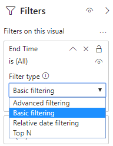

# Installare il connettore di Power BI per usare i modelli di query di Call Quality dashboard

Prima di poter usare i modelli di query di Power BI per Call Quality Dashboard (file PBIX), è necessario installare il connettore Power BI per Microsoft Call Quality dashboard, usando il file *MicrosoftCallQuality. PQX* incluso nel [download](https://github.com/MicrosoftDocs/OfficeDocs-SkypeForBusiness/blob/live/Teams/downloads/CQD-Power-BI-query-templates.zip?raw=true). 

Leggere [usare Power BI per analizzare i dati di Call Quality dashboard per i team](CQD-Power-BI-query-templates.md) per informazioni su questi modelli.

## Installazione

Il processo per l'installazione di un connettore personalizzato e la regolazione della sicurezza per consentire l'uso del connettore sono descritti in dettaglio nella [documentazione di Power bi](https://docs.microsoft.com/power-bi/desktop-connector-extensibility). In nome della semplicità, ecco una breve spiegazione:

1.  Verificare se nel computer è già presente una * \[cartella documenti\]\\di Power bi\\desktop Custom Connector*. In caso contrario, crea questa cartella. 1

2.  Scaricare il file del connettore (un * \** file con estensione MEZ o * \*PQX* ) e inserirlo nella directory dei *connettori personalizzati* .

3.  **Se il file del connettore è * \** un file con estensione MEZ,** è anche necessario modificare le impostazioni di sicurezza descritte nella [documentazione relativa alla configurazione del connettore personalizzato](https://docs.microsoft.com/power-bi/desktop-connector-extensibility#data-extension-security).

Se viene rilasciata una nuova versione di questo connettore di Power BI per Microsoft teams, è sufficiente sostituire il vecchio file del connettore nella directory *Custom Connectors* con il nuovo file.

## Configurazione

Per creare un report ed eseguire query, è prima necessario connettersi all'origine dati di Call Quality dashboard. Seguire i passaggi seguenti per connettersi:

1.  Nella scheda Home di Power BI desktop fare clic su *Get Data*.

    

2.  A questo punto verrà visualizzata la finestra *Ottieni dati* . Passare a *servizi online*, quindi selezionare *qualità chiamata Microsoft (beta)* e premere *Connetti*.

    

3.  Verrà chiesto di accedere a Next. Usa le stesse credenziali usate per Call Quality dashboard. 2

4.  Il prompt successivo ti darà l'opzione tra due *modalità di connettività dati*. Selezionare *DirectQuery* e quindi premere *OK*.

5.  Infine, verrà assegnato un messaggio finale che mostra l'intero modello di dati per Call Quality dashboard. A questo punto non saranno visibili dati, ma solo il modello di dati per Call Quality dashboard. Selezionare *carica* per completare il processo di configurazione.

6.  A questo punto, Power BI caricherà il modello di dati sul lato destro della finestra. La pagina rimarrà altrimenti vuota e nessuna query verrà caricata per impostazione predefinita. Procedere con la **creazione di query** seguenti per creare una query e restituire dati.

Se una delle procedure descritte in questa procedura di configurazione non fosse completamente chiara, è possibile trovare [qui](https://docs.microsoft.com/power-bi/desktop-quickstart-connect-to-data)una spiegazione più dettagliata del processo.

## Creazione di query

Una volta completata l'installazione, nel riquadro *campi* dovrebbero essere visualizzati i nomi di diverse centinaia di dimensioni e misure. La costruzione di query effettive da qui è semplice, basta selezionare le dimensioni e le misure desiderate per la query, quindi trascinarle e rilasciarle nella pagina. Ecco una spiegazione più dettagliata, con un semplice esempio:

1.  Selezionare la visualizzazione che si vuole usare nel riquadro *visualizzazioni* . Nella pagina deve essere visualizzata una versione vuota della visualizzazione. Ai fini di questo esempio, useremo la visualizzazione *tabella* .

    

2.  Determinare le dimensioni e le misure (contrassegnate da un simbolo di aggregazione in base al nome) che si vuole usare per la query, quindi selezionarle manualmente e trascinarle nella visualizzazione nera. In alternativa, trascinarli nel campo *valori* sotto le opzioni di visualizzazione.

    

    > [!IMPORTANT] 
    > Il dashboard qualità chiamata richiede una misura per l'esecuzione di una query. La mancata aggiunta di una misura a una query causerà l'errore della query.

3.  Selezionare *quindi le dimensioni* desiderate per filtrare e trascinarle nel riquadro Filtri in questo campo *visivo* . Il connettore di Power BI di Call Quality dashboard attualmente supporta il filtro di *base* (selezionare i valori da un elenco di valori di dimensione possibili), il filtro *avanzato* (specificare manualmente i valori e gli operandi per filtrare, in modo simile a Advanced Call Quality Dashboard) e il *filtro delle date relativo* (disponibile solo per le dimensioni di *fine* e *ora di inizio* ). Il filtro in base alle *prime N* non è supportato da Call Quality dashboard.

    

4.  Infine, seleziona la scheda *formato* nel riquadro *visualizzazioni* per applicare lo stile e formattare la query.

    > [!NOTE]
    > Le query Call Quality Dashboard richiedono almeno una misura per l'esecuzione. Se la query non viene caricata, verificare che sia stata inclusa una misura nella query.

## Creazione di un report drill-through

Il [drill-through in Power bi](https://docs.microsoft.com/power-bi/desktop-drillthrough) consente di creare report focalizzati che è possibile filtrare rapidamente usando i valori di altri report come contesto. Quando si sa come creare la prima query con il connettore Call Quality dashboard, la creazione di un drill-through è ancora più semplice.

1.  Creare un'altra pagina per il report evidenziato e quindi aggiungere le query a tale pagina.

2.  Selezionare la dimensione che si vuole usare come filtro drill-through e trascinarle nel campo *drill-through* nel riquadro *visualizzazioni* .

    

3.  **Questo è tutto\!** Qualsiasi altra query in un'altra pagina che usa tale dimensione ora può eseguire il drill-through alla pagina, applicando automaticamente il valore della dimensione drill-through come filtro.

    

Diversamente da Advanced Call Quality dashboard, Power BI supporta il drill-through non sequenziale. Finché una query include la dimensione necessaria, può eseguire il drill-through in qualsiasi altra pagina.

### Procedure consigliate

Le query del connettore di qualità delle chiamate devono essere progettate con la funzionalità drill-through. Invece di provare a caricare tutti i dati contemporaneamente e quindi affettare i filtri, iniziare con query più ampie e a bassa cardinalità e eseguire il drill-down per eseguire query di alta cardinalità. Ad esempio, quando si tenta di diagnosticare le subnet che contribuiscono maggiormente ai problemi di qualità, è utile identificare prima di tutto le aree geografiche e i paesi che contribuiscono al problema, quindi eseguire il drill-down delle subnet in quella regione o paese. I modelli di connettori per la qualità delle chiamate sono stati progettati in questo modo per fungere da esempio.

## Limitazioni

Nonostante l'uso di Power BI, non tutte le funzionalità di Power BI sono supportate dal connettore Call Quality dashboard, come risultato delle limitazioni del modello di dati Call Quality dashboard o dei connettori DirectQuery in generale. Nell'elenco seguente sono riportate alcune delle limitazioni più degne di nota del connettore, ma questo elenco non deve essere considerato esaustivo:

1.  **Colonne calcolate:** I connettori DirectQuery in generale hanno un supporto limitato per le colonne calcolate in Power BI. Mentre alcune colonne calcolate possono funzionare con il connettore, queste devono essere considerate eccezioni. Come regola generale, le colonne calcolate non funzioneranno.

2.  **Aggregazioni:** Il modello di dati Call Quality dashboard è basato su un modello di cubo, che significa che le aggregazioni sono già supportate sotto forma di misure. Il tentativo di aggiungere manualmente le aggregazioni a dimensioni diverse o di modificare il tipo di aggregazione di una misura non funzionerà con il connettore e in genere verrà restituito un errore.

3.  Oggetti **visivi personalizzati:** Mentre il connettore Call Quality dashboard funziona con un intervallo di elementi visivi personalizzati, non siamo in grado di garantire la compatibilità con tutti gli oggetti visivi personalizzati. Molti elementi visivi personalizzati si basano sull'uso delle colonne calcolate o dei dati importati, né supportati dai connettori DirectQuery.

4.  **Riferimento ai dati memorizzati nella cache** Power BI attualmente non supporta il riferimento ai dati memorizzati nella cache da un connettore DirectQuery in alcun modo. Qualsiasi tentativo di fare riferimento ai risultati di una query comporterà una nuova query. 

5.  **Filtro dei dati relativi:** È supportata nel connettore Call Quality dashboard, ma solo con le dimensioni ora *inizio* e *ora di fine* . Anche se la dimensione *Data* può essere la scelta più ovvia per il filtro della data relativa, la *Data* non viene archiviata come oggetto data-ora e quindi non supporta il filtro della data relativa in Power bi.

Tieni presente che, anche se il connettore è in anteprima, è improbabile che queste limitazioni cambino con la versione finale del connettore. La maggior parte di questi problemi è una restrizione alla progettazione di connettori DirectQuery in Power BI o fondamentale per la progettazione del modello di dati Call Quality dashboard.

## Risoluzione dei problemi

### Si sta cercando di usare la colonna data come filtro dei dati. Non appena si converte il tipo di dati di questa colonna in data, viene visualizzato questo messaggio di errore:

> **Impossibile caricare i dati per questo oggetto visivo**: errore OLE DB o ODBC: [Expression. Error] non è possibile ripiegare l'espressione nell'origine dati. Provare un'espressione più semplice. 

I filtri dei dati di data non sono supportati con il connettore di Power BI. Per specificare un intervallo di date, applicare due filtri al report, specificando una data minore di e maggiore di.

In alternativa, se le date che si desidera visualizzare sono recenti, applicare un filtro relativo alla data per visualizzare solo i dati degli ultimi N giorni/settimane/mesi.

## Codici di errore

Dato che il connettore di Power BI di Call Quality dashboard è meno limitato rispetto all'app browser in termini di tipi di query che è possibile creare, potrebbe verificarsi occasionalmente un certo numero di errori durante la creazione di query. In caso di ricezione di un messaggio di errore di tipo "CQDError. RunQuery-errore di esecuzione della query, fare riferimento all'elenco seguente con il numero ErrorType fornito per risolvere il problema possibile con la query. Di seguito sono riportati i codici di tipo errore più comuni che possono verificarsi con il connettore di Power BI di Call Quality Dashboard:

  - **ErrorType 1-errore della struttura della query:** Un errore della struttura della query viene in genere causato dal connettore che non riesce a creare una query formattata correttamente. Questo problema si verifica più spesso quando si usa una funzionalità non supportata, come specificato nelle limitazioni precedenti. Verificare che non si stiano usando colonne calcolate o oggetti visivi personalizzati per la query.

  - **Errore di creazione di query ErrorType 2:** Un errore di compilazione della query è causato dal connettore Call Quality Dashboard non è in grado di analizzare correttamente la query che si sta provando a compilare. Questo problema si verifica più spesso quando si usa una funzionalità non supportata, come specificato nelle limitazioni precedenti. Verificare che non si stiano usando colonne calcolate o oggetti visivi personalizzati per la query.

  - **ErrorType 5-timeout esecuzione:** La query ha raggiunto il massimo runtime possibile prima del timeout. Provare ad aggiungere altri filtri alla query per limitarne l'ambito. La restrizione dell'intervallo di dati è spesso il modo più efficace per raggiungerlo.

  - **ErrorType 7-nessun errore di misura:** Le query Call Quality Dashboard richiedono una misura per funzionare. Verificare che la query includa Measure. Le misure nel connettore Call Quality dashboard sono contrassegnate dal simbolo di aggregazione (somma) prima del nome.

Se si verificano altri errori al di fuori di questo ambito, inviare una notifica al team di Call Quality dashboard in modo da aiutare a risolvere il problema e aggiornare la documentazione in base alle esigenze.

## Note

**1** determinati processi e app (ad esempio OneDrive) possono causare la modifica della cartella radice documenti; Verificare che la directory dei *connettori personalizzati\\di Power bi desktop* sia inserita nella cartella documenti della cartella radice corrente.

**2** le credenziali di accesso usate per Call Quality dashboard *non* devono essere le stesse credenziali usate per accedere all'app desktop Power bi.

## Domande frequenti

### Quando verrà aggiornato il connettore di Power BI dallo stato "beta"?

Nonostante il tag beta, il connettore di qualità della chiamata per Power BI è la versione finale del connettore ed è stato ufficialmente firmato dal team di Power BI per riflettere questo. Il processo di certificazione per rimuovere il tag Beta è esteso e richiede un impegno da parte del team di Power BI per consentire il supporto diretto anche al connettore. A causa di vincoli temporali, il team di Power BI non è attualmente in grado di specificare il supporto e la certificazione più ampia, ma è comunque pronto ad attestare la sicurezza, l'autenticità e le funzionalità generali del connettore di qualità della chiamata Microsoft.

## Argomenti correlati

[Usare Power BI per analizzare i dati di Call Quality dashboard per i team](CQD-Power-BI-query-templates.md)
