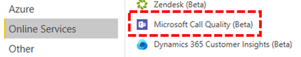
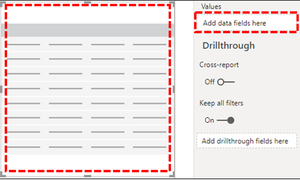

# Installare il connettore Microsoft Call Quality Power BI usare i modelli di query di Call Quality Dashboard

Prima di poter usare i modelli di query di Power BI (file PBIX) per Microsoft Teams Call Quality Dashboard (CQD), è necessario installare il connettore Microsoft Call Quality per Power BI, usando il file *MicrosoftCallQuality.pqx* incluso nel [download.](https://github.com/MicrosoftDocs/OfficeDocs-SkypeForBusiness/blob/live/Teams/downloads/CQD-Power-BI-query-templates.zip?raw=true)

Leggere [Usare Power BI analizzare i dati CQD](CQD-Power-BI-query-templates.md) per Teams informazioni su questi modelli.

Assicurarsi di avere il ruolo [di accesso CQD](./turning-on-and-using-call-quality-dashboard.md#assign-admin-roles-for-access-to-cqd) giusto per accedere ai Power BI report.

> [!NOTE]
> Il connettore Microsoft Call Quality supporta solo DirectQuery in Power BI; La modalità di importazione non è supportata. 

## Installazione

Il processo per l'installazione di un connettore personalizzato e la modifica della sicurezza per abilitare l'uso del connettore è descritto in dettaglio nella documentazione Power BI [informazioni.](/power-bi/desktop-connector-extensibility) Per semplicità, ecco una rapida spiegazione:

1. Verificare se nel computer è già presente una *\[ cartella Power BI Desktop \] \\ \\ connettori* personalizzati. In caso contrario, creare questa cartella. 1

2. Scaricare il file del connettore *\* (un* file con estensione mez o *\* pqx)* e posizionarlo nella directory *Custom Connectors.*

3. **Se il file del connettore è un file con estensione *\* mez,*** sarà necessario modificare le impostazioni di sicurezza come descritto nella documentazione relativa alla configurazione [del connettore personalizzato.](/power-bi/desktop-connector-extensibility#data-extension-security)

Se viene rilasciata una nuova versione del connettore Microsoft Call Quality, sostituire il vecchio file del connettore nella directory *Custom Connectors* con il nuovo file.

## Configurazione

Per creare un report ed eseguire query, è prima necessario connettersi all'origine dati CQD. Seguire la procedura seguente per connettersi:

1. Nella scheda Home di Power BI Desktop fare clic su *Ottieni dati.*

    

2. A *questo punto dovrebbe* essere visualizzata la finestra Ottieni dati. Passa a *Servizi online,* quindi seleziona *Qualità chiamata Microsoft (beta)* e premi *Connessione*.

    

3. Verrà richiesto di eseguire l'accesso successivo. Usare le stesse credenziali usate per Call Quality Dashboard. 2

4. Il prompt successivo offrirà l'opzione tra due modalità *di connettività dati.* Selezionare *DirectQuery* e premere *OK.*

5. Infine, verrà visualizzato un prompt finale che mostra l'intero modello di dati per Call Quality Dashboard. A questo punto non saranno visibili dati, ma solo il modello di dati per CQD. Selezionare *Carica* per completare il processo di configurazione.

6. A questo punto, Power BI il modello di dati verrà caricato sul lato destro della finestra. La pagina rimarrà altrimenti vuota e non verrà caricata alcuna query per impostazione predefinita. Procedere alla **creazione di query** di seguito per creare una query e restituire dati.

Se uno dei passaggi durante il processo di configurazione non è stato chiaro, una spiegazione più dettagliata del processo è disponibile in Guida introduttiva: Connessione ai dati [in Power BI Desktop](/power-bi/desktop-quickstart-connect-to-data).

## Creazione di query

Al termine dell'installazione, nel riquadro Campi dovrebbero essere visualizzati i nomi di diverse centinaia di dimensioni *e* misure. Creare query effettive da qui è semplice, basta selezionare le dimensioni e le misure desiderate per la query, quindi trascinarle e rilasciarle nella pagina. Ecco una spiegazione più dettagliata, con un semplice esempio:

1. Selezionare la visualizzazione da usare nel *riquadro* Visualizzazioni. Nella pagina dovrebbe essere visualizzata una versione vuota di tale visualizzazione. Ai fini di questo esempio, verrà utilizzata la *visualizzazione* Tabella.

    

2. Determinare le dimensioni e le misure (con un simbolo di aggregazione in base al nome) da usare per la query, quindi selezionarle manualmente e trascinarle nella visualizzazione nera. In alternativa, trascinarli nel campo *Valori* sotto le opzioni di visualizzazione.

    

    > [!IMPORTANT]
    > Call Quality Dashboard richiede una misura per l'esecuzione di qualsiasi query. Se non si aggiunge una misura a una query, la query avrà esito negativo.

3. Selezionare quindi le dimensioni in base alle quali filtrare e trascinarle nel campo Filtri in questo *campo* visivo *nel riquadro* Filtri. Il connettore Qualità chiamata Microsoft attualmente supporta il filtro di base (selezionare i valori da un elenco di valori di dimensione possibili), Filtro avanzato  (specificare  manualmente valori e operandi in base a cui filtrare, in modo simile a Call Quality Dashboard) e *Filtro* data relativa (disponibile solo per le dimensioni Ora di fine e Ora inizio).   Il filtro in *base a Top N* non è supportato da Call Quality Dashboard.

    

    > [!IMPORTANT]
    > I filtri sono supportati solo se applicati a Dimensioni. Il filtro sui valori delle misure non è supportato in Call Quality Dashboard.

4. Infine, selezionare la *scheda Formato* nel riquadro *Visualizzazioni* per formattare e formattare la query.

    > [!NOTE]
    > Le query di Call Quality Dashboard richiedono almeno una misura per poter essere eseguite. Se la query non viene caricata, verificare di aver incluso una misura nella query.

## Creazione di un report drill-through

[Il drill-through in Power BI](/power-bi/desktop-drillthrough) consente di creare report mirati che è possibile filtrare rapidamente usando i valori di altri report come contesto. Quando si sa come creare la prima query con il connettore Microsoft Call Quality, la creazione di un drill-through è ancora più semplice.

1. Creare un'altra pagina per il report con lo stato attivo e quindi aggiungere le query a tale pagina.

2. Selezionare la dimensione da usare come filtro drill-through e trascinarla nel campo *Drill-through* in nel *riquadro* Visualizzazioni.

    

3. **Questo è tutto\!** Qualsiasi altra query in un'altra pagina che usa tale dimensione può ora eseguire il drill-through alla pagina, applicando automaticamente il valore della dimensione drill-through come filtro.

    

A differenza di Call Quality Dashboard, Power BI supporta il drill-through non sequenziale. Se una query include la dimensione necessaria, può eseguire il drill-through in qualsiasi altra pagina.

### Procedure consigliate

Le query del connettore Microsoft Call Quality devono essere progettate con la funzionalità drill-through. Invece di provare a caricare tutti i dati contemporaneamente e quindi affettare i filtri, iniziare con query di cardinalità più ampie e a bassa cardinalità ed eseguire il drill-down a query con cardinalità elevata. Ad esempio, quando si prova a diagnosticare quali subnet contribuiscono maggiormente ai problemi di qualità, è utile identificare prima le aree geografiche e i paesi che contribuiscono al problema, quindi eseguire il drill-down fino alle subnet dell'area geografica o del paese. I modelli di connettore Qualità chiamata sono stati progettati in questo modo per fungere da esempio.

## Limitazioni

Nonostante l'uso di Power BI, non tutte le funzionalità di Power BI sono supportate dal connettore Microsoft Call Quality, a causa di limitazioni sul modello di dati di Call Quality Dashboard o sui connettori DirectQuery in generale. L'elenco seguente annota alcune delle limitazioni più degne di nota del connettore, ma questo elenco non deve essere considerato esaustivo:

1. **Colonne calcolate :** I connettori DirectQuery in generale hanno un supporto limitato per le colonne calcolate in Power BI. Alcune colonne calcolate potrebbero funzionare con il connettore, che queste colonne sono eccezioni. Come regola generale, le colonne calcolate non funzionano.

2. **Aggregazioni :** Il modello di dati Call Quality Dashboard è basato su un modello cubo, ovvero le aggregazioni sono già supportate sotto forma di misure. Il tentativo di aggiungere manualmente aggregazioni a dimensioni diverse o di modificare il tipo di aggregazione di una misura non funzionerà con il connettore e in genere restituirà un errore.

3. **Oggetti visivi personalizzati :** Anche se il connettore Microsoft Call Quality funziona con un'ampia gamma di oggetti visivi personalizzati, non siamo in grado di garantire la compatibilità con tutti gli oggetti visivi personalizzati. Molti oggetti visivi personalizzati si basano sull'uso di colonne calcolate o dati importati, nessuno dei quali è supportato dai connettori DirectQuery.

4. **Riferimento a dati memorizzati** nella cache: Power BI attualmente non supporta il riferimento ai dati memorizzati nella cache da un connettore DirectQuery in alcun modo. Qualsiasi tentativo di fare riferimento ai risultati di una query comporta la creazione di una nuova query.

5. **Filtro dei dati relativi:** È supportato nel connettore Qualità chiamata Microsoft, ma solo con *le* dimensioni Ora inizio *e Ora* fine. Anche se la *dimensione Data* può essere la scelta più ovvia per il filtro della data *relativa,* La data non viene archiviata come oggetto data e quindi non supporta il filtro della data relativa in Power BI.

6. **Query di solo misurazione -** Al momento non sono supportati nel connettore Microsoft Call Quality. Quando si crea una visualizzazione con tre o più misure senza dimensioni, i dati della colonna verranno trasposti. Per evitare questo problema, includere sempre nelle visualizzazioni almeno una dimensione, ad esempio Mese Anno. Questa soluzione dovrebbe essere risolta in un rilascio imminente del connettore Microsoft Call Quality per Power BI.

7. **Government Community Cloud (GCC) -** Per i clienti dell'GCC, il connettore Qualità chiamata Microsoft funzionerà solo quando si usa Power BI Desktop. Il connettore Microsoft Call Quality non è attualmente compatibile con il servizio Power BI per GCC clienti.

La maggior parte di questi problemi è una restrizione alla progettazione del connettore DirectQuery in Power BI fondamentale per la progettazione del modello di dati CQD.

## Risoluzione dei problemi

### Si sta provando a usare la colonna Data come filtro dei dati Data. Non appena converto il tipo di dati di questa colonna in Data, viene visualizzato questo errore

> **Non è stato possibile caricare** i dati per questo oggetto visivo: errore OLE DB o ODBC: [Espressione.Errore] Non è stato possibile piegare l'espressione all'origine dati. Provare un'espressione più semplice.

I filtri dei dati data non sono supportati con il connettore Microsoft Call Quality. Per specificare un intervallo di date, applicare due filtri al report, specificando una data minore di e maggiore di.

In alternativa, se le date da visualizzare sono recenti, applicare un filtro data relativo per visualizzare solo i dati relativi agli ultimi N giorni/settimane/mesi.

## Codici di errore

Poiché il connettore Microsoft Call Quality per Power BI è meno limitato dell'app browser in termini di tipi di query che è possibile creare, è possibile che si verifichino occasionalmente diversi errori durante la creazione delle query. Nel caso in cui venga visualizzato un messaggio di errore di tipo "CQDError. RunQuery - Errore di esecuzione della query", fare riferimento all'elenco seguente con il numero ErrorType fornito per risolvere il possibile problema con la query. Di seguito sono riportati i codici di tipo di errore più comuni che possono verificarsi con il connettore CQD Power BI Connector:

- **ErrorType 1 - Errore di struttura della query:** Un errore di struttura della query è in genere causato dalla mancata creazione di una query formattata correttamente dal connettore. Questo problema si verifica più spesso quando si usano funzionalità non supportate, come specificato nelle limitazioni precedenti. Verificare che non si utilizzino colonne calcolate o oggetti visivi personalizzati per la query.

  - **ErrorType 2 - Errore di creazione query:** Un errore di creazione di query è causato dal fatto che il connettore Microsoft Call Quality non è in grado di analizzare correttamente la query che si sta tentando di creare. Questo problema si verifica più spesso quando si usano funzionalità non supportate, come specificato nelle limitazioni precedenti. Verificare che non si utilizzino colonne calcolate o oggetti visivi personalizzati per la query.

  - **ErrorType 5 - Timeout di esecuzione:** La query ha raggiunto il massimo runtime possibile prima del timeout. Provare ad aggiungere altri filtri alla query per limitarne l'ambito. Il restringere l'intervallo di dati è spesso il modo più efficace per ottenere questo risultato.

  - **ErrorType 7 - Nessun errore di misurazione:** Per funzionare, le query di Call Quality Dashboard richiedono una misura. Verificare che la query includa misure. Le misure nel connettore Qualità chiamata Microsoft sono denotate dal simbolo di aggregazione (somma) prima del nome.

Se si verificano altri errori al di fuori di questo ambito, informare il team di Call Quality Dashboard in modo da consentire la risoluzione del problema e aggiornare la documentazione in base alle esigenze.

## Note a piè di pagina

**1** Alcuni processi e app (ad esempio, OneDrive) possono causare la modifica della cartella radice Documenti; assicurarsi che la *directory Power BI Desktop \\ connettori* personalizzati sia inserita all'interno della cartella radice corrente Documenti.

**2** Le credenziali di accesso usate per Call Quality *Dashboard* non devono essere le stesse usate per accedere all'app Power BI Desktop chiamata stessa.

## Domande frequenti

### Quando il connettore Power BI verrà aggiornato dallo stato "Beta"?

Nonostante il tag Beta, il connettore Microsoft Call Quality (Beta) per Power BI è la prima versione "release" del connettore ed è stato ufficialmente firmato dal team di Power BI per riflettere questo problema. Al momento del rilascio iniziale del connettore, il team di Power BI non era in grado di fornire supporto e certificazione più ampia, ma era ancora pronto a attestare la sicurezza, l'autenticità e la funzionalità generale del connettore Microsoft Call Quality. In prospettiva, stiamo pianificando di investire nel connettore Microsoft Call Quality per Power BI nel prossimo futuro.

### Perché il connettore sembra più lento rispetto a Call Quality Dashboard nel browser? Cosa si può fare per migliorare le prestazioni?

Le prestazioni delle query per i vari modelli sono in realtà le stesse sia nel browser che nel connettore.  Come qualsiasi altra app autonoma, Power BI l'autenticazione e il tempo di rendering alle prestazioni. Inoltre, la differenza riguarda il numero di query simultanee eseguite. Poiché la versione nel browser di Call Quality Dashboard aveva opzioni di visualizzazione meno sviluppate e con un'elevata densità di informazioni, la maggior parte dei report era limitata al caricamento di 2-3 query alla volta. D'altra parte, i modelli di connettore spesso visualizzano più di 20 query simultanee. Se si vogliono creare report reattivi come quelli precedenti, provare a creare report con non più di 2-3 query per scheda.

Per altre informazioni, vedere gli articoli seguenti:

- [Guida all'ottimizzazione per Power BI](/power-bi/guidance/power-bi-optimization)
- [Indicazioni sul modello DirectQuery](/power-bi/guidance/directquery-model-guidance)

### Quando si eseguono query, si verifica regolarmente il limite di 10.000 righe. Come si fa a fare in modo che il connettore restituirà più di 10.000 righe?

Il limite di 10.000 righe è in realtà specificato alla fine dell'API ed è progettato per migliorare significativamente le prestazioni e ridurre il rischio di errori di esecuzione delle query derivanti da condizioni di memoria insufficiente.

Invece di provare ad aumentare il numero di righe dei risultati, è meglio ristrutturare i report in base alle procedure consigliate per i connettori. I modelli inclusi sono progettati per illustrare queste procedure consigliate. Se possibile, iniziare esaminando gli indicatori KPI usando dimensioni di cardinalità più ampie e inferiori, ad esempio Mese, Anno, Data, Area geografica, Paese e così via. Da qui è possibile eseguire il drill-down in dimensioni di cardinalità sempre più elevate. L'Helpdesk e Location-Enhanced report forniscono entrambi esempi di questo flusso di lavoro di drill-down.

## Argomenti correlati

[Usare Power BI per analizzare i dati CQD per Teams](CQD-Power-BI-query-templates.md)
