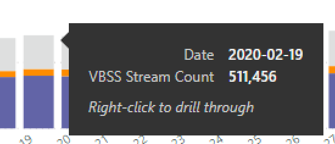
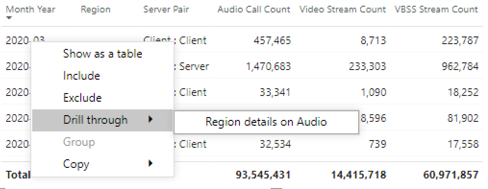
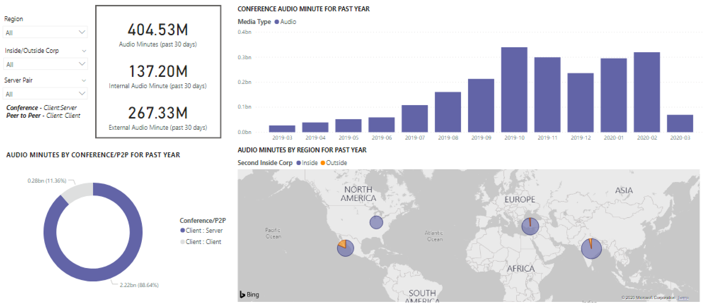
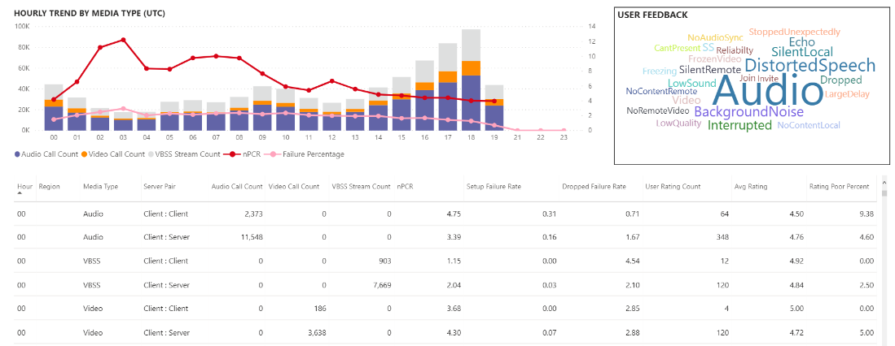
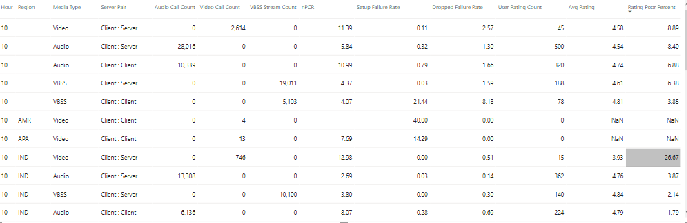

# Visualizzare l'utilizzo di Microsoft teams in Power BI usando i dati di Call Quality dashboardView Microsoft Teams utilization in Power BI using CQD data

Novità di marzo 2020 è stato aggiunto un report di utilizzo dei team ai [modelli di query di Power bi scaricabili per Call Quality dashboard](https://github.com/MicrosoftDocs/OfficeDocs-SkypeForBusiness/blob/live/Teams/downloads/CQD-Power-BI-query-templates.zip?raw=true).New in March 2020, we've added a Teams Utilization report to our downloadable [Power BI query templates for CQD](https://github.com/MicrosoftDocs/OfficeDocs-SkypeForBusiness/blob/live/Teams/downloads/CQD-Power-BI-query-templates.zip?raw=true). 

I nuovi report di utilizzo dei team consentono di vedere come (e quanto) gli utenti usano Microsoft teams accedendo ai dati di Call Quality Dashboard (teams Call Quality Dashboard).This new Teams Utilization reports lets you see how (and how much) your users are using Microsoft Teams by accessing Teams Call Quality Dashboard (CQD) data. Questi report sono progettati per essere una posizione centralizzata che consente agli amministratori e alle aziende leader di accedere rapidamente a questi dati.These reports are intended to be a centralized location that both administrators and business leaders can quickly go to for this data.

Il report utilizzo di Power BI di teams è costituito da due report principali: riepilogo delle **[chiamate](#call-count-summary-report)** e riepilogo dei **[minuti audio](#audio-minutes-summary-report)**.The Teams Utilization Power BI report consists of two primary reports: **[Call Count Summary](#call-count-summary-report)** and **[Audio Minutes Summary](#audio-minutes-summary-report)**. L' [uso quotidiano](#daily-usage), i [dettagli audio regionali](#regional-audio-details), i [Dettagli delle conferenze](#conference-details) e i report [degli elenchi di utenti](#user-list) entrano in gioco quando un utente sfrutta i rapporti di drill-down descritti nelle descrizioni seguenti.The [Daily Usage](#daily-usage), [Regional Audio Details](#regional-audio-details), [Conference Details](#conference-details) and [User List](#user-list) reports come into play when a user takes advantage of the drill-down reports, noted in the descriptions below.

> [!NOTE]
> I dati di compilazione e subnet devono essere popolati per consentire funzionalità di filtro di rete e regionali.Building and subnet data must be populated to provide regional and network filtering capabilities.

## Report riepilogo Conteggio chiamateCall Count Summary Report

La pagina principale (riepilogo Conteggio chiamate) fornisce immediatamente il numero di sessioni di condivisione audio, video e dello schermo negli ultimi 30 e 90 giorni, come indicato nel titolo della sezione.The main page (Call Count Summary) immediately provides the number of audio, video and screen sharing sessions over the last 30 and 90 days as noted in the section title. I dati visualizzati inizialmente sono per l'intera organizzazione e possono essere filtrati usando le opzioni di elenco a discesa del filtro delle informazioni sul lato sinistro della pagina.The data initially displayed is for the organization as a whole and can be filtered using the slicer dropdown options on the left side of the page.

1. A destra dell'elenco a discesa del filtro dei dati, il numero di chiamate per tipo di elemento multimediale è suddiviso in una visualizzazione interna/esterna negli ultimi trenta giorni.To the right of the slicer dropdowns, the number of calls by media type is broken down to an internal/external view over the past thirty days. Possiamo vedere attraverso lo screenshot sopra che ci sono più chiamate che si verificano da posizioni fuori dall'organizzazione, il che ha senso considerando l'ambiente globale corrente.We can see through the above screenshot that there are more calls happening from outside organizational locations, which makes sense considering the current global environment.
  

1. A destra della casella Conteggio tipi di elementi multimediali è presente il conteggio chiamate mensili per tipo di elemento multimediale per gli ultimi 90 giorni.To the right of the media type count box, we have the Monthly Call Count by Media Type for the last 90 days. Ogni colonna e tipo di elemento multimediale può essere posizionato sopra per visualizzare il conteggio per un mese precedente o il mese corrente fino a data, fornendo informazioni sulle tendenze di utilizzo.Each column and media type can be hovered over to display the count for a previous month or the current month to date, providing usage trend information.
  
 

1. Il grafico centrale funziona come il grafico di 90 giorni, ma offre una visualizzazione giornaliera degli ultimi 30 giorni e consente a un utente di fare clic con il pulsante destro del mouse e di eseguire il drill-down nei dettagli per un giorno specifico.The middle graph functions as the 90-day graph does, however it provides a daily usage view for the past 30 days and allows a user to right click and drill down into details for a specific day.
  

Nella sezione in basso a sinistra della pagina è disponibile una tabella che fornisce i valori totali per ogni tipo di elemento multimediale dello scorso anno.On the bottom left section of the page, you'll find a table providing total values for each media type over the past year. 
         

A destra della tabella, un grafico a barre Mostra i client con la maggior parte dei casi (chiamate/flussi) per gli ultimi 30 giorni.To the right of the table, a bar chart shows clients with the most use (calls/streams) for the past 30 days.
   

L'ultimo set di grafici per questa pagina mostra ogni tipo di elemento multimediale individualmente, con una ripartizione che mostra l'uso di conferenze e P2P.The last set of charts for this page show each media type individually, with a breakdown showing conference and P2P usage. I grafici seguenti mostrano che c'è un numero significativamente più elevato di utilizzo delle conferenze rispetto al P2P.The charts below show that there is a significantly higher number of conference usage as compared to P2P.
  

## Report di riepilogo minuti audioAudio Minutes Summary Report

Nel report sull'utilizzo dei minuti audio l'utilizzo totale dei minuti viene fornito tramite alcune visualizzazioni diverse.On the Audio Minutes usage report, the total minute usage is provided through a few different views. 

Il riepilogo dell'utilizzo di trenta giorni viene visualizzato accanto ai filtri dei dati come caselle di testo semplici da utilizzare.We have the thirty-day usage summary shown next to the slicers as easy to consume text boxes. Il numero superiore mostra il totale di trenta giorni, con guasti interni ed esterni.The top number shows the thirty-day total, with internal and external breakdowns below that.

Il grafico a barre superiore destro offre una visualizzazione yearlong dell'uso dell'audio per conferenze.The top right bar graph provides a yearlong view of conference audio usage. Posizionare il puntatore del mouse sul mese per visualizzare i minuti audio della conferenza.Hover over the month to show the conference audio minutes.

Per mostrare la differenza tra il P2P e l'audio per conferenze, il grafico in basso a sinistra prende tutto l'audio per l'anno passato e lo suddivide tra i due tipi.To show the difference in P2P and conference audio, the bottom left chart takes all audio for the past year and breaks it up between the two types.

Nell'ultimo grafico della pagina minuti audio viene visualizzato l'utilizzo dei minuti audio in una sovrapposizione globale della mappa.The last chart for the Audio minutes page shows audio minute usage on a global map overlay. Questo grafico funzionerà solo se i dati di compilazione e subnet vengono caricati nel tenant.This chart will only work if building and subnet data is uploaded to the tenant. È possibile eseguire il drill-down della sovrapposizione del grafico a torta sulla mappa, fornendo in seguito l'utilizzo dell'audio locale.The pie chart overlay on the map can be drilled into, subsequently providing regional audio usage.

## Funzionalità di drill-throughDrill-through capabilities

Come indicato in precedenza, gli utenti possono eseguire il drill-up dei report di utilizzo giornalieri e regionali.As previously noted, users can drill into the daily and regional usage reports.

### Uso quotidianoDaily Usage

Il report utilizzo giornaliero consente a un amministratore di identificare i periodi di consumo di picco nel corso di una giornata.The Daily Usage report allows an administrator to identify peak consumption periods through the course of a day. Oltre all'uso, siamo anche in grado di acquisire sentimenti e feedback generali degli utenti per quel giorno.In addition to usage, we are also able to capture overall user sentiment and feedback for that day.

Nel report utilizzo giornaliero viene visualizzato il numero di condivisioni audio, video e dello schermo per il giorno selezionato, con la possibilità di distinguere tra connettività interna ed esterna.The Daily usage report displays the number of Audio, Video and Screen shares for the selected day with the added ability to differentiate between internal and external connectivity. Una conferenza e una ripartizione peer-to-peer si trova all'immediata destra della casella totale modalità.A Conference and Peer to Peer breakdown is to the immediate right of the modality total box. Nell'angolo in alto a destra del report è disponibile un elenco di conferenze con l'ID associato e i partecipanti per il giorno.The top right of the report provides a list of conferences with their associated ID and participants for the day. L'elenco conferenze offre anche un ulteriore drill-down per il report Dettagli conferenza.The conference list provides an additional drill down to the Conference Details report as well. SOSTITUISCI ELEMENTO GRAFICOREPLACE GRAPHIC

Il grafico a barre nell'area centrale consente all'utente di identificare i periodi di consumo di picco nel corso di una giornata.The bar graph in the center area allows the user to identify peak consumption periods through the course of a day. Gli utenti possono eseguire il drill-down nell'ora rappresentata nel grafico che presenterà il rapporto elenco utenti per l'ora.Users may drill down into the hour represented on the graph which will present the User List report for the hour.

A destra del grafico a barre, il feedback degli utenti viene presentato in un formato visivo.To the right of the bar graph, User Feedback is presented in a visual format. Mentre il sentimento degli utenti può essere soggettivo, offre informazioni che possono essere usate per identificare potenziali problemi.While user sentiment can be subjective, it does provide insight that can be used to identify potential issues.

La tabella inferiore include un intervallo di metriche per il giorno.The bottom table provides a range of metrics for the day. Le percentuali scarse insieme alle tariffe di errore possono essere fornite da un amministratore con potenziali aree di miglioramento.Poor percentages along with failure rates can provide an administrator with potential areas of improvement. Ogni ora può essere selezionata anche singolarmente, come illustrato di seguito.Each hour can also be selected individually as shown below.

Questi dati possono essere usati per identificare le aree che hanno problemi durante i tempi di consumo massimo.This data can be used to identify regions having problems during peak consumption times.

Fare clic sulla colonna per il giorno in cui visualizzare le metriche per l'ora.Click on the column for that day to display metrics for that hour.

  
  1.  La tabella sotto il grafico visualizzerà le metriche per l'ora.The table below the chart will display the metrics for that hour. Questa operazione può essere ordinata in base a qualsiasi intestazione di colonna. Tuttavia, ci interesserebbe trovare aree problematiche.This can be sorted by any column header; however, we would be interested in finding problematic areas.  
    
    
  2.  Vediamo che l'area IND sta vivendo scarse prestazioni video in conferenze durante questo lasso di tempo.We see that the IND region is experiencing poor video performance in conferences during this time frame. In seguito, è possibile usare i report Microsoft Call Quality dashboard QER per limitare la posizione problematica in cui l'area geografica e l'intervallo di tempo sono stati identificati.Subsequently, the CQD QER Microsoft reports can be used to narrow down the problematic location as the region and time frame has been identified.

### Dettagli conferenzaConference Details

Il report Dettagli conferenza offre ulteriori informazioni sulle riunioni, da un elenco di partecipanti, ai tipi di elementi multimediali usati durante la sessione.The Conference Details report provides additional insight for meetings, from an attendee list, to the media types used during the session.

Fare clic con il pulsante destro del mouse su una conferenza nella barra dei partecipanti nel grafico ID conferenza nella pagina uso giornaliero per eseguire il drill-down nei dettagli della conferenza.Right click a conference the participant bar in the conference ID chart on the Daily usage page to drill down into the conference details.

  

Possiamo vedere i partecipanti alla conferenza, nonché tutte le informazioni pertinenti fino a perdita di pacchetti e jitter per facilitare gli sforzi possibili per la risoluzione dei problemi nella tabella inferiore.We can see the participants in the conference as well as all the pertinent information down to packet loss and jitter to assist with potential troubleshooting efforts in the bottom table.

### Dettagli audio internazionaliRegional Audio Details

Il drill-down dei dettagli audio internazionali Mostra in modo specifico l'utilizzo dei minuti audio per l'area selezionata.The Regional Audio Details drill down specifically shows the audio minute usage for the selected region. Gli utenti con accesso a Call Quality dashboard possono vedere le tendenze di utilizzo per l'audio sia P2P che congressuale all'interno dell'area selezionata.Users with access to CQD can see usage trends for both P2P and conference audio within the selected region.

1.  Nella pagina Riepilogo conteggio chiamate eseguire il drill-through come area specifica tramite la tabella.On the Call Count Summary page, drill-through to as specific region through the table.
  

2.  Selezionare la riga con l'area geografica in cui sono necessarie altre informazioni.Select the row with the region additional information is needed for.
  

3.  Le tendenze dei dati mostrano un numero significativo di minuti usati nella rete interna, con i servizi di conferenza che superano l'uso P2P.The data trends show a significant number of minutes being used on the internal network, with conferencing far surpassing P2P use.
  

La tendenza audio locale può essere usata per mostrare in che modo gli utenti hanno un impatto sulle influenze esterne nel mondo.The regional audio trend can be used to show how users are impacted by external influences in the world. In particolare, in questo momento, ci si aspetterebbe di vedere l'uso esterno per le aree EMEA e APAC per aumentare le persone che hanno chiesto di lavorare in remoto.Specifically, right now, we would expect to see the external usage for the EMEA and APAC regions to increase with people being asked to work remotely.

### Elenco utentiUser List

Il drill-down elenco utenti offre, come ci si potrebbe aspettare, informazioni specifiche dell'utente per un'ora specifica selezionata dalla persona che Visualizza il report.The User List drill down provides, as one might expect, user specific information for a specific hour selected by the person viewing the report. Il report elenco utenti è accessibile tramite drill-down nel grafico tendenze orarie nel report utilizzo giornaliero.The User List report is accessible through a drill down in the Hourly Trends graph on the Daily Usage report. Fare clic con il pulsante destro del mouse sull'ora sono necessarie altre informazioni per selezionare drill-through e elenco utenti, come illustrato di seguito.Right click on the hour additional information is needed for and select Drill through and User List, as shown below.

Il report elenco utenti Mostra la connettività interna/esterna tramite il grafico ad anello nel centro superiore della pagina.The User List report shows internal/external connectivity through the doughnut chart in the top center of the page. Possiamo vedere che c'è una grande quantità di partecipazione dall'esterno della rete aziendale nell'immagine seguente.We can see that there is a large amount of participation from Outside the corporate network in the below image.

L'angolo in alto a destra del grafico mostra il numero di chiamate effettuate da ogni utente in quell'ora.The top right of the graph shows the number of calls made by each user within that hour.

Nella tabella inferiore vengono fornite informazioni dettagliate sulle sessioni a cui ogni utente ha partecipato durante tale ora.The bottom table provides detailed information for the sessions each user participated in during that hour. La colonna tipo di errore è utile per determinare cosa ha causato una chiamata a drop.The Failure Type column is useful in determining what caused a call to drop. Le colonne del dispositivo di acquisizione e rendering sono utili per identificare il motivo per cui una chiamata è stata segnalata con scarsa qualità.The Capture and Render Device columns are useful in identifying why a call was reported having poor quality.

## Argomenti correlatiRelated topics

[Dimensioni e misure disponibili in Dashboard Qualità della chiamataDimensions and measures available in Call Quality Dashboard](dimensions-and-measures-available-in-call-quality-dashboard.md)

[Classificazione del flusso in Dashboard Qualità della chiamataStream Classification in Call Quality Dashboard](stream-classification-in-call-quality-dashboard.md)

[Configurazione di Skype for Business Call AnalyticsSet up Skype for Business Call Analytics](set-up-call-analytics.md)

[Uso di Call Analytics per risolvere problemi di bassa qualità delle chiamateUse Call Analytics to troubleshoot poor call quality](use-call-analytics-to-troubleshoot-poor-call-quality.md)

[Analisi delle chiamate e Dashboard Qualità della chiamataCall Analytics and Call Quality Dashboard](difference-between-call-analytics-and-call-quality-dashboard.md)

[Risoluzione dei problemi di TeamsTeams Troubleshooting](https://docs.microsoft.com/MicrosoftTeams/troubleshoot/teams)
 