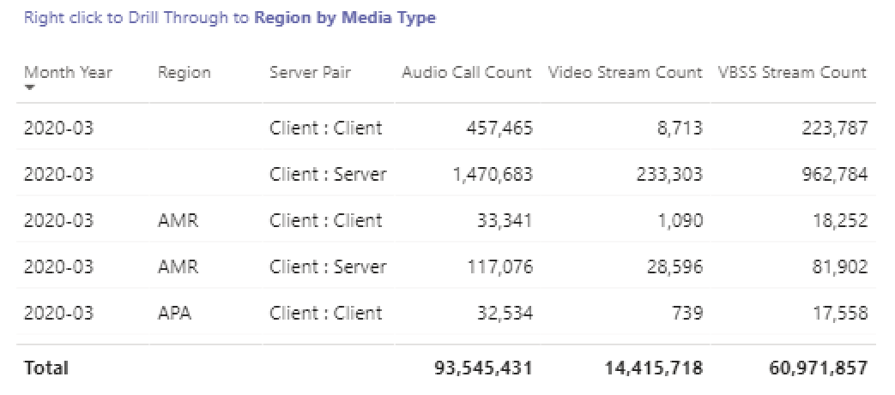

# Visualizzare Microsoft Teams utilizzo Power BI dati CQD

A marzo 2020 è stato aggiunto un report sull'Teams utilizzo dei dati ai modelli di query Power BI scaricabili [per CQD.](https://github.com/MicrosoftDocs/OfficeDocs-SkypeForBusiness/blob/live/Teams/downloads/CQD-Power-BI-query-templates.zip?raw=true) 

Questo nuovo Teams di utilizzo consente di vedere come (e quanto) gli utenti usano Microsoft Teams accedendo ai dati del Teams Call Quality Dashboard (CQD). Questi report sono pensati per essere una posizione centralizzata a cui sia gli amministratori che i responsabili aziendali possono accedere rapidamente per questi dati.

Il report Teams utilizzo Power BI è costituito da due report principali: **[Riepilogo](#call-count-summary-report)** conteggio chiamate **[e Riepilogo minuti audio.](#audio-minutes-summary-report)** I [report](#daily-usage)Uso giornaliero, Dettagli  [audio](#regional-audio-details) [locali,](#conference-details) Dettagli conferenza ed Elenco utenti vengono riprodotti quando un utente sfrutta i report di drill-down, come indicato nelle descrizioni seguenti.

> [!NOTE]
> I dati relativi a edifici e subnet devono essere popolati per fornire funzionalità di filtro di rete e locali.

## Report riepilogo conteggio chiamate

La pagina principale (Riepilogo conteggio chiamate) fornisce immediatamente il numero di sessioni audio, video e di condivisione dello schermo negli ultimi 30 e 90 giorni, come illustrato nel titolo della sezione. I dati inizialmente visualizzati sono per l'intera organizzazione e possono essere filtrati usando le opzioni dell'elenco a discesa del filtro dei dati sul lato sinistro della pagina.

1. A destra degli elenchi a discesa del filtro dei dati, il numero di chiamate per tipo di supporto è suddiviso in una visualizzazione interna/esterna negli ultimi trenta giorni. È possibile vedere attraverso lo screenshot precedente che ci sono più chiamate provenienti da posizioni esterne all'organizzazione, il che ha senso considerando l'ambiente globale corrente.
  

1. A destra della casella Conteggio tipi di supporti, è stato selezionato Il numero di chiamate mensili per tipo di supporto per gli ultimi 90 giorni. È possibile passare il puntatore del mouse su ogni colonna e tipo di elemento multimediale per visualizzare il conteggio di un mese precedente o del mese corrente fino alla data corrente, fornendo informazioni sulla tendenza di utilizzo.
  
 

1. Il grafico centrale funziona come il grafico di 90 giorni, tuttavia offre una visualizzazione di utilizzo giornaliero per gli ultimi 30 giorni e consente a un utente di fare clic con il pulsante destro del mouse ed eseguire il drill-down nei dettagli per un giorno specifico.
  

Nella sezione in basso a sinistra della pagina è presente una tabella che fornisce i valori totali per ogni tipo di supporto nell'ultimo anno. 
        

A destra della tabella, un grafico a barre mostra i clienti con il maggior utilizzo (chiamate/flussi) degli ultimi 30 giorni.
   

L'ultimo set di grafici per questa pagina mostra ogni tipo di elemento multimediale singolarmente, con una suddivisione che mostra l'uso di conferenze e P2P. I grafici seguenti mostrano che esiste un numero significativamente maggiore di utilizzo delle conferenze rispetto a P2P.
  

## Report di riepilogo dei minuti audio

Nel report Utilizzo minuti audio, l'utilizzo totale dei minuti viene fornito tramite alcune visualizzazioni diverse. 

Accanto ai filtri dei dati viene visualizzato il riepilogo dell'utilizzo di 30 giorni, che semplifica l'uso delle caselle di testo. Il numero superiore mostra il totale di 30 giorni, con le suddivisioni interne ed esterne inferiori.

Il grafico a barre in alto a destra offre una visualizzazione annuale dell'utilizzo dell'audio della conferenza. Passare il puntatore del mouse sul mese per visualizzare i minuti audio della conferenza.

Per mostrare la differenza nell'audio P2P e nella conferenza, il grafico in basso a sinistra prende tutto l'audio dell'anno scorso e lo suddivide tra i due tipi.

L'ultimo grafico per la pagina Minuti audio mostra l'utilizzo dei minuti audio in una sovrapposizione mappa globale. Questo grafico funziona solo se i dati di edificio e subnet vengono caricati nel tenant. È possibile eseguire il drill-down della sovrapposizione del grafico a torta sulla mappa, fornendo in seguito l'utilizzo dell'audio locale.

## Funzionalità di drill-through

Come accennato in precedenza, gli utenti possono eseguire il drill-down dei report di utilizzo giornalieri e locali.

### Utilizzo giornaliero

Il report Utilizzo giornaliero consente a un amministratore di identificare i periodi di picco di consumo nel corso di un giorno. Oltre all'uso, siamo anche in grado di acquisire il feedback e il feedback degli utenti per quel giorno.

Il report Utilizzo giornaliero visualizza il numero di condivisioni audio, video e dello schermo per il giorno selezionato, con la possibilità di distinguere tra connettività interna ed esterna. Una suddivisione tra conferenze e peer-to-peer è a destra immediata della casella Totale modalità. Nell'angolo in alto a destra del report è disponibile un elenco di conferenze con l'ID associato e i partecipanti per la giornata. L'elenco delle conferenze fornisce anche un ulteriore drill-down per il report Dettagli conferenza. SOSTITUISCI ELEMENTO GRAFICO

Il grafico a barre nell'area centrale consente all'utente di identificare i periodi di picco di consumo nel corso di una giornata. Gli utenti possono eseguire il drill-down nell'ora rappresentata nel grafico che presenterà il report Elenco utenti per l'ora.

A destra del grafico a barre, il feedback degli utenti è presentato in un formato visivo. Anche se la valutazione degli utenti può essere soggettiva, fornisce informazioni approfondite che possono essere usate per identificare potenziali problemi.

La tabella inferiore fornisce un intervallo di metriche per il giorno. Le percentuali scarse e le percentuali di errore possono fornire a un amministratore potenziali aree di miglioramento. Ogni ora può essere selezionata anche singolarmente, come illustrato di seguito.

Questi dati possono essere usati per identificare le aree in cui si verificano problemi durante i periodi di picco di consumo.

Fare clic sulla colonna del giorno per visualizzare le metriche per quell'ora.

  
  1.  La tabella sotto il grafico visualizza le metriche per quell'ora. Può essere ordinato in base a qualsiasi intestazione di colonna. tuttavia, siamo interessati a trovare aree problematiche.  
    
    
  2.  Vediamo che l'area IND sta riscontrando prestazioni video scarse nelle conferenze durante questo periodo di tempo. Successivamente, i report QER di CQD Microsoft possono essere usati per restringere la posizione problematica quando è stata identificata l'area geografica e l'intervallo di tempo.

### Dettagli conferenza

Il report Dettagli conferenza fornisce informazioni aggiuntive per le riunioni, da un elenco di partecipanti, ai tipi di elementi multimediali usati durante la sessione.

Fare clic con il pulsante destro del mouse su una conferenza sulla barra dei partecipanti nel grafico dell'ID conferenza nella pagina Utilizzo quotidiano per eseguire il drill-down dei dettagli della conferenza.

  

Possiamo vedere i partecipanti alla conferenza, oltre a tutte le informazioni pertinenti fino alla perdita di pacchetti e al jitter, per aiutare con i potenziali tentativi di risoluzione dei problemi nella tabella inferiore.

### Dettagli audio locali

Il drill-down Dettagli audio locali mostra in modo specifico l'utilizzo dei minuti audio per l'area selezionata. Gli utenti che hanno accesso a CQD possono vedere le tendenze di utilizzo sia per l'audio P2P che per la conferenza all'interno dell'area selezionata.

1.  Nella pagina Riepilogo conteggio chiamate eseguire il drill-through come area specifica della tabella.
  

2.  Selezionare la riga per cui sono necessarie informazioni aggiuntive sull'area geografica.
  

3.  Le tendenze dei dati mostrano un numero significativo di minuti usati nella rete interna, con conferenze che superano di gran lunga l'uso P2P.
  

La tendenza audio regionale può essere usata per mostrare in che modo gli utenti sono influenzati da influenze esterne nel mondo. In particolare, in questo momento, l'utilizzo esterno per le aree EMEA e APAC dovrebbe aumentare con la richiesta di lavorare in remoto.

### Elenco utenti

Il drill-down elenco utenti fornisce, come ci si potrebbe aspettare, informazioni specifiche dell'utente per un'ora specifica selezionata dalla persona che visualizza il report. Il report Elenco utenti è accessibile tramite un drill-down nel grafico Tendenze orarie nel report Utilizzo giornaliero. Fare clic con il pulsante destro del mouse sull'ora per cui sono necessarie altre informazioni e selezionare Drill-through ed Elenco utenti, come illustrato di seguito.

Il report Elenco utenti mostra la connettività interna/esterna tramite il grafico ad anello nella parte superiore centrale della pagina. Nell'immagine seguente è presente una grande quantità di partecipazione dall'esterno della rete aziendale.

Nell'angolo in alto a destra del grafico viene visualizzato il numero di chiamate effettuate da ogni utente entro quell'ora.

La tabella inferiore contiene informazioni dettagliate per le sessioni a cui ogni utente ha partecipato durante quell'ora. La colonna Tipo errore è utile per determinare cosa ha causato l'eliminazione di una chiamata. Le colonne Acquisizione e Dispositivo di rendering sono utili per identificare il motivo per cui una chiamata è stata segnalata di qualità scarsa.

## Argomenti correlati

[Dimensioni e misure disponibili in Dashboard Qualità della chiamata](dimensions-and-measures-available-in-call-quality-dashboard.md)

[Classificazione del flusso in Dashboard Qualità della chiamata](stream-classification-in-call-quality-dashboard.md)

[Configurazione di Skype for Business Call Analytics](set-up-call-analytics.md)

[Uso di Call Analytics per risolvere problemi di bassa qualità delle chiamate](use-call-analytics-to-troubleshoot-poor-call-quality.md)

[Analisi delle chiamate e Dashboard Qualità della chiamata](./monitor-call-quality-qos.md)

[Risoluzione dei problemi di Teams](/MicrosoftTeams/troubleshoot/teams)
