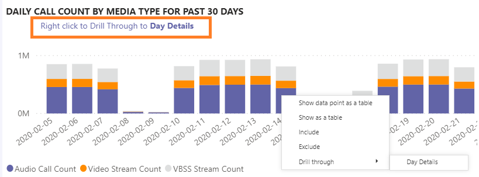
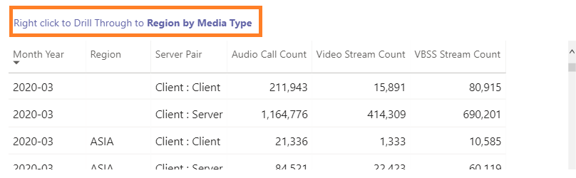

# Visualizzare l'utilizzo di Microsoft teams in Power BI usando i dati di Call Quality dashboard

Novità di marzo 2020 è stato aggiunto un report di utilizzo dei team ai [modelli di query di Power bi scaricabili per Call Quality dashboard](https://github.com/MicrosoftDocs/OfficeDocs-SkypeForBusiness/blob/live/Teams/downloads/CQD-Power-BI-query-templates.zip?raw=true). 

I nuovi report di utilizzo dei team consentono di vedere come (e quanto) gli utenti usano Microsoft teams accedendo ai dati di Call Quality Dashboard (teams Call Quality Dashboard). Questi report sono progettati per essere una posizione centralizzata che consente agli amministratori e alle aziende leader di accedere rapidamente a questi dati.

Il report utilizzo di Power BI di teams è costituito da due report principali: riepilogo delle **[chiamate](#call-count-summary-report)** e riepilogo dei **[minuti audio](#audio-minutes-summary-report)**. L' [uso quotidiano](#daily-usage), i [dettagli audio regionali](#regional-audio-details), i [Dettagli delle conferenze](#conference-details) e i report [degli elenchi di utenti](#user-list) entrano in gioco quando un utente sfrutta i rapporti di drill-down descritti nelle descrizioni seguenti.

> [!NOTE]
> I dati di compilazione e subnet devono essere popolati per consentire funzionalità di filtro di rete e regionali.

## Report riepilogo Conteggio chiamate

La pagina principale (riepilogo Conteggio chiamate) fornisce immediatamente il numero di sessioni di condivisione audio, video e dello schermo negli ultimi 30 e 90 giorni, come indicato nel titolo della sezione. I dati visualizzati inizialmente sono per l'intera organizzazione e possono essere filtrati usando le opzioni di elenco a discesa del filtro delle informazioni sul lato sinistro della pagina.

1. A destra dell'elenco a discesa del filtro dei dati, il numero di chiamate per tipo di elemento multimediale è suddiviso in una visualizzazione interna/esterna negli ultimi trenta giorni. Possiamo vedere attraverso lo screenshot sopra che ci sono più chiamate che si verificano da posizioni fuori dall'organizzazione, il che ha senso considerando l'ambiente globale corrente.
  

1. A destra della casella Conteggio tipi di elementi multimediali è presente il conteggio chiamate mensili per tipo di elemento multimediale per gli ultimi 90 giorni. Ogni colonna e tipo di elemento multimediale può essere posizionato sopra per visualizzare il conteggio per un mese precedente o il mese corrente fino a data, fornendo informazioni sulle tendenze di utilizzo.
  
 

1. Il grafico centrale funziona come il grafico di 90 giorni, ma offre una visualizzazione giornaliera degli ultimi 30 giorni e consente a un utente di fare clic con il pulsante destro del mouse e di eseguire il drill-down nei dettagli per un giorno specifico.
  

Nella sezione in basso a sinistra della pagina è disponibile una tabella che fornisce i valori totali per ogni tipo di elemento multimediale dello scorso anno. 
        

A destra della tabella, un grafico a barre Mostra i client con la maggior parte dei casi (chiamate/flussi) per gli ultimi 30 giorni.
   

L'ultimo set di grafici per questa pagina mostra ogni tipo di elemento multimediale individualmente, con una ripartizione che mostra l'uso di conferenze e P2P. I grafici seguenti mostrano che c'è un numero significativamente più elevato di utilizzo delle conferenze rispetto al P2P.
  

## Report di riepilogo minuti audio

Nel report sull'utilizzo dei minuti audio l'utilizzo totale dei minuti viene fornito tramite alcune visualizzazioni diverse. 

Il riepilogo dell'utilizzo di trenta giorni viene visualizzato accanto ai filtri dei dati come caselle di testo semplici da utilizzare. Il numero superiore mostra il totale di trenta giorni, con guasti interni ed esterni.

Il grafico a barre superiore destro offre una visualizzazione yearlong dell'uso dell'audio per conferenze. Posizionare il puntatore del mouse sul mese per visualizzare i minuti audio della conferenza.

Per mostrare la differenza tra il P2P e l'audio per conferenze, il grafico in basso a sinistra prende tutto l'audio per l'anno passato e lo suddivide tra i due tipi.

Nell'ultimo grafico della pagina minuti audio viene visualizzato l'utilizzo dei minuti audio in una sovrapposizione globale della mappa. Questo grafico funzionerà solo se i dati di compilazione e subnet vengono caricati nel tenant. È possibile eseguire il drill-down della sovrapposizione del grafico a torta sulla mappa, fornendo in seguito l'utilizzo dell'audio locale.

## Funzionalità di drill-through

Come indicato in precedenza, gli utenti possono eseguire il drill-up dei report di utilizzo giornalieri e regionali.

### Uso quotidiano

Il report utilizzo giornaliero consente a un amministratore di identificare i periodi di consumo di picco nel corso di una giornata. Oltre all'uso, siamo anche in grado di acquisire sentimenti e feedback generali degli utenti per quel giorno.

Nel report utilizzo giornaliero viene visualizzato il numero di condivisioni audio, video e dello schermo per il giorno selezionato, con la possibilità di distinguere tra connettività interna ed esterna. Una conferenza e una ripartizione peer-to-peer si trova all'immediata destra della casella totale modalità. Nell'angolo in alto a destra del report è disponibile un elenco di conferenze con l'ID associato e i partecipanti per il giorno. L'elenco conferenze offre anche un ulteriore drill-down per il report Dettagli conferenza. SOSTITUISCI ELEMENTO GRAFICO

Il grafico a barre nell'area centrale consente all'utente di identificare i periodi di consumo di picco nel corso di una giornata. Gli utenti possono eseguire il drill-down nell'ora rappresentata nel grafico che presenterà il rapporto elenco utenti per l'ora.

A destra del grafico a barre, il feedback degli utenti viene presentato in un formato visivo. Mentre il sentimento degli utenti può essere soggettivo, offre informazioni che possono essere usate per identificare potenziali problemi.

La tabella inferiore include un intervallo di metriche per il giorno. Le percentuali scarse insieme alle tariffe di errore possono essere fornite da un amministratore con potenziali aree di miglioramento. Ogni ora può essere selezionata anche singolarmente, come illustrato di seguito.

Questi dati possono essere usati per identificare le aree che hanno problemi durante i tempi di consumo massimo.

Fare clic sulla colonna per il giorno in cui visualizzare le metriche per l'ora.

  
  1.  La tabella sotto il grafico visualizzerà le metriche per l'ora. Questa operazione può essere ordinata in base a qualsiasi intestazione di colonna. Tuttavia, ci interesserebbe trovare aree problematiche.  
    
    
  2.  Vediamo che l'area IND sta vivendo scarse prestazioni video in conferenze durante questo lasso di tempo. In seguito, è possibile usare i report Microsoft Call Quality dashboard QER per limitare la posizione problematica in cui l'area geografica e l'intervallo di tempo sono stati identificati.

### Dettagli conferenza

Il report Dettagli conferenza offre ulteriori informazioni sulle riunioni, da un elenco di partecipanti, ai tipi di elementi multimediali usati durante la sessione.

Fare clic con il pulsante destro del mouse su una conferenza nella barra dei partecipanti nel grafico ID conferenza nella pagina uso giornaliero per eseguire il drill-down nei dettagli della conferenza.

  

Possiamo vedere i partecipanti alla conferenza, nonché tutte le informazioni pertinenti fino a perdita di pacchetti e jitter per facilitare gli sforzi possibili per la risoluzione dei problemi nella tabella inferiore.

### Dettagli audio internazionali

Il drill-down dei dettagli audio internazionali Mostra in modo specifico l'utilizzo dei minuti audio per l'area selezionata. Gli utenti con accesso a Call Quality dashboard possono vedere le tendenze di utilizzo per l'audio sia P2P che congressuale all'interno dell'area selezionata.

1.  Nella pagina Riepilogo conteggio chiamate eseguire il drill-through come area specifica tramite la tabella.
  

2.  Selezionare la riga con l'area geografica in cui sono necessarie altre informazioni.
  

3.  Le tendenze dei dati mostrano un numero significativo di minuti usati nella rete interna, con i servizi di conferenza che superano l'uso P2P.
  

La tendenza audio locale può essere usata per mostrare in che modo gli utenti hanno un impatto sulle influenze esterne nel mondo. In particolare, in questo momento, ci si aspetterebbe di vedere l'uso esterno per le aree EMEA e APAC per aumentare le persone che hanno chiesto di lavorare in remoto.

### Elenco utenti

Il drill-down elenco utenti offre, come ci si potrebbe aspettare, informazioni specifiche dell'utente per un'ora specifica selezionata dalla persona che Visualizza il report. Il report elenco utenti è accessibile tramite drill-down nel grafico tendenze orarie nel report utilizzo giornaliero. Fare clic con il pulsante destro del mouse sull'ora sono necessarie altre informazioni per selezionare drill-through e elenco utenti, come illustrato di seguito.

Il report elenco utenti Mostra la connettività interna/esterna tramite il grafico ad anello nel centro superiore della pagina. Possiamo vedere che c'è una grande quantità di partecipazione dall'esterno della rete aziendale nell'immagine seguente.

L'angolo in alto a destra del grafico mostra il numero di chiamate effettuate da ogni utente in quell'ora.

Nella tabella inferiore vengono fornite informazioni dettagliate sulle sessioni a cui ogni utente ha partecipato durante tale ora. La colonna tipo di errore è utile per determinare cosa ha causato una chiamata a drop. Le colonne del dispositivo di acquisizione e rendering sono utili per identificare il motivo per cui una chiamata è stata segnalata con scarsa qualità.

## Argomenti correlati

[Dimensioni e misure disponibili in Dashboard Qualità della chiamata](dimensions-and-measures-available-in-call-quality-dashboard.md)

[Classificazione del flusso in Dashboard Qualità della chiamata](stream-classification-in-call-quality-dashboard.md)

[Configurazione di Skype for Business Call Analytics](set-up-call-analytics.md)

[Uso di Call Analytics per risolvere problemi di bassa qualità delle chiamate](use-call-analytics-to-troubleshoot-poor-call-quality.md)

[Analisi delle chiamate e Dashboard Qualità della chiamata](difference-between-call-analytics-and-call-quality-dashboard.md)

[Risoluzione dei problemi di Teams](https://docs.microsoft.com/MicrosoftTeams/troubleshoot/teams)
 