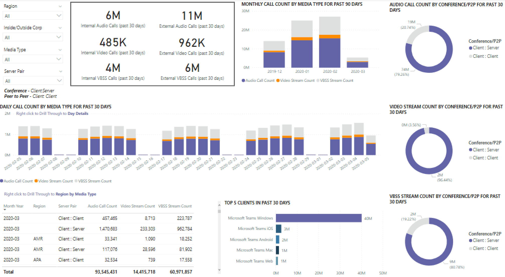

# Visualizzare l'utilizzo di Microsoft Teams in Power BI usando i dati di CQD

A marzo 2020 è stato aggiunto un report sull'utilizzo di Teams ai modelli di query di Power BI scaricabili [per CQD.](https://github.com/MicrosoftDocs/OfficeDocs-SkypeForBusiness/blob/live/Teams/downloads/CQD-Power-BI-query-templates.zip?raw=true) 

Questo nuovo report sull'utilizzo di Teams consente di vedere come (e quanto) gli utenti usano Microsoft Teams accedendo ai dati di Teams Call Quality Dashboard (CQD). Questi report sono stati pensati per essere una posizione centralizzata a cui possono accedere rapidamente gli amministratori e i responsabili aziendali.

Il report Utilizzo team di Power BI è costituito da due report principali: **[Riepilogo conteggi](#call-count-summary-report)** chiamate e Riepilogo **[minuti audio.](#audio-minutes-summary-report)** I [report Utilizzo](#daily-usage)giornaliero, Dettagli  [audio](#regional-audio-details) [regionale,](#conference-details) Dettagli conferenza ed Elenco utenti vengono riprodotti quando un utente sfrutta i report drill-down, indicati nelle descrizioni seguenti.

> [!NOTE]
> I dati di edifici e subnet devono essere popolati per fornire funzionalità di filtro di rete e di zona.

## Report riepilogo conteggi chiamate

La pagina principale (Call Count Summary) fornisce immediatamente il numero di sessioni di condivisione dello schermo, video e audio negli ultimi 30 e 90 giorni, come specificato nel titolo della sezione. I dati inizialmente visualizzati sono per l'intera organizzazione e possono essere filtrati usando le opzioni del menu a discesa del filtro dei dati sul lato sinistro della pagina.

1. A destra degli elenchi a discesa del filtro dei dati, il numero di chiamate per tipo di contenuto è suddiviso in una visualizzazione interna/esterna negli ultimi trenta giorni. Nella schermata precedente si può vedere che ci sono più chiamate in corso da posizioni esterne all'organizzazione, il che ha senso considerando l'attuale ambiente globale.
  

1. A destra della casella media type count, abbiamo il Numero mensile di chiamate per Tipo di supporto per gli ultimi 90 giorni. È possibile passare il mouse su ogni colonna e tipo di supporto per visualizzare il conteggio per il mese precedente o per il mese corrente fino a oggi, fornendo informazioni sulla tendenza di utilizzo.
  
 

1. Il grafico centrale funziona come il grafico di 90 giorni, ma fornisce una visualizzazione dell'utilizzo giornaliero per gli ultimi 30 giorni e consente all'utente di fare clic con il pulsante destro del mouse ed eseguire il drill-down dei dettagli per un giorno specifico.
  

Nella sezione in basso a sinistra della pagina è presente una tabella che fornisce i valori totali per ogni tipo di supporto nell'ultimo anno. 
        

A destra della tabella, un grafico a barre mostra i clienti con il maggior utilizzo (chiamate/flussi) degli ultimi 30 giorni.
   

L'ultimo set di grafici di questa pagina mostra ogni tipo di contenuto multimediale singolarmente, con un'analisi che mostra l'utilizzo di conferenze e P2P. I grafici seguenti mostrano che il numero di utilizzo delle conferenze è notevolmente superiore rispetto alla P2P.
  

## Report riepilogo minuti audio

Nel report Sull'utilizzo dei minuti audio, il consumo totale dei minuti viene fornito da diverse visualizzazioni. 

Accanto ai filtri dei dati viene visualizzato un riepilogo dei trenta giorni con l'uso semplice delle caselle di testo. Il numero più alto mostra il totale di trenta giorni, con le suddivisioni interne ed esterne al di sotto.

Il grafico a barre in alto a destra offre una visualizzazione annuale dell'utilizzo dell'audio delle conferenze. Passare il puntatore del mouse nel mese per visualizzare i minuti audio della conferenza.

Per mostrare la differenza nel P2P e nell'audio della conferenza, il grafico in basso a sinistra prende tutto l'audio dell'ultimo anno e lo suddivide tra i due tipi.

L'ultimo grafico della pagina Minuti audio mostra l'utilizzo dei minuti audio su una mappa globale sovrapposta. Questo grafico funziona solo se i dati dell'edificio e della subnet vengono caricati nel tenant. È possibile eseguire il drill-down della sovrapposizione dei grafici a torta sulla mappa, fornendo successivamente l'uso dell'audio locale.

## Funzionalità drill-through

Come accennato in precedenza, gli utenti possono eseguire il drill-down dei report sull'utilizzo giornaliero e locale.

### Utilizzo giornaliero

Il report Utilizzo giornaliero consente a un amministratore di identificare i periodi di picco del consumo nell'intera giornata. Oltre all'utilizzo, siamo anche in grado di acquisire il feedback generale degli utenti per quella giornata.

Il report Utilizzo giornaliero mostra il numero di condivisioni audio, video e schermo per il giorno selezionato con la possibilità di distinguere tra connettività interna ed esterna. La suddivisione di conferenze e peer-to-peer si trova a destra immediata della casella totale della modalità. Nell'angolo in alto a destra del report è disponibile un elenco delle conferenze con il proprio ID associato e i partecipanti della giornata. L'elenco delle conferenze fornisce un ulteriore drill-down per il report Dettagli conferenza. ELEMENTO GRAFICO SOSTITUISCI

Il grafico a barre nell'area centrale consente all'utente di identificare i periodi di picco del consumo nell'intera giornata. Gli utenti possono eseguire il drill-down fino all'ora rappresentata nel grafico che presenterà il report Elenco utenti per l'ora.

A destra del grafico a barre, il feedback dell'utente è presentato in formato visivo. Anche se il valutazione dell'utente può essere soggettiva, fornisce informazioni approfondite che possono essere usate per identificare i potenziali problemi.

La tabella inferiore fornisce un intervallo di metriche per il giorno. Le percentuali di scarsa qualità e le percentuali di errore possono fornire a un amministratore potenziali aree di miglioramento. Ogni ora può anche essere selezionata singolarmente, come illustrato di seguito.

Questi dati possono essere usati per identificare le aree geografiche che hanno problemi durante i periodi di picco del consumo.

Fare clic sulla colonna del giorno per visualizzare le metriche per quell'ora.

  
  1.  La tabella sotto il grafico visualizza le metriche per quell'ora. Può essere ordinato in base a qualsiasi intestazione di colonna; Tuttavia, siamo interessati a trovare aree problematiche.  
    
    
  2.  Durante questo intervallo di tempo, l'area IND sta riscontrando prestazioni scadenti durante le conferenze. Successivamente, i report QER di CQD Microsoft possono essere usati per limitare la posizione problematica quando viene identificata l'area geografica e l'intervallo di tempo.

### Dettagli conferenza

Il report Dettagli conferenza fornisce informazioni aggiuntive sulle riunioni, dall'elenco dei partecipanti, ai tipi multimediali usati durante la sessione.

Fai clic con il pulsante destro del mouse su una conferenza, sulla barra degli ID conferenza nella pagina Utilizzo giornaliero, per visualizzare i dettagli della conferenza.

  

Nella tabella inferiore sono mostrati i partecipanti alla conferenza e tutte le informazioni pertinenti fino alla perdita di pacchetti e al jitter per agevolare le possibili azioni di risoluzione dei problemi.

### Regional Audio Details

Il drill-down di Dettagli audio internazionali mostra in modo specifico l'utilizzo dei minuti audio per l'area selezionata. Gli utenti con accesso a CQD possono vedere le tendenze di utilizzo sia per il P2P che per l'audio della conferenza nell'area geografica selezionata.

1.  Nella pagina Riepilogo numero chiamate eseguire il drill-through come area specifica della tabella.
  

2.  Selezionare la riga per cui sono necessarie informazioni aggiuntive sull'area.
  

3.  Le tendenze dei dati mostrano un numero significativo di minuti utilizzati nella rete interna, con conferenze molto più rilevanti per l'uso P2P.
  

La tendenza audio regionale può essere usata per mostrare in che modo gli utenti sono influenzati dalle influenza esterne nel mondo. In particolare, in questo momento, l'utilizzo esterno delle aree EMEA e APAC dovrebbe aumentare con le persone a cui viene chiesto di lavorare in remoto.

### Elenco utenti

Il drill-down dell'Elenco utenti fornisce, come ci si può aspettare, informazioni specifiche dell'utente per un'ora specifica selezionata dalla persona che visualizza il report. Il report Elenco utenti è accessibile tramite un drill-down nel grafico Tendenze orarie nel report Utilizzo giornaliero. Fare clic con il pulsante destro del mouse sull'ora per cui sono necessarie informazioni aggiuntive e selezionare Drill-through ed Elenco utenti, come illustrato di seguito.

Il report Elenco utenti mostra la connettività interna/esterna tramite il grafico ad anello nella parte superiore centrale della pagina. Come si può vedere, la partecipazione dall'esterno della rete aziendale è notevole nell'immagine seguente.

L'angolo in alto a destra del grafico mostra il numero di chiamate effettuate da ogni utente nell'ora specifica.

La tabella inferiore contiene informazioni dettagliate per le sessioni a cui ogni utente ha partecipato durante quell'ora. La colonna Tipo errore è utile per determinare la causa dell'eliminazione di una chiamata. Le colonne Dispositivo di acquisizione e rendering sono utili per identificare il motivo per cui una chiamata ha segnalato una qualità scarsa.

## Argomenti correlati

[Dimensioni e misure disponibili in Dashboard Qualità della chiamata](dimensions-and-measures-available-in-call-quality-dashboard.md)

[Classificazione del flusso in Dashboard Qualità della chiamata](stream-classification-in-call-quality-dashboard.md)

[Configurazione di Skype for Business Call Analytics](set-up-call-analytics.md)

[Uso di Call Analytics per risolvere problemi di bassa qualità delle chiamate](use-call-analytics-to-troubleshoot-poor-call-quality.md)

[Analisi delle chiamate e Dashboard Qualità della chiamata](difference-between-call-analytics-and-call-quality-dashboard.md)

[Risoluzione dei problemi di Teams](https://docs.microsoft.com/MicrosoftTeams/troubleshoot/teams)
 