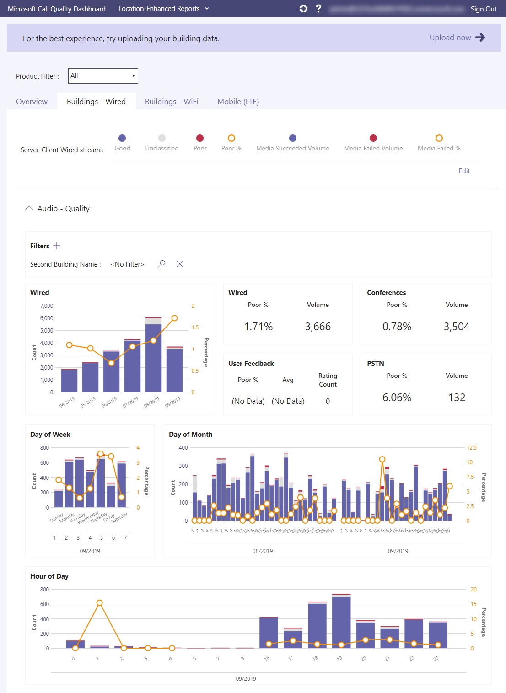

# Che cos'è Call Quality Dashboard (CQD)?

Microsoft Call Quality Dashboard (CQD) - mostra la qualità delle chiamate e delle riunioni, a livello di organizzazione, per Microsoft Teams, Skype for Business Online e Skype for Business Server [https://cqd.teams.microsoft.com](https://cqd.teams.microsoft.com) 2019.  

  
L'ultima versione di CQD include un feed di dati quasi in tempo reale [(NRT),](CQD-data-and-reports.md)il che significa che i record delle chiamate sono disponibili in CQD entro 30 minuti dalla fine di una chiamata.

Dove CQD include dati di informazioni identificabili per l'utente finale [(EUII),](CQD-data-and-reports.md#euii-data)viene gestito allo stesso modo [dell'EUII](/office365/Enterprise/office-365-data-retention-deletion-and-destruction-overview)nell'intero Microsoft 365 .

CQD è progettato per aiutare Teams amministratori, amministratori Skype for Business e tecnici di rete a monitorare la qualità delle chiamate e delle riunioni a livello di organizzazione. Si userà CQD per ottimizzare la **rete per** migliorare la qualità delle prestazioni. Quando è necessario esaminare le informazioni sulle chiamate e le riunioni per un utente **specifico,** usare i dati CQD insieme all'analisi [delle chiamate per utente.](use-call-analytics-to-troubleshoot-poor-call-quality.md)

Ad esempio, usando CQD, è possibile determinare che la scarsa qualità delle chiamate di un utente (osservata usando l'analisi delle chiamate per utente) è dovuta a un problema di rete che interessa anche molti altri utenti. CQD acquisisce sia l'esperienza delle singole chiamate che la qualità generale delle chiamate effettuate con Teams o Skype for Business. Con CQD, i modelli complessivi possono diventare evidenti, quindi i tecnici di rete possono effettuare valutazioni informate sulla qualità delle chiamate. CQD fornisce report sulle metriche sulla qualità delle chiamate che forniscono informazioni approfondite sulla qualità complessiva delle chiamate, i flussi server-client, i flussi client-client e il contratto di servizio sulla [qualità vocale.](https://go.microsoft.com/fwlink/p/?linkid=846252) 
  

In CQD ti consigliamo di caricare informazioni sull'edificio e sull'endpoint, che ti consentono di usare i report di Location-Enhanced per analizzare la qualità e l'affidabilità delle chiamate all'interno dell'edificio di un utente. I dati possono essere valutati per determinare se il problema è isolato per un singolo utente o interessa un segmento più ampio di utenti. Per attivare le visualizzazioni specifiche dell'edificio o [dell'endpoint](CQD-upload-tenant-building-data.md) in CQD, un amministratore deve caricare le informazioni sull'edificio o sull'endpoint nella pagina Upload dati del tenant **CQD.**

Non perderti  l'articolo Gestire la qualità delle chiamate e delle riunioni, che offre indicazioni approfondite per l'amministratore di Teams o il tecnico del supporto responsabile della gestione della qualità del servizio in Teams.

## Usare Power BI per analizzare i dati CQD

Novità di gennaio 2020: [Scaricare Power BI di query per CQD](https://github.com/MicrosoftDocs/OfficeDocs-SkypeForBusiness/blob/live/Teams/downloads/CQD-Power-BI-query-templates.zip?raw=true). Modelli Power BI personalizzabili che è possibile usare per analizzare e segnalare i dati CQD.

Leggere [Usare Power BI analizzare i dati CQD](CQD-Power-BI-query-templates.md) per altre informazioni.

## Argomenti correlati

[Migliorare e monitorare la qualità delle chiamate per Teams](monitor-call-quality-qos.md)

[Configurare call quality dashboard (CQD)](turning-on-and-using-call-quality-dashboard.md)

[Upload tenant e edificio](CQD-upload-tenant-building-data.md)

[Dati e report CQD](CQD-data-and-reports.md)

[Usare CQD per gestire la qualità delle chiamate e delle riunioni](quality-of-experience-review-guide.md)

[Dimensioni e misure disponibili in CQD](dimensions-and-measures-available-in-call-quality-dashboard.md)

[Classificazione dei flussi in CQD](stream-classification-in-call-quality-dashboard.md)

[Usare Power BI per analizzare i dati CQD](CQD-Power-BI-query-templates.md)

[Risoluzione dei problemi di Teams](/MicrosoftTeams/troubleshoot/teams)
