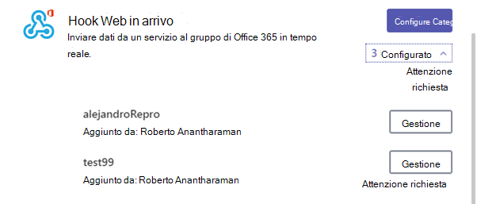

# Usare Microsoft 365 connettori personalizzati in Microsoft Teams

I connettori mantengono aggiornato il team fornendo gli aggiornamenti dei servizi e dei contenuti usati di frequente direttamente in un canale. Con i connettori, gli utenti Microsoft Teams possono ricevere aggiornamenti da servizi popolari come Trello, Wunderlist, GitHub e Azure DevOps Services all'interno dello stream di chat del team.

Qualsiasi membro di un team può connettere il team ai servizi cloud più diffusi con i connettori, se le autorizzazioni del team lo consentono e tutti i membri del team vengono informati delle attività da quel servizio. I connettori continueranno a funzionare anche dopo che il membro che ha inizialmente configurazione il connettore è rimasto. Qualsiasi membro del team con le autorizzazioni per aggiungere o rimuovere può modificare la configurazione dei connettori da parte di altri membri.

Microsoft 365 connettori possono essere usati con gruppi di Microsoft Teams e Microsoft 365, semplificando la sincronizzazione di tutti i membri e la ricezione rapida di informazioni pertinenti. Sia Microsoft Teams che Exchange lo stesso modello di connettore, che consente di usare gli stessi connettori all'interno di entrambe le piattaforme. È tuttavia opportuno notare che la disabilitazione dei connettori per il gruppo di Microsoft 365 da cui dipende un team disabiliterà anche la possibilità di creare connettori per il team.

> [Nota] I connettori sono disabilitati per impostazione predefinita negli ambienti Government Cloud Community (GCC). Se è necessario abilitarli, impostare i parametri ConnectorsEnabled o ConnectorsEnabledForTeams su $true con il cmdlet [SetOrganizationConfig.](/powershell/module/exchange/set-organizationconfig?view=exchange-ps) In precedenza era necessario connettersi alla [Exchange Online PowerShell.](/powershell/exchange/connect-to-exchange-online-powershell?view=exchange-ps)

## Aggiungere un connettore a un canale

Attualmente, è possibile aggiungere connettori usando Microsoft Teams desktop e client Web. Tuttavia, le informazioni pubblicate da questi connettori possono essere visualizzate in **tutti i client,** inclusi i dispositivi mobili.

1. Per aggiungere un connettore a un canale, fare clic sui puntini di sospensione **(...),** a destra del nome di un canale, quindi fare clic su **Connettori**.

    > [!div class="mx-imgBorder"]
    > 

2. È possibile selezionare una varietà di connettori disponibili e quindi fare clic su **Aggiungi**.

    > [!div class="mx-imgBorder"]
    > 

3. Immettere le informazioni necessarie sul connettore selezionato e fare clic su **Salva.** Per il corretto funzionamento di ogni connettore è necessario un set di informazioni diverse e alcuni potrebbero richiedere l'accesso al servizio usando i collegamenti disponibili nella pagina di configurazione del connettore.

    > [!div class="mx-imgBorder"]
    > 

4. I dati forniti dal connettore vengono inseriti automaticamente nel canale.

    > [!div class="mx-imgBorder"]
    > 

<!---Delete this section after customer migration to new Webhook URL is complete--->
> [!IMPORTANT]
> **Notifica di aggiornamento dell'URL del connettore**
>
> I Teams connettori stanno per passare a un nuovo URL per migliorare la sicurezza. Nel corso di questa transizione si riceveranno alcune notifiche per aggiornare il connettore configurato in modo da usare il nuovo URL. È consigliabile aggiornare immediatamente il connettore per evitare interruzioni dei servizi del connettore. Per aggiornare l'URL, è necessario seguire i passaggi seguenti:
> 1. Nella pagina di configurazione dei connettori verrà visualizzato un messaggio "Attenzione richiesta" sotto il pulsante "Gestisci" per le connessioni che devono essere aggiornate.
> 
> 2. Per i connettori Webhook in arrivo, gli utenti possono ricreare la connessione semplicemente selezionando **Aggiorna URL** e usando l'URL del webhook appena generato.
> 
> 3. Per altri tipi di connettori, l'utente dovrà rimuovere il connettore e ricreare la configurazione del connettore.
> 4. Dopo l'aggiornamento dell'URL, verrà visualizzato il messaggio "L'URL è aggiornato".
> 

## Sviluppare connettori personalizzati

È anche possibile creare connettori personalizzati, nonché webhook in arrivo e in uscita. Per altre informazioni, vedere la [documentazione per sviluppatori](/microsoftteams/platform/webhooks-and-connectors/what-are-webhooks-and-connectors).
