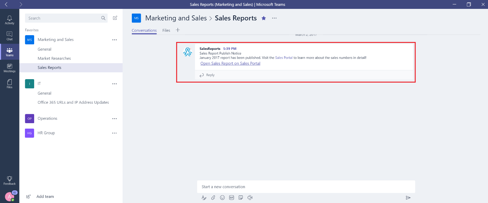

Usare Office 365 e connettori personalizzati in Microsoft TeamsUse Office 365 and custom connectors in Microsoft Teams
=======================================================

I connettori mantengono la corrente del team consegnando i contenuti e gli aggiornamenti del servizio usati di frequente direttamente in un canale.Connectors keep your team current by delivering frequently used content and service updates directly into a channel. Con i connettori, gli utenti di Microsoft teams possono ricevere gli aggiornamenti da servizi popolari come Twitter, Trello, Wunderlist, GitHub e Azure DevOps Services all'interno del flusso di chat del proprio team.With connectors, your Microsoft Teams users can receive updates from popular services such as Twitter, Trello, Wunderlist, GitHub, and Azure DevOps Services within the chat stream in their team.

Qualsiasi membro di un team può connettere il proprio team ai servizi cloud più diffusi con i connettori se le autorizzazioni del team lo consentono e tutti i membri del team ricevono notifiche di attività da tale servizio.Any member of a team can connect their team to popular cloud services with the connectors if the team permissions allow, and all team members are notified of activities from that service. I connettori continueranno a funzionare anche dopo che il membro che ha inizialmente configurato il connettore ha lasciato.Connectors will continue to function even after the member who has initially setup the connector has left. Qualsiasi membro del team con le autorizzazioni per Add\Remove può modificare la configurazione dei connettori da parte di altri membri.Any team member with the permissions to add\remove can modify connectors setup by other members.

I connettori di Office 365 possono essere usati sia con Microsoft teams che con i gruppi di Office 365, semplificando la sincronizzazione e la ricezione rapida delle informazioni rilevanti per tutti i membri.Office 365 connectors can be used with both Microsoft Teams and Office 365 groups, making it easier for all members stay in sync and receive relevant information quickly. Sia Microsoft teams che Exchange usano lo stesso modello di connettore, che consente di usare gli stessi connettori in entrambe le piattaforme.Both Microsoft Teams and Exchange use the same connector model, which allows you to use the same connectors within both platforms. È tuttavia importante notare che la disabilitazione dei connettori per il gruppo di Office 365 a cui un team dipende sarà in grado di disabilitare la possibilità di creare connettori anche per il team.It is worth noting, however, that disabling connectors for the Office 365 Group that a team is dependent upon will disable the ability to create connectors for that team as well.

Aggiungere un connettore a un canaleAdd a connector to a channel
----------------------------

Attualmente è possibile aggiungere connettori usando i client desktop e Web di Microsoft teams.Currently, you can add connectors by using Microsoft Teams desktop and web clients. Tuttavia, le informazioni pubblicate da questi connettori possono essere visualizzate in **tutti i client** , inclusi i dispositivi mobili.However, information posted by these connectors can be viewed in **all clients** including mobile.

1. Per aggiungere un connettore a un canale, fare clic sui puntini di sospensione **(...),** a destra di un nome di canale, quindi fare clic su **connettori**.To add a connector to a channel, click the **ellipses (…),** on the right of a channel name, then click **Connectors**.

    

2. È possibile selezionare una varietà di connettori disponibili e quindi fare clic su **Aggiungi**.You can select from a variety of available connectors, and then click **Add**.

    

3. Immettere le informazioni necessarie del connettore selezionato e fare clic su **Salva**.Fill in the required information of the selected connector and click **Save**. Ogni connettore richiede il corretto funzionamento di un set di informazioni diverso e alcuni potrebbero richiedere l'accesso al servizio usando i collegamenti forniti nella pagina di configurazione del connettore.Each connector requires a diverse set of information to function properly, and some may require you to sign in to the service using the links provided on the connector configuration page.

    

4. I dati forniti dal connettore vengono automaticamente inseriti nel canale.Data provided by the connector is automatically posted to the channel.

    

Sviluppare connettori personalizzatiDevelop custom connectors
-----------------------------

È molto semplice sviluppare connettori personalizzati che possono essere integrati con le applicazioni line-of-business (LOB).It is very easy to develop custom connectors that can integrate with your line-of-business (LOB) applications. Puoi usare il connettore webhook in **ingresso** incorporato per creare un endpoint per un canale che estrae i dati da qualsiasi applicazione usando i metodi post http.You can use the built-in **Incoming Webhook** connector to create an endpoint for a channel that pulls data from any application using HTTP post methods.

1. Aggiungere il **webhook in arrivo** come qualsiasi altro connettore.Add the **Incoming Webhook** like any other connector.

    

2. Per creare un hook, specificare un **nome**, aggiornare l'immagine di Webhook, se necessario, e fare clic su **Crea**.To create a Webhook, specify a **name**, update the Webhook image, if necessary, and click **Create**.

    

3. Le applicazioni che spingono i dati su questo canale richiedono l'URL del connettore webhook.Applications that push data to this channel require the Webhook connector URL. Quando si crea il webhook viene creato un URL univoco.A unique URL is created when you create the Webhook. Condividere questo URL con gli sviluppatori in modo che possano configurare le proprie applicazioni per il push dei dati, in base alle esigenze.Share this URL with your developers so that they can configure their applications to push data, as needed.

    

4. Quando un'applicazione esterna inserisce i dati in un connettore, il messaggio viene visualizzato nell'elenco di conversazione del canale come messaggio speciale denominato messaggio della **scheda connettore** .When an external application pushes data to a connector, the message is shown in the channel conversation list as a special message called a **Connector Card** message.

    

     Gli sviluppatori possono configurare le proprie applicazioni per creare queste schede inviando una richiesta HTTP con un semplice payload JSON all'indirizzo webhook di un team, che è un URL univoco di tale endpoint fornito dalla procedura guidata.Developers can configure their applications to create these cards by sending an HTTP request with a simple JSON payload to a team’s Webhook address, which is a unique URL of that endpoint provided by the wizard. Fare in modo che gli sviluppatori facciano riferimento alla [Guida introduttiva ai connettori di Office 365 per Microsoft teams](https://docs.microsoft.com/en-us/microsoftteams/platform/concepts/connectors/connectors), nella rete Microsoft Developer Network, con istruzioni dettagliate e esempi di connettori.Have your developers refer to [Getting started with Office 365 Connectors for Microsoft Teams](https://docs.microsoft.com/en-us/microsoftteams/platform/concepts/connectors/connectors), on the Microsoft Developer Network, which has detailed instructions and connector samples. Altre risorse includono le [App Connect per i gruppi in Outlook](https://support.office.com/article/Connect-apps-to-your-groups-in-Outlook-ed0ce547-038f-4902-b9b3-9e518ae6fbab) e [Office Dev Center-Microsoft teams](https://go.microsoft.com/fwlink/?linkid=855784).Other resources include [Connect apps to your groups in Outlook](https://support.office.com/article/Connect-apps-to-your-groups-in-Outlook-ed0ce547-038f-4902-b9b3-9e518ae6fbab) and the [Office Dev Center – Microsoft Teams](https://go.microsoft.com/fwlink/?linkid=855784).
