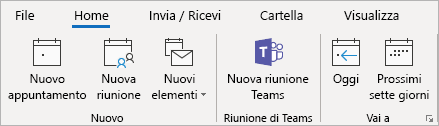
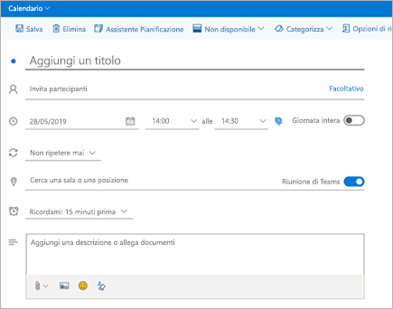
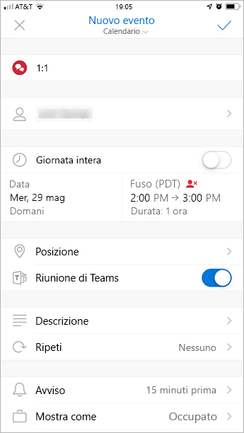

Usare il componente aggiuntivo riunione teams in OutlookUse the Teams Meeting add-in in Outlook
=======================================

Il componente aggiuntivo riunione teams consente agli utenti di pianificare una riunione Teams da Outlook.The Teams Meeting add-in lets users schedule a Teams meeting from Outlook. Il componente aggiuntivo è disponibile per Outlook in Windows, Mac, Web e mobile.The add-in is available for Outlook on Windows, Mac, web, and mobile.

## Componente aggiuntivo riunione teams in Outlook per WindowsTeams Meeting add-in in Outlook for Windows

Il componente aggiuntivo riunione teams viene installato automaticamente per gli utenti che dispongono di Microsoft teams e Office 2010, Office 2013 o Office 2016 installato nel PC Windows.The Teams Meeting add-in is automatically installed for users who have Microsoft Teams and either Office 2010, Office 2013 or Office 2016 installed on their Windows PC. Gli utenti vedranno il componente aggiuntivo riunione teams sulla barra multifunzione del calendario di Outlook.Users will see the Teams Meeting add-in on the Outlook Calendar ribbon.

> [!NOTE]
> - Se gli utenti non vedono il componente aggiuntivo riunione teams, indicano loro di chiudere Outlook e teams, quindi riavviare prima il client teams, quindi accedere a teams e quindi riavviare il client Outlook in questo ordine specifico.If users do not see the Teams Meeting add-in, instruct them to close Outlook and Teams, then restart the Teams client first, then sign in to Teams, and then restart the Outlook client, in that specific order.
> - Gli utenti di Windows 7 devono installare l' [aggiornamento per Universal C Runtime in Windows](https://support.microsoft.com/help/2999226/update-for-universal-c-runtime-in-windows) in Windows per il componente aggiuntivo riunione teams per il lavoro.Windows 7 users must install the [Update for Universal C Runtime in Windows](https://support.microsoft.com/help/2999226/update-for-universal-c-runtime-in-windows) in Windows for the Teams Meeting add-in to work.

## Componente aggiuntivo riunione teams in Outlook per MacTeams Meeting add-in in Outlook for Mac

Il pulsante riunione teams in Outlook per Mac verrà visualizzato nella barra multifunzione di Outlook per Mac se Outlook è in uso per la build di produzione 16.24.414.0 e versioni successive.The Teams Meeting button in Outlook for Mac will appear in the Outlook for Mac ribbon if Outlook is running Production Build 16.24.414.0 and later.

Le coordinate della riunione (i numeri di collegamento e di accesso esterno per i team) verranno aggiunte all'invito alla riunione dopo che l'utente ha fatto clic su **Invia**.The meeting coordinates (the Teams join link and dial-in numbers) will be added to the meeting invite after the user clicks **Send**.  

## Componente aggiuntivo riunione teams in Outlook Web AppTeams Meeting add-in in Outlook Web App

Il pulsante riunioni teams in Outlook Web App verrà visualizzato come parte della nuova creazione di eventi se l'utente si trova in una versione iniziale del nuovo Outlook sul Web.The Teams Meetings button in Outlook Web App will appear as part of new event creation if the user is on an early version of the new Outlook on the web. Vedere il [Blog di Outlook](https://techcommunity.microsoft.com/t5/Outlook-Blog/Designed-to-be-fast-The-Outlook-on-the-web-user-experience-gets/ba-p/234909?utm_source=t.co&utm_medium=referral) per informazioni su come gli utenti possono provare la versione iniziale del nuovo Outlook sul Web.See the [Outlook Blog](https://techcommunity.microsoft.com/t5/Outlook-Blog/Designed-to-be-fast-The-Outlook-on-the-web-user-experience-gets/ba-p/234909?utm_source=t.co&utm_medium=referral) to learn about how users can try the early version of the new Outlook on the web.

Le coordinate della riunione (i numeri di collegamento e di accesso esterno per i team) verranno aggiunte all'invito alla riunione dopo che l'utente ha fatto clic su **Invia**.The meeting coordinates (the Teams join link and dial-in numbers) will be added to the meeting invite after the user clicks **Send**.  

## Componente aggiuntivo riunione teams in Outlook Mobile (iOS e Android)Teams Meeting add-in in Outlook mobile (iOS and Android)

Il pulsante riunione teams viene visualizzato nelle build più recenti dell'app Outlook iOS e Android.The Teams Meeting button shows up in latest builds of the Outlook iOS and Android app.

Le coordinate della riunione (i numeri di collegamento e di accesso esterno per i team) verranno aggiunte all'invito alla riunione dopo che l'utente ha fatto clic su **Invia**.The meeting coordinates (the Teams join link and dial-in numbers) will be added to the meeting invite after the user clicks **Send**.  

## Componente aggiuntivo riunione teams in e FindTime per OutlookTeams Meeting add-in in and FindTime for Outlook
FindTime è un componente aggiuntivo per Outlook che consente agli utenti di raggiungere un consenso per un periodo di riunione tra le aziende.FindTime is an add-in for Outlook that helps users reach a consensus on a meeting time across companies. Quando gli invitati alla riunione hanno fornito i loro orari preferiti, FindTime invia l'invito alla riunione per conto dell'utente.Once the meeting invitees have provided their preferred times, FindTime sends out the meeting invite on the user's behalf. Se l'opzione **riunione online** è selezionata in FindTime, FindTime programmerà una riunione Skype for business o Microsoft teams.If the **Online meeting** option is selected in FindTime, FindTime will schedule a Skype for Business or Microsoft Teams meeting. FindTime utilizzerà l'impostazione impostata dall'organizzazione come canale di riunione online predefinito.(FindTime will use whichever has been set by your organization as the default online meeting channel.)

> [!NOTE]  
> Se è stata salvata un'impostazione di Skype for business nel [dashboard di Findtime](https://findtime.microsoft.com/UserDashboard), Findtime utilizzerà quella invece di Microsoft teams.If you saved a Skype for Business setting in your [Findtime dashboard](https://findtime.microsoft.com/UserDashboard), FindTime will use that instead of Microsoft Teams. Se si vuole usare Microsoft teams, eliminare l'impostazione Skype for business nel dashboard.If you want to use Microsoft Teams, delete the Skype for Business setting in your dashboard.

Per altre informazioni, vedere [pianificare le riunioni con FindTime](https://support.office.com/article/scheduling-meetings-with-findtime-4dc806ed-fde3-4ea7-8c5e-b5d1fddab4a6) .See [Schedule meetings with FindTime](https://support.office.com/article/scheduling-meetings-with-findtime-4dc806ed-fde3-4ea7-8c5e-b5d1fddab4a6) for more information.

## Requisiti di autenticazioneAuthentication requirements

Il componente aggiuntivo riunione teams richiede agli utenti di accedere a teams con l'autenticazione moderna.The Teams Meeting add-in requires users to sign in to Teams using Modern Authentication. Se gli utenti non usano questo metodo per accedere, saranno comunque in grado di usare il client teams, ma non saranno in grado di pianificare le riunioni online di teams usando il componente aggiuntivo per Outlook.If users do not use this method to sign in, they’ll still be able to use the Teams client, but will be unable to schedule Teams online meetings using the Outlook add-in. Per risolvere questo problema, è possibile eseguire una delle operazioni seguenti:You can fix this by doing one of the following:

- Se l'autenticazione moderna non è configurata per l'organizzazione, è necessario configurare l'autenticazione moderna.If Modern Authentication is not configured for your organization, you should configure Modern Authentication.
- Se è stata configurata l'autenticazione moderna, ma la finestra di dialogo è stata annullata, è consigliabile richiedere agli utenti di accedere di nuovo con l'autenticazione a più fattori.If Modern Authentication is configured, but they canceled out on the dialog box, you should instruct users to sign in again using multi-factor authentication.

Per ulteriori informazioni su come configurare l'autenticazione, vedere [modelli di identità e autenticazione in Microsoft teams](identify-models-authentication.md).To learn more about how to configure authentication, see [Identity models and authentication in Microsoft Teams](identify-models-authentication.md).

## Abilitare riunioni privateEnable private meetings

**Consenti la pianificazione per le riunioni private** deve essere abilitata nell'interfaccia di amministrazione di Microsoft teams per il componente aggiuntivo per la distribuzione.**Allow scheduling for private meetings** must be enabled in the Microsoft Teams admin center for the add-in to get deployed. Nell'interfaccia di amministrazione passare a**criteri riunione** **riunioni** > e, nella sezione **generale** , attivare o disattivare la **pianificazione delle riunioni private** .In the admin center, go to **Meetings** > **Meeting Policies**, and in the **General** section, toggle **Allow scheduling private meetings** to On.)

Il client teams installa il componente aggiuntivo corretto determinando se gli utenti necessitano della versione a 32 bit o 64 bit.The Teams client installs the correct add-in by determining if users need the 32-bit or 64-bit version.

> [!NOTE]
> Gli utenti potrebbero dover riavviare Outlook dopo un'installazione o un aggiornamento di teams per ottenere il componente aggiuntivo più recente.Users might need to restart Outlook after an installation or upgrade of Teams to get the latest add-in.

## Criteri di aggiornamento dei team e il componente aggiuntivo riunione team per OutlookTeams upgrade policy and the Teams Meeting add-in for Outlook

I clienti possono [scegliere il viaggio di aggiornamento da Skype for business a teams](upgrade-and-coexistence-of-skypeforbusiness-and-teams.md).Customers can [choose their upgrade journey from Skype for Business to Teams](upgrade-and-coexistence-of-skypeforbusiness-and-teams.md). Gli amministratori del tenant possono usare la modalità di coesistenza di teams per definire questo viaggio per gli utenti.Tenant admins can use the Teams co-existence mode to define this journey for their users. Gli amministratori del tenant hanno la possibilità di consentire agli utenti di usare teams insieme a Skype for business (modalità isole).Tenant admins have the option to enable users to use Teams alongside Skype for Business (Islands mode). 

Quando gli utenti che si trovano in modalità Isola pianificano una riunione in Outlook, in genere si aspettano di poter scegliere se pianificare una riunione di Skype for business o di teams.When users who are in Island mode schedule a meeting in Outlook, they typically expect to be able to choose whether to schedule a Skype for Business or a Teams meeting. In Outlook sul Web, Outlook Windows e Outlook Mac, gli utenti possono visualizzare i componenti aggiuntivi Skype for business e teams in modalità Islands.In Outlook on the web, Outlook Windows, and Outlook Mac, users see both Skype for Business and Teams add-ins when in Islands mode. A causa di alcune limitazioni della versione iniziale, Outlook Mobile può supportare solo la creazione di riunioni Skype for business **o** teams.Due to certain limitations in the initial release, Outlook mobile can only support creating Skype for Business **or** Teams meetings. Per informazioni dettagliate, vedere la tabella seguente.See the following table for details.

| Modalità di coesistenza nell'interfaccia di amministrazione di TeamsCoexistence mode in the Teams admin center | Provider di riunioni predefinito in Outlook MobileDefault meetings provider in Outlook mobile |
| --------------------------------------|---------------------------------------------|
| IsoleIslands | Skype for businessSkype for Business |
| Solo Skype for businessSkype for Business only | Skype for businessSkype for Business |
| Collaborazione tra Skype for business e teamsSkype for Business with Teams collaboration | Skype for businessSkype for Business |
| Skype for business con la collaborazione e le riunioni di TeamsSkype for Business with Teams collaboration and meetings | SquadreTeams |
| Solo TeamsTeams only | SquadreTeams |

## Altre considerazioniOther considerations

Il componente aggiuntivo riunione teams è ancora in costruzione, quindi tieni presente quanto segue:The Teams Meeting add-in is still building functionality, so be aware of the following:

- Il componente aggiuntivo è per le riunioni pianificate con partecipanti specifici, non per le riunioni in un canale.The add-in is for scheduled meetings with specific participants, not for meetings in a channel. Le riunioni di canale devono essere pianificate all'interno di teams.Channel meetings must be scheduled from within Teams.
- Il componente aggiuntivo non funzionerà se un proxy di autenticazione si trova nel percorso di rete dei servizi PC e teams dell'utente.The add-in will not work if an Authentication Proxy is in the network path of user's PC and Teams Services.
- Gli utenti non possono pianificare eventi dinamici dall'interno di Outlook.Users can't schedule live events from within Outlook. Accedere a teams per pianificare gli eventi dinamici.Go to Teams to schedule live events. Per altre informazioni, vedere [che cosa sono gli eventi live di Microsoft teams?](teams-live-events/what-are-teams-live-events.md).For more information, see [What are Microsoft Teams live events?](teams-live-events/what-are-teams-live-events.md).

## Risoluzione dei problemiTroubleshooting

Se non è possibile installare il componente aggiuntivo riunione teams per Outlook, provare a eseguire questi passaggi per la risoluzione dei problemi.If you cannot get the Teams Meeting add-in for Outlook to install, try these troubleshooting steps.

- Verificare che siano stati applicati tutti gli aggiornamenti disponibili per il client desktop Outlook.Ensure all available updates for Outlook desktop client have been applied.
- Riavviare il client desktop teams.Restart the Teams desktop client.
- Disconnettersi e quindi accedere di nuovo al client desktop teams.Sign out and then sign back in to the Teams desktop client.
- Riavviare il client desktop di Outlook.Restart the Outlook desktop client. Verificare che Outlook non sia in uso in modalità amministratore.(Make sure Outlook isn’t running in admin mode.)
- Verificare che il nome dell'account utente connesso non contenga spazi.Make sure the logged-in user account name does not contain spaces. (Si tratta di un problema noto e verrà risolto in un aggiornamento futuro).(This is a known issue, and will be fixed in a future update.)
- Verificare che Single Sign-on (SSO) sia abilitato.Make sure single sign-on (SSO) is enabled.

Se l'amministratore ha configurato Microsoft Exchange per [controllare l'accesso a Exchange Web Server (EWS)](https://docs.microsoft.com/en-us/exchange/client-developer/exchange-web-services/how-to-control-access-to-ews-in-exchange), un delegato non potrà programmare una riunione di teams per conto del boss.If your administrator has configured Microsoft Exchange to [control access to Exchange Web Server (EWS)](https://docs.microsoft.com/en-us/exchange/client-developer/exchange-web-services/how-to-control-access-to-ews-in-exchange), a delegate won't be able to schedule a Teams meeting on behalf of the boss. La soluzione per questa configurazione è in fase di sviluppo e verrà rilasciata in futuro.The solution for this configuration is under development and will be released in the future. 

Per informazioni generali su come disabilitare i componenti aggiuntivi, vedere [visualizzare, gestire e installare componenti aggiuntivi nelle applicazioni di Office](https://support.office.com/article/View-manage-and-install-add-ins-in-Office-programs-16278816-1948-4028-91E5-76DCA5380F8D).For general guidance about how to disable add-ins, see [View, manage, and install add-ins in Office programs](https://support.office.com/article/View-manage-and-install-add-ins-in-Office-programs-16278816-1948-4028-91E5-76DCA5380F8D).

Leggi altre informazioni sulle [riunioni e le chiamate in Microsoft teams](https://support.office.com/article/Meetings-and-calls-d92432d5-dd0f-4d17-8f69-06096b6b48a8).Learn more about [meetings and calling in Microsoft Teams](https://support.office.com/article/Meetings-and-calls-d92432d5-dd0f-4d17-8f69-06096b6b48a8).
