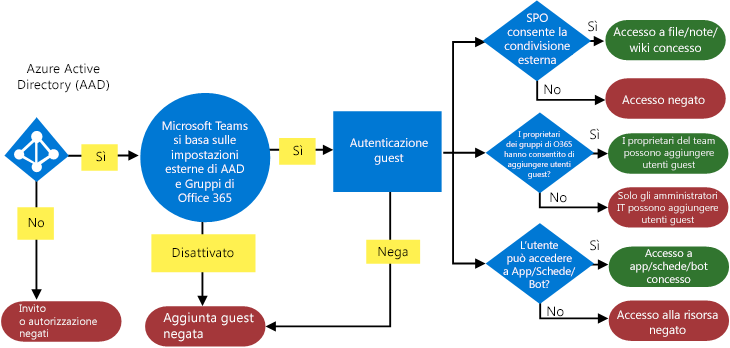
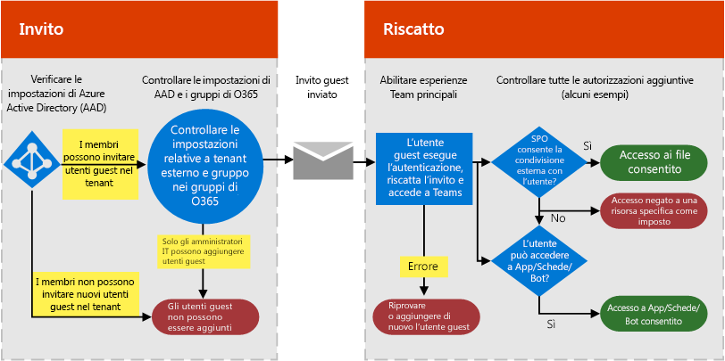
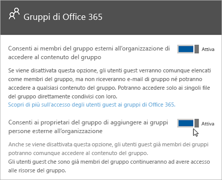

Autorizzare l'accesso guest in Microsoft Teams
===========================================

Per soddisfare i requisiti dell'organizzazione, è possibile gestire le funzionalità di accesso guest di Microsoft Teams tramite quattro diversi livelli di autorizzazione. Tutti i livelli di autorizzazione si applicano all’organizzazione di Office 365 o Microsoft 365. Ogni livello di autorizzazione controlla l'esperienza degli utenti guest come illustrato di seguito:

- **Azure Active Directory**: l'accesso guest in Microsoft Teams si basa sulla piattaforma business-to-business (B2B) di Azure AD. Questo livello di autorizzazione controlla l'esperienza degli utenti guest a livello di directory, tenant e applicazione.
- **Microsoft Teams**: controlla l'esperienza degli utenti guest solo in Microsoft Teams.
- **Gruppi di Microsoft 365**: controlla l'esperienza degli utenti guest in Gruppi di Microsoft 365 e Microsoft Teams.
- **SharePoint Online e OneDrive for Business**: controlla l'esperienza degli utenti guest in SharePoint Online, OneDrive for Business, Gruppi di Microsoft 365 e Microsoft Teams.

Questi diversi livelli di autorizzazione forniscono la massima flessibilità per la configurazione dell'accesso guest per l'organizzazione. Ad esempio, se non si vuole fornire agli utenti guest l'accesso in Microsoft Teams ma si vuole consentire l'accesso globale nell'organizzazione, basta disattivare l'accesso guest in Microsoft Teams. Un altro esempio: è possibile abilitare l'accesso guest a livello di Azure AD, Teams e Gruppi, ma disabilitare l'aggiunta degli utenti guest a determinati team che soddisfano uno o più criteri come una classificazione dei dati di tipo riservato. SharePoint Online e OneDrive for Business hanno le proprie impostazioni per l'accesso guest che non si basano su Gruppi di Microsoft 365.

> [!NOTE]
> Gli utenti guest sono soggetti ai limiti dei servizi descritti in [Descrizione dei servizi di Office 365 e Microsoft 365](https://go.microsoft.com/fwlink/p/?linkid=282347) e [Limitazioni di Collaborazione B2B di Azure AD](https://go.microsoft.com/fwlink/p/?linkid=853019). 

Il diagramma seguente mostra in che modo la dipendenza di autorizzazione per l'accesso guest viene concessa e integrata tra Azure Active Directory, Microsoft Teams e Office 365 o Microsoft 365.

Il diagramma successivo mostra, a un livello generale, come funziona l'esperienza utente con il modello di autorizzazione tramite un flusso tipico di invito e riscatto dell'accesso guest.

È importante evidenziare che app, bot e connettori potrebbero richiedere il proprio set di autorizzazioni e/o il consenso specifico per l'account utente. Potrebbe essere necessario concederli separatamente. Allo stesso modo, SharePoint potrebbe imporre limiti di condivisione aggiuntivi esterni per uno specifico utente, gruppi di utenti o persino a livello del sito.

I due diagrammi precedenti sono disponibili anche in [Visio](https://github.com/MicrosoftDocs/OfficeDocs-SkypeForBusiness/blob/live/Teams/media/teams_dependencies.vsdx?raw=true).

## Controllare l'accesso guest in Azure Active Directory

Usare Azure AD per determinare se i collaboratori esterni possono essere invitati al tenant come utenti guest e in quali modi. Per altre informazioni sull'accesso guest di Azure B2B, consultare [Che cos'è l'accesso utente guest in Azure Active Directory B2B?](https://docs.microsoft.com/azure/active-directory/b2b/what-is-b2b). Per informazioni sui ruoli di Azure AD, consultare [Concedere autorizzazioni agli utenti di organizzazioni partner nel tenant di Azure Active Directory](https://docs.microsoft.com/azure/active-directory/b2b/add-guest-to-role).

Le impostazioni per gli inviti si applicano a livello del tenant e controllano l'esperienza degli utenti guest a livello di directory, tenant e applicazione. Per configurare queste impostazioni nel portale Azure, accedere a **Azure Active Directory** > **Utenti** > **Impostazioni utente**, quindi sotto **Utenti esterni** selezionare **Gestisci le impostazioni di collaborazione esterna**.

Azure AD include le seguenti impostazioni per la configurazione degli utenti esterni:

- **Le autorizzazioni degli utenti guest sono limitate**: **Sì** significa che gli utenti guest non dispongono dell'autorizzazione per determinate attività della directory, come enumerare utenti, gruppi o altre risorse della directory. Inoltre, non è possibile assegnare agli utenti guest ruoli amministrativi nella directory. **No** significa che gli utenti guest hanno lo stesso accesso degli utenti standard ai dati della directory.
- **Amministratori e utenti nel ruolo mittente dell'invito guest possono invitare **: **Sì** significa che gli amministratori e gli utenti nel ruolo mittente invito possono invitare guest nel tenant. **No** significa che gli amministratori e gli utenti non possono invitare guest nel tenant.
- **I membri possono invitare**: per consentire ai membri non amministratori della directory di invitare utenti guest, impostare questo criterio su **Yes** (scelta consigliata). Se si preferisce che solo gli amministratori siano autorizzati ad aggiungere utenti guest, è possibile impostare questo criterio su **No**. Tenere presente che l'opzione **No** limiterà l'esperienza guest per i proprietari di team non amministratori, che potranno aggiungere in Teams solo utenti guest già aggiunti in Azure AD dall'amministratore.
- **I guest possono invitare**: **Sì** significa che gli utenti guest della directory possono invitare altri guest a collaborare sulle risorse protette di Azure AD, come i siti SharePoint o le risorse di Azure. **No** significa che gli utenti guest non possono invitare altri guest a collaborare con l'organizzazione.
    > [!IMPORTANT]
    > Al momento Teams non supporta il ruolo mittente dell'invito, pertanto se si imposta **I guest possono invitare** su **Sì**, gli utenti guest non possono invitare altri guest in Teams.
 
Per altre informazioni su come controllare chi può invitare guest, consultare [Delegare gli inviti per Collaborazione B2B di Azure Active Directory](https://docs.microsoft.com/azure/active-directory/b2b/delegate-invitations).

> [!NOTE]
> È possibile gestire anche i domini che possono essere invitati nel tenant come utenti guest. Consultare [Consentire/Bloccare l'accesso guest a Gruppi di Microsoft 365](https://docs.microsoft.com/exchange/recipients-in-exchange-online/manage-group-access-to-office-365-groups).

Non è necessario aggiungere l'account utente guest manualmente in Azure AD B2B in quanto l'account verrà aggiunto automaticamente alla directory quando il guest viene aggiunto a Teams.

### Licenze per l'accesso guest
Le licenze per l'accesso guest fanno parte delle licenze di Azure AD. L'accesso guest è incluso in tutti gli abbonamenti di Microsoft 365 Business Standard e Office 365 Enterprise. Per altre informazioni sulle licenze, consultare [Guida alle licenze per la Collaborazione B2B di Azure Active Directory](https://docs.microsoft.com/azure/active-directory/b2b/licensing-guidance).

> [!NOTE]
> Gli utenti dell'organizzazione che hanno solo piani di abbonamento a Office 365 autonomi, ad esempio Exchange Online piano 2, non possono essere invitati come utenti guest nell'organizzazione, perché Teams li considera come appartenenti alla stessa organizzazione. Affinché questi utenti possano usare Teams, è necessario assegnare loro un abbonamento a Microsoft 365 Business Standard, Office 365 Enterprise o Office 365 Education. 

## Controllare l'accesso guest in Teams

L'accesso guest è disattivato per impostazione predefinita in Teams. Per attivare l'accesso guest, consultare [Attivare o disattivare l'accesso guest in Microsoft Teams](set-up-guests.md). 

## Controllare l'accesso guest in Gruppi di Microsoft 365

Da Gruppi di Microsoft 365, è possibile controllare l'aggiunta di utenti guest e l'accesso guest a tutti i gruppi di Microsoft 365 e i team di Microsoft Teams dell'organizzazione.

1. Effettuare l'accesso con l'account di amministratore globale su [https://portal.office.com/adminportal/home](https://portal.office.com/adminportal/home).

2. A sinistra scegliere **Impostazioni**, quindi selezionare **Servizi&amp; componenti aggiuntivi**.

3. Selezionare **Gruppi di Microsoft 365**.

     
  
4. Nella pagina Gruppi di Microsoft 365 impostare l'interruttore su **Attivato** o **Disattivato**, a seconda che si voglia o meno consentire ai proprietari del gruppo e del team esterni all'organizzazione di accedere a Gruppi di Microsoft 365. Fare clic o toccare l'interruttore per impostarlo su **Attivato** accanto a **Consenti ai proprietari di gruppi di aggiungere persone esterne all'organizzazione ai gruppi**. Se si imposta l'interruttore su **Attivato**, viene visualizzata un'altra opzione per controllare se si vuole consentire ai proprietari del gruppo e del team di aggiungere persone esterne all'organizzazione a Gruppi di Microsoft 365 e Microsoft Teams. Impostare l'interruttore su **Attivato** per consentire ai proprietari del gruppo e del team di aggiungere utenti guest. 
 
   

Queste impostazioni si applicano a livello del tenant e controllano l'esperienza degli utenti guest in Gruppi di Microsoft 365 e Teams.

Consultare [Accesso guest in Gruppi di Microsoft 365](https://support.office.com/article/Guest-access-in-Office-365-Groups-bfc7a840-868f-4fd6-a390-f347bf51aff6) per maggiori informazioni sull'accesso guest nei gruppi, tra cui il modo in cui funziona l'accesso guest, il modo in cui gestire l'accesso guest e le risposte alle domande frequenti.

## Controllare l'accesso guest in SharePoint Online e OneDrive for Business

Teams si basa su SharePoint Online e OneDrive for Business per archiviare file e documenti per i canali e le conversazioni chat.  

Per l'esperienza di accesso guest completa in Teams, gli amministratori di Microsoft 365 e Office 365 devono configurare le impostazioni seguenti:

- In SharePoint Online: selezionare **Utenti guest esistenti**, **Utenti guest nuovi ed esistenti** o **Tutti**.

    Per altre informazioni, consultare [Attivare o disattivare la condivisione esterna](https://docs.microsoft.com/sharepoint/turn-external-sharing-on-or-off).

- In Gruppi di Microsoft 365: attivare **Consenti ai proprietari di gruppi di aggiungere persone esterne all'organizzazione ai gruppi**.

    Per altre informazioni, consultare [Controllare l'accesso guest in Gruppi di Microsoft 365](#control-guest-access-in-microsoft-365-groups), sopra.
  
Queste impostazioni si applicano a livello del tenant e controllano l'esperienza degli utenti guest in SharePoint Online, OneDrive for Business, Gruppi di Microsoft 365 e Teams.

È possibile gestire le impostazioni degli utenti esterni di SharePoint Online per i siti del team connessi a Teams. Per altre informazioni, consultare [Gestire le impostazioni dei siti del team di SharePoint](https://support.office.com/article/Manage-your-SharePoint-team-site-settings-8376034d-d0c7-446e-9178-6ab51c58df42).

## Accesso esterno (federazione) e accesso guest

[!INCLUDE [guest-vs-external-access](includes/guest-vs-external-access.md)]

## Argomenti correlati

- [Riferimento alle impostazioni di condivisione guest di Microsoft 365](https://docs.microsoft.com/Office365/Enterprise/microsoft-365-guest-settings)
