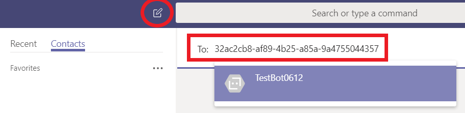

Aggiungere bot per chat personali, chat di gruppo e canali in Microsoft TeamsAdd bots for personal chats, group chats, and channels in Microsoft Teams
==========================================================
> [!IMPORTANT]
> [!INCLUDE [new-teams-sfb-admin-center-notice](includes/new-teams-sfb-admin-center-notice.md)]

I bot sono programmi automatizzati che rispondono alle query o forniscono aggiornamenti e notifiche sui dettagli che gli utenti trovano interessanti o vogliono rimanere informati.Bots are automated programs that respond to queries or give updates and notifications about details users find interesting or want to stay informed about. I bot consentono agli utenti di interagire con i servizi cloud, come gestione delle attività, pianificazione e polling, tramite conversazioni in chat in Microsoft teams.Bots allow users to interact with cloud services like task management, scheduling, and polling, through chat conversations in Microsoft Teams. I bot per Teams sono basati su [Microsoft bot Framework](https://go.microsoft.com/fwlink/?linkid=854370).Bots for Teams are built on the [Microsoft Bot Framework](https://go.microsoft.com/fwlink/?linkid=854370). I bot sviluppati con questo Framework possono essere facilmente abilitati per i team.The bots that are developed using this framework can be enabled easily for Teams. Per altre informazioni, vedere [gestire le impostazioni di Microsoft teams per l'organizzazione](enable-features-office-365.md).For more information, see [Manage Microsoft Teams settings for your organization](enable-features-office-365.md).

Attualmente, teams supporta i bot in chat personali, chat di gruppo e canali all'interno di un team.Currently, Teams supports bots in personal chats, group chats, and channels within a team. Gli amministratori possono controllare se l'uso dei bot è consentito o vietato all'interno del tenant di Office 365.Administrators can control whether the use of bots is allowed or prohibited within the Office 365 tenant.

I bot sviluppati dalla community possono essere sfruttati in teams.Bots developed by the community can be leveraged within Teams. La funzionalità del bot e la possibilità di caricare app personalizzate (nota anche come sideload) devono essere abilitate a livello di tenant per consentire ai bot personalizzati di essere funzionali.The bot's functionality and the ability to upload custom apps (also known as sideloading) must be enabled on the tenant level for custom bots to be functional. I bot possono essere usati in chat personali, chat di gruppo e canali.Bots can be used in personal chats, group chats, and channels. Per i canali, i proprietari del team o i membri possono aggiungere bot.For channels, team owners or members can add bots.

Per altre informazioni, Vedi [app e servizi](https://support.office.com/article/Apps-and-services-cc1fba57-9900-4634-8306-2360a40c665b).For more information, see [Apps and services](https://support.office.com/article/Apps-and-services-cc1fba57-9900-4634-8306-2360a40c665b).

> [!IMPORTANT]
> Non è consigliabile aggiungere un bot per GUID, ad eccezione degli scopi di test.Adding a bot by GUID, for anything other than testing purposes, is not recommended. Limitando la funzionalità di un bot, l'operazione viene così grave.Doing so severely limits the functionality of a bot. I bot in uso di produzione devono essere aggiunti ai team come parte di un'app.Bots in production use should be added to Teams as part of an app. Vedere [creare un bot](https://docs.microsoft.com/microsoftteams/platform/concepts/bots/bots-create) e [testare ed eseguire il debug di Microsoft teams bot](https://docs.microsoft.com/microsoftteams/platform/concepts/bots/bots-test)See [Create a bot](https://docs.microsoft.com/microsoftteams/platform/concepts/bots/bots-create) and [Test and debug your Microsoft Teams bot](https://docs.microsoft.com/microsoftteams/platform/concepts/bots/bots-test)

Creare bot personalizzati per Microsoft TeamsCreate custom bots for Microsoft Teams
--------------------------------------

Puoi creare facilmente un bot che si integra nelle tue applicazioni line-of-business usando il Microsoft bot Framework.You can easily create a bot that integrates in to your LOB applications, using the Microsoft Bot Framework. Per informazioni su come sviluppare e pubblicare i propri bot, vedere la Guida [per la creazione e la verifica di un bot per Microsoft teams](https://go.microsoft.com/fwlink/?linkid=854371) .See the [Creating and Testing a bot for Microsoft Teams](https://go.microsoft.com/fwlink/?linkid=854371) guidance to learn how you can develop and publish your own bots.

Quando crei un bot e lo registri con il Framework bot, puoi scegliere di pubblicarlo.When you create a bot and register it with the Bot Framework, you can choose to publish it. Se non la pubblichi, il bot rimane privato.If you don't publish it, the bot remains private. Puoi anche richiedere agli utenti di eseguire l'accesso prima di usare il bot.You can also require your users to log in before using the bot. La richiesta di accesso garantisce che solo i dipendenti dell'organizzazione possano accedere al bot, anche se l'ID applicazione del bot diventa noto.Requiring login makes sure only employees of your organization can access the bot, even if the bot's application ID becomes known. Vedere [*AuthBot*](https://go.microsoft.com/fwlink/?linkid=854372) su GitHub per un esempio di codice che illustra come autenticare gli utenti in Active Directory usando i bot.See [*AuthBot*](https://go.microsoft.com/fwlink/?linkid=854372) on GitHub for a code example of how to authenticate users against your Active Directory using bots.

I bot possono essere testati usando l' [emulatore di Framework bot](https://go.microsoft.com/fwlink/?linkid=854373) prima di essere distribuiti nei team.Bots can be tested using the [Bot Framework Emulator](https://go.microsoft.com/fwlink/?linkid=854373) before they are deployed into your Teams.

Caricare il bot per la chat personaleUpload your bot for personal chat
---------------------------------------

1. Dopo aver creato il bot, vai alle **impostazioni dell'applicazione** per il bot che hai sviluppato e quindi, in **impostazioni app**, copia il valore dell'impostazione **MicrosoftAppId** . After you create your bot, go to the **Application Settings** for the bot you developed, and then under **App settings**, copy the value of the **MicrosoftAppId** setting.

2.  Nel riquadro **chat** di teams selezionare l' **icona Aggiungi chat**.In Teams, on the **Chat** pane, select the **Add chat icon**. In **per**incollare l' **ID app Microsoft**del tuo bot.In **To**, paste your bot's **Microsoft app ID**. 

3. L'ID app si risolverà nel **nome del bot** e quindi potrai iniziare una conversazione di chat con quel bot.The app ID will resolve to your **bot name,** and then you can start a chat conversation with that bot.

Caricare il bot per chat di gruppo o canaliUpload your bot for group chats or channels
-----------------------------------

Per condividere il bot con i colleghi, ecco come aggiungerlo alle chat di gruppo o ai canali di diversi team:If you want to share your bot with your colleagues, here's how to add it to group chats or channels of different teams:

1. Dopo aver [creato un pacchetto dell'app per il tuo bot](https://docs.microsoft.com/microsoftteams/platform/concepts/apps/apps-upload), Apri teams e passa al team in cui dovrai caricare il bot.After you [create an app package for your bot](https://docs.microsoft.com/microsoftteams/platform/concepts/apps/apps-upload), open Teams and browse to the team in which you'll be uploading the bot.
2. Aggiungere **[App Studio](https://docs.microsoft.com/microsoftteams/platform/get-started/get-started-app-studio)**, app a teams.Add **[App Studio](https://docs.microsoft.com/microsoftteams/platform/get-started/get-started-app-studio)**, app to Teams.
3. In App Studio selezionare la scheda **editor manifesto** . In App Studio, select the **Manifest Editor** Tab. 
4. Per aggiungere il tuo bot, in funzionalità, seleziona il bot e scegli di aggiungere un bot esistente.To add your bot, in capabilities, select the bot and choose to add an existing bot. Scegli quindi un bot esistente o immetti l'ID di un bot esistente.Then, choose an existing bot or enter the Id of an existing bot.

5. Passare al percorso del pacchetto dell'app, selezionarlo e quindi fare clic su **Apri**.Browse to the location of your app package, select it, and then click **Open**.
6. Selezionare il nome del bot.Select your bot's name. (Non dimenticare di selezionare la casella di controllo **chat di gruppo** o **Team** nella sezione ambito).(Don't forget to select the **Group chat** or **Team** check box under the scope section).
7. Selezionare **test e Distribuisci**.Select **Test and distribute**.
8. Selezionare la chat di gruppo o il team in cui si vuole connettere il bot.Select the group chat or team where you want to connect your bot to.

    Il tuo bot sarà disponibile nella chat di gruppo o nel team in teams.Your bot will be available in your group chat or team in Teams.
