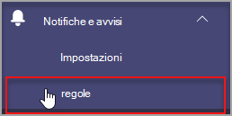
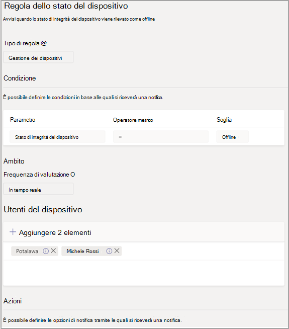
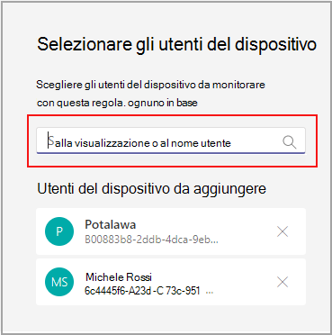

# Monitoraggio dell'integrità dei dispositivi di Microsoft TeamsMicrosoft Teams device health monitoring

Il monitoraggio dell'integrità dei dispositivi nell'interfaccia di amministrazione di Microsoft Teams offre la possibilità di monitorare in modo proattivo l'integrità dei vari dispositivi di Teams.Device health monitoring in the Microsoft Teams admin center gives you an ability to proactively monitor the health of various Teams devices. Monitorare lo stato offline di un dispositivo e ricevere avvisi in tempo reale se il dispositivo monitorato nell'organizzazione diventa offline.Monitor the offline state of a device and receive alerts in real time if the monitored device in your organization goes offline.  

Prima di iniziare, sono necessarie le autorizzazioni per la creazione di team/canali nel tenant.Before you start, you'll need the teams/channel creation permissions in your tenant. [Altre informazioni](https://docs.microsoft.com/microsoft-365/solutions/manage-creation-of-groups?view=o365-worldwide).[Learn More](https://docs.microsoft.com/microsoft-365/solutions/manage-creation-of-groups?view=o365-worldwide).

## Configurare la regola dello stato del dispositivoConfigure device state rule

1. Nel riquadro di spostamento sinistro dell'interfaccia di amministrazione di Microsoft Teams selezionare Regole &   >  **avvisi.**In the left navigation of the Microsoft Teams admin center, select **Notifications & alerts** > **Rules**.

   

2. Nella pagina **Regole** selezionare **Regola stato dispositivo**.In the **Rules** Page, select **Device state rule**.

3. Selezionare il dispositivo per configurare la regola di stato per l'abilitazione degli avvisi.Select the device to configure the state rule for enabling alerts.

    

## Interpretare la configurazione della regolaInterpret the rule configuration

|CampoField |DescrizioneDescription  |
|--------|-------------|
|**Tipo di regola****Rule type**   |La regola dello stato del dispositivo consente di gestire in modo efficace.The device state rule helps you effectively manage. Dispositivi di Teams ed è classificato come tipo di gestione dei dispositivi.Teams devices and is classified as a device management type. In futuro saranno disponibili altre regole per il tipo di gestione dei dispositivi per monitorare altre funzionalità correlate (ad esempio: dispositivo non integro e stato di accesso del dispositivo).In the future, more rules of device management type will be available to monitor other related capabilities (examples may include: unhealthy device and the sign-in status of device).|
|**Condizione****Condition**   |È possibile monitorare l'integrità dei dispositivi se passano offline.You can monitor the health of devices if they go offline. [Altre informazioni sulla](https://docs.microsoft.com/microsoftteams/devices/device-management) gestione dei dispositivi nell'interfaccia di amministrazione di Teams.[Learn more](https://docs.microsoft.com/microsoftteams/devices/device-management) about device management in Teams admin center. |
|**Ambito****Scope**   |È possibile specificare la frequenza con cui si vuole monitorare lo stato di integrità del dispositivo menzionando la frequenza di valutazione della regola.You can specify how frequently you want to monitor device health status by mentioning the rule evaluation frequency. Per impostazione predefinita, i dispositivi di Teams verranno monitorati in tempo quasi reale se passano offline.By default teams devices will be monitored in near real time if they go offline. |
|**Utenti del dispositivo****Device users**   |È possibile specificare i dispositivi da monitorare offline proattivi selezionandoli in base agli utenti connessi.You can specify which devices need proactive offline statue monitoring by selecting them based on signed-in users. Per altre [informazioni, vedere Selezionare i dispositivi](#select-devices-for-configuration) per la configurazione.Refer to [Select devices for configuration](#select-devices-for-configuration) for more details. |
|**Azioni**  >  **Avviso del canale****Actions** > **Channel alert**   |Nella sezione Azioni è possibile specificare i canali dei team per cui si vogliono ricevere avvisi.In the Actions section, you can specify teams channels you want to get alerts for. Attualmente, verrà creato un team predefinito denominato **Avvisi** e notifiche di amministrazione e un canale **denominato MonitoringAlerts** in cui verranno recapitate le notifiche.Currently, a default team named **Admin Alerts and Notifications** and channel named **MonitoringAlerts** will be created where notifications will be delivered to.     Gli amministratori globali e gli amministratori di Teams nel tenant verranno aggiunti automaticamente a questo team predefinito.Global administrators and Teams administrators in your tenant will be automatically added to this default team.|
|**Azioni**  >  **Webhook****Actions** > **Webhook**   |È anche possibile ricevere notifiche con un webhook esterno (facoltativo).You can also get notifications with an external webhook (optional). Specificare un URL webhook pubblico esterno nella sezione webhook in cui verrà inviato un payload di notifica JSON.Specify an external public webhook URL in the webhook section where a JSON notification payload will be sent.      Il payload di notifica, tramite webhook, può essere integrato con altri sistemi dell'organizzazione per creare flussi di lavoro personalizzati.The notification payload, via webhooks, can be integrated with other systems in your organization to create custom workflows.   

**Schema payload JSON per webhook:****JSON payload schema for webhook:**   
<pre lang="json">{      "type": "object",     "properties": {        "AlertTitle": { "type": "string "} ,       "DeviceLoggedInUserId": { "type": "string" } ,       "DeviceId": { "type": "string" } ,        "MetricValues": {              "type": "object",             "properties": {                   "DeviceHealthStatus": { "type": "string"}              }         } ,        "RuleName": { "type": "string"} ,        "RuleDescription": { "type": "string"} ,        "RuleFrequency": { "type": "string"} ,        "RuleType": { "type": "string"} ,        "TenantId": { "type": "string"} ,         "RuleCondition": { "type": "string"} ,         "AlertRaisedAt": { "type": "string"}      }  } </pre>  <pre lang="json">{      "type": "object",     "properties": {        "AlertTitle": { "type": "string "} ,       "DeviceLoggedInUserId": { "type": "string" } ,       "DeviceId": { "type": "string" } ,        "MetricValues": {              "type": "object",             "properties": {                   "DeviceHealthStatus": { "type": "string"}              }         } ,        "RuleName": { "type": "string"} ,        "RuleDescription": { "type": "string"} ,        "RuleFrequency": { "type": "string"} ,        "RuleType": { "type": "string"} ,        "TenantId": { "type": "string"} ,         "RuleCondition": { "type": "string"} ,         "AlertRaisedAt": { "type": "string"}      }  } </pre>   

  **Payload JSON di esempio:****Sample JSON payload**:    <pre lang="JSON">    {        "AlertTitle":"*sample_device_name* of *User_Name* has become offline","AlertTitle":"*sample_device_name* of *User_Name* has become offline",       "DeviceLoggedInUserId": *User_GUID* ,"DeviceLoggedInUserId": *User_GUID* ,       "DeviceId": *Device_GUID* , "DeviceId": *Device_GUID* ,        "MetricValues": {           DeviceHealthStatus": "offline"              },                  "RuleName": "Device state rule" ,        "RuleDescription": ":"Alerts when device health status is detected as offline" ,        "RuleFrequency": "Real-time" ,        "RuleType": "Device Management" ,        "TenantId": *Tenant_GUID* , "TenantId": *Tenant_GUID* ,         "RuleCondition": "DeviceHealthStatus = Offline" ,         "AlertRaisedAt": "2020-02-28T12:49:06Z"      }  </pre>   

## Selezionare i dispositivi per la configurazioneSelect devices for configuration

1. È possibile selezionare i dispositivi di Teams da monitorare selezionando gli utenti connessi a tali dispositivi.You can select Teams devices you want to monitor by selecting users signed in to those devices. Selezionare **Aggiungi** nella **sezione Utenti dispositivo.**Select **Add** from the **Device users** section.

2. Selezionare uno o più utenti di cui monitorare lo stato di integrità del dispositivoSelect one or more users for which you want to monitor device health state

   

   L'elenco di utenti selezionato viene visualizzato nella **sezione Utenti** dispositivo.The selected list of users shows in **Device users** section. È possibile modificare questo elenco aggiungendo o rimuovendo utenti.You can modify this list by adding or removing users.

Tutti i dispositivi di accesso usati dall'elenco di utenti selezionato verranno monitorati per lo stato di integrità offline.All the sign-in devices used by the selected list of users will be monitored for the offline health state.

## Notifiche nel client di TeamsNotifications in Teams client

Le notifiche vengono recapitate nel canale **MonitoringAlerts** creato automaticamente del team **di avvisi e notifiche per** gli amministratori.The notifications are delivered in the auto-created **MonitoringAlerts** channel of the **Admin Alerts and Notifications** Team.

Una notifica offline del dispositivo può includere le informazioni seguenti:A device offline notification can include the following information:

- Nome del dispositivo offline.The device name that's offline.
- Utente del dispositivo offline.The user of the offline device.
- A che ora il dispositivo è stato offline.What time the device went offline. (Attualmente, l'ora è presentata in UTC).(Currently, the time is presented in UTC.)
- Tipo di regola che ha generato l'avviso.The type of rule that raised the alert.
- Perché viene generato un avviso.Why an alert is raised.
