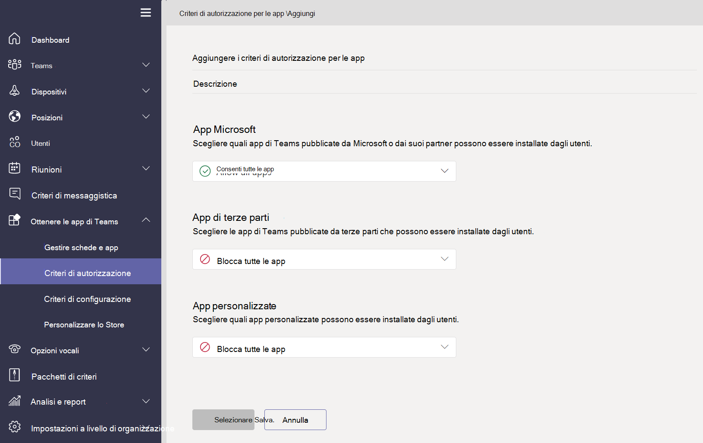

# Panoramica dei criteri delle app usati per gestire le app

I criteri delle app vengono usati per controllare l'accesso alle app e il comportamento di installazione in Microsoft Teams.

## Criteri di autorizzazione delle app

I **criteri di autorizzazione delle app** vengono usati per controllare quali app sono disponibili per gli utenti. Gli amministratori possono consentire o bloccare app specifiche installate dagli utenti dallo Store delle app di Teams. I [criteri di autorizzazione delle app](teams-app-permission-policies.md) vengono gestiti tramite l'interfaccia di amministrazione di Microsoft Teams.

## Criteri di configurazione delle app

I **criteri di configurazione delle app** consentono di aggiungere e installare applicazioni per conto degli utenti e controllare queste impostazioni per l'organizzazione. I [criteri di configurazione delle app](teams-app-setup-policies.md) vengono gestiti nell'interfaccia di amministrazione di Teams.

## Criteri delle app personalizzate

È possibile controllare chi può caricare app personalizzate in Teams con **criteri delle app personalizzate**. Le [impostazioni e i criteri delle app personalizzate](teams-custom-app-policies-and-settings.md) vengono gestiti tramite l'interfaccia di amministrazione di Microsoft Teams.

## Articoli correlati

* [Gestire le impostazioni e i criteri delle app personalizzate in Teams](teams-custom-app-policies-and-settings.md)
* [Gestire i criteri di configurazione delle app in Teams](teams-app-setup-policies.md)
* [Gestire i criteri di autorizzazione delle app in Teams](teams-app-permission-policies.md)
* [Gestire Teams con i criteri](manage-teams-with-policies.md)
