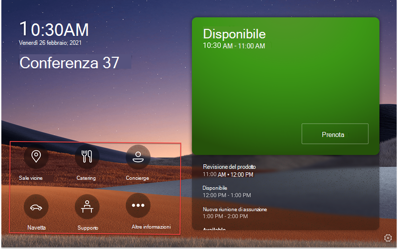

# Microsoft Teams app line of business (LINEB) nei Teams di lavoro

Teams panelli aggiunge il supporto per Teams [app Line of Business (LOB).](/microsoftteams/platform/overview) In questo modo le aziende potranno aggiungere altre esperienze nei pannelli per soddisfare le esigenze dell'organizzazione. Questa versione supporta contenuto Web statico.

> [!IMPORTANT]
> Questa funzionalità è disponibile solo dopo l'aggiornamento dei Teams dei pannelli. È necessario avere l'app Teams versione 1449/1.0.97.2021070601 o successiva per avere il supporto dell'app nei Teams.

## Teams'esperienza dell'app Teams pannelli

 

*La Teams iniziale dei pannelli di ricerca include le opzioni di spostamento delle app, delineate nello screenshot in rosso. Si noti che si tratta di icone di esempio e potrebbero non essere disponibili per l'uso.*

*Quando un utente finale tocca una delle icone dell'app, visualizza la schermata Teams'app visualizzata nello screenshot precedente. Il rettangolo grigio nello screenshot è il punto in cui vengono visualizzate le app nel Teams riquadro. La barra dell'app è fissa e fa parte dell'app Teams pannelli.*

## Configurare e gestire le app Teams pannelli di lavoro nell Teams di amministrazione 

Microsoft Teams app portano informazioni chiave, strumenti comuni e processi attendibili in cui le persone raccolgono, imparano e lavorano. Teams app funzionano [con funzionalità integrate.](/microsoftteams/platform/concepts/capabilities-overview) Ora, l'amministratore IT può scegliere quali app includere nel dispositivo Teams panel dell'organizzazione e personalizzare le autorizzazioni tramite l'interfaccia di amministrazione di [Teams.](https://admin.teams.microsoft.com/)

Ora è possibile usare le app Teams nei Teams e personalizzare l'esperienza utente in base alle esigenze dell'organizzazione. È possibile decidere a quale app Web gli utenti possono accedere e usare e assegnare priorità alle visualizzazioni dell'app. Alcune opzioni, come il bot e le funzionalità di messaggistica, al momento non sono supportate. Altre informazioni sulle [app Teams e](/microsoftteams/platform/overview) su come gestire i dispositivi in [Microsoft Teams.](/microsoftteams/devices/device-management)

## Gestire le app nei Teams di Teams di amministrazione

**Nota:** è necessario essere un amministratore globale o un amministratore del Teams per accedere [all'Teams di amministrazione.](https://admin.teams.microsoft.com/)

Gli utenti finali possono visualizzare ma non installare app Teams pannelli. Gli amministratori possono visualizzare e gestire tutte le app Teams per l'organizzazione tramite l'interfaccia Teams di amministrazione. Altre informazioni su come gestire le app nell'interfaccia Microsoft Teams [di amministrazione tramite](/microsoftteams/manage-apps) la pagina **Gestisci** app. La **pagina Gestisci app** nell'Teams di amministrazione è anche in cui è possibile caricare app [personalizzate.](/microsoftteams/manage-apps#publish-a-custom-app-to-your-organizations-app-store)

Dopo aver configurato le app, è possibile usare i criteri di autorizzazione delle [app](/microsoftteams/teams-app-permission-policies) e i criteri di configurazione delle [app](/microsoftteams/teams-app-setup-policies) per configurare l'esperienza dell'app per specifici account della chat room nell'organizzazione.

## Aggiungere app nei Teams con i criteri di configurazione delle app

Poiché Teams offre la possibilità di visualizzare un'ampia gamma di app, gli amministratori possono decidere quali app sono più  essenziali per l'organizzazione e aggiungere solo queste per la schermata home dei pannelli di Teams per un accesso rapido. Se sono presenti più di cinque app aggiunte o app non aggiunte, verranno visualizzate sotto la **schermata Altro.** Microsoft consiglia di creare criteri di configurazione dell'app personalizzati specifici per Teams pannelli.

 

Per gestire le app aggiunte visualizzate nei pannelli Teams, accedere all'interfaccia di amministrazione di Teams per l'organizzazione e passare **Teams Criteri** di configurazione delle app di Teams Selezionare o Creare un nuovo criterio App \>  \>  \> aggiunte.

 

*Le app incluse in questa immagine sono solo esempi e potrebbero non essere disponibili per l'uso.*

Microsoft consiglia di disattivare le Upload **personalizzate** e l'aggiunta di **utenti** per la migliore esperienza Teams'app nei Teams personalizzati.

Per altre informazioni sull'aggiunta di app, vedere [Gestire i criteri di configurazione delle app.](/microsoftteams/teams-app-setup-policies)

## Gestire l'ordine di visualizzazione delle app Teams pannelli 

*Le app incluse in questa immagine sono solo esempi e potrebbero non essere disponibili per l'uso.*

Per gestire l'ordine di visualizzazione delle app nei pannelli di Teams, accedere all'interfaccia di amministrazione di Teams per l'organizzazione e passare ai criteri di configurazione delle app **di Teams** Selezionare le app aggiunte ai criteri: Sposta \>  \>  \>  **su/giù.**

## Assegnazione di criteri di configurazione a un account delle risorse della chat room

Dopo aver creato i criteri di configurazione, l'amministratore dovrà assegnare questo criterio all'account della risorsa sala che verrà eseguito l'accesso ai Teams di lavoro. Per altre informazioni, vedere [Assegnare criteri a utenti e gruppi.](/microsoftteams/assign-policies-users-and-groups)

## Domande frequenti

### Quanto tempo è necessario per Teams per ottenere i criteri di configurazione delle app nuovi o aggiornati?

Dopo aver modificato o assegnato nuovi criteri nell Teams di amministrazione, l'applicazione delle modifiche può richiedere fino a 24 ore. Gli amministratori possono provare a disconnettersi/accedere dal pannello, toccare l'icona Impostazioni e tornare alla **schermata Home** per provare **ad** aggiornare i criteri.

### Qual è l'ordinamento delle app nella schermata "Altro"?

Nella pagina **Altre** app verranno visualizzate per prime le app aggiunte. Quindi, tutte le altre app installate verranno visualizzate in ordine alfabetico.

### Perché le app bot non vengono visualizzate nei Teams di lavoro?

Al momento è supportato solo il contenuto Web delle schede statiche.

### Perché le app Teams native, ad esempio Calendario e Attività, non vengono visualizzate nei Teams di lavoro?

Le Teams native, ad esempio Calendario e Attività, non vengono visualizzate nei Teams di lavoro.

### Nella sezione Teams criteri di configurazione dell'interfaccia di amministrazione di Office qual è la differenza tra le app installate e le app aggiunte?

Per Teams, Microsoft consiglia di usare le app aggiunte, in modo che l'amministratore sia in grado di selezionare l'app desiderata e ridisporre l'ordinamento.

**Nota:** Alcune app non supportano il blocco delle app. Contatta lo sviluppatore dell'app per abilitare la funzionalità di blocco delle app.

### Perché altre app vengono visualizzate nella schermata "Altro", anche se non fanno parte delle app installate o aggiunte nella sezione dei criteri di configurazione Teams app?

Se le app sono state installate in precedenza tramite altri criteri delle app o manualmente nei client desktop/Web di Teams per l'account delle risorse della chat room usato nei pannelli di Teams, l'amministratore potrebbe dover accedere all'account delle risorse della chat room in Teams e disinstallare manualmente le app facendo clic con il pulsante destro del mouse sull'app e scegliendo **Disinstalla**.

### Perché non si trova un'app nel riquadro "Aggiungi app aggiunte"?

Non tutte le app possono essere aggiunte a Teams tramite un criterio di configurazione dell'app. Alcune app potrebbero non supportare questa funzionalità. Per trovare le app che possono essere aggiunte, cercare l'app nel **riquadro Aggiungi app aggiunte.** Per altre informazioni, vedere le domande frequenti in Uso [dei criteri di configurazione delle app.](/microsoftteams/teams-app-setup-policies#why-cant-i-find-an-app-in-the-add-pinned-apps-pane)

### Perché viene visualizzato un popup "Blocco utenti" nel riquadro dei criteri di configurazione dopo aver disattivato "Blocco utenti?"

*Le app incluse in questa immagine sono solo esempi e potrebbero non essere disponibili per l'uso.* 

Questo comportamento è previsto per un dispositivo in uno spazio condiviso e consente di evitare il blocco involontario delle app.
