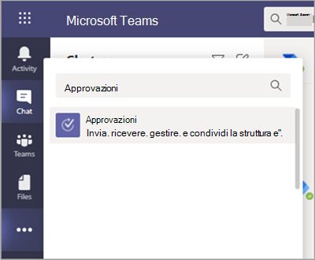
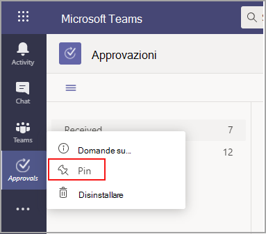
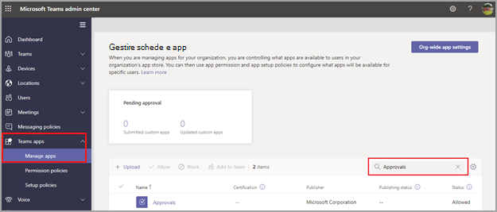

# Disponibilità dell'app Approvazioni in Teams

L'app Approvazioni è disponibile come app personale per tutti gli utenti di Microsoft Teams.
Offre un modo semplice per ottenere controlli, conformità, rendicontazione e flussi di lavoro delle approvazioni strutturate e non strutturate in Teams.

 

Gli utenti possono aggiungere l'app Approvazioni e salvarla nella barra dei menu.

 

La prima approvazione creata dall'app Approvazioni attiverà il provisioning della soluzione Approvazioni nell'ambiente CDS (Common Data Service) predefinito. Le approvazioni create dall'app Approvazioni sono archiviate nell'ambiente CDS predefinito.

Questo articolo descrive i ruoli e i requisiti dell'app Approvazioni.

> [!NOTE]
> Questa funzionalità non è ancora stata rilasciata per gli utenti Government Community Cloud High (GCCH) e Department of Defense (DOD).

## Autorizzazioni e licenze richieste

Per distribuire l Approvazioni app, è necessaria l'autorizzazione per gli elementi seguenti:

- Autorizzazioni per la creazione di un database Microsoft CDS.

- Account su [flow.microsoft.com](https://flow.microsoft.com/)

- Ruolo di amministratore nell'ambiente di destinazione.

- Licenza per [Power Automate,](/power-automate/get-started-approvals)Office 365 o Dynamics 365.

- La licenza per Microsoft Forms è necessaria per consentire agli utenti di configurare nuovi modelli di approvazione.

Per usare l'app Approvazioni, è necessaria una licenza per Power Automate e l'account verrà aggiunto automaticamente al ruolo utente di Approvazioni nell'ambiente di destinazione alla prima assegnazione di approvazione.

## Archiviazione su CDS

Common Data Model (CDM) è il linguaggio dei dati condiviso usato dalle applicazioni aziendali e di analisi in CDS. È costituito da un set di schemi di dati standardizzati ed estendibili pubblicati da Microsoft e dai propri partner, che consentono la coerenza dei dati e il loro significato nelle applicazioni e nei processi aziendali. Per altre informazioni, vedere [Common Data Model di Microsoft Power Platform](/power-automate/get-started-approvals).

Altre informazioni sui [flussi di lavoro di Approvazioni](/power-automate/modern-approvals).

Approvazioni creati da un modello archiviano comunque i dati in CDS, ad esempio il titolo, i dettagli, l'ID del modello e altro ancora. Le risposte inviate nella richiesta di approvazione vengono archiviate in Moduli. Altre informazioni  [sull'archiviazione dei dati per Microsoft Forms.](https://support.microsoft.com/office/data-storage-for-microsoft-forms-97a34e2e-98e1-4dc2-b6b4-7a8444cb1dc3#:~:text=Where%20data%20is%20stored%20for%20Microsoft%20Forms.%20Microsoft,European-based%20tenants%20is%20stored%20on%20servers%20in%20Europe)

>[!Note]
>Se si elimina il modello di modulo nel sito Di Microsoft Forms, il modello Approvazione verrà eliminato e gli utenti non saranno in grado di avviare la richiesta. Gli utenti riceveranno un messaggio di errore "Tabella CDBNonFound" quando si prova ad aprire un modello approvazione eliminato in Microsoft Forms.

I modelli con ambito organizzazione condividono la stessa durata del tenant e i modelli con ambito di team condividono la stessa durata del team. Pertanto, l'eliminazione definitiva del team elimina i modelli correlati.

## Autorizzazioni dell'app Approvazioni di Teams

L'app Approvazioni di Teams consente di accedere alle funzionalità seguenti:

- Ricevere messaggi e dati forniti dall'utente.

- Invio di messaggi e notifiche dell'utente.

- Render delle app e delle finestre di dialogo personali senza intestazione fornita da Teams.

- Accesso alle informazioni del profilo, ad esempio nome, indirizzo di posta elettronica, nome della società e lingua preferita.

- Ricevere messaggi e dati forniti dai membri del team nel canale.

- Inviare messaggi e notifiche in un canale.

- Accedere alle informazioni del team:
  - nome del team
  - elenco dei canali
  - elenco partecipanti (nomi e indirizzi di posta elettronica dei membri del team).

- Uso delle informazioni del team per i contatti.

Autorizzazioni per i modelli di approvazione

- Tutti i proprietari dei team possono creare un modello di approvazione per i team di cui sono proprietari.

- Quando un amministratore crea un modello per l'intera organizzazione per la prima volta, crea automaticamente un nuovo gruppo Azure Active Directory(AAD) per tutti gli amministratori del tenant, inclusi gli amministratori globali e dei servizi del team. Questi amministratori verranno aggiunti come proprietari del gruppo, in modo che possano gestire i modelli dell'organizzazione in modalità co-gestione. Gli amministratori che non hanno più accesso all'organizzazione dopo la creazione del team devono essere aggiunti manualmente come proprietari dei gruppi, in modo da avere le stesse autorizzazioni per gestire i modelli a livello di organizzazione.

> [!Note]
> Se un amministratore elimina il gruppo, è necessario un mese per ripristinarlo all'interno del portale Azure Active Directory (AAD) per ripristinare tutti i dati correlati. Dopo un mese o se l'amministratore elimina questo gruppo nel Cestino, si perderanno tutti i dati correlati.

## Disabilitare l'app Approvazioni

L'app Approvazioni è disponibile per impostazione predefinita. È possibile disabilitarla nell'interfaccia di amministrazione di Teams.

  1. Passare all'interfaccia di amministrazione di Teams.

  2. Espandere **App di Teams** e selezionare **Gestisci app**.

  3. Cercare l'app Approvazioni.

     

  4. Selezionare Approvazioni.

  5. Selezionare l'interruttore per disabilitare l'app per l'organizzazione.

     :::image type="content" alt-text="mostra i dettagli per l Approvazioni app." source="media/approvals-details-new.png" lightbox="media/approvals-details-new.png":::

## Criteri di conservazione

Le approvazioni create dall'app Approvazioni sono archiviate nell'ambiente CDS predefinito, che al momento non supporta i backup. Altre informazioni su come eseguire il [Backup e il ripristino di ambienti - Power Platform \|Microsoft Docs](/power-platform/admin/backup-restore-environments).

I dati archiviati in Forms non verranno eliminati finché i proprietari del team non lo puliranno dalla **scheda** Moduli eliminati nell'app Web Microsoft Forms.

## Limitazioni dei dati

Ogni team può contenere al massimo 400 modelli di approvazione e ogni modello può raccogliere un massimo di 50.000 richieste in base alla funzionalità corrente in Microsoft Forms.

## Controllo

L'app Approvazioni registra gli eventi di controllo all'interno del Centro sicurezza e conformità di Microsoft 365. È possibile visualizzare il log di audit.

1. Passare al sito Conformità di Microsoft 365.

2. Selezionare la sezione **Controllo**.

3. Cercare le attività in **Attività di approvazione di Microsoft Teams**.

È possibile cercare le attività seguenti:

- Creazione di una nuova richiesta di approvazione

- Visualizzazione dei dettagli della richiesta di approvazione

- Richieste di approvazione approvate

- Richieste di approvazione rifiutate

- Richieste di approvazione annullate

- Richieste di approvazione condivise

- File allegato alle richieste di approvazione

- Richieste di approvazione riassegnate

- Firma elettronica aggiunta alle richieste di approvazione

- Dettagli della richiesta di firma elettronica visualizzati

- Richiesta di firma elettronica esaminata

- Richiesta di firma elettronica annullata

- Creare un nuovo modello

- Modificare un modello esistente

- Abilitare/disabilitare un modello

- Modello visualizzato

Per accedere ad altre approvazioni di controllo all'interno del flusso, abilitare e configurare il controllo nell'ambiente predefinito per le entità di approvazione principali Approvazione, Richiesta di approvazione e Risposta di approvazione. Le operazioni di creazione, aggiornamento ed eliminazione sono eventi controllabili per i record di approvazione. Per altre informazioni, vedere [Dati di controllo e attività degli utenti per la sicurezza e la conformità - Power Platform \| Microsoft Docs](/power-platform/admin/audit-data-user-activity).

Il controllo può essere personalizzato ulteriormente nel [Centro sicurezza e conformità di Microsoft 365](https://support.office.com/article/go-to-the-office-365-security-compliance-center-7e696a40-b86b-4a20-afcc-559218b7b1b8?ui=en-US&rs=en-US&ad=US).

1. Per usare i report preconfigurati, accedere al Centro sicurezza e conformità di Microsoft 365.

2. Selezionare **Ricerche e indagini**.

3. Cercare nel log di audit e selezionare la scheda **Attività di Dynamics 365**.

Altre informazioni su [Microsoft Dataverse e registrazione delle attività delle app basata su modello - Power Platform](/power-platform/admin/enable-use-comprehensive-auditing).

## Sicurezza

Tramite l'app Approvazioni di Teams, gli utenti hanno accesso alla creazione di nuove approvazioni e alla visualizzazione di quelle inviate e ricevute. Gli utenti non possono accedere alle approvazioni create da altri utenti a meno che non abbiano risposto o visualizzato la richiesta.

> [!Note]
> L'utente riceve il ruolo di visualizzatore della richiesta se fa parte della chat o del canale in cui è stata creata l'approvazione. Non è possibile intervenire sulla richiesta se al momento della creazione dell'approvazione non è stato assegnato il ruolo specifico.

## Approvazioni e-signature

Le approvazioni delle firme elettroniche create dall'app Approvazioni vengono archiviate nell'ambiente cloud del provider selezionato. Per altre informazioni sull'archiviazione relativa al contratto di firma elettronica, vedere la documentazione di archiviazione del provider selezionato.

Per usare la Approvazioni di firma elettronica dell'app, sono necessari gli elementi seguenti:

- Licenza per lo specifico provider di firme elettroniche che si sta scegliendo di usare. Per ottenere una licenza per l'organizzazione, è necessario accedere al sito del provider.

Per la Approvazioni di firma elettronica di terze parti, i partner della firma di terze parti verranno visualizzati nell'app Teams Approvazioni per impostazione predefinita. È possibile disabilitare specifici provider di firme elettroniche accedendo alle impostazioni dell'app nell'Teams di amministrazione.

1. Nell'Teams di amministrazione, in **Gestisci app,** selezionare l'app Approvazioni e scegliere **Impostazioni**. 

2. Ogni provider di firme elettroniche ha un interruttore accanto al provider che si trova nella posizione attiva (destra) per impostazione predefinita. Scorrere l'interruttore verso sinistra per disabilitare uno specifico provider di firme elettroniche. Se un Teams disabilita un provider, gli utenti finali non potranno visualizzare il provider durante la creazione di un'approvazione. Gli utenti finali non saranno inoltre in grado di visualizzare le richieste di firma elettronica effettuate con il provider.

Le firme Approvazioni create dall'app Approvazioni vengono archiviate nel cloud del provider selezionato. Sarà quindi necessario accedere al sito del provider per esportare i dati relativi alle firme elettroniche. Fare riferimento alla documentazione del provider relativa all'esportazione e alla conservazione di questi contratti.
