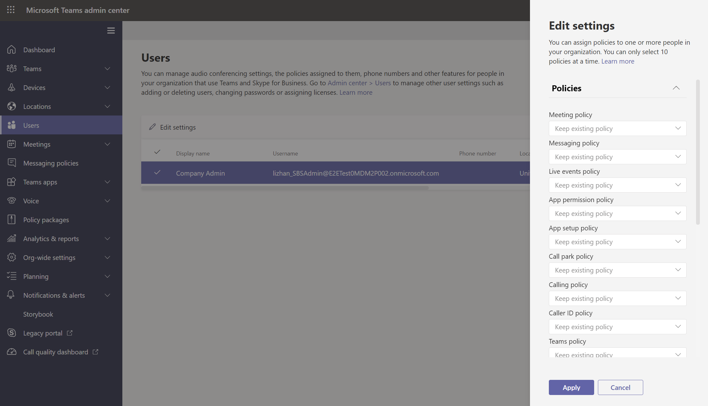

# <a name="assign-policies-to-users-and-groups"></a><span data-ttu-id="40a3b-103">Assegnare criteri a utenti e gruppi</span><span class="sxs-lookup"><span data-stu-id="40a3b-103">Assign policies to users and groups</span></span>

<span data-ttu-id="40a3b-104">Questo articolo illustra i diversi modi per assegnare criteri a utenti e gruppi in Microsoft Teams.</span><span class="sxs-lookup"><span data-stu-id="40a3b-104">This article reviews the different ways to assign policies to users and groups in Microsoft Teams.</span></span> <span data-ttu-id="40a3b-105">Prima di leggere, assicurarsi di aver letto [Assegnare criteri in Teams - Guida introduttiva.](policy-assignment-overview.md)</span><span class="sxs-lookup"><span data-stu-id="40a3b-105">Before reading, be sure you've read [Assign policies in Teams - getting started](policy-assignment-overview.md).</span></span>

## <a name="assign-a-policy-to-individual-users"></a><span data-ttu-id="40a3b-106">Assegnare un criterio a singoli utenti</span><span class="sxs-lookup"><span data-stu-id="40a3b-106">Assign a policy to individual users</span></span>

<span data-ttu-id="40a3b-107">Seguire questa procedura per assegnare un criterio a un singolo utente o a un numero limitato di utenti alla volta.</span><span class="sxs-lookup"><span data-stu-id="40a3b-107">Follow these steps to assign a policy to an individual user or to a small number of users at a time.</span></span>

### <a name="use-the-microsoft-teams-admin-center"></a><span data-ttu-id="40a3b-108">Usare l'interfaccia di amministrazione di Microsoft Teams</span><span class="sxs-lookup"><span data-stu-id="40a3b-108">Use the Microsoft Teams admin center</span></span>

<span data-ttu-id="40a3b-109">Per assegnare un criterio a un utente:</span><span class="sxs-lookup"><span data-stu-id="40a3b-109">To assign a policy to a user:</span></span>

1. <span data-ttu-id="40a3b-110">Nel riquadro di spostamento sinistro dell'interfaccia di amministrazione di Microsoft Teams passare a **Utenti** e quindi selezionare l'utente.</span><span class="sxs-lookup"><span data-stu-id="40a3b-110">In the left navigation of the Microsoft Teams admin center, go to **Users**, and then select the user.</span></span>
2. <span data-ttu-id="40a3b-111">Selezionare l'utente facendo clic a sinistra del nome utente e quindi selezionare **Modifica impostazioni.**</span><span class="sxs-lookup"><span data-stu-id="40a3b-111">Select the user by clicking to the left of the user name, and then select **Edit settings**.</span></span>
3. <span data-ttu-id="40a3b-112">Selezionare il criterio da assegnare e quindi scegliere **Applica**.</span><span class="sxs-lookup"><span data-stu-id="40a3b-112">Select the policy you want to assign, and then select **Apply**.</span></span>



<span data-ttu-id="40a3b-114">Si può anche procedere nel modo seguente:</span><span class="sxs-lookup"><span data-stu-id="40a3b-114">Or, you can also do the following:</span></span>

1. <span data-ttu-id="40a3b-115">Nel riquadro di spostamento sinistro dell'interfaccia di amministrazione di Microsoft Teams passare alla pagina dei criteri.</span><span class="sxs-lookup"><span data-stu-id="40a3b-115">In the left navigation of the Microsoft Teams admin center, go to the policy page.</span></span>
2. <span data-ttu-id="40a3b-116">Selezionare il criterio da assegnare facendo clic a sinistra del nome del criterio.</span><span class="sxs-lookup"><span data-stu-id="40a3b-116">Select the policy you want to assign by clicking to the left of the policy name.</span></span>
3. <span data-ttu-id="40a3b-117">Scegliere **Gestisci utenti**.</span><span class="sxs-lookup"><span data-stu-id="40a3b-117">Select **Manage users**.</span></span>
4. <span data-ttu-id="40a3b-118">Nel riquadro **Gestisci utenti** cercare l'utente per nome visualizzato o in base al nome utente, selezionare il nome e poi selezionare **Aggiungi**.</span><span class="sxs-lookup"><span data-stu-id="40a3b-118">In the **Manage users** pane, search for the user by display name or by user name, select the name, and then select **Add**.</span></span> <span data-ttu-id="40a3b-119">Ripetere questa operazione per ogni utente da aggiungere.</span><span class="sxs-lookup"><span data-stu-id="40a3b-119">Repeat this step for each user that you want to add.</span></span>
5. <span data-ttu-id="40a3b-120">Dopo aver aggiunto gli utenti, selezionare **Applica**.</span><span class="sxs-lookup"><span data-stu-id="40a3b-120">When you're finished adding users, select **Apply**.</span></span>


### <a name="use-powershell"></a><span data-ttu-id="40a3b-122">Usare PowerShell</span><span class="sxs-lookup"><span data-stu-id="40a3b-122">Use PowerShell</span></span>

<span data-ttu-id="40a3b-123">Ogni tipo di criterio ha un proprio set di cmdlet per gestirlo.</span><span class="sxs-lookup"><span data-stu-id="40a3b-123">Each policy type has its own set of cmdlets for managing it.</span></span> <span data-ttu-id="40a3b-124">Usare il ```Grant-``` cmdlet per un determinato tipo di criterio per assegnare il criterio.</span><span class="sxs-lookup"><span data-stu-id="40a3b-124">Use the ```Grant-``` cmdlet for a given policy type to assign the policy.</span></span> <span data-ttu-id="40a3b-125">Ad esempio, usare il ```Grant-CsTeamsMeetingPolicy``` cmdlet per assegnare un criterio di riunione di Teams agli utenti.</span><span class="sxs-lookup"><span data-stu-id="40a3b-125">For example, use the ```Grant-CsTeamsMeetingPolicy``` cmdlet to assign a Teams meeting policy to users.</span></span> <span data-ttu-id="40a3b-126">Questi cmdlet sono inclusi nel modulo di PowerShell di Teams e sono documentati nel riferimento [ai cmdlet di Skype for Business.](https://docs.microsoft.com/powershell/skype)</span><span class="sxs-lookup"><span data-stu-id="40a3b-126">These cmdlets are included in the Teams PowerShell module and are documented in the [Skype for Business cmdlet reference](https://docs.microsoft.com/powershell/skype).</span></span>

 <span data-ttu-id="40a3b-127">Scaricare e installare la versione pubblica [di Teams PowerShell](https://www.powershellgallery.com/packages/MicrosoftTeams/) (se non è già stata eseguita) e quindi eseguire le operazioni seguenti per connettersi.</span><span class="sxs-lookup"><span data-stu-id="40a3b-127">Download and install the [Teams PowerShell public release](https://www.powershellgallery.com/packages/MicrosoftTeams/) (if you haven't already), and then run the following to connect.</span></span>

> [!NOTE]
> <span data-ttu-id="40a3b-128">Skype for Business Online Connector fa attualmente parte dell'ultimo modulo di PowerShell di Teams.</span><span class="sxs-lookup"><span data-stu-id="40a3b-128">Skype for Business Online Connector is currently part of the latest Teams PowerShell module.</span></span>
>
> <span data-ttu-id="40a3b-129">Se si usa l'ultima versione pubblica di [Teams PowerShell,](https://www.powershellgallery.com/packages/MicrosoftTeams/)non è necessario installare Skype for Business Online Connector.</span><span class="sxs-lookup"><span data-stu-id="40a3b-129">If you're using the latest [Teams PowerShell public release](https://www.powershellgallery.com/packages/MicrosoftTeams/), you don't need to install the Skype for Business Online Connector.</span></span>

```powershell
  # When using Teams PowerShell Module

   Import-Module MicrosoftTeams
   $credential = Get-Credential
   Connect-MicrosoftTeams -Credential $credential
```

<span data-ttu-id="40a3b-130">In questo esempio viene assegnato un criterio di riunione di Teams denominato Criteri riunione studenti a un utente denominato Reda.</span><span class="sxs-lookup"><span data-stu-id="40a3b-130">In this example, we assign a Teams meeting policy named Student Meeting Policy to a user named Reda.</span></span>

```powershell
Grant-CsTeamsMeetingPolicy -Identity reda@contoso.com -PolicyName "Student Meeting Policy"
```

<span data-ttu-id="40a3b-131">Per altre informazioni, vedere [Gestire i criteri tramite PowerShell.](teams-powershell-managing-teams.md#manage-policies-via-powershell)</span><span class="sxs-lookup"><span data-stu-id="40a3b-131">To learn more, read [Manage policies via PowerShell](teams-powershell-managing-teams.md#manage-policies-via-powershell).</span></span>

## <a name="assign-a-policy-to-a-group"></a><span data-ttu-id="40a3b-132">Assegnare un criterio a un gruppo</span><span class="sxs-lookup"><span data-stu-id="40a3b-132">Assign a policy to a group</span></span>

<span data-ttu-id="40a3b-133">L'assegnazione dei criteri ai gruppi consente di assegnare un criterio a un gruppo di utenti, ad esempio un gruppo di sicurezza o una lista di distribuzione.</span><span class="sxs-lookup"><span data-stu-id="40a3b-133">Policy assignment to groups lets you assign a policy to a group of users, such as a security group or distribution list.</span></span> <span data-ttu-id="40a3b-134">L'assegnazione dei criteri viene propagata ai membri del gruppo in base alle regole di precedenza.</span><span class="sxs-lookup"><span data-stu-id="40a3b-134">The policy assignment is propagated to members of the group according to precedence rules.</span></span> <span data-ttu-id="40a3b-135">Quando vengono aggiunti o rimossi membri da un gruppo, le assegnazioni dei criteri ereditate vengono aggiornate di conseguenza.</span><span class="sxs-lookup"><span data-stu-id="40a3b-135">As members are added to or removed from a group, their inherited policy assignments are updated accordingly.</span></span>

<span data-ttu-id="40a3b-136">L'assegnazione dei criteri ai gruppi è consigliata per gruppi con un massimo di 50.000 utenti, ma funziona anche con gruppi più grandi.</span><span class="sxs-lookup"><span data-stu-id="40a3b-136">Policy assignment to groups is recommended for groups of up to 50,000 users but it will also work with larger groups.</span></span>

<span data-ttu-id="40a3b-137">Quando si assegna il criterio, questo viene immediatamente assegnato al gruppo.</span><span class="sxs-lookup"><span data-stu-id="40a3b-137">When you assign the policy, it's immediately assigned to the group.</span></span> <span data-ttu-id="40a3b-138">Tuttavia, la propagazione dell'assegnazione dei criteri ai membri del gruppo viene eseguita come operazione in background e può richiedere del tempo, a seconda delle dimensioni del gruppo.</span><span class="sxs-lookup"><span data-stu-id="40a3b-138">However, the propagation of the policy assignment to members of the group is performed as a background operation and might take some time, depending on the size of the group.</span></span> <span data-ttu-id="40a3b-139">Lo stesso vale quando un criterio non è assegnato a un gruppo o quando i membri vengono aggiunti o rimossi da un gruppo.</span><span class="sxs-lookup"><span data-stu-id="40a3b-139">The same is true when a policy is unassigned from a group, or when members are added to or removed from a group.</span></span>

<span data-ttu-id="40a3b-140">Le assegnazioni di Criteri di gruppo vengono propagate solo agli utenti che sono membri diretti del gruppo.</span><span class="sxs-lookup"><span data-stu-id="40a3b-140">Group policy assignments are only propagated to users who are direct members of the group.</span></span> <span data-ttu-id="40a3b-141">Le assegnazioni non vengono propagate ai membri di gruppi annidati.</span><span class="sxs-lookup"><span data-stu-id="40a3b-141">The assignments aren't propagated to members of nested groups.</span></span>

### <a name="what-you-need-to-know-about-policy-assignment-to-groups"></a><span data-ttu-id="40a3b-142">Informazioni necessarie sull'assegnazione dei criteri ai gruppi</span><span class="sxs-lookup"><span data-stu-id="40a3b-142">What you need to know about policy assignment to groups</span></span>

<span data-ttu-id="40a3b-143">Prima di iniziare, è importante comprendere le regole di precedenza e la classificazione delle assegnazioni di gruppo.</span><span class="sxs-lookup"><span data-stu-id="40a3b-143">Before you get started, it's important to understand precedence rules and group assignment ranking.</span></span>

#### <a name="precedence-rules"></a><span data-ttu-id="40a3b-144">Regole di precedenza</span><span class="sxs-lookup"><span data-stu-id="40a3b-144">Precedence rules</span></span>

<span data-ttu-id="40a3b-145">Per un determinato tipo di criterio, i criteri effettivi di un utente vengono determinati in base a quanto segue:</span><span class="sxs-lookup"><span data-stu-id="40a3b-145">For a given policy type, a user's effective policy is determined according to the following:</span></span>

- <span data-ttu-id="40a3b-146">I criteri assegnati direttamente a un utente hanno la precedenza su qualsiasi altro criterio dello stesso tipo assegnato a un gruppo.</span><span class="sxs-lookup"><span data-stu-id="40a3b-146">A policy that's directly assigned to a user takes precedence over any other policy of the same type that's assigned to a group.</span></span> <span data-ttu-id="40a3b-147">In altre parole, se a un utente viene assegnato direttamente un criterio di un determinato tipo, tale utente non erediterà un criterio dello stesso tipo da un gruppo.</span><span class="sxs-lookup"><span data-stu-id="40a3b-147">In other words, if a user is directly assigned a policy of a given type, that user won't inherit a policy of the same type from a group.</span></span> <span data-ttu-id="40a3b-148">Questo significa anche che se un utente ha un criterio di un determinato tipo a cui è stato assegnato direttamente, è necessario rimuoverlo dall'utente prima di poter ereditare un criterio dello stesso tipo da un gruppo.</span><span class="sxs-lookup"><span data-stu-id="40a3b-148">This also means that if a user has a policy of a given type that was directly assigned to them, you have to remove that policy from the user before they can inherit a policy of the same type from a group.</span></span>
- <span data-ttu-id="40a3b-149">Se a un utente non è assegnato direttamente un criterio ed è membro di due o più gruppi e a ogni gruppo è assegnato un criterio dello stesso tipo, l'utente eredita i criteri dell'assegnazione di gruppo con la classificazione più alta.</span><span class="sxs-lookup"><span data-stu-id="40a3b-149">If a user doesn't have a policy directly assigned to them and is a member of two or more groups and each group has a policy of the same type assigned to it, the user inherits the policy of the group assignment that has the highest ranking.</span></span>
- <span data-ttu-id="40a3b-150">Se un utente non è membro di alcun gruppo a cui è assegnato un criterio, il criterio globale (impostazione predefinita a livello di organizzazione) per quel tipo di criterio si applica all'utente.</span><span class="sxs-lookup"><span data-stu-id="40a3b-150">If a user isn't a member of any groups that are assigned a policy, the global (Org-wide default) policy for that policy type applies to the user.</span></span>

<span data-ttu-id="40a3b-151">I criteri effettivi di un utente vengono aggiornati in base alle regole seguenti:</span><span class="sxs-lookup"><span data-stu-id="40a3b-151">A user's effective policy is updated according to these rules:</span></span>

- <span data-ttu-id="40a3b-152">quando un utente viene aggiunto o rimosso da un gruppo a cui è assegnato un criterio.</span><span class="sxs-lookup"><span data-stu-id="40a3b-152">when a user is added to or removed from a group that's assigned a policy.</span></span>
- <span data-ttu-id="40a3b-153">un criterio non è assegnato a un gruppo.</span><span class="sxs-lookup"><span data-stu-id="40a3b-153">a policy is unassigned from a group.</span></span>
- <span data-ttu-id="40a3b-154">i criteri assegnati direttamente all'utente vengono rimossi.</span><span class="sxs-lookup"><span data-stu-id="40a3b-154">a policy that's directly assigned to the user is removed.</span></span>

#### <a name="group-assignment-ranking"></a><span data-ttu-id="40a3b-155">Classificazione delle assegnazioni di gruppo</span><span class="sxs-lookup"><span data-stu-id="40a3b-155">Group assignment ranking</span></span>

<span data-ttu-id="40a3b-156">Quando si assegna un criterio a un gruppo, si specifica una classificazione per l'assegnazione del gruppo.</span><span class="sxs-lookup"><span data-stu-id="40a3b-156">When you assign a policy to a group, you specify a ranking for the group assignment.</span></span> <span data-ttu-id="40a3b-157">Viene usato per determinare quali criteri un utente deve ereditare come criterio effettivo se l'utente è membro di due o più gruppi e a ogni gruppo viene assegnato un criterio dello stesso tipo.</span><span class="sxs-lookup"><span data-stu-id="40a3b-157">This is used to determine which policy a user should inherit as their effective policy if the user is a member of two or more groups and each group is assigned a policy of the same type.</span></span>

<span data-ttu-id="40a3b-158">La classificazione delle assegnazioni di gruppo è relativa ad altre assegnazioni di gruppo dello stesso tipo.</span><span class="sxs-lookup"><span data-stu-id="40a3b-158">The group assignment ranking is relative to other group assignments of the same type.</span></span> <span data-ttu-id="40a3b-159">Ad esempio, se si assegna un criterio di chiamata a due gruppi, impostare la classificazione di un'attività su 1 e l'altra su 2, con 1 come classificazione più alta.</span><span class="sxs-lookup"><span data-stu-id="40a3b-159">For example, if you're assigning a calling policy to two groups, set the ranking of one assignment to 1 and the other to 2, with 1 being the highest ranking.</span></span> <span data-ttu-id="40a3b-160">La classificazione delle assegnazioni di gruppo indica quale appartenenza al gruppo è più importante o più pertinente rispetto ad altre appartenenze ai gruppi per quanto riguarda l'ereditarietà.</span><span class="sxs-lookup"><span data-stu-id="40a3b-160">The group assignment ranking indicates which group membership is more important or more relevant than other group memberships with regards to inheritance.</span></span>

<span data-ttu-id="40a3b-161">Si supponga, ad esempio, di avere due gruppi, Dipendenti negozio e Responsabili negozio.</span><span class="sxs-lookup"><span data-stu-id="40a3b-161">Say, for example, you have two groups, Store Employees and Store Managers.</span></span> <span data-ttu-id="40a3b-162">A entrambi i gruppi sono assegnati rispettivamente un criterio di chiamata di Teams, criteri di chiamata dei dipendenti dello Store e criteri di chiamata dei responsabili dello store.</span><span class="sxs-lookup"><span data-stu-id="40a3b-162">Both groups are assigned a Teams calling policy, Store Employees Calling Policy and Store Managers Calling Policy, respectively.</span></span> <span data-ttu-id="40a3b-163">Per un responsabile del negozio che fa parte di entrambi i gruppi, il suo ruolo di responsabile è più rilevante del suo ruolo di dipendente, quindi i criteri di chiamata assegnati al gruppo Store Manager devono avere una classificazione più alta.</span><span class="sxs-lookup"><span data-stu-id="40a3b-163">For a store manager who is in both groups, their role as a manager is more relevant than their role as an employee, so the calling policy that's assigned to the Store Managers group should have a higher ranking.</span></span>

|<span data-ttu-id="40a3b-164">Raggruppa</span><span class="sxs-lookup"><span data-stu-id="40a3b-164">Group</span></span> |<span data-ttu-id="40a3b-165">Nome del criterio di chiamata di Teams</span><span class="sxs-lookup"><span data-stu-id="40a3b-165">Teams calling policy name</span></span>  |<span data-ttu-id="40a3b-166">Rango</span><span class="sxs-lookup"><span data-stu-id="40a3b-166">Rank</span></span>|
|---------|---------|---|
|<span data-ttu-id="40a3b-167">Responsabili dello Store</span><span class="sxs-lookup"><span data-stu-id="40a3b-167">Store Managers</span></span>   |<span data-ttu-id="40a3b-168">Criteri di chiamata dei responsabili dei negozi</span><span class="sxs-lookup"><span data-stu-id="40a3b-168">Store Managers Calling Policy</span></span>         |<span data-ttu-id="40a3b-169">1</span><span class="sxs-lookup"><span data-stu-id="40a3b-169">1</span></span>|
|<span data-ttu-id="40a3b-170">Dipendenti del negozio</span><span class="sxs-lookup"><span data-stu-id="40a3b-170">Store Employees</span></span>    |<span data-ttu-id="40a3b-171">Criteri per le chiamate dei dipendenti dello Store</span><span class="sxs-lookup"><span data-stu-id="40a3b-171">Store Employees Calling Policy</span></span>      |<span data-ttu-id="40a3b-172">2</span><span class="sxs-lookup"><span data-stu-id="40a3b-172">2</span></span>|

<span data-ttu-id="40a3b-173">Se non si specifica una classificazione, all'assegnazione dei criteri viene assegnato il rango più basso.</span><span class="sxs-lookup"><span data-stu-id="40a3b-173">If you don't specify a ranking, the policy assignment is given the lowest ranking.</span></span>

### <a name="in-the-teams-admin-center"></a><span data-ttu-id="40a3b-174">Nell'interfaccia di amministrazione di Teams</span><span class="sxs-lookup"><span data-stu-id="40a3b-174">In the Teams admin center</span></span>

> [!NOTE]
> <span data-ttu-id="40a3b-175">Attualmente, l'assegnazione dei criteri ai gruppi che usano l'interfaccia di amministrazione di Microsoft Teams è disponibile solo per i criteri di chiamata di Teams, i criteri del parcheggio di chiamata di Teams, i criteri di Teams, i criteri per gli eventi live di Teams, i criteri per le riunioni di Teams e i criteri di messaggistica di Teams.</span><span class="sxs-lookup"><span data-stu-id="40a3b-175">Currently, policy assignment to groups using the Microsoft Teams admin center is only available for Teams calling policy, Teams call park policy, Teams policy, Teams live events policy, Teams meeting policy, and Teams messaging policy.</span></span> <span data-ttu-id="40a3b-176">Per altri tipi di criteri, usare PowerShell.</span><span class="sxs-lookup"><span data-stu-id="40a3b-176">For other policy types, use PowerShell.</span></span>

1. <span data-ttu-id="40a3b-177">Nel riquadro di spostamento sinistro dell'interfaccia di amministrazione di Microsoft Teams passare alla pagina del tipo di criterio.</span><span class="sxs-lookup"><span data-stu-id="40a3b-177">In the left navigation of the Microsoft Teams admin center, go to the policy type page.</span></span> <span data-ttu-id="40a3b-178">Ad esempio, passare a **Criteri**  >  **riunione riunioni**.</span><span class="sxs-lookup"><span data-stu-id="40a3b-178">For example, go to **Meetings** > **Meeting policies**.</span></span>
2. <span data-ttu-id="40a3b-179">Selezionare la scheda **Assegnazione criteri di** gruppo.</span><span class="sxs-lookup"><span data-stu-id="40a3b-179">Select the **Group policy assignment** tab.</span></span>
3. <span data-ttu-id="40a3b-180">Selezionare **Aggiungi gruppo** e quindi nel riquadro Assegna criteri a **gruppo** eseguire le operazioni seguenti:</span><span class="sxs-lookup"><span data-stu-id="40a3b-180">Select **Add group**, and then in the **Assign policy to group** pane, do the following:</span></span>
    1. <span data-ttu-id="40a3b-181">Cercare e aggiungere il gruppo a cui si vuole assegnare il criterio.</span><span class="sxs-lookup"><span data-stu-id="40a3b-181">Search for and add the group you want to assign the policy to.</span></span>
    2. <span data-ttu-id="40a3b-182">Impostare la classificazione per l'assegnazione di gruppo.</span><span class="sxs-lookup"><span data-stu-id="40a3b-182">Set the ranking for the group assignment.</span></span>
    3. <span data-ttu-id="40a3b-183">Selezionare il criterio da assegnare.</span><span class="sxs-lookup"><span data-stu-id="40a3b-183">Select the policy that you want to assign.</span></span>
    4. <span data-ttu-id="40a3b-184">Selezionare **Applica**.</span><span class="sxs-lookup"><span data-stu-id="40a3b-184">Select **Apply**.</span></span>
    


<span data-ttu-id="40a3b-186">Per rimuovere un'assegnazione di  Criteri di gruppo, nella scheda Assegnazione criteri di gruppo della pagina dei criteri selezionare l'assegnazione di gruppo e quindi **scegliere Rimuovi**.</span><span class="sxs-lookup"><span data-stu-id="40a3b-186">To remove a group policy assignment, on the **Group policy assignment** tab of the policy page, select the group assignment, and then select **Remove**.</span></span>

<span data-ttu-id="40a3b-187">Per modificare la classificazione di un'assegnazione di gruppo, è necessario prima rimuovere l'assegnazione di Criteri di gruppo.</span><span class="sxs-lookup"><span data-stu-id="40a3b-187">To change the ranking of a group assignment, you have to first remove the group policy assignment.</span></span> <span data-ttu-id="40a3b-188">Seguire quindi i passaggi precedenti per assegnare il criterio a un gruppo.</span><span class="sxs-lookup"><span data-stu-id="40a3b-188">Then, follow the steps above to assign the policy to a group.</span></span>

### <a name="use-the-powershell-option"></a><span data-ttu-id="40a3b-189">Usare l'opzione di PowerShell</span><span class="sxs-lookup"><span data-stu-id="40a3b-189">Use the PowerShell option</span></span>

> [!NOTE]
> <span data-ttu-id="40a3b-190">Attualmente, l'assegnazione dei criteri ai gruppi con PowerShell non è disponibile per tutti i tipi di criteri di Teams.</span><span class="sxs-lookup"><span data-stu-id="40a3b-190">Currently, policy assignment to groups using PowerShell isn't available for all Teams policy types.</span></span> <span data-ttu-id="40a3b-191">Vedere [New-CsGroupPolicyAssignment per](https://docs.microsoft.com/powershell/module/teams/new-csgrouppolicyassignment) l'elenco dei tipi di criteri supportati.</span><span class="sxs-lookup"><span data-stu-id="40a3b-191">See [New-CsGroupPolicyAssignment](https://docs.microsoft.com/powershell/module/teams/new-csgrouppolicyassignment) for the list of supported policy types.</span></span>

#### <a name="install-and-connect-to-the-microsoft-teams-powershell-module"></a><span data-ttu-id="40a3b-192">Installare e connettersi al modulo di PowerShell di Microsoft Teams</span><span class="sxs-lookup"><span data-stu-id="40a3b-192">Install and connect to the Microsoft Teams PowerShell module</span></span>

<span data-ttu-id="40a3b-193">Per istruzioni dettagliate, vedere Installare [PowerShell di Teams.](teams-powershell-install.md)</span><span class="sxs-lookup"><span data-stu-id="40a3b-193">For step-by-step guidance, see [Install Teams PowerShell](teams-powershell-install.md).</span></span>

#### <a name="assign-a-policy-to-a-group-of-users"></a><span data-ttu-id="40a3b-194">Assegnare un criterio a un gruppo di utenti</span><span class="sxs-lookup"><span data-stu-id="40a3b-194">Assign a policy to a group of users</span></span>

<span data-ttu-id="40a3b-195">Usare il cmdlet [New-CsGroupPolicyAssignment](https://docs.microsoft.com/powershell/module/teams/new-csgrouppolicyassignment) per assegnare un criterio a un gruppo.</span><span class="sxs-lookup"><span data-stu-id="40a3b-195">Use the [New-CsGroupPolicyAssignment](https://docs.microsoft.com/powershell/module/teams/new-csgrouppolicyassignment) cmdlet to assign a policy to a group.</span></span> <span data-ttu-id="40a3b-196">È possibile specificare un gruppo usando l'ID oggetto, l'indirizzo SIP o l'indirizzo di posta elettronica.</span><span class="sxs-lookup"><span data-stu-id="40a3b-196">You can specify a group by using the object ID, SIP address, or email address.</span></span>

<span data-ttu-id="40a3b-197">In questo esempio viene assegnato un criterio di riunione di Teams denominato Criteri riunione dei responsabili dei punti vendita al dettaglio a un gruppo con una classificazione delle assegnazioni di 1.</span><span class="sxs-lookup"><span data-stu-id="40a3b-197">In this example, we assign a Teams meeting policy named Retail Managers Meeting Policy to a group with an assignment ranking of 1.</span></span>

```powershell
New-CsGroupPolicyAssignment -GroupId d8ebfa45-0f28-4d2d-9bcc-b158a49e2d17 -PolicyType TeamsMeetingPolicy -PolicyName "Retail Managers Meeting Policy" -Rank 1
```

#### <a name="get-policy-assignments-for-a-group"></a><span data-ttu-id="40a3b-198">Ottenere le assegnazioni dei criteri per un gruppo</span><span class="sxs-lookup"><span data-stu-id="40a3b-198">Get policy assignments for a group</span></span>

<span data-ttu-id="40a3b-199">Usare il cmdlet [Get-CsGroupPolicyAssignment](https://docs.microsoft.com/powershell/module/teams/get-csgrouppolicyassignment) per ottenere tutti i criteri assegnati a un gruppo.</span><span class="sxs-lookup"><span data-stu-id="40a3b-199">Use the [Get-CsGroupPolicyAssignment](https://docs.microsoft.com/powershell/module/teams/get-csgrouppolicyassignment) cmdlet to get all policies assigned to a group.</span></span> <span data-ttu-id="40a3b-200">Si noti che i gruppi sono sempre elencati in base all'ID gruppo, anche se per assegnare il criterio è stato usato l'indirizzo SIP o l'indirizzo di posta elettronica.</span><span class="sxs-lookup"><span data-stu-id="40a3b-200">Note that groups are always listed by their group ID even if its SIP address or email address was used to assign the policy.</span></span>

<span data-ttu-id="40a3b-201">In questo esempio vengono recuperati tutti i criteri assegnati a un gruppo specifico.</span><span class="sxs-lookup"><span data-stu-id="40a3b-201">In this example, we retrieve all policies assigned to a specific group.</span></span>

```powershell
Get-CsGroupPolicyAssignment -GroupId e050ce51-54bc-45b7-b3e6-c00343d31274
```

<span data-ttu-id="40a3b-202">In questo esempio vengono restituiti tutti i gruppi a cui è assegnato un criterio di riunione di Teams.</span><span class="sxs-lookup"><span data-stu-id="40a3b-202">In this example, we return all groups that are assigned a Teams meeting policy.</span></span>

```powershell
Get-CsGroupPolicyAssignment -PolicyType TeamsMeetingPolicy
```

#### <a name="remove-a-policy-from-a-group"></a><span data-ttu-id="40a3b-203">Rimuovere un criterio da un gruppo</span><span class="sxs-lookup"><span data-stu-id="40a3b-203">Remove a policy from a group</span></span>

<span data-ttu-id="40a3b-204">Usare il cmdlet [Remove-CsGroupPolicyAssignment](https://docs.microsoft.com/powershell/module/teams/remove-csgrouppolicyassignment) per rimuovere un criterio da un gruppo.</span><span class="sxs-lookup"><span data-stu-id="40a3b-204">Use the [Remove-CsGroupPolicyAssignment](https://docs.microsoft.com/powershell/module/teams/remove-csgrouppolicyassignment) cmdlet to remove a policy from a group.</span></span> <span data-ttu-id="40a3b-205">Quando si rimuove un criterio da un gruppo, vengono aggiornate le priorità di altri criteri dello stesso tipo assegnati al gruppo e con una classificazione inferiore.</span><span class="sxs-lookup"><span data-stu-id="40a3b-205">When you remove a policy from a group, the priorities of other policies of the same type assigned to that group, and that have a lower ranking, are updated.</span></span> <span data-ttu-id="40a3b-206">Ad esempio, se si rimuove un criterio con una classificazione di 2, i criteri con una classificazione 3 e 4 vengono aggiornati in base alla nuova classificazione.</span><span class="sxs-lookup"><span data-stu-id="40a3b-206">For example, if you remove a policy that has a ranking of 2, policies that have a ranking of 3 and 4 are updated to reflect their new ranking.</span></span> <span data-ttu-id="40a3b-207">Questo esempio è illustrato nelle due tabelle seguenti.</span><span class="sxs-lookup"><span data-stu-id="40a3b-207">The following two tables show this example.</span></span>

<span data-ttu-id="40a3b-208">Ecco un elenco delle assegnazioni dei criteri e delle priorità per un criterio di riunione di Teams.</span><span class="sxs-lookup"><span data-stu-id="40a3b-208">Here's a list of the policy assignments and priorities for a Teams meeting policy.</span></span>

|<span data-ttu-id="40a3b-209">Nome gruppo</span><span class="sxs-lookup"><span data-stu-id="40a3b-209">Group name</span></span>  |<span data-ttu-id="40a3b-210">Nome del criterio</span><span class="sxs-lookup"><span data-stu-id="40a3b-210">Policy name</span></span>  |<span data-ttu-id="40a3b-211">Rango</span><span class="sxs-lookup"><span data-stu-id="40a3b-211">Rank</span></span>|
|---------|---------|---------|
|<span data-ttu-id="40a3b-212">Vendite</span><span class="sxs-lookup"><span data-stu-id="40a3b-212">Sales</span></span>    |<span data-ttu-id="40a3b-213">Criteri di vendita</span><span class="sxs-lookup"><span data-stu-id="40a3b-213">Sales policy</span></span>       | <span data-ttu-id="40a3b-214">1</span><span class="sxs-lookup"><span data-stu-id="40a3b-214">1</span></span>        |
|<span data-ttu-id="40a3b-215">Area occidentale</span><span class="sxs-lookup"><span data-stu-id="40a3b-215">West Region</span></span>     |<span data-ttu-id="40a3b-216">Criteri dell'area occidentale</span><span class="sxs-lookup"><span data-stu-id="40a3b-216">West Region policy</span></span>         |<span data-ttu-id="40a3b-217">2</span><span class="sxs-lookup"><span data-stu-id="40a3b-217">2</span></span>         |
|<span data-ttu-id="40a3b-218">Divisione</span><span class="sxs-lookup"><span data-stu-id="40a3b-218">Division</span></span>    |<span data-ttu-id="40a3b-219">Criteri di divisione</span><span class="sxs-lookup"><span data-stu-id="40a3b-219">Division policy</span></span>         |<span data-ttu-id="40a3b-220">3</span><span class="sxs-lookup"><span data-stu-id="40a3b-220">3</span></span>         |
|<span data-ttu-id="40a3b-221">Affiliata</span><span class="sxs-lookup"><span data-stu-id="40a3b-221">Subsidiary</span></span>   |<span data-ttu-id="40a3b-222">Criteri affiliati</span><span class="sxs-lookup"><span data-stu-id="40a3b-222">Subsidiary policy</span></span>        |<span data-ttu-id="40a3b-223">4</span><span class="sxs-lookup"><span data-stu-id="40a3b-223">4</span></span>         |

<span data-ttu-id="40a3b-224">Se si rimuove il criterio Area occidentale dal gruppo Area ovest, le assegnazioni e le priorità dei criteri vengono aggiornate nel modo seguente.</span><span class="sxs-lookup"><span data-stu-id="40a3b-224">If we remove the West Region policy from the West Region group, the policy assignments and priorities are updated as follows.</span></span>

|<span data-ttu-id="40a3b-225">Nome gruppo</span><span class="sxs-lookup"><span data-stu-id="40a3b-225">Group name</span></span>  |<span data-ttu-id="40a3b-226">Nome del criterio</span><span class="sxs-lookup"><span data-stu-id="40a3b-226">Policy name</span></span>  |<span data-ttu-id="40a3b-227">Rango</span><span class="sxs-lookup"><span data-stu-id="40a3b-227">Rank</span></span>|
|---------|---------|---------|
|<span data-ttu-id="40a3b-228">Vendite</span><span class="sxs-lookup"><span data-stu-id="40a3b-228">Sales</span></span>    |<span data-ttu-id="40a3b-229">Criteri di vendita</span><span class="sxs-lookup"><span data-stu-id="40a3b-229">Sales policy</span></span>       | <span data-ttu-id="40a3b-230">1</span><span class="sxs-lookup"><span data-stu-id="40a3b-230">1</span></span>        |
|<span data-ttu-id="40a3b-231">Divisione</span><span class="sxs-lookup"><span data-stu-id="40a3b-231">Division</span></span>    |<span data-ttu-id="40a3b-232">Criteri di divisione</span><span class="sxs-lookup"><span data-stu-id="40a3b-232">Division policy</span></span>         |<span data-ttu-id="40a3b-233">2</span><span class="sxs-lookup"><span data-stu-id="40a3b-233">2</span></span>         |
|<span data-ttu-id="40a3b-234">Affiliata</span><span class="sxs-lookup"><span data-stu-id="40a3b-234">Subsidiary</span></span>   |<span data-ttu-id="40a3b-235">Criteri affiliati</span><span class="sxs-lookup"><span data-stu-id="40a3b-235">Subsidiary policy</span></span>        |<span data-ttu-id="40a3b-236">3</span><span class="sxs-lookup"><span data-stu-id="40a3b-236">3</span></span>        |

<span data-ttu-id="40a3b-237">In questo esempio i criteri di riunione di Teams vengono rimosso da un gruppo.</span><span class="sxs-lookup"><span data-stu-id="40a3b-237">In this example, we remove the Teams meeting policy from a group.</span></span>

```powershell
Remove-CsGroupPolicyAssignment -PolicyType TeamsMeetingPolicy -GroupId f985e013-0826-40bb-8c94-e5f367076044
```

#### <a name="change-a-policy-assignment-for-a-group"></a><span data-ttu-id="40a3b-238">Modificare un'assegnazione di criteri per un gruppo</span><span class="sxs-lookup"><span data-stu-id="40a3b-238">Change a policy assignment for a group</span></span>

> [!NOTE]
> <span data-ttu-id="40a3b-239">Il cmdlet [Set-CsGroupPolicyAssignment](https://docs.microsoft.com/powershell/module/teams/set-csgrouppolicyassignment) sarà disponibile a breve.</span><span class="sxs-lookup"><span data-stu-id="40a3b-239">The [Set-CsGroupPolicyAssignment](https://docs.microsoft.com/powershell/module/teams/set-csgrouppolicyassignment) cmdlet will be available soon.</span></span> <span data-ttu-id="40a3b-240">Nel frattempo, per modificare un'assegnazione di criteri di gruppo, è possibile rimuovere l'assegnazione corrente dei criteri dal gruppo e quindi aggiungere una nuova assegnazione di criteri.</span><span class="sxs-lookup"><span data-stu-id="40a3b-240">In the meantime, to change a group policy assignment, you can remove the current policy assignment from the group, and then add a new policy assignment.</span></span>

<span data-ttu-id="40a3b-241">Dopo aver assegnato un criterio a un gruppo, è possibile usare il cmdlet [Set-CsGroupPolicyAssignment](https://docs.microsoft.com/powershell/module/teams/set-csgrouppolicyassignment) per modificare l'assegnazione dei criteri del gruppo nel modo seguente:</span><span class="sxs-lookup"><span data-stu-id="40a3b-241">After you assign a policy to a group, you can use the [Set-CsGroupPolicyAssignment](https://docs.microsoft.com/powershell/module/teams/set-csgrouppolicyassignment) cmdlet to change that group's policy assignment as follows:</span></span>

- <span data-ttu-id="40a3b-242">Modificare la classificazione</span><span class="sxs-lookup"><span data-stu-id="40a3b-242">Change the ranking</span></span>
- <span data-ttu-id="40a3b-243">Modificare il criterio di un determinato tipo di criterio</span><span class="sxs-lookup"><span data-stu-id="40a3b-243">Change the policy of a given policy type</span></span>
- <span data-ttu-id="40a3b-244">Modificare i criteri di un determinato tipo di criteri e la classificazione</span><span class="sxs-lookup"><span data-stu-id="40a3b-244">Change the policy of a given policy type and the ranking</span></span>

<span data-ttu-id="40a3b-245">In questo esempio, i criteri di parcheggio di chiamata di Teams di un gruppo vengono 3 in un criterio denominato SupportCallPark e la classificazione delle assegnazioni viene impostata su 3.</span><span class="sxs-lookup"><span data-stu-id="40a3b-245">In this example, we change a group's Teams call park policy to a policy named SupportCallPark and the assignment ranking to 3.</span></span>

```powershell
Set-CsGroupPolicyAssignment -GroupId 566b8d39-5c5c-4aaa-bc07-4f36278a1b38 -PolicyType TeamsMeetingPolicy -PolicyName SupportCallPark -Rank 3
```

#### <a name="change-the-effective-policy-for-a-user"></a><span data-ttu-id="40a3b-246">Modificare i criteri effettivi per un utente</span><span class="sxs-lookup"><span data-stu-id="40a3b-246">Change the effective policy for a user</span></span>

<span data-ttu-id="40a3b-247">Ecco un esempio di come modificare i criteri effettivi per un utente a cui è assegnato direttamente un criterio.</span><span class="sxs-lookup"><span data-stu-id="40a3b-247">Here's an example of how to change the effective policy for a user who is directly assigned a policy.</span></span>

<span data-ttu-id="40a3b-248">Prima di tutto, viene utilizzato il cmdlet [Get-CsUserPolicyAssignment](https://docs.microsoft.com/powershell/module/teams/get-csuserpolicyassignment) insieme al parametro per ottenere i dettagli dei criteri di trasmissione delle riunioni di ```PolicySource``` Teams associati all'utente.</span><span class="sxs-lookup"><span data-stu-id="40a3b-248">First, we use the [Get-CsUserPolicyAssignment](https://docs.microsoft.com/powershell/module/teams/get-csuserpolicyassignment) cmdlet together with the ```PolicySource``` parameter to get details of the Teams meeting broadcast policies associated with the user.</span></span>

```powershell
Get-CsUserPolicyAssignment -Identity daniel@contoso.com -PolicyType TeamsMeetingBroadcastPolicy | select -ExpandProperty PolicySource
```

<span data-ttu-id="40a3b-249">L'output mostra che all'utente è stato assegnato direttamente un criterio di trasmissione riunione di Teams denominato Eventi dipendente, che ha la precedenza sul criterio denominato Eventi live fornitore assegnato a un gruppo a cui appartiene l'utente.</span><span class="sxs-lookup"><span data-stu-id="40a3b-249">The output shows that the user was directly assigned a Teams meeting broadcast policy named Employee Events, which takes precedence over the policy named Vendor Live Events that's assigned to a group the user belongs to.</span></span>

```console
AssignmentType PolicyName         Reference
-------------- ----------         ---------
Direct         Employee Events
Group          Vendor Live Events 566b8d39-5c5c-4aaa-bc07-4f36278a1b38
```

<span data-ttu-id="40a3b-250">A questo punto, il criterio Eventi dipendente viene rimosso dall'utente.</span><span class="sxs-lookup"><span data-stu-id="40a3b-250">Now, we remove the Employee Events policy from the user.</span></span> <span data-ttu-id="40a3b-251">Questo significa che all'utente non è più assegnato direttamente un criterio di trasmissione riunione di Teams e erediterà il criterio Eventi live fornitore assegnato al gruppo a cui appartiene l'utente.</span><span class="sxs-lookup"><span data-stu-id="40a3b-251">This means that the user no longer has a Teams meeting broadcast policy directly assigned to them and will inherit the Vendor Live Events policy that's assigned to the group the user belongs to.</span></span>

<span data-ttu-id="40a3b-252">A questo scopo, usare il cmdlet seguente nel modulo di PowerShell di Skype for Business.</span><span class="sxs-lookup"><span data-stu-id="40a3b-252">Use the following cmdlet in the Skype for Business PowerShell module to do this.</span></span>

```powershell
Grant-CsTeamsMeetingBroadcastPolicy -Identity daniel@contoso.com -PolicyName $null
```

<span data-ttu-id="40a3b-253">Usare il cmdlet seguente nel modulo di PowerShell di Teams per eseguire questa operazione su larga scala anche se un'assegnazione di criteri batch, in cui $users è un elenco di utenti specificato dall'utente.</span><span class="sxs-lookup"><span data-stu-id="40a3b-253">Use following cmdlet in the Teams PowerShell module to do this at scale though a batch policy assignment, where $users is a list of users that you specify.</span></span>

```powershell
New-CsBatchPolicyAssignmentOperation -OperationName "Assigning null at bulk" -PolicyType TeamsMeetingBroadcastPolicy -PolicyName $null -Identity $users  
```

## <a name="assign-a-policy-to-a-batch-of-users"></a><span data-ttu-id="40a3b-254">Assegnare un criterio a un batch di utenti</span><span class="sxs-lookup"><span data-stu-id="40a3b-254">Assign a policy to a batch of users</span></span>

### <a name="use-the-admin-center"></a><span data-ttu-id="40a3b-255">Usare l'interfaccia di amministrazione</span><span class="sxs-lookup"><span data-stu-id="40a3b-255">Use the admin center</span></span>

<span data-ttu-id="40a3b-256">Per assegnare un criterio agli utenti in blocco:</span><span class="sxs-lookup"><span data-stu-id="40a3b-256">To assign a policy to users in bulk:</span></span>

1. <span data-ttu-id="40a3b-257">Nel riquadro di spostamento sinistro dell'interfaccia di amministrazione di Microsoft Teams selezionare **Utenti.**</span><span class="sxs-lookup"><span data-stu-id="40a3b-257">In the left navigation of the Microsoft Teams admin center, select **Users**.</span></span>
2. <span data-ttu-id="40a3b-258">Cercare gli utenti a cui si vuole assegnare il criterio o filtrare la visualizzazione per visualizzare gli utenti desiderati.</span><span class="sxs-lookup"><span data-stu-id="40a3b-258">Search for the users you want to assign the policy to or filter the view to show the users you want.</span></span>
3. <span data-ttu-id="40a3b-259">Nella colonna **&#x2713;** (segno di spunta) selezionare gli utenti.</span><span class="sxs-lookup"><span data-stu-id="40a3b-259">In the **&#x2713;** (check mark) column, select the users.</span></span> <span data-ttu-id="40a3b-260">Per selezionare tutti gli utenti, fare clic sul &#x2713; (segno di spunta) nella parte superiore della tabella.</span><span class="sxs-lookup"><span data-stu-id="40a3b-260">To select all users, click the &#x2713; (check mark) at the top of the table.</span></span>
4. <span data-ttu-id="40a3b-261">Selezionare **Modifica impostazioni,** apportare le modifiche desiderate e quindi scegliere **Applica.**</span><span class="sxs-lookup"><span data-stu-id="40a3b-261">Select **Edit settings**, make the changes that you want, and then select **Apply**.</span></span>

<span data-ttu-id="40a3b-262">Per visualizzare lo stato dell'assegnazione dei criteri, nel  banner visualizzato nella  parte superiore della pagina Utenti dopo aver selezionato Applica per inviare l'assegnazione dei criteri, selezionare **Log attività.**</span><span class="sxs-lookup"><span data-stu-id="40a3b-262">To view the status of your policy assignment, in the banner that appears at the top of the **Users** page after you select **Apply** to submit your policy assignment, select **Activity log**.</span></span> <span data-ttu-id="40a3b-263">Oppure, nel riquadro di spostamento sinistro dell'interfaccia di amministrazione di Microsoft Teams, passare a **Dashboard** e quindi in **Log attività** selezionare **Visualizza dettagli.**</span><span class="sxs-lookup"><span data-stu-id="40a3b-263">Or, in the left navigation of the Microsoft Teams admin center, go to **Dashboard**, and then under **Activity log**, select **View details**.</span></span> <span data-ttu-id="40a3b-264">Il log attività mostra le assegnazioni dei criteri a batch di più di 20 utenti tramite l'interfaccia di amministrazione di Microsoft Teams degli ultimi 30 giorni.</span><span class="sxs-lookup"><span data-stu-id="40a3b-264">The Activity log shows policy assignments to batches of more than 20 users through the Microsoft Teams admin center from the last 30 days.</span></span> <span data-ttu-id="40a3b-265">Per altre informazioni, vedere [Visualizzare le assegnazioni dei criteri nel log attività.](activity-log.md)</span><span class="sxs-lookup"><span data-stu-id="40a3b-265">To learn more, see [View your policy assignments in the Activity log](activity-log.md).</span></span>

### <a name="use-powershell-method"></a><span data-ttu-id="40a3b-266">Usare il metodo di PowerShell</span><span class="sxs-lookup"><span data-stu-id="40a3b-266">Use PowerShell method</span></span>

> [!NOTE]
> <span data-ttu-id="40a3b-267">Attualmente, l'assegnazione di criteri batch con PowerShell non è disponibile per tutti i tipi di criteri di Teams.</span><span class="sxs-lookup"><span data-stu-id="40a3b-267">Currently, batch policy assignment using PowerShell isn't available for all Teams policy types.</span></span> <span data-ttu-id="40a3b-268">Per [l'elenco dei tipi di criteri supportati, vedere New-CsBatchPolicyAssignmentOperation.](https://docs.microsoft.com/powershell/module/teams/new-csbatchpolicyassignmentoperation)</span><span class="sxs-lookup"><span data-stu-id="40a3b-268">See [New-CsBatchPolicyAssignmentOperation](https://docs.microsoft.com/powershell/module/teams/new-csbatchpolicyassignmentoperation) for the list of supported policy types.</span></span>

<span data-ttu-id="40a3b-269">Con l'assegnazione di criteri batch, è possibile assegnare un criterio a set di utenti di grandi dimensioni alla volta senza dover usare uno script.</span><span class="sxs-lookup"><span data-stu-id="40a3b-269">With batch policy assignment, you can assign a policy to large sets of users at a time without having to use a script.</span></span> <span data-ttu-id="40a3b-270">Usare il cmdlet [New-CsBatchPolicyAssignmentOperation](https://docs.microsoft.com/powershell/module/teams/new-csbatchpolicyassignmentoperation) per inviare un batch di utenti e i criteri da assegnare.</span><span class="sxs-lookup"><span data-stu-id="40a3b-270">You use the [New-CsBatchPolicyAssignmentOperation](https://docs.microsoft.com/powershell/module/teams/new-csbatchpolicyassignmentoperation) cmdlet to submit a batch of users and the policy that you want to assign.</span></span> <span data-ttu-id="40a3b-271">Le assegnazioni vengono elaborate come operazione in background e viene generato un ID operazione per ogni batch.</span><span class="sxs-lookup"><span data-stu-id="40a3b-271">The assignments are processed as a background operation and an operation ID is generated for each batch.</span></span> <span data-ttu-id="40a3b-272">È quindi possibile usare il cmdlet [Get-CsBatchPolicyAssignmentOperation](https://docs.microsoft.com/powershell/module/teams/get-csbatchpolicyassignmentoperation) per tenere traccia dello stato e dello stato delle assegnazioni in un batch.</span><span class="sxs-lookup"><span data-stu-id="40a3b-272">You can then use the [Get-CsBatchPolicyAssignmentOperation](https://docs.microsoft.com/powershell/module/teams/get-csbatchpolicyassignmentoperation) cmdlet to track the progress and status of the assignments in a batch.</span></span>

<span data-ttu-id="40a3b-273">Specificare gli utenti in base all'ID oggetto o all'indirizzo SIP (Session Initiation Protocol).</span><span class="sxs-lookup"><span data-stu-id="40a3b-273">Specify users by their object ID or Session Initiation Protocol (SIP) address.</span></span> <span data-ttu-id="40a3b-274">L'indirizzo SIP di un utente spesso ha lo stesso valore del nome dell'entità utente (UPN) o dell'indirizzo di posta elettronica, ma non è obbligatorio.</span><span class="sxs-lookup"><span data-stu-id="40a3b-274">A user's SIP address often has the same value as the User Principal Name (UPN) or email address, but this is not required.</span></span> <span data-ttu-id="40a3b-275">Se un utente viene specificato usando l'UPN o la posta elettronica, ma ha un valore diverso dall'indirizzo SIP, l'assegnazione dei criteri non riuscirà per l'utente.</span><span class="sxs-lookup"><span data-stu-id="40a3b-275">If a user is specified using their UPN or email, but it has a different value than their SIP address, then policy assignment will fail for the user.</span></span> <span data-ttu-id="40a3b-276">Se un batch include utenti duplicati, i duplicati verranno rimossi dal batch prima dell'elaborazione e lo stato verrà fornito solo per gli utenti univoci rimanenti nel batch.</span><span class="sxs-lookup"><span data-stu-id="40a3b-276">If a batch includes duplicate users, the duplicates will be removed from the batch before processing and status will only be provided for the unique users remaining in the batch.</span></span>

<span data-ttu-id="40a3b-277">Un batch può contenere fino a 5.000 utenti.</span><span class="sxs-lookup"><span data-stu-id="40a3b-277">A batch can contain up to 5,000 users.</span></span> <span data-ttu-id="40a3b-278">Per risultati ottimali, non inviare più di pochi batch alla volta.</span><span class="sxs-lookup"><span data-stu-id="40a3b-278">For best results, don't submit more than a few batches at a time.</span></span> <span data-ttu-id="40a3b-279">Consentire ai batch di completare l'elaborazione prima di inviare altri batch.</span><span class="sxs-lookup"><span data-stu-id="40a3b-279">Allow batches to complete processing before submitting more batches.</span></span>

#### <a name="install-and-connect-to-the-teams-powershell-module"></a><span data-ttu-id="40a3b-280">Installare e connettersi al modulo di PowerShell di Teams</span><span class="sxs-lookup"><span data-stu-id="40a3b-280">Install and connect to the Teams PowerShell module</span></span>

<span data-ttu-id="40a3b-281">Eseguire le operazioni seguenti per installare il [modulo di PowerShell di Microsoft Teams.](https://www.powershellgallery.com/packages/MicrosoftTeams)</span><span class="sxs-lookup"><span data-stu-id="40a3b-281">Run the following to install the [Microsoft Teams PowerShell module](https://www.powershellgallery.com/packages/MicrosoftTeams).</span></span> <span data-ttu-id="40a3b-282">Assicurarsi di installare la versione 1.0.5 o successiva.</span><span class="sxs-lookup"><span data-stu-id="40a3b-282">Make sure you install version 1.0.5 or later.</span></span>

```powershell
Install-Module -Name MicrosoftTeams
```

<span data-ttu-id="40a3b-283">Eseguire le operazioni seguenti per connettersi a Teams e avviare una sessione.</span><span class="sxs-lookup"><span data-stu-id="40a3b-283">Run the following to connect to Teams and start a session.</span></span>

```powershell
Connect-MicrosoftTeams
```

<span data-ttu-id="40a3b-284">Quando richiesto, accedere con le credenziali di amministratore.</span><span class="sxs-lookup"><span data-stu-id="40a3b-284">When you're prompted, sign in using your admin credentials.</span></span>

#### <a name="install-and-connect-to-the-azure-ad-powershell-for-graph-module-optional"></a><span data-ttu-id="40a3b-285">Installare e connettersi al modulo PowerShell per Graph di Azure AD (facoltativo)</span><span class="sxs-lookup"><span data-stu-id="40a3b-285">Install and connect to the Azure AD PowerShell for Graph module (optional)</span></span>

<span data-ttu-id="40a3b-286">È anche possibile scaricare e installare il modulo [Di Azure AD PowerShell](https://docs.microsoft.com/powershell/azure/active-directory/install-adv2) per Graph (se non è già stato fatto) e connettersi ad Azure AD in modo da recuperare un elenco di utenti nell'organizzazione.</span><span class="sxs-lookup"><span data-stu-id="40a3b-286">You might also want to [download and install the Azure AD PowerShell for Graph module](https://docs.microsoft.com/powershell/azure/active-directory/install-adv2) (if you haven't already) and connect to Azure AD so that you can retrieve a list of users in your organization.</span></span>

<span data-ttu-id="40a3b-287">Eseguire le operazioni seguenti per connettersi ad Azure AD.</span><span class="sxs-lookup"><span data-stu-id="40a3b-287">Run the following to connect to Azure AD.</span></span>

```powershell
Connect-AzureAD
```

<span data-ttu-id="40a3b-288">Quando richiesto, accedere con le stesse credenziali di amministratore usate per connettersi a Teams.</span><span class="sxs-lookup"><span data-stu-id="40a3b-288">When you're prompted, sign in using the same admin credentials that you used to connect to Teams.</span></span>

#### <a name="assign-a-setup-policy-to-a-batch-of-users"></a><span data-ttu-id="40a3b-289">Assegnare un criterio di configurazione a un batch di utenti</span><span class="sxs-lookup"><span data-stu-id="40a3b-289">Assign a setup policy to a batch of users</span></span>

<span data-ttu-id="40a3b-290">In questo esempio viene utilizzato il cmdlet [New-CsBatchPolicyAssignmentOperation](https://docs.microsoft.com/powershell/module/teams/new-csbatchpolicyassignmentoperation) per assegnare un criterio di configurazione dell'app denominato Criteri configurazione app risorse umane a un batch di utenti elencati nel file Users_ids.text.</span><span class="sxs-lookup"><span data-stu-id="40a3b-290">In this example, we use the [New-CsBatchPolicyAssignmentOperation](https://docs.microsoft.com/powershell/module/teams/new-csbatchpolicyassignmentoperation) cmdlet to assign an app setup policy named HR App Setup Policy to a batch of users listed in the Users_ids.text file.</span></span>

```powershell
$user_ids = Get-Content .\users_ids.txt
New-CsBatchPolicyAssignmentOperation -PolicyType TeamsAppSetupPolicy -PolicyName "HR App Setup Policy" -Identity $users_ids -OperationName "Example 1 batch"
```

<span data-ttu-id="40a3b-291">In questo esempio ci connettiamo ad Azure AD per recuperare una raccolta di utenti e quindi assegniamo un criterio di messaggistica denominato Criteri di messaggistica new hire a un batch di utenti specificato usando l'indirizzo SIP.</span><span class="sxs-lookup"><span data-stu-id="40a3b-291">In this example, we connect to Azure AD to retrieve a collection of users and then assign a messaging policy named New Hire Messaging Policy to a batch of users specified by using their SIP address.</span></span>

```powershell
Connect-AzureAD
$users = Get-AzureADUser
New-CsBatchPolicyAssignmentOperation -PolicyType TeamsMessagingPolicy -PolicyName "New Hire Messaging Policy" -Identity $users.SipProxyAddress -OperationName "Example 2 batch"
```

#### <a name="get-the-status-of-a-batch-assignment"></a><span data-ttu-id="40a3b-292">Ottenere lo stato di un'assegnazione batch</span><span class="sxs-lookup"><span data-stu-id="40a3b-292">Get the status of a batch assignment</span></span>

<span data-ttu-id="40a3b-293">Eseguire quanto segue per ottenere lo stato di un'assegnazione batch, dove OperationId è l'ID operazione restituito dal ```New-CsBatchPolicyAssignmentOperation``` cmdlet per un determinato batch.</span><span class="sxs-lookup"><span data-stu-id="40a3b-293">Run the following to get the status of a batch assignment, where OperationId is the operation ID that's returned by the ```New-CsBatchPolicyAssignmentOperation``` cmdlet for a given batch.</span></span>

```powershell
$Get-CsBatchPolicyAssignmentOperation -OperationId f985e013-0826-40bb-8c94-e5f367076044 | fl
```

<span data-ttu-id="40a3b-294">Se l'output indica che si è verificato un errore, eseguire le operazioni seguenti per ottenere altre informazioni sugli errori presenti nella ```UserState``` proprietà.</span><span class="sxs-lookup"><span data-stu-id="40a3b-294">If the output shows that an error occurred, run the following to get more information about errors, which are in the ```UserState``` property.</span></span>

```powershell
Get-CsBatchPolicyAssignmentOperation -OperationId f985e013-0826-40bb-8c94-e5f367076044 | Select -ExpandProperty UserState
```

<span data-ttu-id="40a3b-295">Per altre informazioni, vedere [Get-CsBatchPolicyAssignmentOperation](https://docs.microsoft.com/powershell/module/teams/get-csbatchpolicyassignmentoperation).</span><span class="sxs-lookup"><span data-stu-id="40a3b-295">To learn more, see [Get-CsBatchPolicyAssignmentOperation](https://docs.microsoft.com/powershell/module/teams/get-csbatchpolicyassignmentoperation).</span></span>

## <a name="related-topics"></a><span data-ttu-id="40a3b-296">Argomenti correlati</span><span class="sxs-lookup"><span data-stu-id="40a3b-296">Related topics</span></span>

- [<span data-ttu-id="40a3b-297">Gestire Teams con i criteri</span><span class="sxs-lookup"><span data-stu-id="40a3b-297">Manage Teams with policies</span></span>](manage-teams-with-policies.md)
- [<span data-ttu-id="40a3b-298">Panoramica di Teams PowerShell</span><span class="sxs-lookup"><span data-stu-id="40a3b-298">Teams PowerShell Overview</span></span>](teams-powershell-overview.md)
- [<span data-ttu-id="40a3b-299">Assegnare criteri in Teams - Guida introduttiva</span><span class="sxs-lookup"><span data-stu-id="40a3b-299">Assign policies in Teams - getting started</span></span>](policy-assignment-overview.md)
