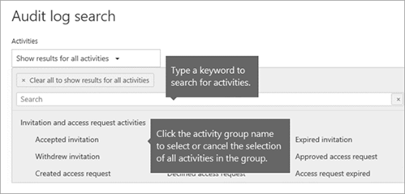

# Eseguire una ricerca nel log di controllo per gli eventi in Microsoft TeamsSearch the audit log for events in Microsoft Teams

> [!IMPORTANT]
> [!INCLUDE [new-teams-sfb-admin-center-notice](includes/new-teams-sfb-admin-center-notice.md)]

Il log di controllo consente di analizzare attività specifiche nei servizi Microsoft 365.The audit log can help you investigate specific activities across Microsoft 365 services. Per Microsoft teams, Ecco alcune delle attività che vengono controllate:For Microsoft Teams, here are some of the activities that are audited:

- Creazione di TeamTeam creation
- Eliminazione del teamTeam deletion
- Canale aggiuntoAdded channel
- Impostazione modificataChanged setting

Per un elenco completo delle attività di teams controllate, vedere [attività di Team](#teams-activities) e [turni nelle attività di Teams (in anteprima)](#shifts-in-teams-activities).For a complete list of Teams activities that are audited, see [Teams activities](#teams-activities) and [Shifts in Teams activities (in preview)](#shifts-in-teams-activities).

> [!NOTE]
> Gli eventi di controllo dei canali privati vengono registrati anche per i team e i canali standard.Audit events from private channels are also logged as they are for teams and standard channels.

## Attivare il controllo in teamsTurn on auditing in Teams

Prima di poter esaminare i dati di controllo, è necessario attivare prima di tutto il controllo nel [centro conformità & sicurezza](https://protection.office.com).Before you can look at audit data, you have to first turn on auditing in the [Security & Compliance Center](https://protection.office.com). Per informazioni sull'attivazione del controllo, leggere [attivare o disattivare la ricerca nel log di controllo](https://support.office.com/article/Turn-Office-365-audit-log-search-on-or-off-e893b19a-660c-41f2-9074-d3631c95a014).For help with turning on auditing, read [Turn audit log search on or off](https://support.office.com/article/Turn-Office-365-audit-log-search-on-or-off-e893b19a-660c-41f2-9074-d3631c95a014).

> [!IMPORTANT]
> I dati di controllo sono disponibili solo dal momento in cui è stato attivato il controllo.Audit data is only available from the point at which you turned on auditing.

## Recuperare i dati di teams dal log di controlloRetrieve Teams data from the audit log

1. Per recuperare i log di controllo, accedere al [centro conformità & sicurezza](https://go.microsoft.com/fwlink/?linkid=855775).To retrieve audit logs, go to the [Security & Compliance Center](https://go.microsoft.com/fwlink/?linkid=855775). In **ricerca**selezionare **Ricerca log di controllo**.Under **Search**, select **Audit log search**.
2. Usare la **ricerca** per filtrare in base alle attività, alle date e agli utenti che si desidera controllare.Use **Search** to filter by the activities, dates, and users you want to audit.
3. Esportare i risultati in Excel per un'ulteriore analisi.Export your results to Excel for further analysis.

> [!IMPORTANT]
> I dati di controllo sono visibili solo nel log di controllo se è attivato il controllo.Audit data is only visible in the audit log if auditing is turned on.

Il periodo di tempo in cui un record di controllo viene mantenuto e la ricerca nel log di controllo dipende dall'abbonamento a Microsoft 365 o Office 365 e, in particolare, al tipo di licenza assegnato agli utenti.The length of time that an audit record is retained and searchable in the audit log depends on your Microsoft 365 or Office 365 subscription, and specifically the type of license that's assigned to users. Per altre informazioni, vedere la [Descrizione del servizio Security & Compliance Center](https://docs.microsoft.com/office365/servicedescriptions/office-365-platform-service-description/office-365-securitycompliance-center).To learn more, see the [Security & Compliance Center service description](https://docs.microsoft.com/office365/servicedescriptions/office-365-platform-service-description/office-365-securitycompliance-center).

## Suggerimenti per la ricerca nel log di controlloTips for searching the audit log

Ecco alcuni suggerimenti per la ricerca di attività in teams nel log di controllo.Here are tips for searching for Teams activities in the audit log.

- È possibile selezionare attività specifiche da cercare facendo clic sul nome dell'attività.You can select specific activities to search for by clicking the activity name. In alternativa, è possibile cercare tutte le attività di un gruppo, ad esempio **attività di file e cartelle**, facendo clic sul nome del gruppo.Or you can search for all activities in a group (such as **File and folder activities**) by clicking the group name. Se è selezionata un'attività, è possibile fare clic su di essa per annullare la selezione.If an activity is selected, you can click it to cancel the selection. È anche possibile usare la casella di ricerca per visualizzare le attività che contengono la parola chiave digitata.You can also use the search box to display the activities that contain the keyword that you type. 
    
- Per visualizzare gli eventi per le attività eseguite tramite cmdlet, selezionare **Mostra risultati per tutte le attività** nell'elenco **attività** .To display events for activities run using cmdlets, select **Show results for all activities** in the **Activities** list. Se si conosce il nome dell'operazione per queste attività, cercare tutte le attività e quindi filtrare i risultati digitando il nome dell'operazione nella casella della colonna **attività** .If you know the name of the operation for these activities, search for all activities, and then filter the results by typing the name of the operation in the box in the **Activity** column. Per altre informazioni, vedere [passaggio 3: filtrare i risultati della ricerca](https://docs.microsoft.com/microsoft-365/compliance/search-the-audit-log-in-security-and-compliance?view=o365-worldwide#step-3-filter-the-search-results).To learn more, see [Step 3: Filter the search results](https://docs.microsoft.com/microsoft-365/compliance/search-the-audit-log-in-security-and-compliance?view=o365-worldwide#step-3-filter-the-search-results).
- Per cancellare i criteri di ricerca correnti, fare clic su **Cancella**.To clear the current search criteria, click **Clear**. L'intervallo di date restituisce l'impostazione predefinita degli ultimi sette giorni.The date range returns to the default of the last seven days. È anche possibile fare clic su **Cancella tutto per visualizzare i risultati per tutte le attività** per annullare tutte le attività selezionate.You can also click **Clear all to show results for all activities** to cancel all selected activities.
- Se vengono trovati risultati di 5.000, è probabile che siano presenti più eventi di 5.000 che soddisfano i criteri di ricerca.If 5,000 results are found, you can probably assume that there are more than 5,000 events that met the search criteria. È possibile affinare i criteri di ricerca e rieseguire la ricerca per restituire meno risultati oppure esportare tutti i risultati della ricerca selezionando **Esporta risultati**per  >  **scaricare tutti i risultati**.You can refine the search criteria and rerun the search to return fewer results, or you can export all the search results by selecting **Export results** > **Download all results**.

Guarda [questo video per l'](https://www.youtube.com/embed/UBxaRySAxyE) uso della ricerca nel log audio.Check out [this video](https://www.youtube.com/embed/UBxaRySAxyE) for using audio log search. Unisciti a un responsabile di programma per Teams, come dimostra come eseguire una ricerca nel log di controllo per i team.Join Ansuman Acharya, a program manager for Teams, as he demonstrates how to do an audit log search for Teams.

## Usare la sicurezza delle app cloud per impostare i criteri di attivitàUse Cloud App Security to set activity policies

Usando l'integrazione di [sicurezza delle app di Microsoft Cloud](https://docs.microsoft.com/cloud-app-security/what-is-cloud-app-security) , puoi impostare i [criteri di attività](https://docs.microsoft.com/cloud-app-security/user-activity-policies) per applicare una vasta gamma di processi automatizzati usando le API del provider di app.Using [Microsoft Cloud App Security](https://docs.microsoft.com/cloud-app-security/what-is-cloud-app-security) integration, you can set [activity policies](https://docs.microsoft.com/cloud-app-security/user-activity-policies) to enforce a wide range of automated processes using the app provider's APIs. Questi criteri consentono di monitorare le attività specifiche svolte da diversi utenti o di seguire tariffe inaspettatamente elevate di un determinato tipo di attività.These policies enable you to monitor specific activities carried out by various users, or follow unexpectedly high rates of one certain type of activity.

Dopo aver impostato un criterio di rilevamento attività, viene avviata la generazione di avvisi.After you set an activity detection policy, it starts to generate alerts. Gli avvisi vengono generati solo per le attività che si verificano dopo la creazione dei criteri.Alerts are only generated on activities that occur after you create the policy. Ecco alcuni esempi di scenari in cui è possibile usare i criteri di attività nella sicurezza delle app cloud per monitorare le attività dei team.Here's some example scenarios for how you can use activity policies in Cloud App Security to monitor Teams activities.

### Scenario utente esternoExternal user scenario

Uno scenario in cui è consigliabile tenersi d'occhio, da un punto di vista aziendale, è l'aggiunta di utenti esterni all'ambiente teams.One scenario you might want to keep an eye on, from a business perspective, is the addition of external users to your Teams environment. Se gli utenti esterni sono abilitati, è consigliabile monitorarne la presenza.If external users are enabled, monitoring their presence is a good idea.  Puoi usare la [sicurezza delle app Cloud](https://docs.microsoft.com/cloud-app-security/what-is-cloud-app-security) per identificare potenziali minacce.You can use [Cloud App Security](https://docs.microsoft.com/cloud-app-security/what-is-cloud-app-security) to identify potential threats.

Lo screenshot di questo criterio per il monitoraggio dell'aggiunta di utenti esterni consente di assegnare un nome al criterio, impostare la gravità in base alle esigenze aziendali, impostarlo come (in questo caso) una singola attività e quindi stabilire i parametri che verranno monitorati in modo specifico solo l'aggiunta di utenti non interni e limitare l'attività ai team.The screenshot of this policy to monitor adding external users allows you to name the policy, set the severity according to your business needs, set it as (in this case) a single activity, and then establish the parameters that will specifically monitor only the addition of non-internal users, and limit this activity to Teams.

I risultati di questo criterio possono essere visualizzati nel registro attività:The results from this policy can be viewed in the activity log:

Qui puoi rivedere le corrispondenze ai criteri impostati e apportare le eventuali modifiche necessarie oppure esportare i risultati per usarli altrove.Here you can review matches to the policy you've set, and make any adjustments as needed, or export the results to use elsewhere.

### Scenario di eliminazione di massaMass delete scenario

Come accennato in precedenza, è possibile monitorare gli scenari di eliminazione.As mentioned earlier, you can monitor deletion scenarios. È possibile creare un criterio che monitora l'eliminazione di massa dei siti di teams.It's possible to create a policy that would monitor mass deletion of Teams sites. In questo esempio viene configurato un criterio basato sugli avvisi per rilevare l'eliminazione di massa dei team in un intervallo di 30 minuti.In this example, an alert-based policy is set up to detect mass deletion of teams in a span of 30 minutes.

Come Mostra la schermata, è possibile impostare molti parametri diversi per questo criterio per monitorare le eliminazioni dei team, tra cui gravità, azione singola o ripetuta e parametri che limitano questa operazione ai team e all'eliminazione del sito.As the screenshot shows, you can set many different parameters for this policy to monitor Teams deletions, including severity, single or repeated action, and parameters limiting this to Teams and site deletion. Questa operazione può essere eseguita indipendentemente da un modello oppure è possibile che sia stato creato un modello per basare il criterio in base alle esigenze dell'organizzazione.This can be done independently of a template, or you may have a template created to base this policy on, depending on your organizational needs.

Dopo aver stabilito un criterio che funzionerà per l'azienda, è possibile esaminare i risultati nel log attività come vengono attivati gli eventi:Once you've established a policy that will work for your business, you can then review the results in the activity log as events are triggered:

È possibile filtrare i criteri impostati per visualizzare i risultati di tale criterio.You can filter down to the policy you've set to see the results of that policy. Se i risultati ottenuti nel registro attività non sono soddisfacenti (si possono vedere molti risultati o niente affatto), potrebbe essere utile ottimizzare la query per renderla più pertinente a ciò che è necessario.If the results you're getting in the activity log are not satisfactory (maybe you're seeing lots of results, or nothing at all), this may help you to fine-tune the query to make it more relevant to what you need it to do.

### Scenario di avviso e governanceAlert and governance scenario

Quando viene attivato un criterio di attività, è possibile impostare avvisi e inviare messaggi di posta elettronica agli amministratori e agli altri utenti.You can set alerts and send emails to admins and other users when an activity policy is triggered. Puoi impostare azioni di governance automatizzate come la sospensione di un utente o la possibilità di accedere di nuovo in modo automatizzato a un utente.You can set automated governance actions such as suspending a user or making a user to sign in again in an automated way. Questo esempio Mostra come un account utente può essere sospeso quando viene attivato un criterio di attività e determina che un utente ha eliminato due o più team in 30 minuti.This example shows how a user account can be suspended when an activity policy is triggered and determines a user deleted two or more teams in 30 minutes.

## Usare la sicurezza delle app cloud per impostare i criteri di rilevamento anomalieUse Cloud App Security to set anomaly detection policies

I [criteri di rilevamento delle anomalie](https://docs.microsoft.com/cloud-app-security/anomaly-detection-policy) nella sicurezza delle app cloud consentono di usare le funzionalità utente e l'analisi comportamentale (Ueba) e l'apprendimento automatico (ml) in modo da poter eseguire immediatamente il rilevamento avanzato delle minacce nell'ambiente cloud.[Anomaly detection policies](https://docs.microsoft.com/cloud-app-security/anomaly-detection-policy) in Cloud App Security provide out-of-the-box user and entity behavioral analytics (UEBA) and machine learning (ML) so that you can immediately run advanced threat detection across your cloud environment. Dato che sono abilitati automaticamente, i nuovi criteri di rilevamento delle anomalie forniscono risultati immediati fornendo rilevamenti immediati, con l'obiettivo di numerose anomalie comportamentali tra gli utenti e i computer e i dispositivi connessi alla rete.Because they're automatically enabled, the new anomaly detection policies provide immediate results by providing immediate detections, targeting numerous behavioral anomalies across your users and the machines and devices connected to your network. I nuovi criteri espongono inoltre altri dati dal motore di rilevamento della sicurezza delle app cloud per velocizzare il processo di analisi e contenere le minacce in corso.Additionally, the new policies expose more data from the Cloud App Security detection engine, to help you speed up the investigation process and contain ongoing threats.

Stiamo lavorando per integrare gli eventi dei team in criteri di rilevamento delle anomalie.We're working to integrate Teams events into anomaly detection policies. Per il momento, puoi configurare i criteri di rilevamento delle anomalie per gli altri prodotti di Office e ottenere elementi di azione per gli utenti che soddisfano tali criteri.For now, you can set up anomaly detection policies for other Office products and take action items on users who match those policies.

## Attività TeamsTeams activities

Ecco un elenco di tutti gli eventi registrati per le attività utente e amministratore in teams nel log di controllo di Microsoft 365.Here's a list of all events that are logged for user and admin activities in Teams in the Microsoft 365 audit log. La tabella include il nome descrittivo visualizzato nella colonna **attività** e il nome dell'operazione corrispondente che viene visualizzata nelle informazioni dettagliate di un record di controllo e nel file CSV quando si esportano i risultati della ricerca.The table includes the friendly name that's displayed in the **Activities** column and the name of the corresponding operation that appears in the detailed information of an audit record and in the CSV file when you export the search results.

|Nome descrittivoFriendly name  |OperazioneOperation|DescrizioneDescription |
|---------|---------|---------|
|Aggiunta di un bot al teamAdded bot to team   |BotAddedToTeamBotAddedToTeam        |Un utente aggiunge un bot a un team.A user adds a bot to a team.        |
|Canale aggiuntoAdded channel   |ChannelAddedChannelAdded         |Un utente aggiunge un canale a un team.A user adds a channel to a team.         |
|Connettore aggiuntoAdded connector  |ConnectorAddedConnectorAdded          |Un utente aggiunge un connettore a un canale.A user adds a connector to a channel.        |
|Membri aggiuntiAdded members    |MemberAddedMemberAdded         |Un proprietario del team aggiunge membri a un team, un canale o una chat di gruppo.A team owner adds members to a team, channel, or group chat.         |
|Scheda aggiuntaAdded tab    |TabAddedTabAdded         |Un utente aggiunge una tabulazione a un canale.A user adds a tab to a channel.        |
|Impostazione del canale modificataChanged channel setting    |ChannelSettingChangedChannelSettingChanged         |L'operazione ChannelSettingChanged viene registrata quando si esegue l'esecuzione delle attività seguenti da parte di un membro del team.The ChannelSettingChanged operation is logged when the following activities are performed by a team member. Per ognuna di queste attività, viene visualizzata una descrizione dell'impostazione modificata (mostrata tra parentesi nella colonna **elemento** nei risultati della ricerca del log di controllo.For each of these activities, a description of the setting that was changed (shown in parentheses is displayed in the **Item** column in the audit log search results. <ul><li>Modifica il nome di un canale del team (**nome canale**)Changes name of a team channel (**Channel name**)</li><li>Modifica la descrizione di un canale del team (**Descrizione del canale**)Changes description of a team channel (**Channel description**)</li> </ul>      |
|Impostazione dell'organizzazione modificataChanged organization setting   |TeamsTenantSettingChangedTeamsTenantSettingChanged         |L'operazione TeamsTenantSettingChanged viene registrata quando le attività seguenti vengono eseguite da un amministratore globale nell'interfaccia di amministrazione di Microsoft 365.The TeamsTenantSettingChanged operation is logged when the following activities are performed by a global admin in the Microsoft 365 admin center. Queste attività influiscono sulle impostazioni di team a livello di organizzazione.These activities affect org-wide Teams settings. Per altre informazioni, vedere [gestire le impostazioni dei team per l'organizzazione](enable-features-office-365.md).To learn more, see [Manage Teams settings for your organization](enable-features-office-365.md).  Per ognuna di queste attività viene visualizzata una descrizione dell'impostazione modificata (visualizzata tra parentesi) nella colonna **elemento** nei risultati della ricerca del log di controllo.For each of these activities, a description of the setting that was changed (shown in parentheses) is displayed in the **Item** column in the audit log search results.<ul><li>Abilita o Disabilita team per l'organizzazione (**Microsoft teams**).Enables or disables Teams for the organization (**Microsoft Teams**).</li><li>Abilita o Disabilita l'interoperabilità tra Microsoft teams e Skype for business per l'organizzazione (**interoperabilità Skype for business**).Enables or disables interoperability between Microsoft Teams and Skype for Business for the organization (**Skype for Business interoperability**).</li><li>Abilita o Disabilita la visualizzazione organigramma nei client di Microsoft Teams (**visualizzazione**organigramma).Enables or disables the organizational chart view in Microsoft Teams clients (**Org chart view**).</li><li>Abilita o Disabilita la possibilità per i membri del team di pianificare riunioni private (**pianificazione di riunioni private**).Enables or disables the ability for team members to schedule private meetings (**Private meeting scheduling**).</li><li>Abilita o Disabilita la possibilità per i membri del team di pianificare le riunioni di canale (**pianificazione delle riunioni di canale**).Enables or disables the ability for team members to schedule channel meetings (**Channel meeting scheduling**).</li><li>Abilita o Disabilita le chiamate video nelle riunioni del team (**video per riunioni Skype**).Enables or disables video calling in Teams meetings (**Video for Skype meetings**).</li><li>Abilita o Disabilita la condivisione dello schermo in Meetup di Microsoft teams per l'organizzazione (**condivisione dello schermo per riunioni Skype**).Enables or disables screen sharing in Microsoft Teams meetups for the organization (**Screen sharing for Skype meetings**).</li><li>Abilita o Disabilita la possibilità di aggiungere immagini animate (dette Giphy) alle conversazioni del team (**Immagini animate**).Enables or disables that ability to add animated images (called Giphys) to Teams conversations (**Animated images**).</li><li>Modifica l'impostazione di classificazione del contenuto per l'organizzazione (**classificazione del contenuto**).Changes the content rating setting for the organization (**Content rating**). La classificazione del contenuto limita il tipo di immagine animata che può essere visualizzata nelle conversazioni.The content rating restricts the type of animated image that can be displayed in conversations.</li><li>Abilita o Disabilita la possibilità per i membri del team di aggiungere immagini personalizzabili (dette meme personalizzati) da Internet alle conversazioni del team (**Immagini personalizzabili da Internet**).Enables or disables the ability for team members to add customizable images (called custom memes) from the internet to team conversations (**Customizable images from the Internet**).</li><li>Abilita o Disabilita la possibilità per i membri del team di aggiungere immagini modificabili (dette adesivi) alle conversazioni del team (**immagini modificabili**).Enables or disables the ability for team members to add editable images (called stickers) to team conversations (**Editable images**).</li><li>Abilita o Disabilita la possibilità per i membri del team di usare i bot in chat e canali di Microsoft Teams (**bot a livello di organizzazione)**.Enables or disables that ability for team members to use bots in Microsoft Teams chats and channels (**Org-wide bots)**.</li><li>Abilita bot specifici per Microsoft teams.Enables specific bots for Microsoft Teams. Questo non include il T-bot, che è il bot della Guida di teams disponibile quando i bot sono abilitati per l'organizzazione (**singoli bot**).This doesn't include the T-Bot, which is Teams help bot that's available when bots are enabled for the organization (**Individual bots**).</li><li>Abilita o Disabilita la possibilità per i membri del team di aggiungere estensioni o schede (**estensioni o schede**).Enables or disables the ability for team members to add extensions or tabs (**Extensions or tabs**).</li><li>Abilita o Disabilita il caricamento laterale di bot proprietari per Microsoft Teams (**caricamento laterale dei bot**).Enables or disables the side-loading of proprietary bots for Microsoft Teams (**Side loading of Bots**).</li><li>Abilita o Disabilita la possibilità per gli utenti di inviare messaggi di posta elettronica a un canale di Microsoft Teams (**canale di posta elettronica**).Enables or disables the ability for users to send email messages to a Microsoft Teams channel (**Channel email**).</li></ul>|
|Ruolo modificato dei membri del teamChanged role of members in team    |MemberRoleChangedMemberRoleChanged         |Un proprietario del team modifica il ruolo dei membri in un team.A team owner changes the role of members in a team. I valori seguenti indicano il tipo di ruolo assegnato all'utente.The following values indicate the role type assigned to the user.   **1** -indica il ruolo del proprietario.**1** - Indicates the Owner role. **2** -indica il ruolo del membro.**2** -  Indicates the Member role. **3** -indica il ruolo Guest.**3** -  Indicates the Guest role.  La proprietà Members include anche il nome dell'organizzazione e l'indirizzo di posta elettronica del membro.The Members property also includes the name of your organization and the member's email address.        |
|Impostazioni del team modificateChanged team setting    |TeamSettingChangedTeamSettingChanged        |L'operazione TeamSettingChanged viene registrata quando si esegue l'esecuzione delle attività seguenti da parte di un proprietario del team.The TeamSettingChanged operation is logged when the following activities are performed by a team owner. Per ognuna di queste attività viene visualizzata una descrizione dell'impostazione modificata (visualizzata tra parentesi) nella colonna **elemento** nei risultati della ricerca del log di controllo.For each of these activities, a description of the setting that was changed (shown in parentheses) is displayed in the **Item** column in the audit log search results.<ul><li>Modifica il tipo di accesso per un team.Changes the access type for a team. I team possono essere impostati come privati o pubblici (**tipo di accesso al team**).Teams can be set as private or public (**Team access type**). Quando un team è privato (impostazione predefinita), gli utenti possono accedere al team solo su invito.When a team is private (the default setting), users can access the team only by invitation. Quando un team è pubblico, è individuabile da chiunque.When a team is public, it's discoverable by anyone.</li><li>Modifica la classificazione delle informazioni di un team (**classificazione del team**).Changes the information classification of a team (**Team classification**). I dati del team, ad esempio, possono essere classificati come un impatto elevato, un impatto medio delle aziende o un impatto minimo sulle aziende.For example, team data can be classified as high business impact, medium business impact, or low business impact.</li><li>Modifica il nome di un team (**nome del team**).Changes the name of a team (**Team name**).</li><li>Modifica la descrizione del team (**Descrizione del team**).Changes the team description (**Team description**).</li><li>Modifiche apportate alle impostazioni del team.Changes made to team settings. Per accedere a queste impostazioni, il proprietario del team può fare clic con il pulsante destro del mouse su un team, scegliere **Gestisci team**e quindi fare clic sulla scheda **Impostazioni** . Per queste attività, il nome dell'impostazione modificata viene visualizzato nella colonna **elemento** nei risultati della ricerca del log di controllo.To access these settings,  a team owner can right-click a team, select **Manage team**, and then click the **Settings** tab. For these activities, the name of the setting that was changed is displayed in the **Item** column in the audit log search results.</li></ul>         |
|Team creatoCreated team    |TeamCreatedTeamCreated         |Un utente crea un team.A user creates a team.         |
|Eliminate tutte le app dell'organizzazioneDeleted all organization apps|DeletedAllOrganizationAppsDeletedAllOrganizationApps           |Eliminate tutte le app dell'organizzazione dal catalogo.Deleted all organization apps from the catalog.     |
|App eliminataDeleted app |AppDeletedFromCatalogAppDeletedFromCatalog           |Un'app è stata eliminata dal catalogo.An app has been deleted from the catalog.     |
|Canale eliminatoDeleted channel     |ChannelDeletedChannelDeleted         |Un utente elimina un canale da un team.A user deletes a channel from a team.         |
|Team eliminatoDeleted team  |TeamDeletedTeamDeleted            |Un proprietario del team Elimina un team.A team owner deletes a team.      |
|App installataInstalled app |AppInstalledAppInstalled         |È stata installata un'app.An app was installed.   |
|Azione eseguita sulla schedaPerformed action on card|PerformedCardActionPerformedCardAction|Un utente ha intrapreso un'azione su una scheda adattiva all'interno di una chat.A user took action on an adaptive card within a chat. Le schede adattive vengono in genere usate dai bot per consentire l'ampia visualizzazione delle informazioni e l'interazione nelle chat.Adaptive cards are typically used by bots to allow the rich display of information and interaction in chats.   **Nota:** Solo le azioni di input in linea su una scheda adattiva all'interno di una chat saranno disponibili nel log di controllo.**Note:** Only inline input actions on an adaptive card inside a chat will be available in the audit log. Ad esempio, quando un utente invia una risposta al sondaggio in una conversazione di canale su una scheda adattiva generata da un bot di sondaggio.For example, when a user submits a poll response in a channel conversation on an adaptive card generated by a Poll bot. Le azioni degli utenti, ad esempio "Visualizza risultato", che apriranno una finestra di dialogo o le azioni degli utenti all'interno di finestre di dialogo non saranno disponibili nel log di controllo.User actions such as "View result", which will open a dialog, or user actions inside dialogs won't be available in the audit log.|
|App pubblicataPublished app |AppPublishedToCatalogAppPublishedToCatalog           |Un'app è stata aggiunta al catalogo.An app was added to the catalog.     |
|Bot rimosso dal teamRemoved bot from team   |BotRemovedFromTeamBotRemovedFromTeam         |Un utente rimuove un bot da un team.A user removes a bot from a team.       |
|Connettore rimossoRemoved connector     |ConnectorRemovedConnectorRemoved         |Un utente rimuove un connettore da un canale.A user removes a connector from a channel.         |
|Membri rimossiRemoved members    |MemberRemovedMemberRemoved        |Un proprietario del team rimuove i membri da un team, un canale o una chat di gruppo.A team owner removes members from a team, channel, or group chat.         |
|Scheda rimossoRemoved tab    |TabRemovedTabRemoved         |Un utente rimuove una tabulazione da un canale.A user removes a tab from a channel.         |
|App disinstallataUninstalled app |AppUninstalledAppUninstalled           |È stata disinstallata un'app.An app was uninstalled.     |
|App aggiornataUpdated app |AppUpdatedInCatalogAppUpdatedInCatalog           |Un'app è stata aggiornata nel catalogo.An app was updated in the catalog.     |
|Connettore aggiornatoUpdated connector    |ConnectorUpdatedConnectorUpdated         |Un utente ha modificato un connettore in un canale.A user modified a connector in a channel.         |
|Scheda aggiornamentoUpdated tab   |TabUpdatedTabUpdated         |Un utente ha modificato una tabulazione in un canale.A user modified a tab in a channel.         |
|App aggiornataUpgraded app |AppUpgradedAppUpgraded           |Un'app è stata aggiornata alla versione più recente del catalogo.An app was upgraded to its latest version in the catalog.     |
|L'utente ha eseguito l'accesso a teamsUser signed in to Teams     |TeamsSessionStartedTeamsSessionStarted         |Un utente accede a un client Microsoft teams.A user signs in to a Microsoft Teams client. Questo evento non acquisisce le attività di aggiornamento del token.This event doesn't capture token refresh activities.         |

## Turni nelle attività di TeamsShifts in Teams activities

**(in anteprima)****(in preview)**

Se l'organizzazione usa l'app turni in teams, è possibile eseguire una ricerca nel log di controllo per le attività correlate all'app turni.If your organization is using the Shifts app in Teams, you can search the audit log for activities related to the Shifts app. Ecco un elenco di tutti gli eventi che vengono registrati per le attività di turni in teams nel log di controllo di Microsoft 365.Here's a list of all events that are logged for Shifts activities in Teams in the Microsoft 365 audit log.

|Nome descrittivoFriendly name  |OperazioneOperation  |DescrizioneDescription  |
|---------|---------|---------|
|Gruppo di pianificazione aggiuntoAdded scheduling group      |SchedulingGroupAddedSchedulingGroupAdded          |Un utente aggiunge correttamente un nuovo gruppo di pianificazione alla programmazione.A user successfully adds a new scheduling group to the schedule.          |
|Gruppo di pianificazione modificatoEdited scheduling group     |SchedulingGroupEditedSchedulingGroupEdited         |Un utente modifica correttamente un gruppo di pianificazione.A user successfully edits a scheduling group.          |
|Gruppo pianificazione eliminataDeleted scheduling group         |SchedulingGroupDeletedSchedulingGroupDeleted              |Un utente elimina correttamente un gruppo di pianificazione dalla pianificazione.A user successfully deletes a scheduling group from the schedule.|
|Aggiunta di un turnoAdded shift      |ShiftAddedShiftAdded          |Un utente aggiunge correttamente un turno.A user successfully adds a shift.           |
|Turno modificatoEdited shift       |ShiftEditedShiftEdited       |Un utente modifica correttamente un turno.A user successfully edits a shift.        |
|Spostamento eliminatoDeleted shift          |ShiftDeletedShiftDeleted          | Un utente elimina correttamente un turno.A user successfully deletes a shift.               |
|Aggiunta di una pausaAdded time off      |TimeOffAddedTimeOffAdded          |Un utente aggiunge correttamente una pausa nella programmazione.A user successfully adds time off on the schedule.          |
|Timeout modificatoEdited time off         |TimeOffEditedTimeOffEdited           |Un utente modifica correttamente il tempo.A user successfully edits time off.          |
|Timeout eliminataDeleted time off     |TimeOffDeletedTimeOffDeleted              |Un utente elimina correttamente il tempo.A user successfully deletes time off.           |
|Aggiunta di un turno apertoAdded open shift     |OpenShiftAddedOpenShiftAdded          |Un utente aggiunge correttamente un turno aperto a un gruppo di pianificazione.A user successfully adds an open shift to a scheduling group.          |
|Modifica open ShiftEdited open shift    |OpenShiftEditedOpenShiftEdited          |Un utente modifica correttamente un turno aperto in un gruppo di pianificazione.A user successfully edits an open shift in a scheduling group.          |
|Elimina turno apertoDeleted open shift      |OpenShiftDeletedOpenShiftDeleted          |Un utente elimina correttamente un turno aperto da un gruppo di pianificazione.A user successfully deletes an open shift from a scheduling group.         |
|Pianificazione condivisaShared schedule     |ScheduleSharedScheduleShared                  |Un utente ha condiviso correttamente una pianificazione del team per un intervallo di date.A user successfully shared a team schedule for a date range.          |
|Clock in uso dell'oraClocked in using Time clock         |ClockedInClockedIn          |Un utente ha correttamente l'orologio usando l'ora.A user successfully clocks in using Time clock.          |
|Temporizzato con l'oraClocked out using Time clock      |ClockedOutClockedOut          |Un utente ha correttamente l'orologio usando il cronometro.A user successfully clocks out using Time clock.          |
|Interruzione iniziata con l'oraStarted break using Time clock      |BreakStartedBreakStarted          |Un utente avvia un'interruzione durante una sessione di clock del tempo attiva.A user successfully starts a break during an active Time clock session.          |
|Interruzione terminata con l'oraEnded break using Time clock    |BreakEndedBreakEnded          |Un utente termina un'interruzione durante una sessione di clock del tempo attiva.A user successfully ends a break during an active Time clock session.          |
|Aggiunta dell'ora di clockAdded Time clock entry     |TimeClockEntryAddedTimeClockEntryAdded          |Un utente aggiunge correttamente una nuova voce di clock manuale nel foglio di tempo.A user successfully adds a new manual Time clock entry on Time Sheet.          |
|Voce dell'ora di clock modificataEdited Time clock entry     | TimeClockEntryEditedTimeClockEntryEdited             |Un utente modifica correttamente una voce di clock nel foglio di tempo.A user successfully edits a Time clock entry on Time Sheet.          |
|Voce dell'ora di clock eliminataDeleted Time clock entry    |TimeClockEntryDeletedTimeClockEntryDeleted              |Un utente elimina correttamente una voce dell'ora di clock nel foglio di tempo.A user successfully deletes a Time clock entry on Time Sheet.          |
|Richiesta di spostamento aggiuntaAdded shift request         |RequestAddedRequestAdded              |Un utente ha aggiunto una richiesta di spostamento.A user added a shift request.          |
|Risposta alla richiesta di spostamentoResponded to shift request     |RequestRespondedToRequestRespondedTo                  |Un utente ha risposto a una richiesta di spostamento.A user responded to a shift request.          |
|Richiesta di spostamento annullataCanceled shift request         |RequestCanceledRequestCanceled               |Un utente ha annullato una richiesta di spostamento.A user canceled a shift request.          |
|Impostazione di pianificazione modificataChanged schedule setting      |ScheduleSettingChangedScheduleSettingChanged          |Un utente modifica un'impostazione nelle impostazioni di turni.A user changes a setting in Shifts settings.         |
|Integrazione della forza lavoro aggiuntaAdded workforce integration      |WorkforceIntegrationAddedWorkforceIntegrationAdded                  | L'app turni è integrata con un sistema di terze parti.The Shifts app is integrated with a third-party system.         |
|Messaggio di fuori turno accettatoAccepted off shift message         |OffShiftDialogAcceptedOffShiftDialogAccepted          |Un utente riconosce il messaggio di spostamento disattivato per accedere ai team dopo il turno di ore.A user acknowledges the off-shift message to access Teams after shift hours.           |

## API di attività di gestione di Office 365Office 365 Management Activity API

Puoi usare l'API di gestione attività di Office 365 per recuperare informazioni sugli eventi teams.You can use the Office 365 Management Activity API to retrieve information about Teams events. Per altre informazioni sullo schema dell'API di gestione attività per i team, vedere [schema teams](https://docs.microsoft.com/office/office-365-management-api/office-365-management-activity-api-schema#microsoft-teams-schema).To learn more about the  Management Activity API schema for Teams, see [Teams schema](https://docs.microsoft.com/office/office-365-management-api/office-365-management-activity-api-schema#microsoft-teams-schema).

## Argomenti correlatiRelated topics

- [Eseguire ricerche nel log di controllo nel centro conformità di Microsoft 365Search the audit log in the Microsoft 365 compliance center](https://docs.microsoft.com/microsoft-365/compliance/search-the-audit-log-in-security-and-compliance) 
