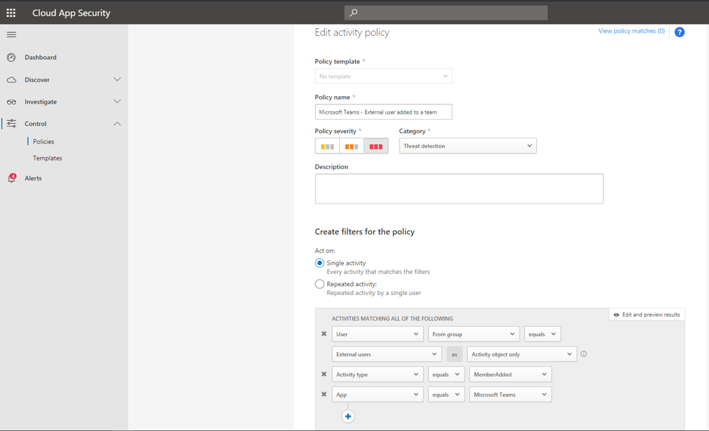
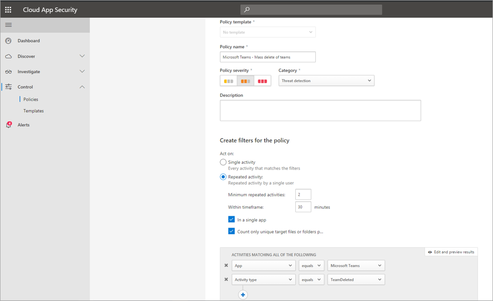

# Eseguire una ricerca nel log di controllo per gli eventi in Microsoft Teams

> [!IMPORTANT]
> [!INCLUDE [new-teams-sfb-admin-center-notice](includes/new-teams-sfb-admin-center-notice.md)]

Il log di controllo consente di analizzare attività specifiche in tutti i servizi di Office 365. Per i team, Ecco alcune delle attività che vengono controllate:

- Creazione di Team

- Eliminazione del team

- Canale aggiunto

- Impostazione modificata

> [!NOTE]
> Gli eventi di controllo dei canali privati vengono registrati anche per i team e i canali standard.

Per visualizzare l'elenco completo delle attività controllate in Microsoft 365, leggere [cercare il log di controllo nel centro conformità microsoft 365](https://support.office.com/article/0d4d0f35-390b-4518-800e-0c7ec95e946c).

## Attivare il controllo in teams

Prima di poter esaminare i dati di controllo, è necessario attivare prima di tutto il controllo nel [centro conformità & sicurezza](https://protection.office.com). Per assistenza durante l'attivazione del controllo, leggere [attivare o disattivare la ricerca nel log di controllo](https://support.office.com/article/Turn-Office-365-audit-log-search-on-or-off-e893b19a-660c-41f2-9074-d3631c95a014).

> [!IMPORTANT]
> I dati di controllo sono disponibili solo dal momento in cui è stato attivato il controllo.

## Recuperare i dati di teams dal log di controllo

1. Per recuperare i log di controllo, accedere al [centro conformità & sicurezza](https://go.microsoft.com/fwlink/?linkid=855775). In **ricerca**selezionare **Ricerca log di controllo**.
1. Usare la **ricerca** per filtrare in base alle attività, alle date e agli utenti che si desidera controllare.
1. Esportare i risultati in Excel per un'ulteriore analisi.

> [!IMPORTANT]
> I dati di controllo sono visibili solo nel log di controllo se è attivato il controllo.

## Scenario utente esterno

Uno scenario in cui è consigliabile tenersi d'occhio, da un punto di vista aziendale, è l'aggiunta di utenti esterni all'ambiente teams. Se gli utenti esterni sono abilitati, è consigliabile monitorarne la presenza.

La schermata di questo criterio per il monitoraggio delle aggiunte degli utenti esterni consente di assegnare un nome ai criteri, impostare la gravità in base alle esigenze aziendali, impostarla come (in questo caso) una singola attività e quindi stabilire i parametri che controlleranno in modo specifico solo l'aggiunta di utenti non interni e limitare l'attività a Microsoft teams.

I risultati di questo criterio saranno quindi in grado di essere visualizzati nel log attività:

Qui puoi rivedere le corrispondenze ai criteri impostati e apportare le eventuali modifiche necessarie oppure esportare i risultati per usarli altrove.

## Scenario di eliminazione di massa

Come accennato in precedenza, è possibile monitorare gli scenari di eliminazione. È possibile creare un criterio che monitora l'eliminazione di massa dei siti di teams:

Come Mostra la schermata, è possibile impostare molti parametri diversi per questo criterio per monitorare le eliminazioni dei team, tra cui gravità, azione singola o ripetuta e parametri che limitano questa operazione ai team e all'eliminazione del sito. Questa operazione può essere eseguita indipendentemente da un modello oppure è possibile che sia stato creato un modello per la base dei criteri, a seconda delle esigenze dell'organizzazione.

Dopo aver stabilito un criterio che funzionerà per l'azienda, è possibile esaminare i risultati nel log attività come vengono attivati gli eventi:

È possibile filtrare i criteri impostati per visualizzare i risultati di tale criterio. Se i risultati ottenuti nel registro attività non sono soddisfacenti (forse si verificano molti risultati o niente affatto), potrebbe essere utile ottimizzare la query per renderla più pertinente a ciò che è necessario.

## Video: TechTip: uso della ricerca nel log di controllo in teams

Partecipare a un responsabile del programma per Teams, che illustra come eseguire la ricerca di un log di controllo per i team nel centro conformità & sicurezza di Office 365.

> [!VIDEO https://www.youtube.com/embed/UBxaRySAxyE]
