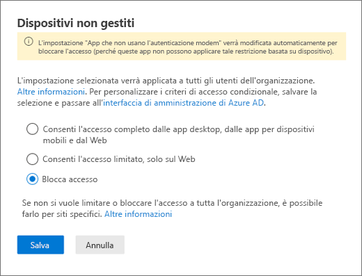
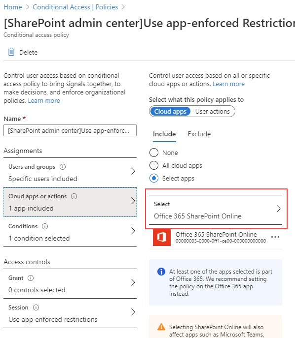
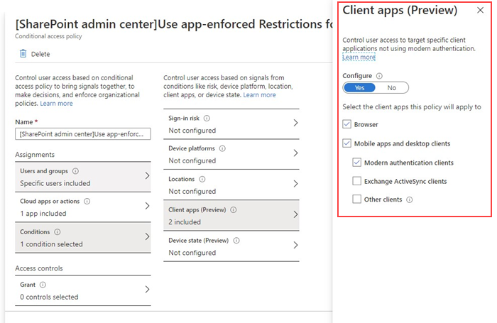
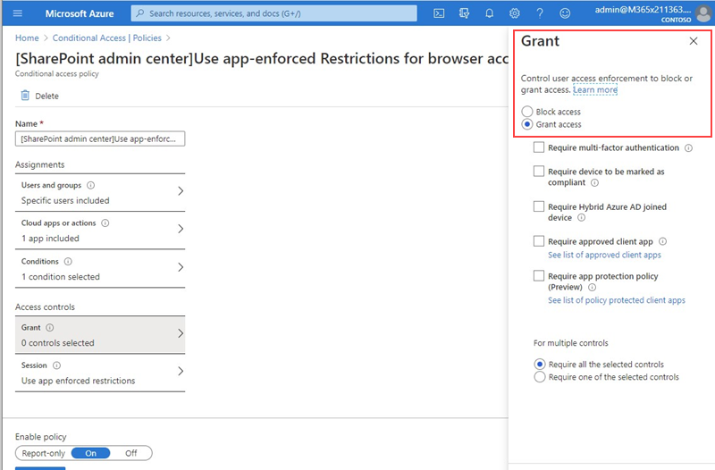
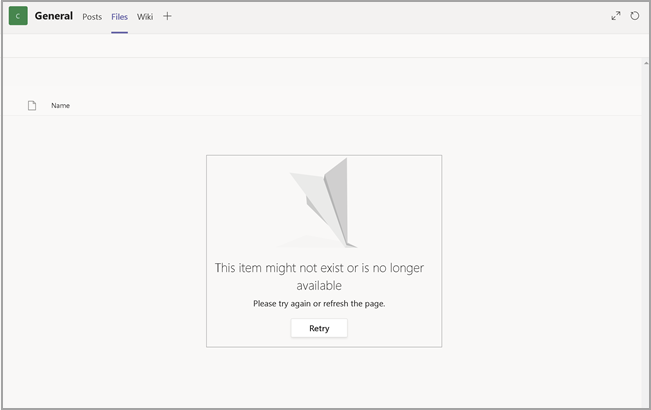

# Bloccare l'accesso a SharePoint per utenti specifici

Applicando i criteri di accesso condizionale in SharePoint in Microsoft 365, verranno applicati anche a Teams. Alcune organizzazioni, tuttavia, desiderano bloccare l'accesso ai file di SharePoint (caricare, scaricare, visualizzare, modificare, creare), ma consentono ai dipendenti di usare Teams desktop, per dispositivi mobili e Web su dispositivi non gestiti. In base alle regole dei criteri CA, il blocco di SharePoint porterebbe anche al blocco di Teams. Questo articolo spiega come ovviare a questa limitazione e consente ai dipendenti di continuare a usare Teams bloccando al contempo l'accesso ai file archiviati in SharePoint.

> [!Note]
> Il blocco o la limitazione dell'accesso su dispositivi non gestiti si basa sui criteri di accesso condizionale di Azure AD. Informazioni sulla [Licenza Azure AD](https://azure.microsoft.com/pricing/details/active-directory/). Per una panoramica sull'accesso condizionale in Azure AD, vedere [Accesso condizionale in Azure Active Directory](https://docs.microsoft.com/azure/active-directory/conditional-access/overview). Per informazioni sui criteri di accesso consigliati di SharePoint Online, vedere [Suggerimenti sui criteri per la protezione di siti e file di SharePoint](https://docs.microsoft.com/microsoft-365/enterprise/sharepoint-file-access-policies). Se si limita l'accesso sui dispositivi non gestiti, anche gli utenti di dispositivi gestiti sono tenuti a usare una delle [combinazioni di sistema operativo e browser](https://docs.microsoft.com/azure/active-directory/conditional-access/technical-reference#client-apps-condition), o avranno un accesso limitato.

È possibile bloccare o limitare l'accesso per:

- Gli utenti dell'organizzazione o solo per alcuni utenti o gruppi di sicurezza.

- Tutti i siti dell'organizzazione o solo alcuni siti.

Una volta bloccato l'accesso, gli utenti vedranno un messaggio di errore. Il blocco dell'accesso consente di garantire la sicurezza e di proteggere i dati. Una volta bloccato l'accesso, gli utenti vedranno un messaggio di errore.

1. Aprire l'interfaccia di amministrazione di SharePoint.

2. Espandere i **Criteri** > **Criteri di accesso**.

3. Nella sezione **Dispositivi non gestiti**, selezionare **Blocca accesso** e seleziona **Salva**.

   

4. Aprire il portale [Azure Active Directory](https://portal.azure.com/#blade/Microsoft_AAD_IAM/ConditionalAccessBlade/Policies) e passare a **Criteri di accesso condizionale**.

    Verrà visualizzato un criterio creato da SharePoint simile a questo esempio:

    

5. Aggiornare i criteri in modo che siano destinati solo a utenti specifici o a un gruppo.

    

  > [!Note]
> L'impostazione di questo criterio ridurrà l'accesso al portale di amministrazione di SharePoint. È consigliabile configurare i criteri di esclusione e selezionare gli amministratori globali e di SharePoint.

6. Verificare che l'opzione solo SharePoint sia selezionata come app cloud di destinazione

    

7. Aggiornare le **Condizioni** per includere anche i client desktop.

    

8. Verificare che l'opzione **Concedi accesso** sia abilitata

    

9. Verificare che **Usa restrizioni imposte dalle app** sia abilitato.

10. Attivare i criteri e selezionare **Salva**.

    

Per testare i criteri, è necessario disconnettersi da qualsiasi client, ad esempio l'app desktop Teams o il client di sincronizzazione di OneDrive for Business ed eseguire di nuovo l'accesso per vedere il criterio funzionante. Se l'accesso è stato bloccato, viene visualizzato un messaggio che indica che l'elemento potrebbe non esistere.

 

In SharePoint viene visualizzato un messaggio di accesso negato.

## Argomenti correlati

[Controllare l'accesso per i dispositivi non gestiti in SharePoint](https://docs.microsoft.com/sharepoint/control-access-from-unmanaged-devices)
