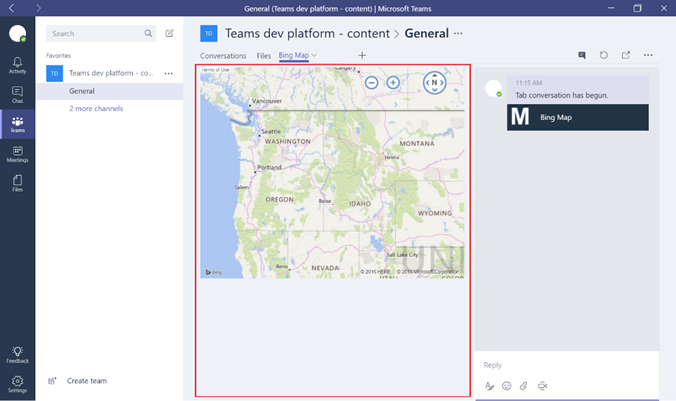

# Usare schede predefinite e personalizzate in Microsoft Teams

Le schede consentono ai membri del team di accedere ai servizi e ai contenuti in uno spazio dedicato all'interno di un canale o in una chat. In questo modo il team può lavorare direttamente con strumenti e dati e avere conversazioni sugli strumenti e i dati, tutto nel contesto del canale o della chat.

I proprietari e i membri del team possono aggiungere schede a un canale, una chat privata e una chat di gruppo per integrare i propri servizi cloud. È possibile aggiungere schede per consentire agli utenti di accedere e gestire facilmente i dati di cui hanno bisogno o di interagire al meglio. Può trattarsi di un report Power BI, di un dashboard o persino di un canale video [di Microsoft Stream](https://go.microsoft.com/fwlink/?linkid=855785) in cui si pubblicano video di formazione.

>[!Note]
> Il passaggio dall'utilizzo di Microsoft Stream a [ OneDrive for Business e SharePoint per le registrazioni delle riunioni ](tmr-meeting-recording-change.md) sarà graduale. Al momento del lancio sarà possibile acconsentire esplicitamente all’esperienza. A novembre sarà necessario rifiutarla esplicitamente se si vuole continuare a usare Stream e all'inizio del 2021 sarà chiesto a tutti i clienti di usare OneDrive for Business e SharePoint per le nuove registrazioni delle riunioni.

## Usare le schede

- Per ogni nuovo canale, per impostazione predefinita viene eseguito il provisioning di due schede: Conversazioni e File.

    
- Per ogni chat privata, per impostazione predefinita viene eseguito il provisioning di quattro schede: Conversazioni, File, Organizzazione e Attività.

    

- I proprietari e i membri del team possono aggiungere altre schede a un canale o a una chat facendo clic su **Aggiungi** una scheda Screenshot del pulsante Aggiungi scheda, con  nella parte superiore del canale o della chat.

- Excel, PowerPoint, Word e i file PDF devono essere caricati  nella scheda File prima di poter essere convertiti in schede. Qualsiasi file caricato esistente può essere convertito in una scheda con un solo clic, come illustrato di seguito.

    

- Per aggiungere un sito Web, l'URL deve iniziare con un prefisso **https** in modo che le informazioni scambiate rimangano sicure.

- Le istruzioni dettagliate vengono fornite quando un membro del team prova ad aggiungere una scheda personalizzata al canale o alla chat. Quando una scheda personalizzata viene aggiunta  a un canale, viene creata una conversazione a schede che consente ai membri del team di avere discussioni mirate sul contenuto.

    

## Sviluppare schede personalizzate

Oltre alle schede predefinite, è possibile progettare e sviluppare schede personalizzate da integrare Teams o condividere con il resto della community. Per altre informazioni, vedere la [documentazione per sviluppatori](/microsoftteams/platform/tabs/what-are-tabs).

---
