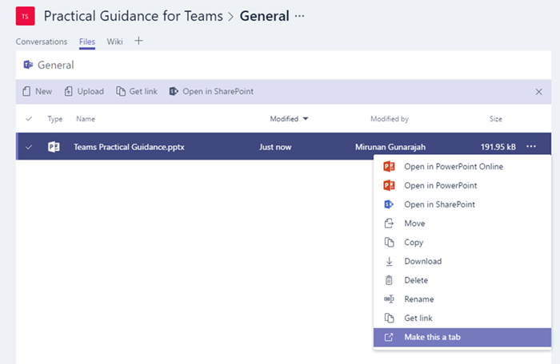

Usare le schede predefinite e personalizzate in Microsoft Teams
==================================================

Le schede consentono ai membri del team di accedere a servizi e contenuti in uno spazio dedicato all'interno di un canale o in una chat. In questo modo il team può lavorare direttamente con gli strumenti e i dati e avere conversazioni sugli strumenti e i dati, tutto nel contesto del canale o della chat.

I proprietari e i membri del team possono aggiungere schede a un canale, una chat privata e una chat di gruppo per integrare i propri servizi cloud. Le schede possono essere aggiunte per consentire agli utenti di accedere e gestire facilmente i dati necessari o interagire con i più. Può trattarsi di un report di Power BI, un dashboard o anche un canale video [Microsoft Stream](https://go.microsoft.com/fwlink/?linkid=855785) in cui pubblicare video di formazione.

## Usare le schede

- Con ogni nuovo canale vengono provisionate due schede per impostazione predefinita: conversazioni e file.

    
- Con tutte le chat private, le quattro schede vengono provisionate per impostazione predefinita: conversazioni, file, organizzazione e attività.

    

- I proprietari e i membri del team possono aggiungere altre schede a un canale o una chat facendo clic su **Aggiungi una scheda**  nella parte superiore del canale o della chat.

- I file di Excel, PowerPoint, Word e PDF devono essere caricati nella scheda **file** prima che possano essere convertiti in tabulazioni. Tutti i file caricati esistenti possono essere convertiti in una scheda con un solo clic, come illustrato di seguito.

    

- Per aggiungere un sito Web, l'URL deve iniziare con un prefisso **https** in modo che le informazioni scambiate rimangano sicure.

- Istruzioni dettagliate vengono fornite quando un membro del team prova ad aggiungere una scheda personalizzata al canale o alla chat. Quando una scheda personalizzata viene aggiunta a un canale, viene creata una **conversazione di tabulazione** che consente ai membri del team di avere discussioni mirate sul contenuto.

    

## Sviluppare schede personalizzate

Oltre alle schede predefinite, puoi progettare e sviluppare le tue schede per integrarti in team o condividere con il resto della community. Per altre informazioni, vedere la [documentazione per sviluppatori](/microsoftteams/platform/tabs/what-are-tabs).

---
