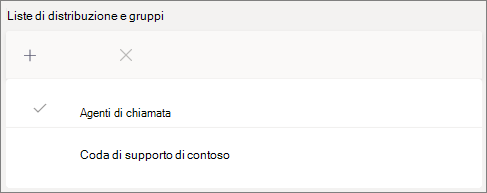

# Creare una coda di chiamata-esercitazione sulle piccole impreseCreate a call queue - small business tutorial

Le code di chiamata offrono un metodo per indirizzare i chiamanti alle persone dell'organizzazione che possono aiutarti con un problema o una domanda particolare.Call queues provide a method of routing callers to people in your organization who can help with with a particular issue or question. Le chiamate vengono distribuite una alla volta per gli utenti della coda (noti come *agenti*).Calls are distributed one at a time to the people in the queue (who are known as *agents*). 

Le code di chiamata includono:Call queues provide:

- Messaggio di saluto.A greeting message.

- Musica mentre gli utenti attendono il blocco in una coda.Music while people are waiting on hold in a queue.

- Chiamata routing-in *First in, First out* (FIFO) Order-to Agents.Call routing - in *First In, First Out* (FIFO) order - to agents.

- Opzioni di gestione per l'overflow e il timeout delle code.Handling options for queue overflow and timeout.

#### Prima di iniziareBefore you begin

Ottenere alcune [licenze per gli utenti virtuali nel sistema telefonico,](../teams-add-on-licensing/virtual-user.md) se non sono già disponibili.Get some [Phone System - Virtual User licenses](../teams-add-on-licensing/virtual-user.md) if you don't already have them. Ottenere uno per ogni coda di chiamata e operatore automatico che si prevede di configurare.Get one for each call queue and auto attendant that you plan to set up. Queste licenze sono gratuite, quindi ti consigliamo di ottenere qualche extra nel caso in cui decidi di apportare modifiche alla configurazione in futuro.These licenses are free, so we suggest getting a few extra in case you decide to make changes to your setup in the future.

Poiché gli agenti in una coda di chiamata possono effettuare chiamate in uscita per restituire una chiamata al cliente, è consigliabile impostare l'ID chiamante per gli agenti di chiamata sul numero di telefono principale o sul numero di un operatore automatico appropriato.Since agents in a call queue may dial out to return a customer call, consider setting the caller ID for your call agents to your main phone number or the number of an appropriate auto attendant. Per altre informazioni, vedere [gestire i criteri di ID chiamante in Microsoft teams](../caller-id-policies.md) .See [Manage caller ID policies in Microsoft Teams](../caller-id-policies.md) for more information.

#### Seguire questa procedura per configurare la coda di chiamataFollow these steps to set up your call queue

# [Passaggio 1   creare un teamStep 1 Create a team](#tab/create-team)

Quando si crea una coda di chiamata, è possibile aggiungere singoli utenti alla coda oppure usare un gruppo di sicurezza esistente, un gruppo Microsoft 365 o un team di Microsoft teams.When creating a call queue, you can add individual users to the queue, or you can use an existing security group, Microsoft 365 group, or Microsoft Teams team. È consigliabile usare un team.We recommend using a team. Ciò consente ai membri della coda di chattare tra loro, condividere idee e creare documenti o altre risorse per aiutarli a aiutare i clienti.This allows members of the queue to chat with each other, share ideas, and create documents or other resources to help them help your customers. Un team offre anche una cassetta postale vocale per i chiamanti che lasciano un messaggio dopo le ore o se la coda raggiunge la sua capacità massima.A team also provides a voice mailbox for callers to leave a message after hours or if the queue reaches its maximum capacity.

Per creare un teamTo create a team

1. Prima di tutto, fai clic su **Teams** sul lato sinistro dell'app, quindi fai clic su **partecipa o crea un team** nella parte inferiore dell'elenco teams.First, click **Teams** on the left side of the app, then click **Join or create a team** at the bottom of your teams list.

2. Quindi fare clic su **Crea team** (prima carta, angolo in alto a sinistra).Then click **Create team** (first card, top left corner).

3. Scegliere **Crea un team da zero**.Choose **Build a team from scratch**.

4. Scegliere quindi se si vuole un team pubblico o privato.Next, choose whether you want a public or private team. È consigliabile **private** per la coda di chiamata per evitare che gli utenti involontariamente partecipino alla coda unendo il team.We recommend **Private** for your call queue to avoid people unintentionally becoming part of the queue by joining the team.

5. Assegnare un nome al team e aggiungere una descrizione facoltativa.Name your team and add an optional description.

6. Al termine, fare clic su **Crea**.When you're done, click **Create**.

8. Digitare i nomi delle persone che si desidera includere nella coda di chiamata e quindi fare clic su **Aggiungi**.Type the names of the people that you want to have in your call queue, and then click **Add**.

9. Fare clic su **Chiudi**.Click **Close**. Gli utenti aggiunti a un team riceveranno un messaggio di posta elettronica che informa che ora sono membri del team e che il team verrà visualizzato nell'elenco teams.People you add to a team will receive an email letting them know they are now a member of your team and the team will show up in their teams list.

> [!div class="nextstepaction"]
> [Passaggio 2->degli account risorse Step 2 - Resource accounts >](https://review.docs.microsoft.com/microsoftteams/business-voice/create-a-phone-system-call-queue-smb?branch=mikeplum-smb-voice&tabs=resource-account#steps)

# [ Account delle risorse del passaggio 2Step 2 Resource accounts](#tab/resource-account)

Ogni coda di chiamata creata richiede un account di risorse.Each call queue that you create requires a resource account. Questo è simile a un account utente, ad eccezione del fatto che l'account è associato a un operatore automatico o a una coda di chiamata invece che a una persona.This is similar to a user account, except the account is associated with an auto attendant or call queue instead of a person. In questo passaggio creeremo l'account, gli assegnaremo un *sistema telefonico Microsoft 365-* licenza per gli utenti virtuali e lo useremo per iniziare a creare la coda di chiamata.In this step, we'll create the account, assign it a *Microsoft 365 Phone System - Virtual User* license, and then use it to start creating the call queue.

### Creare un account di risorseCreate a resource account

È possibile creare un account risorse nell'interfaccia di amministrazione di teams.You can create a resource account in the Teams admin center.

1. Nell'interfaccia di amministrazione di teams espandere **impostazioni a livello di organizzazione** e quindi fare clic su **account risorse**.In the Teams admin center, expand **Org-wide settings**, and then click **Resource accounts**.

2. Fare clic su **Aggiungi**.Click **Add**.

3. Nel riquadro **Aggiungi account risorse** compilare **nome visualizzato**, **nomeutente** e scegliere **coda di chiamata** per il **tipo di account risorse**.In the **Add resource account** pane, fill out **Display name**, **Username**, and choose **Call queue** for the **Resource account type**.

    

4. Fare clic su **Salva**.Click **Save**.

Il nuovo account verrà visualizzato nell'elenco degli account.The new account will appear in the list of accounts.

### Assegnare una licenzaAssign a license

È necessario assegnare un *sistema telefonico Microsoft 365-licenza utente virtuale* per l'account delle risorse.You must assign a *Microsoft 365 Phone System - Virtual User* license to the resource account.

1. Nell'interfaccia di amministrazione di Microsoft 365 fare clic sull'account delle risorse a cui si vuole assegnare una licenza.In the Microsoft 365 admin center, click the resource account to which you want to assign a license.

2. Nella scheda **licenze e app** , in **licenze**, selezionare **Microsoft 365 Phone System-Virtual User**.On the **Licenses and Apps** tab, under **Licenses**, select **Microsoft 365 Phone System - Virtual User**.

3. Fare clic su **Salva modifiche**.Click **Save changes**.

    

### Creare una coda di chiamataCreate a call queue

Inizieremo quindi a creare una nuova coda di chiamata e ad assegnare l'account delle risorse.Next, we'll start creating a new call queue and assign the resource account.

1. Nell'interfaccia di amministrazione di teams espandere **Voice**, fare clic su **code di chiamata** e quindi fare clic su **Aggiungi**.In the Teams admin center, expand **Voice**, click **Call queues**, and then click **Add**.

1. Digitare un nome per la coda di chiamata.Type a name for the call queue. Gli agenti vedranno questo nome quando ricevono una chiamata in arrivo dalla coda.Agents will see this name when they receive an incoming call from the queue.

2. Fare clic su **Aggiungi account**, cercare l'account risorse che si vuole usare con la coda di chiamata, fare clic su **Aggiungi** e quindi fare clic su **Aggiungi**.Click **Add accounts**, search for the resource account that you want to use with this call queue, click **Add**, and then click **Add**.

3. Scegliere una lingua.Choose a language. Questa lingua verrà usata per le istruzioni vocali generate dal sistema e la trascrizione della segreteria telefonica (se abilitate).This language will be used for system-generated voice prompts and voicemail transcription (if you enable them).

    

4. Specificare se si vuole riprodurre un saluto ai chiamanti quando arrivano in coda.Specify if you want to play a greeting to callers when they arrive in the queue. È necessario caricare un file MP3, WAV o WMA contenente il messaggio di saluto che si vuole riprodurre.You must upload an MP3, WAV, or WMA file containing the greeting that you want to play.

5. Teams offre musica predefinita ai chiamanti mentre sono in attesa in una coda.Teams provides default music to callers while they are on hold in a queue. Se si vuole riprodurre un file audio specifico, scegliere **Riproduci un file audio** e caricare un file MP3, WAV o WMA.If you want to play a specific audio file, choose **Play an audio file** and upload an MP3, WAV, or WMA file.

> [!NOTE]
> La registrazione caricata non può essere superiore a 5 MB.The uploaded recording can be no larger than 5 MB.
> La musica predefinita fornita nelle code delle chiamate di teams è priva di qualsiasi royalties pagabile dall'organizzazione.The default music supplied in Teams call queues is free of any royalties payable by your organization. 

> [!div class="nextstepaction"]
> [Passaggio 3-chiamare gli agenti >Step 3 - Call agents >](https://review.docs.microsoft.com/microsoftteams/business-voice/create-a-phone-system-call-queue-smb?branch=mikeplum-smb-voice&tabs=call-agents#steps)

# [Passaggio 3   chiama agentiStep 3 Call agents](#tab/call-agents)

Per aggiungere agenti alla coda di chiamata, aggiungiamo il team creato in precedenza.To add agents to the call queue, we'll add the team that we created earlier.

1. Fare clic su **Aggiungi gruppi**.Click **Add groups**.
2. Digitare il nome del team creato.Type the name of the team that you created.
3. Fare clic su **Aggiungi** e quindi su **Aggiungi**.Click **Add**, and then click **Add**.

    

È possibile aggiungere fino a 20 agenti singolarmente e fino a 200 agenti tramite gruppi o team.You can add up to 20 agents individually and up to 200 agents via groups or teams.

> [!NOTE]
> Quando si aggiungono nuovi utenti al team, possono essere necessarie fino a otto ore per la prima chiamata in arrivo.When new users are added to the team, it can take up to eight hours for their first call to arrive.

> [!div class="nextstepaction"]
> [Passaggio 4->degli account risorse Step 4 - Resource accounts >](https://review.docs.microsoft.com/microsoftteams/business-voice/create-a-phone-system-call-queue-smb?branch=mikeplum-smb-voice&tabs=call-routing#steps)

# [Passaggio 4   chiamata di routingStep 4 Call routing](#tab/call-routing)

Scegliere il metodo di routing delle chiamate che si vuole usare.Choose the call routing method that you want to use.

1. Impostare la **modalità conferenza** su **auto**.Set **Conference mode** to **Auto**.

2. Scegliere il **metodo di routing** che si vuole usare.Choose the **Routing method** you want to use. In questo modo viene determinato l'ordine in cui gli agenti ricevono chiamate dalla coda.This determines the order in which agents receive calls from the queue. È consigliabile un **routing seriale** o  **Round Robin**.We recommend **Serial routing** or  **Round robin**. Scegliere una delle opzioni seguenti:Choose from these options:

    - Il **routing di Attendant** squilla tutti gli agenti della coda contemporaneamente.**Attendant routing** rings all agents in the queue at the same time. Il primo agente di chiamata a prendere la chiamata riceve la chiamata.The first call agent to pick up the call gets the call.

    - Il **routing seriale** squilla tutti gli agenti di chiamata uno alla volta.**Serial routing** rings all call agents one by one. Se un agente respinge o non prende una chiamata, la chiamata suonerà l'agente successivo e proverà tutti gli agenti finché non viene prelevato o non viene ritirato.If an agent dismisses or does not pick up a call, the call will ring the next agent and will try all agents until it is picked up or times out.

    - **Round Robin** bilancia il routing delle chiamate in arrivo in modo che ogni agente di chiamata ottenga lo stesso numero di chiamate dalla coda.**Round robin** balances the routing of incoming calls so that each call agent gets the same number of calls from the queue. Questo potrebbe essere auspicabile in un ambiente di vendita in entrata per assicurare la parità di opportunità tra tutti gli agenti di chiamata.This may be desirable in an inbound sales environment to assure equal opportunity among all the call agents.

    - Le rotte **inattive più lunghe** ogni chiamata all'agente che è stato inattivo il tempo più lungo.**Longest idle** routes each call to the agent who has been idle the longest time. Gli agenti il cui stato presenza è stato assente per più di 10 minuti non sono inclusi.(Agents whose presence state has been Away for more than 10 minutes are not included.)

    

3. Attivare il **routing basato sulla presenza** .Turn **Presence-based routing** on. Questo instrada le chiamate agli agenti di cui è **disponibile** lo stato presenza.This routes calls to agents whose presence status is **Available**.

4. Scegliere se si vuole consentire agli agenti di rifiutare le chiamate.Choose if you want to allow agents to opt out of calls.

5. Impostare il **tempo di avviso** di un agente per specificare la durata dell'interlinea telefonica di un agente prima che la chiamata venga reindirizzata all'agente successivo.Set an **Agent alert time** to specify how long an agent's phone will ring before the queue redirects the call to the next agent.

    

> [!div class="nextstepaction"]
> [Passaggio 5->di overflow delle chiamate Step 5 - Call overflow >](https://review.docs.microsoft.com/microsoftteams/business-voice/create-a-phone-system-call-queue-smb?branch=mikeplum-smb-voice&tabs=call-overflow#steps)

# [Passaggio 5-   overflow delle chiamateStep 5 Call overflow](#tab/call-overflow)

Scegliere la modalità di gestione delle chiamate che superano il massimo nella coda.Choose how you want to handle calls that exceed the maximum in the queue.

1. Impostare le **chiamate massime nella coda**.Set the **Maximum calls in the queue**.

2. Scegliere cosa si vuole fare quando viene raggiunto il numero massimo di chiamate.Choose what you want to do when the maximum number of calls is reached. È possibile disconnettere la chiamata o reindirizzarla.You can disconnect the call or redirect it. È consigliabile reindirizzare la chiamata a una delle destinazioni seguenti:We recommend that you redirect the call to one of the following destinations:
    - **Persona dell'organizzazione** : una persona dell'organizzazione che è in grado di ricevere chiamate vocali**Person in the organization** - a person in your organization who is able to receive voice calls
    - **App vocale** : un operatore automatico o un'altra coda di chiamata.**Voice app** - an auto attendant or another call queue. Scegliere l'account delle risorse associato all'operatore automatico o alla coda di chiamata quando si sceglie questa destinazione.(Choose the resource account associated with the auto attendant or call queue when choosing this destination.)
    - **Numero di telefono esterno** -qualsiasi numero di telefono.**External phone number** - any phone number. Usare questo formato: + [codice paese] [prefisso] [numero di telefono]Use this format: +[country code][area code][phone number]
    - **Segreteria telefonica** : è possibile usare la cassetta postale vocale del team creato.**Voicemail** - you can use the voice mailbox of the team that you created.

    

> [!div class="nextstepaction"]
> [Passaggio 6-Timeout chiamata >Step 6 - Call timeout >](https://review.docs.microsoft.com/microsoftteams/business-voice/create-a-phone-system-call-queue-smb?branch=mikeplum-smb-voice&tabs=call-timeout#steps)

# [Passaggio 6   timeout chiamataStep 6 Call timeout](#tab/call-timeout)

Scegliere cosa si vuole fare quando le chiamate sono state attese in coda troppo a lungo.Choose what you want to happen when calls have been waiting in the queue for too long.

1. Impostare il **timeout della chiamata: tempo massimo di attesa**.Set the **Call Timeout: maximum wait time**.

2. Scegliere cosa si vuole fare quando si esce da una chiamata. È possibile disconnettere la chiamata o reindirizzarla.Choose what you want to do when a call times out. You can disconnect the call or redirect it. È consigliabile reindirizzare la chiamata a una delle destinazioni seguenti:We recommend that you redirect the call to one of the following destinations:
    - **Persona dell'organizzazione** : una persona dell'organizzazione che è in grado di ricevere chiamate vocali**Person in the organization** - a person in your organization who is able to receive voice calls
    - **App vocale** : un operatore automatico o un'altra coda di chiamata.**Voice app** - an auto attendant or another call queue. Scegliere l'account delle risorse associato all'operatore automatico o alla coda di chiamata quando si sceglie questa destinazione.(Choose the resource account associated with the auto attendant or call queue when choosing this destination.)
    - **Numero di telefono esterno** -qualsiasi numero di telefono.**External phone number** - any phone number. Usare questo formato: + [codice paese] [prefisso] [numero di telefono]Use this format: +[country code][area code][phone number]
    - **Segreteria telefonica** : è possibile usare la cassetta postale vocale del team creato.**Voicemail** - you can use the voice mailbox of the team that you created.

    

3. Fare clic su **Salva**.Click **Save**.

In questo articolo viene completata la configurazione della coda di chiamata.This completes the setup of your call queue. È quindi consigliabile [configurare un operatore automatico](create-a-phone-system-auto-attendant-smb.md).Next, you may want to [set up an auto attendant](create-a-phone-system-auto-attendant-smb.md).

---

