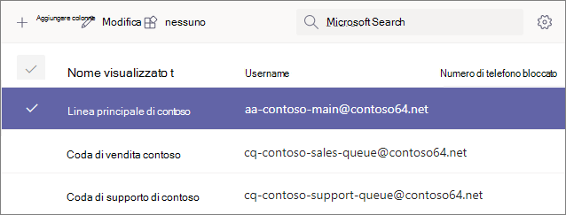
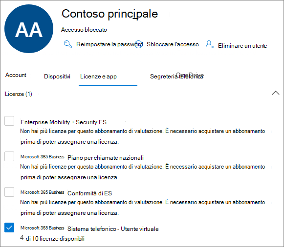
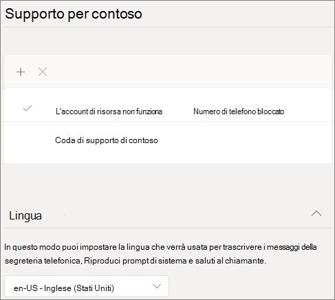
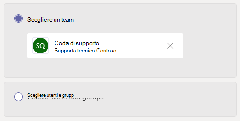
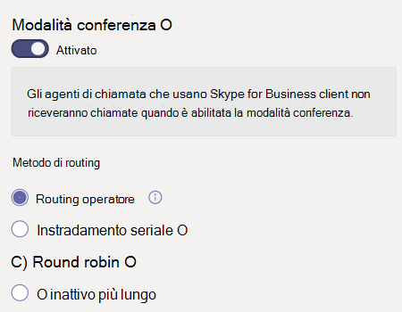
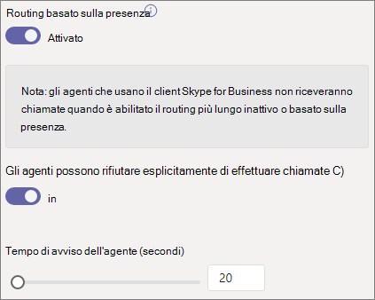
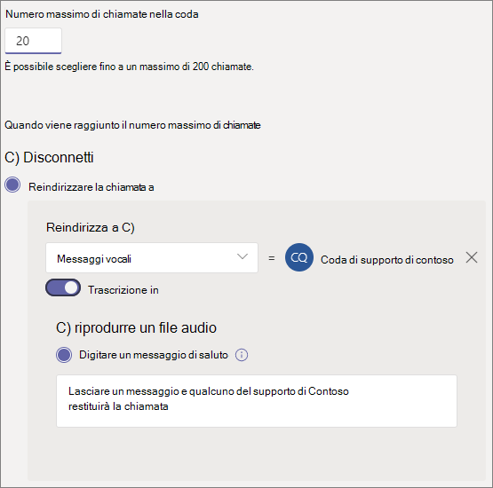
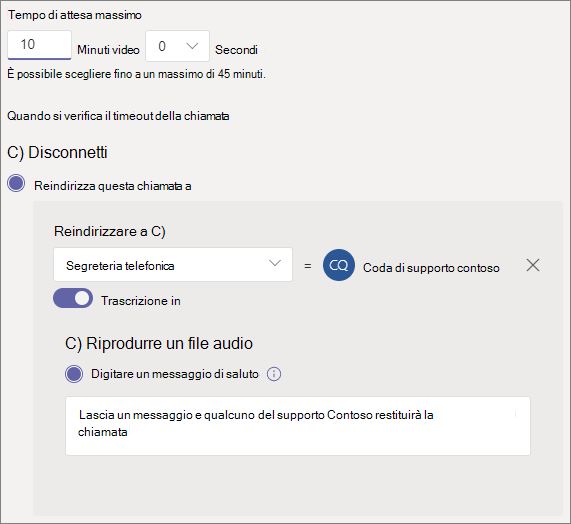

# Creare una coda di chiamata - Esercitazione sulle piccole imprese

Le code di chiamata forniscono un metodo per instradare i chiamanti alle persone dell'organizzazione che possono aiutare a risolvere un particolare problema o domanda. Le chiamate vengono distribuite una alla volta alle persone in coda (note come *agenti).* 

Le code di chiamata forniscono:

- Messaggio di saluto.

- Musica mentre le persone sono in attesa di blocco in una coda.

- Instradamento delle chiamate, in ordine FIFO *(First In, First Out)* agli agenti.

- Opzioni di gestione per l'overflow e il timeout della coda.

#### Prima di iniziare

Ottenere un [sistema telefonico - Licenze utente virtuale](../teams-add-on-licensing/virtual-user.md) se non sono già disponibili. Ottenere una per ogni coda di chiamata e operatore automatico che si prevede di configurare. Queste licenze sono gratuite, quindi ti consigliamo di ottenere un po' di più se decidi di apportare modifiche alla configurazione in futuro.

Poiché gli agenti in una coda di chiamata possono effettuare chiamate in uscita per restituire una chiamata al cliente, è consigliabile impostare l'ID chiamante per gli agenti di chiamata sul numero di telefono principale o sul numero di un operatore automatico appropriato. Per altre informazioni, vedere Gestire [i criteri id chiamante in Microsoft Teams.](../caller-id-policies.md)

#### Seguire questa procedura per configurare la coda di chiamata

# [Passaggio 1   Creare un team](#tab/create-team)

Quando si crea una coda di chiamata, è possibile aggiungere singoli utenti alla coda oppure usare un gruppo di sicurezza esistente, un gruppo di Microsoft 365 o un team di Microsoft Teams. È [consigliabile usare un canale del team.](https://support.microsoft.com/office/9f07dabe-91c6-4a9b-a545-8ffdddd2504e) In questo modo i membri della coda possono chattare tra loro, condividere idee e creare documenti o altre risorse per aiutare i clienti. Un team fornisce anche una cassetta postale vocale per consentire ai chiamanti di lasciare un messaggio dopo ore o se la coda raggiunge la capacità massima.

Per creare un team

1. Prima di tutto, fai clic su **Teams** sul lato sinistro dell'app, quindi fai clic su **Partecipa o** crea un team nella parte inferiore dell'elenco dei team.

2. Quindi fare clic **su Crea team** (prima scheda, angolo in alto a sinistra).

3. Scegliere **Crea un team da zero.**

4. Scegliere quindi se si vuole un team pubblico o privato. È **consigliabile usare Privato** per la coda di chiamata per evitare che le persone diventino involontariamente parte della coda partecipando al team.

5. Assegnare un nome al team e aggiungere una descrizione facoltativa.

6. Al termine, fare clic su **Crea.**

8. Digitare i nomi delle persone che si desidera inserire nella coda di chiamata e quindi fare clic su **Aggiungi**.

9. Fare clic **su Chiudi**. Le persone che aggiungi a un team riceveranno un messaggio di posta elettronica che informa che sono ora membri del team e che il team verrà visualizzato nell'elenco dei team.

Verrà quindi aggiunto un canale da usare con la coda di chiamata.

Per aggiungere un canale

1. In Teams trovare il team appena creato, fare clic su **Altre opzioni** (...), quindi fare clic su **Aggiungi canale.**

2. Digitare un nome e una descrizione per il canale e quindi fare clic su **Aggiungi**.

> [!div class="nextstepaction"]
> [Passaggio 2 - Account delle risorse >](/microsoftteams/business-voice/create-a-phone-system-call-queue-smb?tabs=resource-account#steps)

# [Passaggio 2   Account delle risorse](#tab/resource-account)

Per ogni coda di chiamata creata è necessario un account della risorsa. È simile a un account utente, ad eccezione del fatto che l'account è associato a un operatore automatico o a una coda di chiamata invece che a una persona. In questo passaggio creeremo l'account, gli assegniamo una licenza *Microsoft 365 Phone System - Virtual User* e quindi lo useremo per iniziare a creare la coda di chiamata.

### Creare un account della risorsa

È possibile creare un account delle risorse nell'interfaccia di amministrazione di Teams.

1. Nell'interfaccia di amministrazione di Teams espandere **Impostazioni a livello di organizzazione** e quindi fare clic su Account **risorse.**

2. Fare clic su **Aggiungi**.

3. Nel riquadro **Aggiungi account risorsa** compilare **Nome** visualizzato , Nome **utente** e scegliere **Coda** di chiamata per il tipo di **account risorsa**. Gli agenti visualizzano il nome visualizzato quando ricevono una chiamata in arrivo dalla coda.

    

4. Fare clic su **Salva**.

   Il nuovo account verrà visualizzato nell'elenco degli account.

   

### Assegnare una licenza

È necessario assegnare una licenza Sistema telefonico - Utente virtuale di *Microsoft 365* all'account della risorsa.

1. Nell'elenco Utenti attivi dell'interfaccia  di amministrazione di Microsoft 365 fare clic sull'account della risorsa a cui si vuole assegnare una licenza.

2. Nella scheda **Licenze e app,** in **Licenze,** selezionare Sistema telefonico **Microsoft 365 - Utente virtuale.**

3. Fare clic **su Salva modifiche**.

    

### Creare una coda di chiamata

A questo punto, inizieremo a creare una nuova coda di chiamata e assegnare l'account della risorsa.

1. Nell'interfaccia di amministrazione di Teams espandere **Voce,** fare clic su **Code di chiamata** e quindi su **Aggiungi.**

1. Digitare un nome per la coda di chiamata.

2. Fare **clic su Aggiungi account,** cercare l'account della risorsa che si vuole usare con questa coda di chiamata, fare clic su Aggiungi e quindi su **Aggiungi.** 

3. Scegliere una lingua. Questa lingua verrà usata per le istruzioni vocali generate dal sistema e per la trascrizione della segreteria telefonica (se abilitate).

    

4. Specificare se si vuole riprodurre un messaggio di saluto ai chiamanti quando arrivano in coda. È necessario caricare un file MP3, WAV o WMA contenente il messaggio di saluto da riprodurre.

5. Teams fornisce musica predefinita ai chiamanti mentre sono in attesa in una coda. Se si vuole riprodurre un file audio specifico, scegliere Riproduci **un file audio** e caricare un file MP3, WAV o WMA.

   > [!NOTE]
   > La registrazione caricata non può essere superiore a 5 MB.
   > La musica predefinita fornita nelle code di chiamata di Teams è gratuita di eventuali royalty pagate dall'organizzazione. 

> [!div class="nextstepaction"]
> [Passaggio 3 - Chiamare gli agenti >](/microsoftteams/business-voice/create-a-phone-system-call-queue-smb?tabs=call-agents#steps)

# [Passaggio 3   Agenti di chiamata](#tab/call-agents)

Per aggiungere agenti alla coda di chiamata, li aggiungeremo al team e al canale creato in precedenza.

1. Selezionare **l'opzione Scegli un team** e fare clic **su Aggiungi canale.**
2. Digitare il nome del team creato, selezionarlo e fare clic su **Aggiungi.**
3. Selezionare il canale creato per la coda.
3. Fare clic **su Applica**.

    

> [!NOTE]
> Quando vengono aggiunti nuovi utenti al team, l'arrivo della prima chiamata può richiedere fino a otto ore.

> [!div class="nextstepaction"]
> [Passaggio 4 - Account delle risorse >](/microsoftteams/business-voice/create-a-phone-system-call-queue-smb?tabs=call-routing#steps)

# [Passaggio 4   Routing delle chiamate](#tab/call-routing)

Scegliere il metodo di routing delle chiamate da usare.

1. Impostare **la modalità conferenza** su **Automatico**.

2. Scegliere il **metodo di** instradamento da usare. Questo determina l'ordine in cui gli agenti ricevono le chiamate dalla coda. È consigliabile **instradamento seriale** **o Round robin.** Scegliere una delle opzioni seguenti:

    - **Il routing** dell'operatore chiama tutti gli agenti nella coda contemporaneamente. Il primo agente di chiamata a prendere la chiamata riceve la chiamata.

    - **Il routing seriale** chiama tutti gli agenti di chiamata uno alla volta. Se un agente licenzia o non riceve una chiamata, la chiamata squillerà all'agente successivo e proverà tutti gli agenti fino a quando non viene ritirata o non si verifica il timeout.

    - **Round robin** bilancia il routing delle chiamate in arrivo in modo che ogni agente di chiamata oscinda lo stesso numero di chiamate dalla coda. Questo può essere utile in un ambiente di vendita in ingresso per garantire la stessa opportunità tra tutti gli agenti di chiamata.

    - **L'inattività** più lunga instrada ogni chiamata all'agente che è rimasto inattivo più a lungo. Gli agenti il cui stato di presenza è Fuori rete per più di 10 minuti non sono inclusi.

    

3. Attivare **il routing basato sulla** presenza. In questo modo le chiamate vengono instradato agli agenti il cui stato di presenza è **Disponibile**.

4. Scegliere se consentire agli agenti di rifiutare esplicitamente le chiamate.

5. Impostare un **tempo di avviso per** l'agente per specificare per quanto tempo il telefono di un agente squillerà prima che la coda reindirizza la chiamata all'agente successivo.

    

> [!div class="nextstepaction"]
> [Passaggio 5 - Overflow delle chiamate >](/microsoftteams/business-voice/create-a-phone-system-call-queue-smb?tabs=call-overflow#steps)

# [Passaggio 5   Overflow delle chiamate](#tab/call-overflow)

Scegliere come gestire le chiamate che superano il massimo in coda.

1. Impostare il **numero massimo di chiamate in coda**.

2. Scegliere l'operazione da eseguire quando viene raggiunto il numero massimo di chiamate. È possibile disconnettere la chiamata o reindirizzarla. È consigliabile reindirizzare la chiamata a una delle destinazioni seguenti:
    - **Persona dell'organizzazione,** una persona dell'organizzazione che è in grado di ricevere chiamate vocali
    - **App vocale:** un operatore automatico o un'altra coda di chiamata. Scegliere l'account della risorsa associato all'operatore automatico o alla coda di chiamata quando si sceglie questa destinazione.
    - **Numero di telefono esterno:** qualsiasi numero di telefono. Usare questo formato: +[codice paese][codice area][numero di telefono]
    - **Segreteria telefonica:** è possibile usare la cassetta postale vocale del team creato.

    

> [!div class="nextstepaction"]
> [Passaggio 6 - Timeout chiamata >](/microsoftteams/business-voice/create-a-phone-system-call-queue-smb?tabs=call-timeout#steps)

# [Passaggio 6   Timeout chiamata](#tab/call-timeout)

Scegli cosa vuoi fare quando le chiamate sono in coda da troppo tempo.

1. Impostare il **tempo di attesa massimo**.

2. Scegliere l'operazione da eseguire quando si verifica il timeout di una chiamata. È possibile disconnettere la chiamata o reindirizzarla. È consigliabile reindirizzare la chiamata a una delle destinazioni seguenti:
    - **Persona dell'organizzazione,** una persona dell'organizzazione che è in grado di ricevere chiamate vocali
    - **App vocale:** un operatore automatico o un'altra coda di chiamata. Scegliere l'account della risorsa associato all'operatore automatico o alla coda di chiamata quando si sceglie questa destinazione.
    - **Numero di telefono esterno:** qualsiasi numero di telefono. Usare questo formato: +[codice paese][codice area][numero di telefono]
    - **Segreteria telefonica:** è possibile usare la cassetta postale vocale del team creato.

    

3. Fare clic su **Salva**.

In questo modo viene completata la configurazione della coda di chiamata. È quindi possibile configurare [un operatore automatico.](create-a-phone-system-auto-attendant-smb.md)

---

