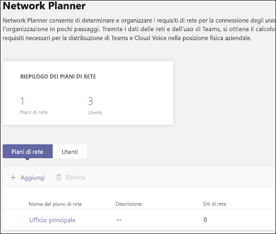
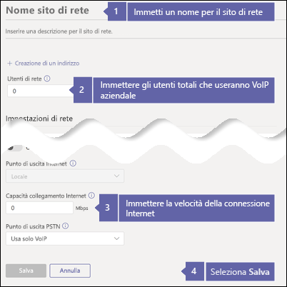
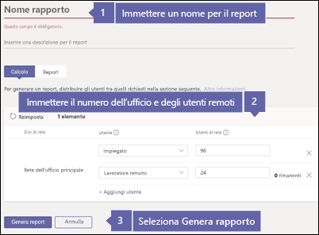
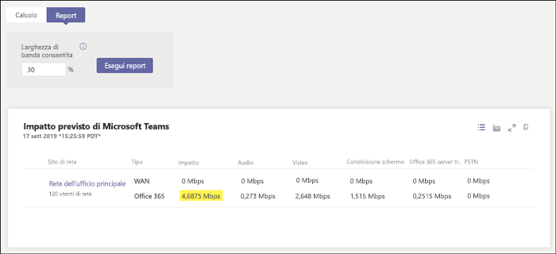

# Controllare la connessione Internet per Business Voice

VoIP aziendale si trova nel cloud con Microsoft 365. Ogni dispositivo che usa Microsoft Teams e Business Voice richiede una connessione a Internet.

Per un'esperienza ottimale di Business Voice, è necessaria una connessione Internet a banda larga in grado di supportare il numero massimo di chiamate telefoniche che verranno effettuate dall'organizzazione in qualsiasi momento. È anche necessario assicurarsi che i computer della rete possano accedere ai server Microsoft 365.

Per eseguire questa procedura, è necessario avere un tenant con uno degli abbonamenti seguenti:

* Office 365 Business Essentials
* Office 365 Business Premium
* Office 365 E1
* Office 365 E3
* Office 365 F1
* Microsoft 365 A1
* Microsoft 365 A3
* Microsoft 365 E3
* Microsoft 365 Business

Non è necessaria una licenza VoIP aziendale per eseguire questa procedura.

## Controllare la velocità della connessione Internet

Questo articolo illustra come determinare se la connessione Internet è abbastanza veloce per il numero di persone che devono effettuare chiamate telefoniche e organizzare videoconferenze. Fornendo alcune informazioni sull'organizzazione è possibile ottenere un report con la quantità di connessione Internet che verrà usata da Teams e da Business Voice.

### Raccogliere informazioni sulla connessione Internet e sugli utenti

Prima di iniziare, è necessario disporre delle informazioni seguenti:

* La velocità della connessione Internet
* Quante persone useranno Business Voice principalmente dall'ufficio
* Quante persone useranno Business Voice principalmente da una posizione remota, come un ufficio a casa

### Immettere le informazioni in Network Planner

Eseguire la procedura seguente:

1. Aprire un browser e passare a https://admin.teams.microsoft.com. Accedere con un account dotato di autorizzazioni di amministratore globale. L'account usato per iscriversi a Office 365 dispone di queste autorizzazioni.
2. Aprire **Pianificazione** e selezionare **Network Planner**.
3. In **Piani di rete** selezionare **Aggiungi**. Immettere un nome per il piano e quindi selezionare **Applica**. Il piano di rete dovrebbe essere simile a questo:

    
1. Selezionare il nome del piano di rete. Si tratta di **Ufficio principale** nell'immagine precedente.
2. Nella pagina successiva selezionare **Aggiungi un sito di rete** nella scheda **Siti di rete**.
3. Compilare solo i campi indicati nella schermata seguente e quindi selezionare **Salva**. Lasciare vuoti gli altri campi della schermata e non selezionare le opzioni **ExpressRoute** o **Connesso a WAN**.

    
1. Nella scheda **Report** selezionare **Avviare un report**.
1. Immettere le informazioni seguenti e quindi selezionare **Genera rapporto** per creare un report con i requisiti di larghezza di banda per Teams. Mostreremo come leggere il report nella sezione successiva.

    

### Trovare la velocità minima della connessione Internet

Dopo aver selezionato **Genera report**, Office 365 crea un report simile al seguente:

Il numero evidenziato indica la quantità di connessione Internet che Teams e VoIP aziendale useranno. Si consiglia di non superare il 30% della velocità totale della connessione Internet. Ad esempio, se la connessione Internet è di 60 Mbps, Teams e Business Voice non devono usare più di 18 Mbps.

Usare questa equazione per determinare la velocità della connessione Internet minima: *\<numero evidenziato> / 0,3*. Con il numero evidenziato nell'immagine precedente, il calcolo è il seguente: *4,6875 / 0,3 = 15,6*. In questo caso, la velocità della connessione Internet deve essere di almeno 15,6 Mbps.

Se Teams e Business Voice usano più del 30% della velocità totale della connessione Internet, il numero evidenziato verrà visualizzato in rosso. In questo caso, potrebbe essere necessario eseguire l'aggiornamento della connessione Internet.

## Assicurarsi che i computer e i dispositivi della rete possano raggiungere Microsoft 365

I computer e i dispositivi che usano Business Voice devono essere porte di rete specifiche per comunicare con i server di Microsoft 365. In poche parole, si tratta di porte che consentono ai dispositivi di comunicare tra di loro tramite una rete o Internet. Il firewall deve consentire ai dispositivi della rete di raggiungere Microsoft 365 usando le porte di rete *in uscita* seguenti:

* **porte TCP** 80 e 443
* **Porte UDP** 3478, 3479, 3480 e 3481

Il modo più semplice per verificare se il firewall consente la comunicazione tra queste porte di rete è quello di effettuare una chiamata di prova con Teams:

1. Passare a https://aka.ms/getteams in un computer della rete e installare Teams. Assicurarsi che il computer abbia un microfono e degli altoparlanti.
2. Aprire Teams ed eseguire l'accesso con un account Microsoft 365.
3. In Teams selezionare l'immagine del profilo, quindi passare a **Impostazioni** > **Dispositivi**.
4. In **Dispositivi audio**, selezionare **Effettua una chiamata di prova**.
5. Seguire la procedura visualizzata per inviare un messaggio e riascoltarlo.

   * Se la chiamata si connette e si sente il messaggio, il firewall è configurato correttamente.
   * Se la chiamata si connette, ma non si sentono le istruzioni o il messaggio, verificare che gli altoparlanti e il microfono siano configurati correttamente e riprovare.
   * Se la chiamata non si connette o se si connette ma non si sente il messaggio, potrebbe essere necessario aggiornare il firewall per autorizzare le porte di rete richieste. Consultare la documentazione del firewall o rivolgersi a un esperto IT per ricevere assistenza.

 Se si è un professionista IT e si vogliono ottenere altre informazioni su come preparare reti più grandi o complesse per supportare VoIP aziendale, vedere [Valutare l'ambiente](../3-envision-evaluate-my-environment.md). Questo articolo fornisce informazioni sui requisiti di larghezza di banda, proxy e firewall e su come usare lo [Strumento di valutazione della rete](../3-envision-evaluate-my-environment.md#test-the-network) per testare la rete.

