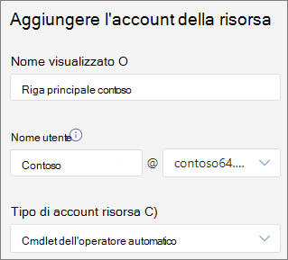
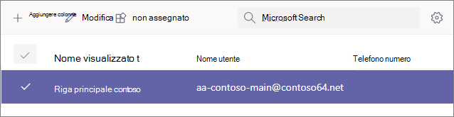

# Passaggio 4: Configurare un account della risorsa Voce aziendale

Gli account delle risorse non sono assegnati a un utente specifico. Gli account delle risorse, che usano una licenza utente virtuale gratuita, vengono invece usati dai dispositivi e dai servizi in Microsoft 365. In Microsoft Teams, agli account delle risorse vengono assegnati numeri di telefono e quindi associati agli operatori automatici e alle code di chiamata.

Associando gli account delle risorse agli operatori automatici e alle code di chiamata, è possibile aggiungere uno o più numeri a numero verde o a pedaggio. Ad esempio, è possibile associare un account della risorsa a un numero a pedaggio a un operatore automatico per i chiamanti locali. Per le chiamate interurbane, è possibile associare un altro account della risorsa a un numero verde allo stesso operatore automatico.

Le sezioni di questo articolo illustrano come configurare un account della risorsa e quindi assegnare un numero di telefono. In seguito, l'account della risorsa verrà associato a un operatore automatico.

Il video seguente mostra come completare questi passaggi nell'interfaccia Teams di amministrazione.

> [!VIDEO https://www.microsoft.com/videoplayer/embed/RE4OFYG]

## Ottenere licenze utente virtuali

Gli account delle risorse richiedono una licenza per poter usare operatori automatici e code di chiamata. È possibile usare una licenza *Microsoft 365 Sistema telefonico - Utente* virtuale gratuita.

> [!NOTE]
> È necessario eseguire la procedura seguente solo se si è effettuato l'accesso a un periodo di valutazione di Business Voice. Se sono state acquistate licenze Business Voice, le licenze virtuali dovrebbero essere già applicate al proprio account. 
>
> Per verificare se si hanno già licenze virtuali, accedere Microsoft 365 un account con autorizzazioni di amministratore globale. Quindi vai a Fatturazione > [Tuoi prodotti](https://admin.microsoft.com/Adminportal/Home#/subscriptions). Se si hanno licenze virtuali, verranno visualizzate **come Microsoft 365 Sistema telefonico - Utente virtuale.**

1. Aprire il interfaccia di amministrazione di Microsoft 365 e accedere con un utente che è un amministratore globale (in genere si tratta dell'account usato per iscriversi per Microsoft 365).
2. Nel riquadro di spostamento sinistro passare a <a href="https://admin.microsoft.com/Adminportal/Home#/catalog" target="_blank"> **Componenti**  > </a>aggiuntivi Servizi di acquisto  >  **fatturazione**  >  **Vedere tutti i prodotti aggiuntivi.**
3. Scorrere fino alla fine per trovare la licenza **Microsoft 365 Sistema telefonico - Utente** virtuale. Seleziona **Dettagli**, quindi **Acquista**.
4. Nella pagina di acquisto della licenza selezionare il numero di licenze utente virtuali desiderate. È necessaria una licenza virtuale per ogni operatore automatico e coda di chiamata che si prevede di configurare. È consigliabile selezionare almeno cinque licenze per configurare più operatori automatici e code di chiamata in futuro senza dover acquistare subito altre licenze.
5. Deselezionare **Assegna automaticamente a tutti gli utenti senza licenze.**
6. Selezionare **Estrai adesso.**
7. Confermare l'ordine, **selezionare Avanti** e quindi **Eseguire l'ordine.**

> [!NOTE]
> Tenere presente che è comunque necessario  **acquistare** la licenza anche se ha un costo pari a zero.

## Creare un account della risorsa

Dopo aver ricevuto la licenza *Microsoft 365 Sistema telefonico - Utente* virtuale, è possibile creare l'account delle risorse.

1. Aprire l'Microsoft Teams di amministrazione e accedere con un utente che è un amministratore globale (in genere si tratta dell'account usato per iscriversi per Microsoft 365).
2. Nel riquadro di spostamento sinistro passare a <a href="https://admin.teams.microsoft.com/company-wide-settings/resource-accounts" target="_blank"> **Impostazioni a livello di** organizzazione Account delle  >  **risorse.**</a>
3. Selezionare **Aggiungi**.
4. Nel riquadro **Aggiungi account risorsa** compilare Nome **visualizzato** e quindi **Nome utente.** Scegliere un nome visualizzato descrittivo, ad esempio "Operatore automatico linea principale" per descrivere lo scopo dell'account della risorsa.
5. In **Tipo di account risorsa** selezionare **Operatore automatico.**
6. Selezionare **Salva**.

## Assegnare una licenza

Dopo aver creato l'account delle risorse, è necessario assegnare una licenza *Microsoft 365 Sistema telefonico -* Utente virtuale o Sistema telefonico *licenza.*

1. Aprire il interfaccia di amministrazione di Microsoft 365 e accedere con un utente che è un amministratore globale (in genere si tratta dell'account usato per iscriversi per Microsoft 365).
1. Nel riquadro di spostamento sinistro passare a <a href="https://admin.microsoft.com/Adminportal/Home#/users" target="_blank"> **Utenti**  >  **utenti attivi**</a>.
1. Selezionare l'account della risorsa.
1. Nella scheda **Licenze e app,** in **Licenze,** **selezionare Microsoft 365 Sistema telefonico - Utente virtuale**.
1. Selezionare **Salva modifiche** e quindi **Chiudi.**

## Assegnare un numero di servizio

1. Aprire l'Microsoft Teams di amministrazione e accedere con un utente che è un amministratore globale (in genere si tratta dell'account usato per iscriversi per Microsoft 365).
1. Nel riquadro di spostamento sinistro passare a <a href="https://admin.teams.microsoft.com/company-wide-settings/resource-accounts" target="_blank"> **Impostazioni a livello di** organizzazione Account delle  >  **risorse.**</a>
1. Selezionare l'account della risorsa appena creato e quindi fare clic su **Assegna/annulla assegnazione.**
1. **Nell'Telefono tipo di numero scegliere** **Online.**
1. Nella casella **Numero di telefono assegnato** cercare il numero da usare e fare clic su **Aggiungi.** Assicurarsi di includere il codice paese ,ad esempio **+1** 250 555 0012
1. Fare clic su **Salva**.

> [!div class="nextstepaction"]
> [Passaggio successivo: Assegnare numeri di telefono agli utenti](set-up-assign-numbers.md)
