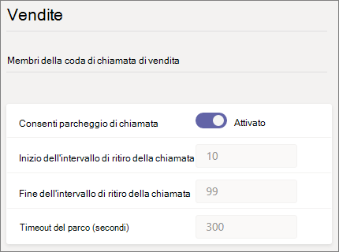
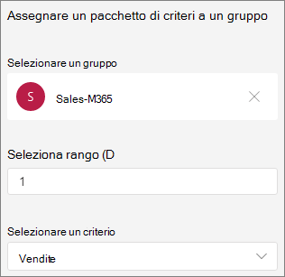

# Parcheggio di chiamata e recupero in Microsoft Teams

Il parcheggio di chiamata e il recupero è una funzionalità che consente a un utente di mettere una chiamata in attesa. Quando una chiamata è parcheggiata, il servizio genera un codice univoco per il recupero delle chiamate. L'utente che ha parcheggiato la chiamata o qualcun altro può quindi usare il codice con un'app o un dispositivo supportato per recuperare la chiamata. Per informazioni [dettagliate, vedere](https://support.office.com/article/park-a-call-in-teams-8538c063-d676-4e9a-8045-fc3b7299bb2f) Parcheggiare una chiamata in Teams.

Alcuni degli scenari comuni per l'uso del parcheggio di chiamata sono:

- Un addetto alla reception parcheggia una chiamata per qualcuno che lavora in una fabbrica. L'addetto alla ricezione annuncia quindi la chiamata e il numero di codice sul sistema di indirizzi pubblici. L'utente per cui è stata chiamata può quindi prendere un telefono Teams telefono nella fabbrica e immettere il codice per recuperare la chiamata.
- Un utente parcheggia una chiamata su un dispositivo mobile perché la batteria del dispositivo è in esaurimento. L'utente può quindi immettere il codice per recuperare la chiamata da un Teams da tavolo.
- Un rappresentante del supporto parcheggia una chiamata del cliente e invia un annuncio su un canale Teams per consentire a un esperto di recuperare la chiamata e aiutare il cliente. Un esperto immette il codice in Teams client per recuperare la chiamata

Per parcheggiare e recuperare le chiamate, un utente deve essere un VoIP aziendale utente e deve essere incluso in un criterio di parcheggio di chiamata.

> [!NOTE]
> Il parcheggio di chiamata e il recupero sono disponibili solo in [Teams modalità](teams-and-skypeforbusiness-coexistence-and-interoperability.md) di distribuzione e non sono supportati nei telefoni IP Skype for Business telefoni IP.

## Configurare il parcheggio di chiamata e recuperare

È necessario essere un amministratore Teams per configurare il parcheggio di chiamata e recuperare. È disabilitato per impostazione predefinita. È possibile abilitarlo per gli utenti e creare gruppi di utenti usando i criteri di parcheggio di chiamata. Quando si applicano gli stessi criteri a un set di utenti, possono parcheggiare e recuperare le chiamate tra loro.

Per impostazione predefinita, l'intervallo di numeri di ritiro delle chiamate è compreso tra 10 e 99. È anche possibile creare un intervallo personalizzato compreso tra 10 e 9999. La prima chiamata parcheggiata verrà resa un codice di ritiro dell'inizio dell'intervallo (ad esempio 10). La chiamata parcheggiata successiva verrà resa un codice di ritiro incrementato di 1; cio, 11 e così via, finché la fine dell'intervallo non viene resa come codice di ritiro. Dopo di che, i codici di ritiro di cui è stato eseguito il rendering ricominciano dall'inizio dell'intervallo. 

È possibile specificare un timeout come numero di secondi di attesa prima di squillare quando la chiamata parcheggiata non è stata ritirata. L'intervallo consentito è compreso tra 120 e 1800 secondi e il valore predefinito è 300 secondi.

Per impostare l'intervallo del parco personalizzato e il timeout del parco, usare i cmdlet New e Set-CsTeamsCallParkPolicy disponibili nel modulo di PowerShell 2.6.0 o versione successiva di Teams. Le modifiche all'intervallo del parco personalizzato e al timeout del parco non sono gestibili nell'Teams di amministrazione. Si noti che Teams'interfaccia di amministrazione continuerà a visualizzare i valori predefiniti.

Per abilitare un criterio di parcheggio di chiamata:

1. Nel riquadro di spostamento sinistro dell'interfaccia Microsoft Teams di amministrazione, passare a **Criteri**  >  **del parco chiamate vocali.**
2. Nella scheda **Gestisci criteri** fare clic su **Aggiungi.**
3. Assegnare un nome al criterio e quindi impostare **Consenti parcheggio di chiamata** su **Attivata.** Non è possibile personalizzare l'intervallo di risposta e il timeout della chiamata.

    

4. Selezionare **Salva**.

È possibile modificare il criterio selezionandolo nell'elenco e facendo clic su **Modifica**.

Per il corretto funzionamento del criterio, è necessario assegnarlo agli utenti. È possibile [assegnare il criterio agli utenti singolarmente](assign-policies-users-and-groups.md) o assegnarli a un gruppo.

Per assegnare un criterio di parcheggio di chiamata a un gruppo

1. Nella scheda **Assegnazione Criteri di** gruppo della pagina Criteri di parcheggio **di** chiamata fare clic su **Aggiungi gruppo.**
2. Cercare il gruppo da usare e quindi fare clic su **Aggiungi**.
3. Scegliere un rango rispetto ad altre assegnazioni di gruppo.
4. In **Selezionare un criterio** scegliere il criterio a cui si vuole assegnare il gruppo.

    

5. Selezionare **Applica**.

## Argomenti correlati

[Parcheggiare una chiamata in Teams](https://support.office.com/article/park-a-call-in-teams-8538c063-d676-4e9a-8045-fc3b7299bb2f)

[Assegnare i criteri agli utenti in Teams](policy-assignment-overview.md)

[New-CsTeamsCallParkPolicy](/powershell/module/skype/new-csteamscallparkpolicy)

[Set-CsTeamsCallParkPolicy](/powershell/module/skype/set-csteamscallparkpolicy)

[Grant-CsTeamsCallParkPolicy](/powershell/module/skype/grant-csteamscallparkpolicy)
