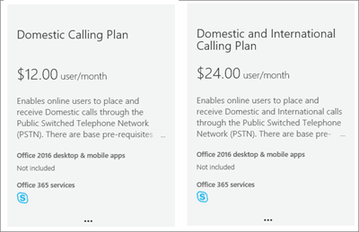

# Piani di chiamata per Microsoft 365Calling Plans for Microsoft 365

Le chiamate ad altri utenti di Skype for business e Microsoft teams sono gratuite, ma se si vuole che gli utenti possano chiamare telefoni normali e non si dispone già di un provider di servizi per effettuare chiamate vocali, è necessario acquistare un piano di chiamata.Calls to other Skype for Business and Microsoft Teams users are free, but if you want your users to be able to call regular phones, and you don't already have a service provider to make voice calls, you need to buy a Calling Plan. Per altre informazioni, vedere [sistema telefonico e piani per chiamate](calling-plan-landing-page.md).For more information, see [Phone System and Calling Plans](calling-plan-landing-page.md).
  
Ecco le opzioni per i piani di chiamata:Here are the Calling Plans options:
  
- **Piano per chiamate nazionali**: gli utenti con licenza possono chiamare i numeri che si trovano nel paese/area geografica in cui sono assegnati in Office 365.**Domestic Calling Plan**: Licensed users can call out to numbers located in the country/region where they are assigned in Office 365.
    
- **Piano per chiamate nazionali e internazionali**: gli utenti con licenza possono chiamare i numeri che si trovano nel paese/area geografica in cui la licenza di Office 365 è assegnata all'utente in base alla posizione dell'utente e ai numeri internazionali in [196 paesi/aree geografiche](country-and-region-availability-for-audio-conferencing-and-calling-plans/users-can-make-outbound-calls-to-these-countries-and-regions.md).**Domestic and International Calling Plan**: Licensed users can call out to numbers located in the country/region where their Office 365 license is assigned to the user based on the user's location, and to international numbers in [196 countries/regions](country-and-region-availability-for-audio-conferencing-and-calling-plans/users-can-make-outbound-calls-to-these-countries-and-regions.md).
    
Per informazioni sui minuti mensili disponibili per ogni organizzazione in ogni paese/area geografica, vedere [disponibilità di paesi e aree](country-and-region-availability-for-audio-conferencing-and-calling-plans/country-and-region-availability-for-audio-conferencing-and-calling-plans.md) geografiche.Visit [Country and region availability](country-and-region-availability-for-audio-conferencing-and-calling-plans/country-and-region-availability-for-audio-conferencing-and-calling-plans.md) to find out about monthly minutes available for each organization in each country/region.
  
> [!IMPORTANT]
> Il paese/area geografica si basa sulla posizione della licenza dell'utente negli > **utenti attivi** dell'interfaccia di **amministrazione di Microsoft 365**e **non** sull'indirizzo di fatturazione elencato nel **profilo dell'organizzazione** nell'area di **amministrazione di Microsoft 365**.The country/region is based on the location of the user's license in the **Microsoft 365 admin center** > **Active users** and **NOT** the billing address listed under the **Organization Profile** in the **Microsoft 365 admin center**.   

  
Per informazioni dettagliate sui limiti di utilizzo e sulle condizioni per l'utilizzo, vedere il [periodo di chiamata gratuita per](complimentary-dial-out-period.md)i servizi di audioconferenza.For detailed information about usage limits and terms of use, see [Audio Conferencing complimentary dial-out period](complimentary-dial-out-period.md).
  
## Come acquistare un piano di chiamataHow to buy a Calling Plan

1. <strong>Devi prima acquistare una</strong> licenza per il componente aggiuntivo \* \* Phone System<strong>. A questo scopo, [Accedi all'interfaccia di amministrazione di Microsoft 365](https://portal.office.com/adminportal/home?add=sub&amp;adminportal=1#/catalog) e scegli \* \*</strong> > **Purchase services** >  > **abbonamenti per i componenti aggiuntivi per**l'acquisto di servizi di fatturazione**Acquista ora**.<strong>You must first purchase a \*\*Phone System</strong> add-on license<strong>. To do that, [sign into the Microsoft 365 admin center](https://portal.office.com/adminportal/home?add=sub&amp;adminportal=1#/catalog) and choose \*\*Billing</strong> > **Purchase services** > **Add-on subscriptions** > **Buy now**.
    
    
  
    > [!NOTE]
    > A seconda del piano, potrebbe essere necessario acquistare altri componenti aggiuntivi prima di poter acquistare licenze per il sistema telefonico.Depending on your plan, you may need to buy more add-ons before you can buy Phone System licenses. Per altre informazioni, vedere "opzioni di licenza basate sul piano" in [licenze per i componenti aggiuntivi Microsoft teams](teams-add-on-licensing/microsoft-teams-add-on-licensing.md).To learn more, see "License options based on your plan" in [Microsoft Teams add-on licensing](teams-add-on-licensing/microsoft-teams-add-on-licensing.md).
  
2. Dopo aver acquistato le licenze di sistema telefonico, è possibile acquistare il piano per le chiamate effettuando l'accesso all'interfaccia di **amministrazione di Microsoft 365**, scegliere**abbonamenti per i componenti aggiuntivi**per l'**acquisto di servizi** > di **fatturazione** > e quindi fare clic su **Acquista ora**.After you buy Phone System licenses, you can buy the Calling Plan by signing in to the **Microsoft 365 admin center**, choose **Billing** > **Purchase services** > **Add-on subscriptions**, and then clicking **Buy now**. Verranno visualizzati i piani per le chiamate.You'll see the Calling Plans there.
    
    
  
È possibile acquistare e assegnare piani di chiamata diversi a utenti diversi, a seconda delle esigenze dell'organizzazione.You can buy and assign different Calling Plans to different users, depending on the needs of your organization. Dopo aver selezionato il piano di chiamata necessario, procedere con l'estrazione.After you select the Calling Plan you need, proceed to checkout. Si assegna un piano a ogni utente nell'interfaccia di amministrazione di Microsoft 365.You assign a plan to each user in the Microsoft 365 admin center. Per informazioni, vedere [assegnare le licenze di Microsoft teams](assign-teams-licenses.md).To learn how, see [Assign Microsoft Teams licenses](assign-teams-licenses.md).
  
## Si dispone di un provider di servizi che offre connettività PSTN locale per gli utenti ibridi?Do you have a service provider that provides on-premises PSTN connectivity for hybrid users?

In caso affermativo, non è necessario acquistare un piano per le chiamate.If so, you don't need to buy a Calling Plan. Office 365 Enterprise E5 include il componente aggiuntivo per il **sistema telefonico** , quindi è possibile procedere con l'estrazione.Office 365 Enterprise E5 includes the **Phone System** add-on, so you can proceed to checkout.
  
Assegna quindi le licenze per i componenti aggiuntivi Enterprise E5 o **Phone System** agli utenti nell'interfaccia di amministrazione di Microsoft 365.Then, assign the Enterprise E5 or **Phone System** add-on licenses to users in the Microsoft 365 admin center. Per informazioni, vedere [assegnare le licenze di Microsoft teams](assign-teams-licenses.md).To learn how, see [Assign Microsoft Teams licenses](assign-teams-licenses.md).
  
## Informazioni sui prezziPricing information

- [Prezzi per Piani di chiamataPricing for Calling Plans](https://go.microsoft.com/fwlink/?LinkId=799761)
    
- [Tariffe del Sistema telefonicoPricing for Phone System](https://go.microsoft.com/fwlink/?linkid=799763)
    
- [Prezzi per AudioconferenzaPricing for Audio Conferencing](https://go.microsoft.com/fwlink/?linkid=799762)
    
## Per altre informazioniFor more information

Ecco altri articoli che spiegano come configurare i piani per le chiamate:Here are more articles that explain how to set up your Calling Plans:
  
- [Configurare i piani per chiamateSet up Calling Plans](set-up-calling-plans.md)
    
- [Licenze per i componenti aggiuntivi di Microsoft TeamsMicrosoft Teams add-on licensing](teams-add-on-licensing/microsoft-teams-add-on-licensing.md)
    
- [Ecco cosa offre il Sistema telefonico in Office 365Here's what you get with Phone System in Office 365](https://docs.microsoft.com/MicrosoftTeams/here-s-what-you-get-with-phone-system)
    
   
## Argomenti correlatiRelated topics

- [Configurare Skype for Business onlineSet up Skype for Business Online](/SkypeForBusiness/set-up-skype-for-business-online/set-up-skype-for-business-online)
    
- [Configurare Cloud Voicemail - Guida per gli amministratoriSet up Cloud Voicemail - Admin help](set-up-phone-system-voicemail.md)
    
- [Configurare i piani per chiamateSet up Calling Plans](set-up-calling-plans.md)
    
- [Aggiungere fondi e gestire Credito per la comunicazioneAdd funds and manage Communications Credits](add-funds-and-manage-communications-credits.md)
 
