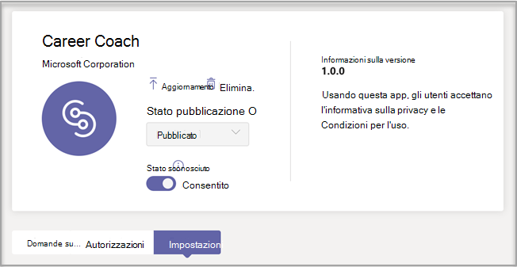
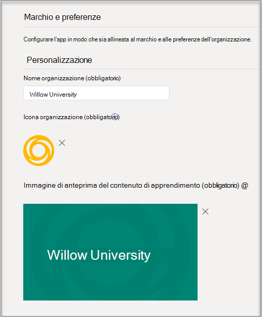

# Acquistare, configurare e abilitare Career Coach per Microsoft Teams

Career Coach è un'app Microsoft Teams per l'istruzione basata su LinkedIn che fornisce indicazioni personalizzate per gli studenti dell'istruzione superiore per esplorare il percorso di carriera. Career Coach offre agli istituti di istruzione una soluzione di carriera unificata per gli studenti per scoprire il percorso di carriera, sviluppare competenze reali e creare la propria rete in un'unica posizione.

Altre informazioni su [Career Coach](https://aka.ms/career-coach).

> [!NOTE]
> Usare le procedure consigliate e i suggerimenti utili in questa guida per abilitare le funzionalità di Career Coach per studenti, docenti e personale. Vedere [l'articolo Guida alla pianificazione](https://support.microsoft.com/office/c5d0b934-bfcf-4fe7-8a85-ba7bbb1b6ad4) rapida.

## Esaminare i requisiti

Per abilitare Career Coach per il tuo istituto di istruzione, controlla cosa ti serve per attivare l'app.

**Requisiti tecnici**

  - Office 365 tenant con Azure Active Directory

  - Microsoft Teams

  - Connessioni all'account LinkedIn in Azure Active Directory

**Licenze**

  - Facoltà 

  - Studenti

> [!NOTE]
> Una licenza Career Coach Faculty deve essere assegnata all'amministratore IT che completa la configurazione.

**Dati e file dell'istituto di istruzione**

  - Dati del catalogo dei corsi

  - Campi di studio offerti

  - Pagina LinkedIn dell'istituto di istruzione

  - Abbonamento al campus di LinkedIn Learning (preferito)

## Acquistare le licenze career coach

Career Coach è disponibile in tutto il mondo (ad eccezione della Cina e della Russia) per istituti di istruzione superiore qualificati tramite Enrollment for Education Solutions (EES), Cloud Service Providers (CSP) e Microsoft 365 admin center (web direct). Come app Microsoft Teams, i clienti devono avere Microsoft 365 A3/A5 o Office 365 A1/A3/A5.

### Assegnare licenze per le app agli utenti

Per istruzioni dettagliate, vedere [Assegnare licenze agli utenti.](/microsoft-365/admin/manage/assign-licenses-to-users)

### Attivare le connessioni all'account LinkedIn

Career Coach **richiede agli** utenti dell'istituto di istruzione di avere la possibilità di connettere il proprio account Microsoft 365 al proprio account LinkedIn, agevolato all'interno di Career Coach

1. Accedere [all'interfaccia di amministrazione di Azure AD](https://aad.portal.azure.com/) con un account amministratore globale per l'organizzazione di Azure AD.

2. Selezionare **Utenti**.

3. Nella pagina **Utenti** selezionare **Impostazioni utente.**

4. In **Connessioni account LinkedIn** consentire agli utenti di connettere i propri account per accedere alle connessioni LinkedIn all'interno di alcune app Microsoft. Nessun dato viene condiviso finché gli utenti non acconsenteno a connettere i loro account.

   - Selezionare **Sì** per abilitare il servizio per tutti gli utenti dell'istituto di istruzione

   - Selezionare **Gruppo selezionato per** abilitare il servizio solo per un gruppo di utenti selezionati nell'istituto di istruzione

   - Selezionare **No per** revocare il consenso a tutti gli utenti dell'istituto di istruzione

Informazioni su come [integrare le connessioni degli account LinkedIn in Azure Active Directory](/azure/active-directory/enterprise-users/linkedin-integration)

## Configurare Career Coach nell'interfaccia Teams di amministrazione

Usando le impostazioni di amministrazione nell'Microsoft Teams di amministrazione, è possibile configurare Career Coach per l'istituto di istruzione e abilitarlo per gli utenti.

## Accedere alle impostazioni dell'app Career Coach

Usare la [pagina Gestisci app per](/microsoftteams/manage-apps) visualizzare le app Teams nel catalogo app dell'istituto di istruzione.

1. Accedere all'interfaccia **Teams di amministrazione.**

2. Nel riquadro di spostamento sinistro selezionare Teams  >  **app Gestisci app.**  

    > [!NOTE]
    > Per accedere alla pagina, è necessario essere un amministratore globale o Teams del servizio.

3. Cercare o cercare **Career Coach**.  

4. Selezionare **Career Coach** e quindi selezionare **Impostazioni.**  

    

### Configurare le impostazioni dell'app Career Coach

Career Coach ha cinque categorie di configurazione:

- [Marchio e preferenze](#brand-and-preferences)

- [Configurazione di LinkedIn](#linkedin-configuration)

- [Catalogo dei corsi](#course-catalog)

- [Campi di studio](#fields-of-study)

- [Personalizzazione](#customization)

> [!NOTE]
> Il marchio e le preferenze, la configurazione di  LinkedIn, il catalogo dei corsi e i campi di studio sono necessari per abilitare in modo efficace l'app per studenti, docenti e personale.

#### Marchio e preferenze

Impostare il nome, il logo e la lingua predefinita dell'istituto di istruzione nella pagina delle impostazioni del marchio e delle preferenze.

##### Icona dell'istituto di istruzione

L'icona dell'istituto di istruzione viene usata in Career Coach per identificare contenuti univoci per l'istituto di istruzione, le risorse del catalogo dei corsi in tutta l'app e nella sezione esperienze reali del dashboard. L'icona è formattata nel modo seguente:

 - PNG trasparente
 - Proporzioni di 1:1
 - Dimensioni massime di 64 px x 64 px.

##### Anteprima dell'istituto di istruzione

L'icona dell'istituto di istruzione verrà usata per le risorse del catalogo dei corsi in tutta l'app quando un'immagine specifica non è disponibile per un corso. L'icona è formattata nel modo seguente:

- Un PNG
- Proporzioni di 16:9
- Dimensioni massime di 360 px x 200 px.

#### Configurazione di LinkedIn

La configurazione di LinkedIn connette Career Coach ai dati degli ex allievi pubblici di LinkedIn.

> [!NOTE]
> Career Coach non può essere abilitato senza la verifica della connessione alla pagina LinkedIn.

##### Aggiungere e confermare la pagina LinkedIn

Determinare la pagina LinkedIn dell'istituto di istruzione. Trovare la pagina LinkedIn cercando su LinkedIn o connettendosi con un membro del personale dei servizi professionali per determinare la pagina corretta da usare.  
  
1. Accedere all'interfaccia **Teams di amministrazione.**

1. Selezionare **Teams app gestisci** le  >  **app** Career  >  **Coach** Connessione  >  **LinkedIn**.

2. Immettere l'URL della pagina LinkedIn dell'istituto di istruzione.  

3. Selezionare **Applica**.

4. Copiare l'URL di verifica e condividerlo con la documentazione dell'amministratore della pagina LinkedIn dell'istituto [didattico.](https://www.linkedin.com/help/linkedin/answer/4783/linkedin-page-admins-overview?lang=en) Il collegamento di verifica scade dopo 30 giorni.  

     

#### Catalogo dei corsi

Il catalogo dei corsi rappresenta i corsi e le classi offerti agli studenti dall'istituto di istruzione. Questi corsi vengono usati all'interno dell'app in due aree:

- I corsi vengono restituiti come parte delle risorse di apprendimento.  

- I corsi e i metadati del corso, come le descrizioni, vengono usati per aiutare gli studenti a identificare le proprie competenze quando caricano una trascrizione.  

Per creare il catalogo dei corsi, creare un elenco di tutti i corsi insegnati presso l'istituto di istruzione e caricarlo come file CSV. L'app attinge dal catalogo dei corsi per identificare le competenze di uno studente dalla trascrizione e per suggerire corsi da intraprendere. 

##### Formattazione e schema dei documenti del catalogo dei corsi

Il documento deve essere in formato CSV con una dimensione massima di 18 MB. Il documento deve contenere i campi obbligatori titolo del **corso,** **ID corso** e URL **del corso.** L'inclusione dei campi consigliati migliora l'esperienza degli studenti grazie alla restituzione di risultati di ricerca migliori e di identificazione delle competenze.

> [!NOTE]
> Iniziare con il [documento di catalogo del]( https://aka.ms/career-coach/docs/it-admins/sample-catalog) corso di esempio per iniziare.

La tabella seguente mostra gli elementi da includere nel catalogo dei corsi:

| Nome             | Stato      | Tipo   | Descrizione                                                                    |
|------------------|-------------|--------|--------------------------------------------------------------------------------|
| courseId         | Obbligatorio    | stringa | In genere l'ID del corso (in genere è associato a ciò che viene generato nella trascrizione). |
| titolo            | Obbligatorio    | stringa | In genere il titolo del corso.                                                      |
| sourceLink       | Obbligatorio    | URL    | Collegamento sito Web alla pagina del corso.                                               |
| descrizione      | Scelta consigliata | stringa | Testo introduttivo per il corso.                                              |
| lingua         | Scelta consigliata | stringa | Lingua del corso. Usare i codici lingua standard.                           |
| formato           | Scelta consigliata | stringa | Modalità di insegnamento, ad esempio online, video, di persona.                              |
| thumbnailLink    | Scelta consigliata | URL    | Collegamento anteprima all'immagine del corso.                                            |
| thumbnailAltText | Scelta consigliata | stringa | Testo alternativo per l'accessibilità per l'immagine                                           |
| educationLevel   | Scelta consigliata | stringa | Livello di studio, ad esempio. Laureato/laureato.                                       |
| argomenti           | Scelta consigliata | stringa | Argomenti o tag associati alle competenze insegnate nei corsi.          |

##### Aggiungere il catalogo dei corsi

1. Accedere all'interfaccia **Teams di amministrazione.**

1. Selezionare **Teams app Gestisci** &gt; **app** &gt; **Career Coach** &gt; **Impostazioni** &gt; **Catalogo corsi.**  

2. Upload corsi in formato CSV.

4. Selezionare **Applica**.

   

#### Campi di studio

I campi di studio sono sinonimi di importanti aree di interesse, di laurea e di laurea. Questi titoli fanno riferimento agli studenti quando iniziano a usare l'app e iniziano a configurare il proprio profilo personalizzato.

Aggiungere tutti i campi di studio disponibili per gli studenti, ad esempio Ingegneria, Inglese, Business e così via. L'elenco dei campi consente agli studenti di individuare i campi di studio che potrebbero interessarli e di aggiungere l'area di interesse al proprio profilo.

> [!NOTE]
> Iniziare con il [campo di esempio del documento di](https://aka.ms/career-coach/docs/it-admins/sample-fieldsofstudy) studio.
##### Aggiungere i campi di studio

1. Accedere all'interfaccia **Teams di amministrazione.**
1. Selezionare **Teams app Gestisci** &gt; **app** &gt; **Career Coach** &gt; **Impostazioni** campi &gt; **di studio**.  

2. Upload di studio in formato CSV.

3. Selezionare **Applica**.

#### Personalizzazione

Career Coach può essere personalizzato in modo da essere univoco per il tuo istituto di istruzione. La personalizzazione supporta l'aggiunta di esperienze al dashboard. È consigliabile aggiungere collegamenti a bacheche di lavoro, eventi, servizi di carriera, eventi correlati alla carriera, club di studenti e qualsiasi altra risorsa che aiuti gli studenti a acquisire esperienza reale.

##### Aggiungere esperienze personalizzate

1. Accedere all'interfaccia **Teams di amministrazione.**

1. Selezionare **Teams app Gestisci** &gt; **app** &gt; **Career Coach**  >  **Impostazioni** &gt; **personalizzazione**.

2. Aggiungere ogni URL, un titolo e una breve descrizione.  
  
3. Selezionare **Applica**.

## Rendere disponibile Career Coach per l'organizzazione

Ora che Career Coach è stato configurato per la tua organizzazione. Seguire questa procedura per assicurarsi che Career Coach sia disponibile per l'organizzazione in Microsoft Teams.

### Abilitare l'app

Dopo aver completato la configurazione, abilitare l'app per gli studenti e gli utenti con licenza in modo che abbia accesso a Career Coach.  
  
> [!NOTE]
> È necessario avere autorizzazioni di amministratore globale o Teams di amministratore.

1. Accedere all'interfaccia **Teams di amministrazione.**

1. Selezionare **Teams app Gestisci** &gt; **app** Career &gt; **Coach**.

2. Spostare l'interruttore Stato su **Consentito**.  

  > [!NOTE]
  > Consentito significa che l'app è disponibile per gli utenti dell'istituto di istruzione. Bloccato significa che l'app non è disponibile per gli studenti.

### Aggiungere Career Coach come app installata

> [!NOTE]
> Questo passaggio assicura 1) che Career Coach sia configurato correttamente per l'organizzazione 2) che gli studenti trovino Career Coach.

1. Accedere all'interfaccia **Teams di amministrazione.**

2. Selezionare **Teams criteri di configurazione** delle &gt; **app** &gt; *.* 

3. In App installate selezionare Aggiungi app.

4. Nel riquadro Aggiungi app installate cercare le app da installare automaticamente per gli utenti all'avvio Teams. È anche possibile filtrare le app in base ai criteri di autorizzazione delle app. Dopo aver scelto l'elenco di app, selezionare Aggiungi.

### Aggiungere l'app

L'aggiunta di Career Coach rende l'app più accessibile e visibile per gli studenti.

1. Accedere all'interfaccia **Teams di amministrazione.**

2. Selezionare **Teams criteri di configurazione** delle &gt; **app** &gt; *.* 

3. In **App aggiunte** scegliere Aggiungi **app.**

4. Cerca **Career Coach** e quindi seleziona **Aggiungi**.

5. Scegliere l'ordine in cui visualizzare l'app e selezionare **Salva.**

> [!NOTE]
> Gli studenti riceveranno una notifica Microsoft Teams che Career Coach è stato aggiunto.

Riferimento [Gestire i criteri di configurazione delle app in Microsoft](/microsoftteams/teams-app-setup-policies) per altri dettagli.

## Risorse

Le risorse seguenti ti aiuteranno a pianificare l'app Career Coach.

- [Benvenuto in Microsoft Teams](Teams-overview.md)

- [Come implementare Teams](get-started-with-teams-resources-for-org-wide-rollout.md?tabs=SmallBusiness)

- [Panoramica dei team e i canali in Microsoft Teams](teams-channels-overview.md)

- [Gestione delle app nell'Microsoft Teams di amministrazione](manage-apps.md)

- [Kit di orientamento virtuale online](https://www.microsoft.com/education/remote-learning/virtual-orientation) 

- [Limiti e specifiche dei Teams canali](limits-specifications-teams.md)

- [Guida introduttiva alla formazione per gli amministratori per Microsoft Teams](ITAdmin-readiness.md)

- [Risoluzione dei problemi di Teams](/microsoftteams/troubleshoot/teams-welcome)

- [Gestire i criteri di autorizzazione app in Microsoft Teams](teams-app-permission-policies.md)
