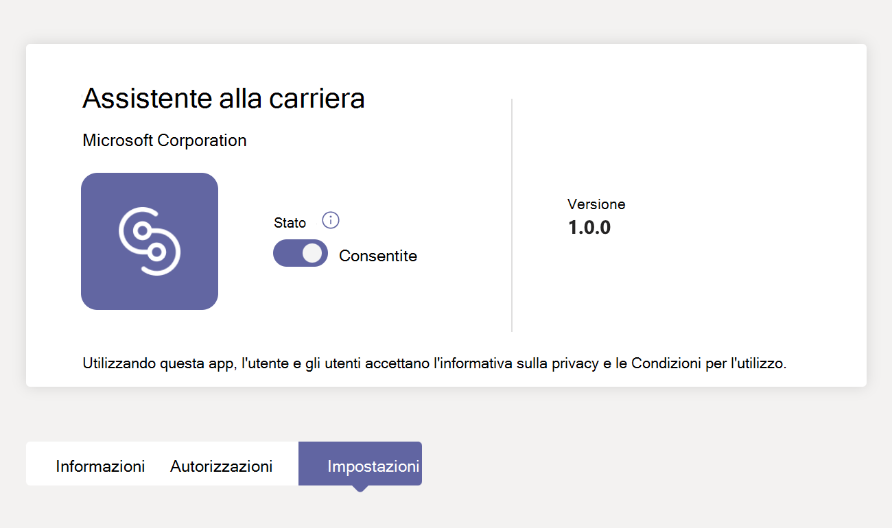
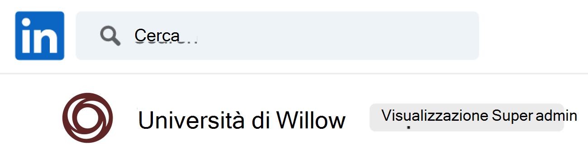
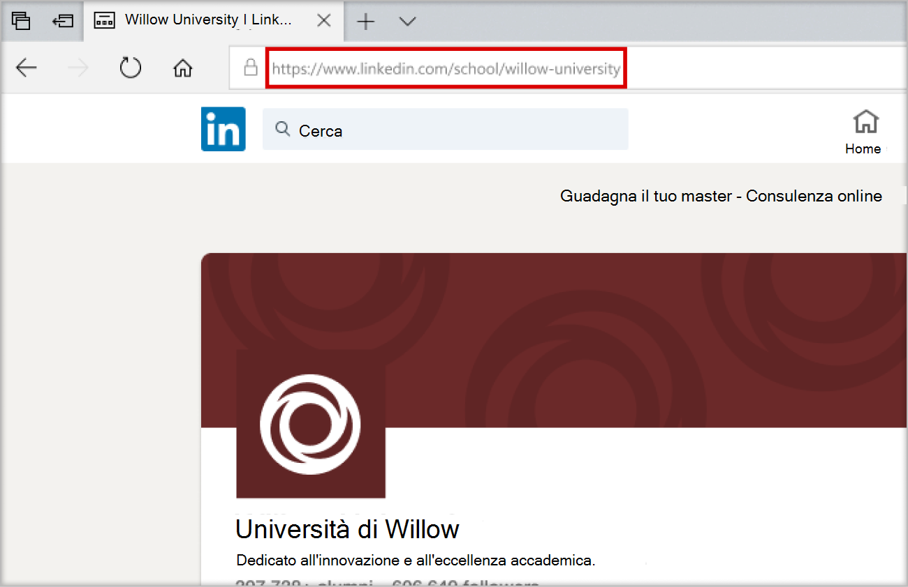
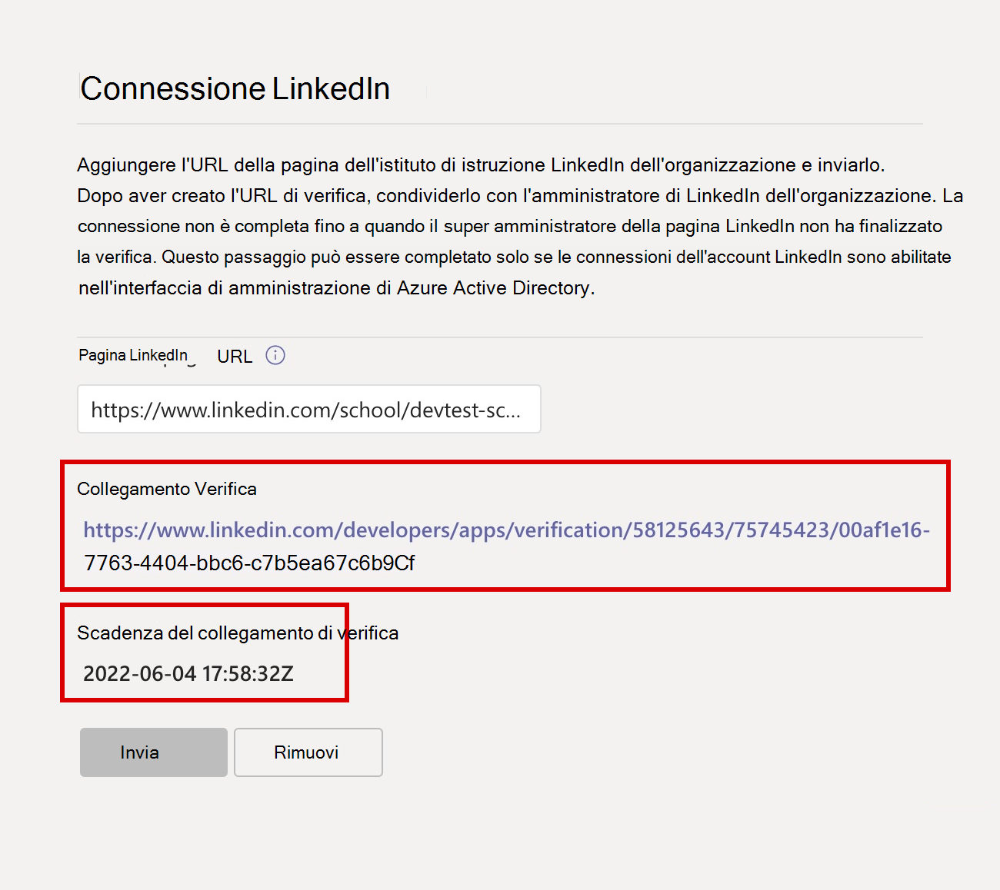
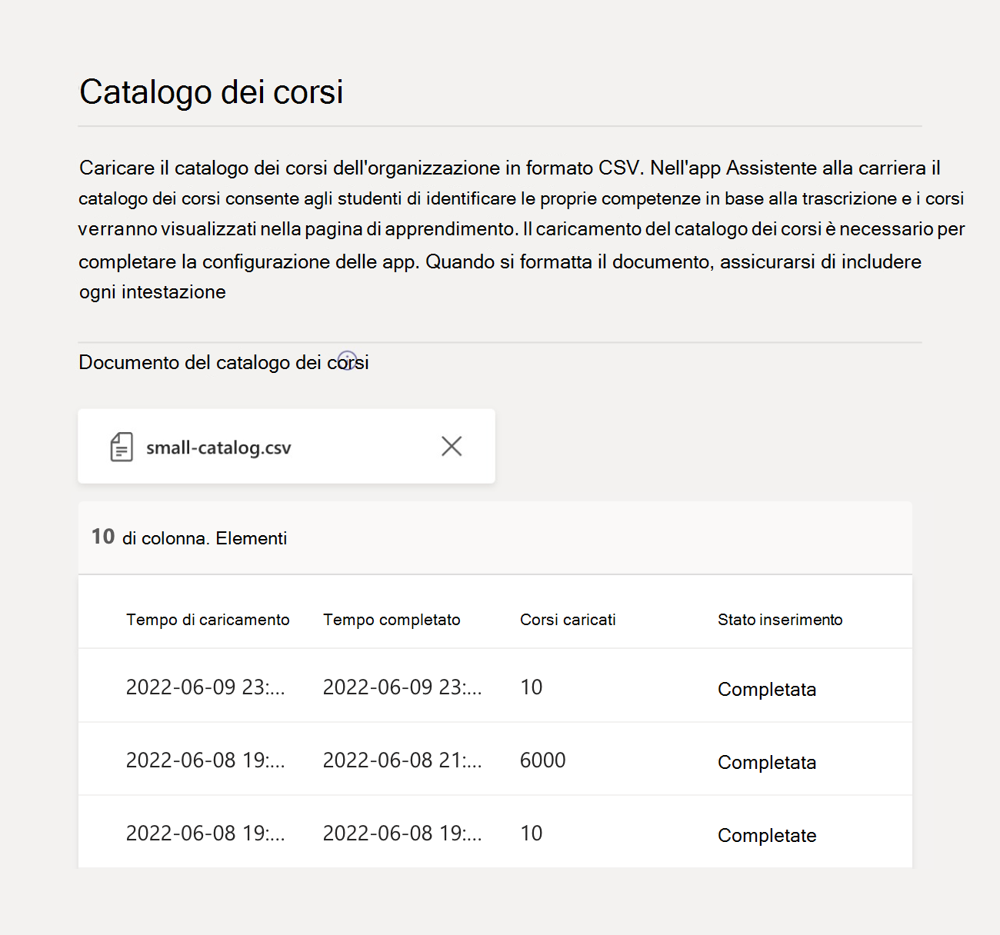

# Acquistare, configurare e abilitare Assistente alla carriera per Microsoft Teams

Assistente alla carriera è un'app Microsoft Teams per l'istruzione basata su LinkedIn che fornisce indicazioni personalizzate agli studenti dell'istruzione superiore per esplorare il loro percorso professionale. Career Coach offre agli istituti di istruzione una soluzione di carriera unificata per consentire agli studenti di scoprire il loro percorso professionale, aumentare le competenze reali e costruire la loro rete in un unico posto.

## Lingue supportate

Assistente alla carriera è localizzato nelle seguenti lingue:

- Cinese (semplificato, Cina continentale)
- Cinese (tradizionale, Taiwan)
- Inglese (US)
- Inglese (UK)
- Francese (Canada)
- Francese (Francia)
- Tedesco (Deutschland)
- Giapponese (Giappone)
- Portoghese (Brasile)
- Spagnolo (Spagna)
- Spagnolo (Messico)

Altre informazioni su [Assistente alla carriera](https://aka.ms/career-coach).

> [!TIP]
> Usare le procedure consigliate e i suggerimenti utili in questa guida per abilitare le funzionalità di Assistente alla carriera per studenti, docenti e personale didattico. Vedere l'articolo [Guida alla pianificazione rapida](https://support.microsoft.com/office/c5d0b934-bfcf-4fe7-8a85-ba7bbb1b6ad4) .

## Rivedere i requisiti

Per abilitare Assistente alla carriera per il tuo istituto di istruzione, esamina ciò di cui hai bisogno per rendere assistente alla carriera operativo.

### Requisiti tecnici

- Office 365 tenant con Azure Active Directory con connessioni all'account LinkedIn abilitate.
- Microsoft Teams.
- Pagina linkedin dell'istituto di istruzione.

### Dati e file dell'istituto di istruzione

- Logo e risorse grafiche dell'istituto di istruzione [nel formato richiesto](#brand-and-preferences).

- Dati del catalogo dei corsi. [Visualizzare il formato di file](https://aka.ms/career-coach/docs/it-admins/sample-catalog) e [documento](#course-catalog-document-format-and-schema) di esempio.

- Elenco dei campi di studio offerti. [Visualizzare un file di esempio](https://aka.ms/career-coach/docs/it-admins/sample-fieldsofstudy).

- [URL della pagina linkedin](https://www.linkedin.com/help/linkedin/answer/40133/differences-between-a-linkedin-page-for-a-school-and-company?lang=en) dell'istituto di istruzione.

- URL dell'informativa sulla privacy dell'istituto di istruzione.

- Gli istituti di istruzione sono collegati a risorse correlate alla carriera, ad esempio un sito Web di servizi professionali e post di lavoro per studenti (facoltativo).

## Elenco di controllo per la configurazione

Prima di rilasciare Career Coach per il tenant, sono necessari diversi ruoli di amministratore. Questi ruoli e autorizzazioni possono essere assegnati a una sola persona o richiedere la collaborazione con i professionisti IT dell'organizzazione. Usare questa guida per identificare le persone necessarie per completare le attività necessarie.

Per controllare i ruoli assegnati all'account, visitare il [interfaccia di amministrazione di Microsoft 365 > Utenti > Utenti attivi](https://go.microsoft.com/fwlink/p/?linkid=834822) > Selezionare il proprio nome utente per confermare il ruolo.

Altre informazioni sui [ruoli di amministratore nella interfaccia di amministrazione di Microsoft 365](/microsoft-365/admin/add-users/about-admin-roles).

### [interfaccia di amministrazione di Microsoft 365](https://go.microsoft.com/fwlink/p/?linkid=2024339)

Ruolo: [Global Administrator](/azure/active-directory/roles/permissions-reference#global-administrator) Career Coach:

- [Acquistare licenze](#purchase-career-coach-licenses)
- [Assegna le licenze](#assign-career-coach-licenses-to-users)

### [Interfaccia di amministrazione di Azure Active Directory](https://go.microsoft.com/fwlink/p/?linkid=2067268)

Ruolo: [Attività Amministratore globale](/azure/active-directory/roles/permissions-reference#global-administrator) assistente alla carriera:

- [Attivare le connessioni dell'account LinkedIn](#turn-on-linkedin-account-connections)

### [Interfaccia di amministrazione di Teams](https://admin.teams.microsoft.com/dashboard)

Ruolo: [Amministratore di Teams](/azure/active-directory/roles/permissions-reference#teams-administrator) Attività assistente alla carriera:

- [Aggiungere Career Coach come app installata](#add-career-coach-as-an-installed-app)
- [Configurare le impostazioni dell'app Career Coach](#configure-career-coach-settings)
  - [Marchio e preferenze](#brand-and-preferences)  - obbligatorio
  - [Connessione](#linkedin-connection)  LinkedIn - obbligatorio
  - [Catalogo dei corsi](#course-catalog)  - obbligatorio
  - [Campi di studio](#fields-of-study)  - obbligatorio
  - [Personalizzazione](#customization) - facoltativa
- [Criteri di configurazione](#setup-policies-and-pin-the-app)
- [Aggiungere l'app](#setup-policies-and-pin-the-app)

### Portale di sviluppo di LinkedIn

Ruolo: [LinkedIn School Page Super Amministrazione'attività](https://www.linkedin.com/help/linkedin/answer/a541981) Assistente alla carriera:

- [Verificare la pagina linkedin dell'istituto di istruzione](#verify-the-linkedin-school-page)

## Acquistare le licenze di Career Coach

### Tipi di licenza

Career Coach richiede una licenza per accedere all'applicazione.

Sono disponibili due tipi di licenza.

- La **licenza Student** è progettata per gli studenti.
- La **licenza per istituti di istruzione** è progettata per docenti, personale e professionisti IT coinvolti nel supporto degli studenti con Assistente alla carriera.

> [!IMPORTANT]
> È necessario assegnare una **licenza di Assistente alla carriera** all'amministratore IT che completa la configurazione.

### Acquistare licenze

Career Coach è disponibile in tutto il mondo (ad eccezione della Cina e della Russia) per gli istituti di istruzione superiore qualificati come licenza per i componenti aggiuntivi tramite Enrollment for Education Solutions (EES), Cloud Service Provider (CSP) e interfaccia di amministrazione di Microsoft 365 (web direct).

Come app Microsoft Teams, il tenant deve avere Microsoft 365 A3/A5 o Office 365 A1/A3/A5 per acquistare la licenza di Assistente alla carriera per il componente aggiuntivo. Sono disponibili licenze separate per studenti e utenti di istituti di istruzione.

### Iscriviti per ottenere una versione di valutazione gratuita

È disponibile una versione di valutazione gratuita standard di 90 giorni per 25 studenti e 25 licenze per docenti e personale didattico. È disponibile una versione di valutazione per ogni tenant idoneo. Le licenze di valutazione possono essere attivate da interfaccia di amministrazione di Microsoft 365 da tenant qualificati per l'acquisto di Career Coach.

Per l'attivazione della versione di valutazione, accedere [a interfaccia di amministrazione di Microsoft 365 > Fatturazione > Acquisto di servizi > cercare Assistente](https://go.microsoft.com/fwlink/p/?linkid=868433) alla carriera per trovare la [versione di valutazione della licenza studente](https://signup.microsoft.com/signup?OfferId=b3a40ff2-3d0d-481e-a0ed-f4de1069f201) e la [versione di valutazione della licenza per istituti di istruzione](https://signup.microsoft.com/signup?OfferId=6f6e7db5-b9ab-4baa-86be-f13d0ae6a2c8).

## Prepararsi per Assistente alla carriera

### Attivare le connessioni dell'account LinkedIn

Esistono due modi in cui le connessioni dell'account LinkedIn vengono usate da Assistente alla carriera.

- Per consentire a studenti, docenti e personale didattico di connettere il proprio account Microsoft 365 al proprio account LinkedIn e [inviare inviti a LinkedIn da Assistente alla carriera](https://support.microsoft.com/topic/career-coach-quick-start-guide-for-students-c419db47-9290-4961-9684-c3f86a9b3708#bkmk_connect_your_linkedin_account).
- Per attivare le funzionalità [Crea la tua rete](https://support.microsoft.com/topic/career-coach-quick-start-guide-for-students-c419db47-9290-4961-9684-c3f86a9b3708#bkmk_build_your_network) ed [Esplora le professioni](https://support.microsoft.com/topic/career-coach-quick-start-guide-for-students-c419db47-9290-4961-9684-c3f86a9b3708#bkmk_discover_your_career_path) usando i dati degli ex studenti pubblici di LinkedIn.

1. Accedere [all'interfaccia di amministrazione di Azure AD](https://go.microsoft.com/fwlink/p/?linkid=2067268) con un [account di amministratore globale](#setup-checklist) per l'organizzazione Azure AD.

2. Selezionare **Utenti**.

3. Nella pagina **Utenti** selezionare **Impostazioni utente**.

4. Per configurare correttamente Assistente alla carriera, **le connessioni dell'account LinkedIn** devono essere impostate su **Sì** o **Gruppo selezionato**.

   - Selezionare **Sì** per abilitare il servizio per tutti gli utenti dell'istituto di istruzione.
   - Selezionare **Gruppo selezionato** per abilitare il servizio solo per un gruppo di utenti selezionati nell'istituto di istruzione.

Per altre informazioni, vedere [Connessioni all'account LinkedIn in Azure Active Directory](/azure/active-directory/enterprise-users/linkedin-integration).

> [!NOTE]
> Nessun dato viene condiviso senza il consenso dell'utente.

### Consentire le app Microsoft in Teams

Career Coach è un'applicazione Microsoft e quindi deve essere consentita nei criteri di autorizzazione dell'app Teams.

1. Accedere **[all'interfaccia di amministrazione di Teams](https://admin.teams.microsoft.com)**.

2. Nella barra di spostamento sinistra selezionare Criteri **[di autorizzazione](https://admin.teams.microsoft.com/policies/manage-apps)** **per le app** >  di Teams.

3. Selezionare i criteri preferiti.
    1. Se non si è certi dei criteri da usare, fare riferimento alla documentazione  relativa alla gestione dei criteri di [Microsoft Teams](policy-packages-edu.md)o usare la [procedura guidata](easy-policy-setup-edu.md) Criteri per l'istruzione per configurare un criterio per Microsoft Teams.

Altre informazioni sulla [configurazione dei criteri di autorizzazione](teams-app-permission-policies.md).

### Aggiungere Career Coach come app installata

Questo passaggio assicura che Assistente alla carriera sia configurato correttamente per l'organizzazione e che gli studenti trovino Assistente alla carriera.

1. Accedere [all'interfaccia di amministrazione di Teams](https://go.microsoft.com/fwlink/p/?linkid=2066851).

2. Selezionare **Criteri di configurazione**  **delle app** > di Teams e selezionare i criteri preferiti.
    1. Se non si è certi dei criteri da usare, fare riferimento alla documentazione  relativa alla gestione dei criteri di [Microsoft Teams](policy-packages-edu.md)o usare la [procedura guidata](easy-policy-setup-edu.md) Criteri per l'istruzione per configurare un criterio per Microsoft Teams.

3. In **App installate** seleziona  **+ Aggiungi app**.

4. Nel riquadro **Aggiungi app installate** cercare le app che si vogliono installare automaticamente per gli utenti quando avviano Teams. Puoi anche filtrare le app in base ai criteri di autorizzazione delle app.

5. Dopo aver scelto l'elenco di app, seleziona **Aggiungi**.

6. Seleziona  **Salva** > **Conferma**.

> [!NOTE]
> La modifica o l'assegnazione di un criterio può richiedere alcune ore prima che le modifiche diano effetto. Assistente alla carriera sarà disponibile in Microsoft Teams solo dopo il completamento delle modifiche.

## Configurare le impostazioni di Assistente alla carriera

### Accedere alle impostazioni dell'app Career Coach

Per configurare le impostazioni di Assistente alla carriera e abilitarle per gli utenti, è necessario essere un amministratore globale o un amministratore dei servizi di Teams per accedere alla pagina.

1. Accedere [all'interfaccia di amministrazione di Teams](https://go.microsoft.com/fwlink/p/?linkid=2066851).
2. Nel riquadro di spostamento sinistro selezionare **App di** > Teams **Gestisci app**.
3. Cerca o cerca **Assistente alla carriera**.
4. Seleziona **Assistente alla carriera** e quindi **Impostazioni**.

### Categorie di configurazione assistente alla carriera

Per abilitare efficacemente Assistente alla carriera per studenti, docenti e personale didattico, sono necessarie le impostazioni seguenti:

- [Marchio e preferenze](#brand-and-preferences)
- [Connessione LinkedIn](#linkedin-connection)
- [Catalogo dei corsi](#course-catalog)
- [Campi di studio](#fields-of-study)

È anche possibile impostare impostazioni di [personalizzazione](#customization) facoltative.

> [!TIP]
> Passa rapidamente da una categoria all'altra selezionando **il percorso assistente** alla carriera situato nella parte superiore della pagina nel formato `Manage apps\Career Coach\Setting label`.

### Marchio e preferenze

Personalizza Assistente alla carriera in base al marchio del tuo istituto di istruzione. L'utente è tenuto a rispettare i diritti altrui, inclusi i diritti di copyright e marchio.

> [!IMPORTANT]
> Questa è una sezione obbligatoria. Assistente alla carriera non può essere abilitato senza **l'invio di Brand e preferenze** .

1. Accedere **[all'interfaccia di amministrazione di Teams](https://go.microsoft.com/fwlink/p/?linkid=2066851)**.

2. Selezionare **le app** >  di Teams **Gestire le app** > **Impostazioni** > **assistente alla** >  carriera **Modificare il marchio e le preferenze**.

3. In **Personalizzazione** aggiungere **Nome organizzazione**.

4. Caricare **l'icona Organizzazione**. L'icona viene usata in Assistente alla carriera per identificare i contenuti specifici dell'istituto di istruzione, le risorse del catalogo dei corsi in tutta l'app e la sezione esperienze reali del dashboard.

    L'icona è formattata in modo ottimale come:

    - Un PNG trasparente
    - Proporzioni di 1:1
    - Dimensione massima di 64 px x 64 px

5. Carica **l'immagine di anteprima del contenuto di apprendimento**. L'anteprima verrà usata per le risorse di apprendimento del catalogo del corso in tutta l'app quando non è specificata un'immagine specifica per un corso offerto dal tuo istituto di istruzione.

    L'anteprima è formattata in modo ottimale come:

    - Un PNG
    - Proporzioni di 16:9
    - Dimensione massima di 360 px x 200 px

6. Aggiungere **l'URL dell'informativa sulla privacy dell'organizzazione**. Se aggiunta, l'informativa sulla privacy dell'istituto sarà disponibile per la revisione da parte degli studenti in Assistente alla carriera.

7. Seleziona **Invia**.

8. Per verificare che le impostazioni siano state inviate correttamente, controlla [lo stato di configurazione di Assistente alla carriera](#configuration-status) per **Il completamento**.

### Connessione LinkedIn

L'impostazione di connessione di LinkedIn collega Assistente alla carriera con i dati degli ex studenti pubblici della pagina linkedin dell'istituto.

Questo passaggio può essere completato solo se [le connessioni dell'account LinkedIn sono abilitate in Azure Active Directory](#turn-on-linkedin-account-connections). L'impostazione di connessione di LinkedIn abilita le funzionalità [Crea la tua rete](https://support.microsoft.com/topic/career-coach-quick-start-guide-for-students-c419db47-9290-4961-9684-c3f86a9b3708#bkmk_build_your_network) ed [Esplora professioni](https://support.microsoft.com/topic/career-coach-quick-start-guide-for-students-c419db47-9290-4961-9684-c3f86a9b3708#bkmk_discover_your_career_path) .

> [!IMPORTANT]
> Questa è una sezione obbligatoria. Assistente alla carriera non può essere abilitato senza che sia stata verificata la connessione alla pagina dell'istituto di istruzione linkedin.

#### Aggiungere l'URL della pagina dell'istituto di istruzione linkedin

Il processo di aggiunta dell'URL della pagina dell'istituto di istruzione LinkedIn viene gestito da un amministratore di Teams. Il passaggio successivo per verificare l'URL viene completato dall'amministratore della pagina linkedin della pagina linkedin dell'istituto di istruzione.

1. Accedere **[all'interfaccia di amministrazione di Teams](https://go.microsoft.com/fwlink/p/?linkid=2066851)**.

2. Seleziona **Le app** >  di Teams **Gestisci app** > **Impostazioni** > **Assistente alla** > **carriera Connessione LinkedIn**.

3. Seleziona **Connetti a LinkedIn**.

4. Per trovare la pagina linkedin dell'istituto di istruzione, cercare su LinkedIn e selezionare il filtro **Dell'istituto** di istruzione. In alternativa, contatta un membro del personale di marketing dell'istituto per determinare la pagina dell'istituto linkedin corretta da usare. Per altre informazioni, vedere [Come identificare le pagine di LinkedIn](https://www.linkedin.com/help/linkedin/answer/40133/differences-between-a-linkedin-page-for-a-school-and-company?lang=en).

    

5. Aggiungere **l'URL della pagina dell'istituto di istruzione di LinkedIn**. L'URL deve essere una *pagina dell'istituto* di istruzione, non una *pagina aziendale* e in genere è formattato come `https://www.linkedin.com/school/willow-university/`.

   

6. Seleziona **Invia**.

7. Dopo l'invio **dell'URL della pagina dell'istituto di istruzione linkedin** , la pagina delle impostazioni verrà aggiornata per visualizzare il  **collegamento** Verifica e la  **scadenza del collegamento Verifica**. Il collegamento di verifica scade dopo 30 giorni.

8. Copiare il **collegamento Verifica** e condividerlo con il super amministratore della pagina linkedin dell'istituto di istruzione.

9. L'amministratore di LinkedIn School Page Super userà il collegamento di verifica univoco per [verificare la pagina dell'istituto linkedin](#verify-the-linkedin-school-page) e associarla a Assistente alla carriera.

10. Per verificare che la verifica e le impostazioni siano state inviate correttamente, verifica che [lo stato di configurazione di Assistente alla carriera](#configuration-status) sia contrassegnato come **Completata**.

#### Verificare la pagina linkedin dell'istituto di istruzione

La verifica della pagina linkedin dell'istituto di istruzione deve essere completata [dall'amministratore di LinkedIn School Page dell'istituto](https://www.linkedin.com/help/linkedin/answer/a541981) di istruzione.

È possibile controllare i ruoli di amministratore dell'account LinkedIn accedendo a LinkedIn e visitando la pagina LinkedIn School dell'istituto di istruzione. Se all'account è assegnato un ruolo di super amministratore, nella pagina LinkedIn verrà visualizzata la **visualizzazione Super admin** accanto al nome dell'istituto di istruzione. Se il tag di **visualizzazione Super admin** non è visualizzato, significa che non si è un super amministratore per la pagina dell'istituto di istruzione.

1. Dopo **l'invio dell'URL della pagina dell'istituto di istruzione linkedin** da parte dell'amministratore di Teams, nella pagina verranno visualizzati il **collegamento Verifica** e la **scadenza del collegamento verifica**. Il collegamento di verifica scade dopo 30 giorni.

     

2. Copiare il collegamento di verifica e condividerlo con l'amministratore di LinkedIn School Page Super.

3. La pagina LinkedIn Super admin aprirà il collegamento di verifica per associare Assistente alla carriera alla pagina dell'istituto di istruzione. Per altre informazioni, vedere [Documentazione aggiuntiva sulla verifica della pagina di LinkedIn](https://www.linkedin.com/help/linkedin/answer/102672).

4. Una volta completata la verifica, l'amministratore di Teams può verificare se le impostazioni sono state inviate correttamente controllando se [lo stato di configurazione di Assistente alla carriera](#configuration-status) è contrassegnato come **Completata**.

   

### Catalogo dei corsi

Il catalogo dei corsi registra i corsi e i corsi offerti dal tuo istituto di istruzione.

Assistente alla carriera usa i dati del catalogo dei corsi per identificare le competenze di uno studente dalla sua trascrizione e per suggerire corsi da seguire.

> [!IMPORTANT]
> Questa è una sezione obbligatoria. Assistente alla carriera non può essere abilitato senza un catalogo di corsi.

Questi corsi vengono utilizzati all'interno di Assistente alla carriera in due aree:

- I corsi vengono restituiti come parte delle [risorse di apprendimento](https://support.microsoft.com/topic/career-coach-quick-start-guide-for-students-c419db47-9290-4961-9684-c3f86a9b3708#bkmk_grow_real_world_skills).  

- I corsi e i metadati del corso, come i titoli e le descrizioni dei corsi, vengono usati per aiutare gli studenti a identificare le proprie competenze quando [caricano una trascrizione](https://support.microsoft.com/topic/career-coach-quick-start-guide-for-students-c419db47-9290-4961-9684-c3f86a9b3708#bkmk_Set_up_your_profile).

Per creare il catalogo dei corsi, creare un elenco di tutti i corsi tenuti presso l'istituto di istruzione e caricarlo come file CSV usando il [formato e lo schema del documento del catalogo dei corsi](#course-catalog-document-format-and-schema).

> [!TIP]
> Iniziare con il documento di catalogo  del [corso di esempio](https://aka.ms/career-coach/docs/it-admins/sample-catalog)per garantire la formattazione corretta.Per informazioni dettagliate sui campi obbligatori e consigliati, è anche possibile fare riferimento alle sezioni relative al [formato del documento del catalogo del corso e alle sezioni dello schema](#course-catalog-document-format-and-schema) .

#### Aggiungere il catalogo dei corsi

1. Accedere **[all'interfaccia di amministrazione di Teams](https://go.microsoft.com/fwlink/p/?linkid=2066851)**.

2. Selezionare **le app** >  di Teams **Gestisci app** >**catalogo del corso** **impostazioni** >  **di Assistente** >  alla carriera.

3. Selezionare **Carica catalogo corsi** > Caricare corsi in formato CSV con le colonne obbligatorie: courseId, title e sourceLink.
    1. Ogni riga deve includere dati per ognuna delle colonne necessarie.
    1. *L'inclusione dei campi consigliati migliora l'esperienza degli studenti restituendo risultati di ricerca migliori e identificando le competenze.*

4. Per riferimento verrà visualizzata un'anteprima di una sezione del catalogo dei corsi caricato.

5. Seleziona **Invia** quando sei pronto.

6. Lo [stato del documento caricato](#course-catalog-status) viene visualizzato nella pagina delle impostazioni.

7. Per verificare che le impostazioni siano state inviate correttamente, verifica che [lo stato di configurazione di Assistente alla carriera](#configuration-status) sia contrassegnato come **Completato**.

> [!TIP]
> Per caricare un nuovo file, assicurarsi che l'ultimo file sia deselezionato selezionando (X) per chiudere l'anteprima del documento. Questa azione consentirà di visualizzare di nuovo il pulsante **Carica** .

#### Schema e formato del documento del catalogo dei corsi

Il documento deve essere in formato CSV con una dimensione massima di 18 MB. I file di grandi dimensioni devono essere suddivisi in più file più piccoli che includono un massimo di 15.000 righe per una corretta elaborazione.

Il documento deve contenere i metadati del corso obbligatori: **titolo del corso**,  **ID del corso** e  **URL del corso**.

> [!TIP]
> Iniziare con il documento di [catalogo del corso di esempio]( https://aka.ms/career-coach/docs/it-admins/sample-catalog) per garantire la formattazione corretta. *L'inclusione dei campi consigliati migliora l'esperienza degli studenti restituendo risultati di ricerca migliori e identificando le competenze.*

La tabella seguente mostra gli elementi da includere nel catalogo dei corsi:

| Nome             | Stato      | Tipo   | Descrizione                                                                    |
|------------------|-------------|--------|--------------------------------------------------------------------------------|
| courseId         | Obbligatorio    | Stringa | CourseId esegue il mapping a ciò che viene generato nella trascrizione dello studente.             |
| Titolo            | Obbligatorio    | Stringa | Titolo del corso.                                                              |
| sourceLink       | Obbligatorio    | URL    | Collegamento del sito Web alla pagina del corso per ulteriori informazioni sul corso e sul programma.   |
| Descrizione      | Consigliata | Stringa | Testo introduttivo per il corso che descrive gli obiettivi di apprendimento.       |
| linguaggio         | Consigliata | Stringa | Lingua del corso. Usare i codici di lingua standard.                           |
| Formato           | Consigliata | Stringa | Modalità di insegnamento (online, video, di persona).                                   |
| thumbnailLink    | Consigliata | URL    | Collegamento anteprima all'immagine del corso.                                            |
| thumbnailAltText | Consigliata | Stringa | Testo alternativo per l'accessibilità per l'immagine                                           |
| educationLevel   | Consigliata | Stringa | Livello di studio, ad esempio Laureata/Laureata.                                       |
| Argomenti           | Consigliata | Stringa | Argomenti o tag associati alle competenze insegnate dai corsi.          |

### Stato del catalogo dei corsi

Lo stato del catalogo del corso viene visualizzato nella pagina Impostazioni catalogo corsi dopo il caricamento di un documento, fornendo i dettagli sullo stato di caricamento e elaborazione del documento.

Durante l'elaborazione, Assistente alla carriera analizzerà il documento per individuare duplicati, normalizzerà e arricchirà il catalogo estraendo le competenze da titoli e descrizioni e lo memorizzerà per l'uso nella pagina Apprendimento e durante il caricamento delle trascrizioni degli studenti per l'identificazione delle competenze.

| Colonna           | Valore     | Descrizione                                                                                        |
| ---------------- | --------- | -------------------------------------------------------------------------------------------------- |
| Tempo di caricamento    | Timestamp | Data e ora in cui un amministratore IT ha caricato un documento.                                                     |
| Tempo completato   | Timestamp | Data e ora in cui il documento è stato elaborato completamente.                                               |
| Corsi caricati | Numero intero   | Numero di corsi disponibili nel documento.                                                           |
| Stato inserimento | In sospeso   | Documento in coda per l'elaborazione.                                                                  |
| Stato inserimento | Corsa   | Il documento è attualmente in fase di elaborazione. Questo processo può richiedere fino a 6 ore, a seconda delle dimensioni del documento. |
| Stato inserimento | Successo   | Il processo di inserimento è completo e i corsi saranno disponibili in Assistente alla carriera una volta configurate tutte le impostazioni richieste. |
| Stato inserimento | Fallito    | Controllare il formato del documento e ricaricarlo.                                                           |
| Duplicati       | Numero intero   | Numero di corsi duplicati trovati nel documento.                                                 |

> [!NOTE]
> Se una colonna nello stato del catalogo del corso è vuota, il documento è in fase di elaborazione e tali valori non sono disponibili. Questo processo può richiedere fino a 6 ore, a seconda delle dimensioni del catalogo. Una volta elaborato il documento, i valori verranno popolati. È possibile aggiornare la pagina per verificare la disponibilità di aggiornamenti.

### Campi di studio

I campi di studio sono sinonimo di importanti aree di interesse, discipline accademiche e corsi di laurea. Questi campi di studio vengono indicati dagli studenti quando iniziano a usare Assistente alla carriera e iniziano a configurare il loro profilo personalizzato.

L'elenco dei campi consente agli studenti di individuare i campi di studio che potrebbero interessarli e di aggiungere la loro attenzione accademica pianificata al loro profilo in Assistente alla carriera.

> [!IMPORTANT]
> Questa è una sezione obbligatoria. Assistente alla carriera non può essere abilitato senza un elenco di campi di studio.
>
> Aggiungere tutti i campi di studio disponibili per gli studenti, ad esempio Ingegneria, Inglese, Business e così via

#### Aggiungere i campi di studio

1. Accedere **[all'interfaccia di amministrazione di Teams](https://go.microsoft.com/fwlink/p/?linkid=2066851)**.

2. Selezionare **le app** >  di Teams **Gestire le app** > Cercare **i campi di studio nelle** **impostazioni** >   di **Assistente** >  alla carriera.

3. Selezionare **Carica** per caricare i campi del file di studio in formato CSV. Verrà visualizzata un'anteprima dei campi del documento di studio.

4. Seleziona **Invia**.

5. Per verificare che le impostazioni siano state inviate correttamente, verifica che [lo stato di configurazione di Assistente alla carriera](#configuration-status) sia contrassegnato come **Completato**.

#### Campi del formato e dello schema del documento di studio

Il documento deve essere in formato CSV con una dimensione massima di 18 MB. Il documento deve contenere i metadati necessari: **Nome campo di studio**.

La tabella seguente mostra gli elementi da includere nei campi di studio:

| Nome          | Stato   | Tipo   | Descrizione                    |
|---------------|----------|--------|--------------------------------|
| campiDiStudy | Obbligatorio | Stringa | Il nome del campo di studio |

### Personalizzazione

L'impostazione Personalizzazione supporta l'aggiunta di opportunità per acquisire esperienze reali nel dashboard che l'istituto di istruzione offre agli studenti.

I collegamenti consigliati da includere sono quelli che consentono agli studenti di acquisire esperienze reali, come bacheche professionali, eventi, ufficio per i servizi professionali, eventi relativi alla carriera e club degli studenti.

1. Accedere **[all'interfaccia di amministrazione di Teams](https://go.microsoft.com/fwlink/p/?linkid=2066851)**.

2. Selezionare **le app** >  di Teams **Gestire le app** >**cercare le impostazioni** **di Career Coach** > .

3. Seleziona **Personalizza l'esperienza** > **+ Aggiungi**

4. Aggiungi ogni **titolo**, **URL** e **descrizione del suggerimento** > Seleziona **Applica**.

5. Verrà visualizzata un'anteprima delle informazioni aggiunte.

6. Seleziona **Invia**.

## Stato delle impostazioni di Assistente alla carriera

La pagina delle impostazioni di Assistente alla carriera nell'interfaccia di amministrazione di Teams fornisce un riepilogo dello stato dei passaggi incompleti, in sospeso, completi e non riusciti per la configurazione di Assistente alla carriera.

Il messaggio di stato consente di determinare se Assistente alla carriera è configurato correttamente e pronto per il rilascio nel tenant.

### Stato configurazione

Nella sezione dello stato di configurazione della pagina delle impostazioni dell'app verrà visualizzato lo stato in tempo reale usando la legenda seguente.

| Categoria                    | Stato                                        | Descrizione                                                 |
| --------------------------- | --------------------------------------------- | ----------------------------------------------------------- |
| Stato provisioning del servizio | Assistente alla carriera sta inizializzando il tuo tenant.     | Il provisioning dei servizi viene eseguito automaticamente quando si accede alla pagina delle impostazioni di Assistente alla carriera. Le modifiche alla configurazione non verranno accettate fino al completamento della configurazione iniziale. Il tempo stimato per il provisioning del servizio può essere di 15 minuti. |
| Stato provisioning del servizio | Career Coach è pronto per essere configurato.       | La pagina delle impostazioni di Assistente alla carriera è pronta per l'amministratore IT per l'invio delle impostazioni. |
| Marchio e preferenze       | Non avviato                                   | Le impostazioni devono essere inviate. |
| Marchio e preferenze       | Mancante: icona Apprendimento                        | Carica l'immagine di anteprima del contenuto di apprendimento mancante. |
| Marchio e preferenze       | Mancante: Logo                                 | Caricare l'icona dell'organizzazione mancante. |
| Marchio e preferenze       | Mancante: nome dell'istituto                     | Caricare il nome dell'organizzazione mancante. |
| Marchio e preferenze       | Completo                                      | Non sono necessarie altre azioni. L'impostazione è stata completata. |
| Caricamento catalogo corsi       | Non avviato                                   | Il file CSV del catalogo del corso deve essere inviato. |
| Caricamento catalogo corsi       | Mancante: caricamento corretto del catalogo dei corsi   | Controllare lo stato del catalogo del corso per informazioni dettagliate sull'elaborazione del catalogo del corso. |
| Caricamento catalogo corsi       | Completo                                      | Non sono necessarie altre azioni. L'impostazione è stata completata. |
| Connessione dell'istituto di istruzione di LinkedIn  | Non avviato                                   | L'URL della pagina dell'istituto di istruzione LinkedIn deve essere inviato. |
| Connessione dell'istituto di istruzione di LinkedIn  | Mancante: URL della pagina dell'istituto di istruzione LinkedIn approvato | In attesa dell'approvazione della verifica da parte dell'amministratore della pagina LinkedIn School. |
| Connessione dell'istituto di istruzione di LinkedIn  | Completo                                      | Non sono necessarie altre azioni. L'impostazione è stata completata. |
| Caricamento di campi di studio      | Non avviato                                   | Campo di studio CSV deve essere inviato. |
| Caricamento di campi di studio      | Mancanti: aree di interesse                    | Verificare se il caricamento nel campo di studio ha esito positivo. |
| Caricamento di campi di studio      | Completo                                      | Non sono necessarie altre azioni. L'impostazione è stata completata. |

> [!NOTE]
> Una volta segnati come completati tutti i passaggi necessari, Assistente alla carriera può essere rilasciato correttamente nel tuo tenant.

## Rendere Assistente alla carriera disponibile per la tua organizzazione

A questo punto, Assistente alla carriera è stato configurato per la tua organizzazione.

Quindi, seguire questa procedura per assicurarsi che Assistente alla carriera sia disponibile per l'organizzazione in Microsoft Teams.

### Assegnare licenze di Assistente alla carriera agli utenti

Per istruzioni dettagliate, vedere [Assegnare licenze agli utenti](/microsoft-365/admin/manage/assign-licenses-to-users).

### Configurare i criteri e aggiungere l'app

L'assistente alla carriera lo aggiungerà alla barra sinistra della finestra di Microsoft Teams per renderlo più accessibile e visibile per gli studenti. Se preferisci aggiungere Assistente alla carriera per un sottoinsieme dei tuoi utenti, dovrai implementare un [criterio di configurazione](teams-app-setup-policies.md) con quel gruppo incluso.

1. Accedere **[all'interfaccia di amministrazione di Teams](https://go.microsoft.com/fwlink/p/?linkid=2066851)**.

2. Selezionare **Criteri di configurazione** **delle app** >  di Teams e selezionare i criteri preferiti.

    Se non si è certi dei criteri da usare, fare riferimento alla documentazione relativa alla gestione dei criteri di [Microsoft Teams](policy-packages-edu.md) o usare la [procedura guidata Criteri per l'istruzione](easy-policy-setup-edu.md) per configurare un criterio per Microsoft Teams.

3. In **App aggiunte** scegliere **Aggiungi app**.

4. Seleziona i criteri preferiti in **Cerca in base a questo criterio di autorizzazione per le app**.

5. Cerca **Assistente alla carriera** in **Cerca per nome** e quindi seleziona  **Aggiungi** > **Aggiungi** per chiudere il riquadro.

6. Scegli l'ordine in cui visualizzare l'app e seleziona **Conferma**.

> [!NOTE]
> Gli studenti riceveranno una notifica in Microsoft Teams che Assistente alla carriera è stato aggiunto.

## Accessibilità in Assistente alla carriera

Assistente alla carriera ha la responsabilità di creare un'esperienza accessibile a tutti gli utenti. Career Coach è conforme a WCAG 2.1 A, AA e AAA e adotta tutti gli standard globali di accessibilità.

Le funzionalità di accessibilità di Assistente alla carriera includono:

- Una struttura di intestazione logica e indicatori di stato attivo chiari per supportare lo spostamento tramite mouse, tastiera o voce.
- Ignorare i collegamenti per consentire agli utenti di accedere più rapidamente alle caratteristiche importanti.
- Testo chiaro e conciso per semplificare la lettura e la comprensione di Assistente alla carriera per tutti gli utenti.
- Contrasto dei colori con modalità Scuro e Contrasto elevato per esigenze e preferenze diverse.
- Un'esperienza utente di dimensioni corrette che viene verificata in tutti i formati (PC, Mac, Android e iPhone) usando i [tester attendibili della sezione 508](https://www.dhs.gov/trusted-tester).

## Risoluzione dei problemi

### Dati di configurazione obbligatori mancanti

Se vedi "Assistente alla carriera è in fase di configurazione per l'uso futuro" nell'esperienza Assistente alla carriera, **non sono stati aggiunti tutti i dati di configurazione necessari**.

Le **sezioni seguenti devono essere completate** prima di poter utilizzare Assistente alla carriera:

- [Marchio e preferenze](#brand-and-preferences)
- [Connessione LinkedIn](#linkedin-connection)
- [Catalogo dei corsi](#course-catalog)
- [Campi di studio](#fields-of-study)

Fare riferimento allo [stato di configurazione di Assistente alla carriera](#configuration-status) per vedere quali impostazioni devono essere completate.

### Formattazione non corretta del catalogo del corso o dei campi dei dati di studio

I CSV per il catalogo dei corsi e il campo di studio hanno formati obbligatori e una dimensione massima di 18 MB.

Fare riferimento allo [schema dei documenti del catalogo dei corsi](#course-catalog-document-format-and-schema) di Assistente alla carriera e ai campi assistente alla carriera [dello schema del documento di studio](#fields-of-study-document-format-and-schema) per garantire una configurazione corretta.

Inoltre, un file di catalogo del corso non deve avere più di 15.000 righe per garantire una corretta elaborazione.

### Campi mancanti nelle pagine delle impostazioni di Assistente alla carriera

Le pagine delle impostazioni di Assistente alla carriera hanno campi obbligatori. Se i campi necessari non sono completati, la pagina non verrà invii.

Potrebbe non essere visualizzato un messaggio di avviso; la pagina non verrà inviato.

L'invio ha esito positivo quando viene visualizzato un banner verde nella parte superiore della pagina.

### Le modifiche ai criteri di installazione non sono complete

Se Assistente alla carriera non viene visualizzato in Microsoft Teams per gli utenti, le modifiche ai criteri di configurazione potrebbero non essere ancora applicate. Career Coach non verrà installato e aggiunto per gli utenti in Microsoft Teams finché i criteri di configurazione non saranno applicati. L'applicazione delle modifiche ai criteri può richiedere alcune ore.

Tuttavia, Assistente alla carriera può essere installato direttamente dall'app store di Microsoft Teams.

- Se gli utenti non riescono a trovare Assistente alla carriera nell'app Store di Microsoft Teams, esamina i criteri di autorizzazione delle app e assicurati che Assistente alla carriera non sia un'app bloccata.
- Career Coach è un'app Microsoft ed è consigliabile consentire le app Microsoft in base ai criteri di autorizzazione. Altre informazioni sulla [configurazione dei criteri di autorizzazione](teams-app-permission-policies.md).

### L'inizializzazione di Assistente alla carriera non è completa

Potrebbe essere visualizzato l'errore seguente: "Non è possibile recuperare le impostazioni dell'app. Riprovare. Se continui ad avere problemi, contatta il supporto tecnico Microsoft".

Controlla **lo stato di provisioning dei servizi** nella pagina delle impostazioni di Assistente alla carriera.

Se il tenant è ancora in fase di inizializzazione, attendere 15 minuti e riprovare. Apri un ticket di supporto se continui a ricevere l'errore.

## Risorse

Le risorse seguenti ti aiuteranno a pianificare l'implementazione di Assistente alla carriera con Microsoft Teams.

- [Guida alla pianificazione rapida di Assistente alla carriera](https://support.microsoft.com/topic/career-coach-quick-planning-guide-c5d0b934-bfcf-4fe7-8a85-ba7bbb1b6ad4)
- [Guida introduttiva di Assistente alla carriera per studenti](https://support.microsoft.com/topic/career-coach-quick-start-guide-for-students-c419db47-9290-4961-9684-c3f86a9b3708)
- [Coinvolgere gli studenti con i piani delle lezioni di Assistente alla carriera](https://support.microsoft.com/topic/get-started-with-career-coach-goals-and-activities-086ce412-05de-4259-a9fd-c96471cef1b0?preview=true)
- [Benvenuto in Microsoft Teams](Teams-overview.md)
- [Come implementare Teams](get-started-with-teams-resources-for-org-wide-rollout.md?tabs=SmallBusiness)
- [Panoramica dei team e i canali in Microsoft Teams](teams-channels-overview.md)
- [Gestione delle app nell'interfaccia di amministrazione di Microsoft Teams](manage-apps.md)
- [Introduzione alla formazione per gli amministratori per Microsoft Teams](ITAdmin-readiness.md)
- [Risoluzione dei problemi di Teams](/microsoftteams/troubleshoot/teams-welcome)
- [Gestire i criteri di autorizzazione app in Microsoft Teams](teams-app-permission-policies.md)
