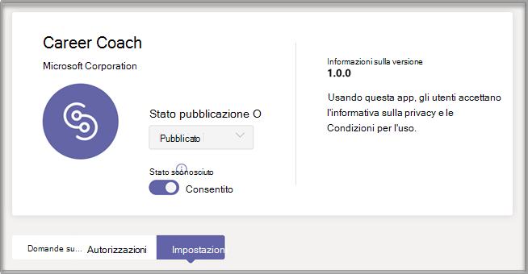
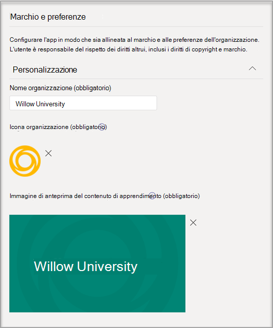
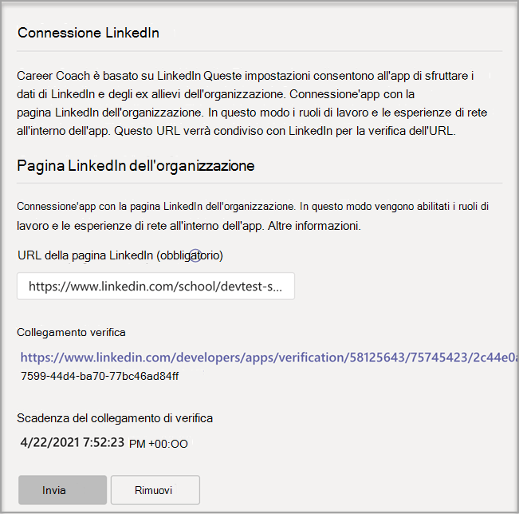
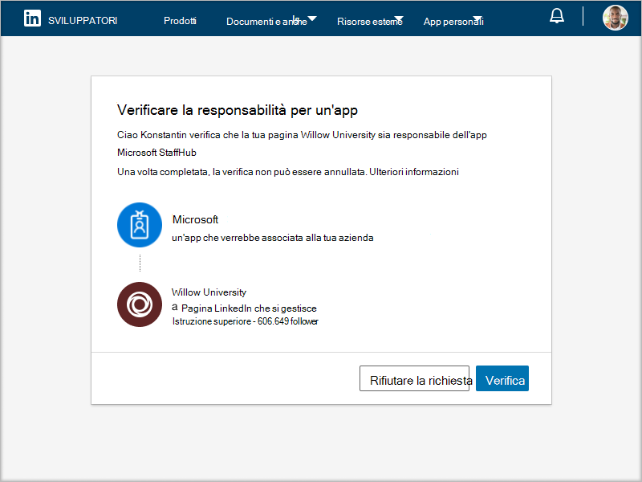

# Acquistare, configurare e abilitare Assistente alla carriera per Microsoft Teams

Assistente alla carriera è un'app Microsoft Teams per l'istruzione basata su LinkedIn che fornisce indicazioni personalizzate per gli studenti dell'istruzione superiore per esplorare il percorso di carriera. Assistente alla carriera offre agli istituti di istruzione una soluzione di carriera unificata per gli studenti per scoprire il percorso di carriera, far crescere le competenze del mondo reale e creare la propria rete in un'unica posizione.

## Lingue supportate

Assistente alla carriera localizzato nelle lingue seguenti:

- Cinese (Cinese semplificato, Cina continentale)
- Cinese (tradizionale, Taiwan)
- Inglese (US)
- Inglese (UK)
- Francese (Canada)
- Francese (Francia)
- Tedesco (Germania)
- Giapponese (Giappone)
- Portoghese (Brasile)
- Spagnolo (Spagna)
- Spagnolo (Messico)

Altre informazioni su [Assistente alla carriera](https://aka.ms/career-coach).

> [!TIP]
> Usare le procedure consigliate e i suggerimenti utili in questa guida per abilitare le funzionalità di Assistente alla carriera per studenti, docenti e personale. Vedere [l'articolo Guida alla pianificazione](https://support.microsoft.com/office/c5d0b934-bfcf-4fe7-8a85-ba7bbb1b6ad4) rapida.

## Esaminare i requisiti

Per abilitare Assistente alla carriera per l'istituto di istruzione, esaminare gli elementi necessari per attivare l'app.

**Requisiti tecnici**

- Office 365 tenant con Azure Active Directory.

- Microsoft Teams.

- Connessioni all'account LinkedIn in Azure Active Directory.

**Licenze**

- Facoltà

- Studenti

> [!IMPORTANT]
> Una Assistente alla carriera di facoltà deve essere assegnata all'amministratore IT che completa la configurazione.

**Dati e file dell'istituto di istruzione**

- Logo dell'istituto didattico e risorse grafiche nel formato richiesto.

- Dati del catalogo del corso.

- Elenco dei campi di studio offerti.

- Pagina [LinkedIn dell'istituto di istruzione](https://www.linkedin.com/help/linkedin/answer/40133/differences-between-a-linkedin-page-for-a-school-and-company?lang=en).

- URL dell'informativa sulla privacy dell'istituto didattico.

- L'istituto di istruzione è collegato a risorse correlate alla carriera, ad esempio servizi di carriera e post di lavoro degli studenti (facoltativo).

- Abbonamento a LinkedIn Learning campus (preferito).

## Acquistare le licenze Assistente alla carriera licenze

Assistente alla carriera è disponibile in tutto il mondo (ad eccezione della Cina e della Russia) per istituti di istruzione superiore qualificati come licenza per componenti aggiuntivi tramite Enrollment for Education Solutions (EES), Cloud Service Providers (CSP) e interfaccia di amministrazione di Microsoft 365 (web direct). Come app Microsoft Teams, i clienti devono avere Microsoft 365 A3/A5 o Office 365 A1/A3/A5 per acquistare il componente aggiuntivo Assistente alla carriera licenza.

### Assegnare licenze per le app agli utenti

Per istruzioni dettagliate, vedere [Assegnare licenze agli utenti.](/microsoft-365/admin/manage/assign-licenses-to-users)

### Attivare le connessioni all'account LinkedIn

Assistente alla carriera **gli** utenti dell'istituto di istruzione devono avere la possibilità di connettere il proprio account Microsoft 365 al proprio account LinkedIn, agevolato all'interno di Assistente alla carriera.

1. Accedere [all'Azure AD di amministrazione con](https://aad.portal.azure.com/) un account amministratore globale per l'organizzazione Azure AD globale.

2. Selezionare **Utenti**.

3. Nella pagina **Utenti** selezionare **Impostazioni utente.**

4. **Le connessioni all'account LinkedIn** devono essere impostate su **Sì** o su Gruppo **selezionato** Assistente alla carriera configurato correttamente.

   

   > [!NOTE]
   > Nessun dato viene condiviso finché gli utenti non acconsenteno a connettere i loro account.

   - Selezionare **Sì** per abilitare il servizio per tutti gli utenti dell'istituto di istruzione.

   - Selezionare **Gruppo selezionato per** abilitare il servizio solo per un gruppo di utenti selezionati nell'istituto di istruzione.

Per altre informazioni, vedere [Connessioni all'account LinkedIn in Azure Active Directory](/azure/active-directory/enterprise-users/linkedin-integration).

## Accedere alle impostazioni Assistente alla carriera'app

Usare Microsoft Teams di amministrazione per configurare Assistente alla carriera per l'istituto di istruzione e abilitarlo per gli utenti.

> [!IMPORTANT]
> Per accedere alla pagina, è necessario essere un amministratore globale o Teams del servizio.

1. Accedere all'interfaccia **[Teams di amministrazione.](https://admin.teams.microsoft.com)**

2. Nel riquadro di spostamento sinistro selezionare Teams  >  **[app Gestisci app.](https://admin.teams.microsoft.com/policies/manage-apps)**  

3. Cercare o cercare **Assistente alla carriera**.  

4. Selezionare **Assistente alla carriera** e quindi selezionare **Impostazioni**.  

    

## Configurare le impostazioni Assistente alla carriera'app

Assistente alla carriera ha cinque categorie di configurazione:

- [Marchio e preferenze](#brand-and-preferences) - obbligatorio

- [Connessione LinkedIn](#linkedin-connection) - obbligatorio

- [Catalogo corsi](#course-catalog) - obbligatorio

- [Campi di studio](#fields-of-study) - obbligatorio

- [Personalizzazione](#customization)

> [!IMPORTANT]
> Il marchio e le preferenze, la configurazione di  LinkedIn, il catalogo dei corsi e i campi di studio sono necessari per abilitare in modo efficace l'app per studenti, docenti e personale.

### Marchio e preferenze

Personalizza Assistente alla carriera in base al marchio del tuo istituto di istruzione. L'utente è responsabile del rispetto dei diritti altrui, inclusi i diritti di copyright e marchio.

> [!IMPORTANT]
> Questa è una sezione obbligatoria: Assistente alla carriera non può essere abilitata senza il marchio e le preferenze inviate.

1. Accedere all'interfaccia **[Teams di amministrazione.](https://admin.teams.microsoft.com)**

2. Selezionare **Teams app Gestisci app**  >  **[Assistente alla carriera](https://admin.teams.microsoft.com/policies/manage-apps)** marchio e  >    >  **preferenze.**

3. **Upload'icona dell'istituto di istruzione**. L'icona viene usata in Assistente alla carriera per identificare contenuti univoci per l'istituto di istruzione, le risorse del catalogo dei corsi in tutta l'app e nella sezione esperienze reali del dashboard. L'icona è formattata nel modo seguente:

    - PNG trasparente
    - Proporzioni di 1:1
    - Dimensioni massime di 64 px x 64 px

4. **Upload'anteprima dell'istituto di istruzione**. L'anteprima verrà usata per le risorse del catalogo dei corsi in tutta l'app quando un'immagine specifica non è disponibile per un corso. L'anteprima è formattata nel modo seguente:

    - Un PNG
    - Proporzioni di 16:9
    - Dimensioni massime di 360 px x 200 px

5. Aggiungere **l'URL dell'informativa sulla privacy dell'istituto di istruzione**. Se viene aggiunto, l'informativa sulla privacy dell'istituto sarà disponibile per gli studenti per la revisione nell'app Assistente alla carriera.

6. Selezionare **Invia**.

### Connessione LinkedIn

La configurazione di LinkedIn Assistente alla carriera con i dati degli ex allievi pubblici di LinkedIn.

> [!IMPORTANT]
> Questa è una sezione obbligatoria: Assistente alla carriera non può essere abilitata senza la verifica della connessione alla pagina LinkedIn.

#### Aggiungere la pagina LinkedIn
  
1. Accedere all'interfaccia **[Teams di amministrazione.](https://admin.teams.microsoft.com)**

2. Selezionare **Teams app Gestisci app**  >  **[Assistente alla carriera](https://admin.teams.microsoft.com/policies/manage-apps)** connessione  >    >  **LinkedIn**.

3. Trovare la pagina LinkedIn eseguendo una ricerca in LinkedIn e selezionando il **filtro Scuola.** Oppure è possibile connettersi con un membro del personale dei servizi professionali per determinare la pagina dell'istituto di istruzione di LinkedIn corretta da usare. Per altre informazioni, vedere [Come identificare le pagine di LinkedIn.](https://www.linkedin.com/help/linkedin/answer/40133/differences-between-a-linkedin-page-for-a-school-and-company?lang=en)

    

4. Aggiungere l'URL della pagina dell'istituto di istruzione di LinkedIn. L'URL deve essere una pagina dell'istituto di istruzione e non una pagina aziendale e in genere è formattato come `https://www.linkedin.com/school/willow-university/` .

   

5. Selezionare **Invia**.
#### Verificare la pagina LinkedIn 

> [!IMPORTANT]
> La verifica deve essere completata dal super amministratore della pagina LinkedIn dell'istituto di istruzione.

1. Se l'invio è stato completato, la pagina verrà aggiornata in modo da visualizzare il **collegamento Verifica** e la scadenza del **collegamento Verifica.** Il collegamento di verifica scade dopo 30 giorni.

     

2. Copiare il collegamento di verifica e condividerlo con l'amministratore della pagina LinkedIn dell'istituto di istruzione. Altre informazioni sul ruolo di super amministratore della pagina LinkedIn nella documentazione [di amministrazione della pagina LinkedIn.](https://www.linkedin.com/help/linkedin/answer/102672)

3. L'amministratore della pagina LinkedIn userà il collegamento di verifica univoco Assistente alla carriera alla pagina dell'istituto di istruzione. Per [altre informazioni, vedere Documentazione aggiuntiva sulla](https://www.linkedin.com/help/linkedin/answer/102672) verifica della pagina LinkedIn.

   

### Catalogo dei corsi

Il catalogo dei corsi rappresenta i corsi e le classi offerti agli studenti dall'istituto di istruzione.

> [!IMPORTANT]
> Questa è una sezione obbligatoria: Assistente alla carriera non può essere abilitata senza un catalogo dei corsi.

Questi corsi vengono usati all'interno dell'app in due aree:

- I corsi vengono restituiti come parte delle risorse di apprendimento.  

- I corsi e i metadati del corso, come le descrizioni, vengono usati per aiutare gli studenti a identificare le proprie competenze quando caricano una trascrizione.  

Per creare il catalogo dei corsi, creare un elenco di tutti i corsi insegnati presso l'istituto di istruzione e caricarlo come file CSV. L'app attinge dal catalogo dei corsi per identificare le competenze di uno studente dalla trascrizione e per suggerire corsi da intraprendere.

#### Aggiungere il catalogo dei corsi

1. Accedere all'interfaccia **[Teams di amministrazione.](https://admin.teams.microsoft.com)**

1. Selezionare **Teams app Gestisci app** &gt; **** &gt; **Assistente alla carriera** &gt; **Impostazioni** &gt; **catalogo corsi.**  

2. Upload corsi in formato CSV con le colonne obbligatorie: courseId, title e sourceLink. Ogni riga deve includere dati per ognuna delle colonne obbligatorie. _L'inclusione dei campi consigliati migliora l'esperienza degli studenti grazie alla restituzione di risultati di ricerca e identificazione delle competenze migliori._

4. Selezionare **Invia**.

   

#### Formato e schema del documento del catalogo dei corsi

Il documento deve essere in formato CSV con una dimensione massima di 18 MB. Il documento deve contenere i campi obbligatori titolo del **corso,** **ID corso** e URL **del corso.** 

> [!TIP]
> Iniziare con il documento [di catalogo del corso di]( https://aka.ms/career-coach/docs/it-admins/sample-catalog) esempio per garantire la formattazione corretta. _L'inclusione dei campi consigliati migliora l'esperienza degli studenti grazie alla restituzione di risultati di ricerca e identificazione delle competenze migliori._

La tabella seguente mostra gli elementi da includere nel catalogo dei corsi:

| Nome             | Stato      | Tipo   | Descrizione                                                                    |
|------------------|-------------|--------|--------------------------------------------------------------------------------|
| courseId         | Obbligatorio    | stringa | In genere l'ID del corso è mappato a ciò che viene generato nella trascrizione. |
| titolo            | Obbligatorio    | stringa | In genere il titolo del corso.                                                      |
| sourceLink       | Obbligatorio    | URL    | Collegamento sito Web alla pagina del corso.                                               |
| descrizione      | Consigliata | stringa | Testo introduttivo per il corso.                                              |
| linguaggio         | Consigliata | stringa | Lingua del corso. Usare i codici lingua standard.                           |
| formato           | Consigliata | stringa | Modalità di insegnamento (online, video, di persona).                                   |
| thumbnailLink    | Consigliata | URL    | Collegamento anteprima all'immagine del corso.                                            |
| thumbnailAltText | Consigliata | stringa | Testo alternativo per l'accessibilità per l'immagine                                           |
| educationLevel   | Consigliata | stringa | Livello di studio, ad esempio. Laureato/laureato.                                       |
| argomenti           | Consigliata | stringa | Argomenti o tag associati alle competenze insegnate nei corsi.          |

### Campi di studio

I campi di studio sono sinonimi di importanti aree di interesse, di laurea e di laurea. Questi titoli fanno riferimento agli studenti quando iniziano a usare l'app e iniziano a configurare il proprio profilo personalizzato.

> [!IMPORTANT]
> Si tratta di una sezione obbligatoria, Assistente alla carriera non può essere abilitata senza un elenco di campi di studio.

#### Aggiungere i campi di studio

1. Accedere all'interfaccia **[Teams di amministrazione.](https://admin.teams.microsoft.com)**
1. Selezionare **Teams app Gestisci app** &gt; **** &gt; **Assistente alla carriera** &gt; **Impostazioni** &gt; **campi di studio**.  

2. Upload di studio in formato CSV.

3. Selezionare **Invia**.

#### Campi del formato e dello schema del documento di studio

Aggiungere tutti i campi di studio disponibili per gli studenti, ad esempio Ingegneria, Inglese, Business e così via. L'elenco dei campi consente agli studenti di individuare i campi di studio che potrebbero interessarli e di aggiungere l'area di interesse al proprio profilo.

> [!TIP]
> Iniziare con il [campo di esempio del documento di studio](https://aka.ms/career-coach/docs/it-admins/sample-fieldsofstudy) per garantire la formattazione corretta.

La tabella seguente mostra gli elementi da includere nei campi di studio:

| Nome          | Stato   | Tipo   | Descrizione                    |
|---------------|----------|--------|--------------------------------|
| fieldsOfStudy | Obbligatorio | stringa | Nome del campo di studio |

### Personalizzazione

Assistente alla carriera può essere personalizzato in modo da essere univoco per l'istituto di istruzione. La personalizzazione supporta l'aggiunta di esperienze al dashboard. È consigliabile aggiungere collegamenti a bacheche di lavoro, eventi, servizi di carriera, eventi correlati alla carriera, club di studenti e qualsiasi altra risorsa che aiuti gli studenti a acquisire esperienza reale.

#### Aggiungere esperienze personalizzate

1. Accedere all'interfaccia **[Teams di amministrazione.](https://admin.teams.microsoft.com)**

1. Selezionare **Teams app Gestisci app** &gt; **[Assistente alla carriera](https://admin.teams.microsoft.com/policies/manage-apps)** &gt;   >  **Impostazioni** &gt; **personalizzazione**.

2. Aggiungere ogni titolo, URL e breve descrizione.  
  
3. Selezionare **Invia**.

## Rendere Assistente alla carriera disponibili per l'organizzazione

Ora che la Assistente alla carriera è stata configurata per l'organizzazione. Seguire questa procedura per assicurarsi che i Assistente alla carriera siano disponibili per l'organizzazione in Microsoft Teams.

### Abilitare l'app

Dopo aver completato la configurazione, abilitare l'app per gli studenti e gli utenti con licenza in modo che abbia accesso a Assistente alla carriera.  
  
> [!IMPORTANT]
> È necessario disporre delle autorizzazioni di Teams globali o di amministratore.

1. Accedere all'interfaccia **[Teams di amministrazione.](https://admin.teams.microsoft.com)**

1. Selezionare **Teams app Gestisci** app &gt; **** &gt; **Assistente alla carriera**.

2. Spostare l'interruttore Stato su **Consentito**.  

   > [!NOTE]
   > **Consentito** significa che l'app è disponibile per gli utenti dell'istituto di istruzione. Bloccato significa che l'app non è disponibile per gli studenti.

### Aggiungere Assistente alla carriera come app installata

> [!IMPORTANT]
> Questo passaggio assicura che i Assistente alla carriera siano configurati correttamente per l'organizzazione e che gli studenti trovino Assistente alla carriera.

1. Accedere all'interfaccia **[Teams di amministrazione.](https://admin.teams.microsoft.com)**

2. Selezionare **Teams criteri di** configurazione delle app e selezionare i criteri &gt;  preferiti.
Se non si è certi dei criteri da [usare,](/microsoftteams/policy-packages-edu) è possibile fare  riferimento alla documentazione relativa alla gestione dei criteri di Microsoft Teams o usare la Procedura guidata Criteri didattici per configurare un criterio per Microsoft Teams.

3. In App installate selezionare **Aggiungi app.**

4. Nel riquadro Aggiungi app installate cercare le app da installare automaticamente per gli utenti all'avvio Teams. È anche possibile filtrare le app in base ai criteri di autorizzazione delle app. Dopo aver scelto l'elenco di app, selezionare **Aggiungi**.

5. Selezionare **Salva**.

> [!NOTE]
> La modifica o l'assegnazione di un criterio può richiedere alcune ore per l'applicazione delle modifiche. L Assistente alla carriera app non sarà disponibile in Microsoft Teams fino al completamento delle modifiche.

### Aggiungere l'app

L'aggiunta Assistente alla carriera rende l'app più accessibile e visibile per gli studenti.

1. Accedere all'interfaccia **[Teams di amministrazione.](https://admin.teams.microsoft.com)**

2. Selezionare **Teams criteri di** configurazione delle app e selezionare i criteri &gt;  preferiti.
Se non si è certi dei criteri da [usare,](/microsoftteams/policy-packages-edu) è possibile fare  riferimento alla documentazione relativa alla gestione dei criteri di Microsoft Teams o usare la Procedura guidata Criteri didattici per configurare un criterio per Microsoft Teams.

3. In **App aggiunte** scegliere Aggiungi **app.**

4. Cercare **Assistente alla carriera** e quindi selezionare **Aggiungi**.

5. Scegliere l'ordine in cui visualizzare l'app e selezionare **Salva.**

> [!NOTE]
> Gli studenti riceveranno una notifica Microsoft Teams che Assistente alla carriera è stato aggiunto.

Riferimento [Gestire i criteri di configurazione delle app in Microsoft](/microsoftteams/teams-app-setup-policies) per altre informazioni.

## Risoluzione dei problemi

- Se nell'app Assistente alla carriera viene visualizzato il messaggio "Assistente alla carriera è attualmente in fase di configurazione per l'uso", le sezioni necessarie non __sono state completate.__ Prima di poter __usare Assistente alla carriera,__ è necessario completare le sezioni seguenti: Marchio e [preferenze,](#brand-and-preferences)Connessione [LinkedIn,](#linkedin-connection)Catalogo corsi e [Campi di studio.](#fields-of-study)

- I cvs per il catalogo dei corsi e il campo di studio hanno formati obbligatori e dimensioni massime di 18 MB. Fare riferimento allo schema [Assistente alla carriera](#course-catalog-document-format-and-schema) del documento del Assistente alla carriera dello [schema](#fields-of-study-document-format-and-schema) del documento di studio per garantire la corretta configurazione.

- Nelle pagine delle impostazioni con i campi obbligatori, se i campi non sono completati, la pagina non verrà inviato. Non viene visualizzato un messaggio di avviso. la pagina semplicemente non verrà inviato.

- Quando si configura il Assistente alla carriera, potrebbe essere visualizzato un banner di errore che indica che non è possibile aggiornare le impostazioni dell'app. Riprova". Ciò è probabilmente dovuto al provisioning del tenant Assistente alla carriera'app, che può richiedere fino a 15 minuti. In questo caso, attendere 15 minuti prima di inviarlo di nuovo.

- Se l Assistente alla carriera app non viene visualizzata in Microsoft Teams, le modifiche ai criteri potrebbero non essere state applicate. L'aggiornamento delle modifiche ai criteri può richiedere alcune ore. L Assistente alla carriera app non sarà disponibile in Microsoft Teams fino al completamento delle modifiche.

## Rimozione dei dati del tenant

I dati del tenant includono informazioni caricate o generate come parte della configurazione dell'applicazione. Per eliminare tutti i dati in un tenant Assistente alla carriera, chiedere all'amministratore globale del tenant di aprire un [ticket](https://edusupport.microsoft.com/support?product_id=career_coach) di supporto che richiede che i dati del tenant siano eliminati definitivamente. Tenere presente che questo processo non è reversibile. Al termine della rimozione dei dati, l'applicazione Assistente alla carriera tornerà allo stato preconfigurato e non personalizzato per tutti gli utenti e un amministratore di Teams dovrà configurare di nuovo l'applicazione per continuare a usarla.

Di seguito viene illustrato il processo di eliminazione:

- Un ticket di supporto deve essere richiesto da un amministratore globale del tenant che indica chiaramente la richiesta di eliminazione definitiva dei dati del tenant. Non è possibile limitare il set di dati o **l'intervallo di tempo dell'eliminazione.**

- Dopo l'archiviazione, il ticket di supporto verrà indirizzato dopo una settimana per soddisfare i criteri di conservazione minimi di conformità. È possibile annullare l'operazione durante questo periodo di tempo.

- Dopo una settimana, il team Assistente alla carriera assicurarsi che tutti i dati correlati al tenant siano eliminati. Il supporto Microsoft monitora il ticket e ti invierà una notifica al termine del processo di eliminazione, non più **di 30 giorni.**

## Risorse

Le risorse seguenti ti aiuteranno a pianificare l'app Assistente alla carriera app.

- [Benvenuto in Microsoft Teams](Teams-overview.md)

- [Come implementare Teams](get-started-with-teams-resources-for-org-wide-rollout.md?tabs=SmallBusiness)

- [Panoramica dei team e i canali in Microsoft Teams](teams-channels-overview.md)

- [Gestione delle app nell'Microsoft Teams di amministrazione](manage-apps.md)

- [Kit di orientamento virtuale online](https://www.microsoft.com/education/remote-learning/virtual-orientation)

- [Limiti e specifiche dei Teams canali](limits-specifications-teams.md)

- [Guida introduttiva alla formazione per gli amministratori per Microsoft Teams](ITAdmin-readiness.md)

- [Risoluzione dei problemi di Teams](/microsoftteams/troubleshoot/teams-welcome)

- [Gestire i criteri di autorizzazione app in Microsoft Teams](teams-app-permission-policies.md)
