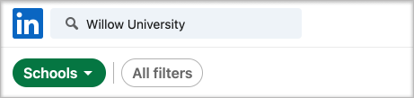

# Acquistare, configurare e abilitare Assistente alla carriera per Microsoft Teams

Assistente alla carriera è un'app Microsoft Teams per l'istruzione basata su LinkedIn che fornisce indicazioni personalizzate per gli studenti dell'istruzione superiore per esplorare il percorso di carriera. Assistente alla carriera offre agli istituti di istruzione una soluzione di carriera unificata che consente agli studenti di scoprire il percorso di carriera, sviluppare competenze reali e creare la propria rete in un'unica posizione.

## Lingue supportate

Assistente alla carriera localizzato nelle lingue seguenti:

- Cinese (Semplificato, Cina continentale)
- Cinese (tradizionale, Taiwan)
- Inglese (US)
- Inglese (UK)
- Francese (Canada)
- Francese (Francia)
- Tedesco (Germania)
- Giapponese (Giappone)
- Portoghese (Brasile)
- Spagnolo (Spagna)
- Spagnolo (Messico)

Altre informazioni su [Assistente alla carriera](https://aka.ms/career-coach).

> [!NOTE]
> Usare le procedure consigliate e i suggerimenti utili in questa guida per abilitare le funzionalità di Assistente alla carriera per studenti, docenti e personale. Vedere [l'articolo Guida alla pianificazione](https://support.microsoft.com/office/c5d0b934-bfcf-4fe7-8a85-ba7bbb1b6ad4) rapida.

## Esaminare i requisiti

Per abilitare Assistente alla carriera per l'istituto di istruzione, esaminare gli elementi necessari per attivare l'app.

**Requisiti tecnici**

- Office 365 tenant con Azure Active Directory

- Microsoft Teams

- Connessioni all'account LinkedIn in Azure Active Directory

**Licenze**

- Facoltà

- Studenti

> [!NOTE]
> Una Assistente alla carriera facoltà deve essere assegnata all'amministratore IT che completa la configurazione.

**Dati e file dell'istituto di istruzione**

- Dati del catalogo dei corsi

- Campi di studio offerti

- Pagina LinkedIn dell'istituto di istruzione

- LinkedIn Learning campus (preferito)

## Acquistare le licenze Assistente alla carriera licenze

Assistente alla carriera è disponibile in tutto il mondo (ad eccezione della Cina e della Russia) per istituti di istruzione superiore qualificati come licenza per componenti aggiuntivi tramite Enrollment for Education Solutions (EES), Cloud Service Providers (CSP) e interfaccia di amministrazione di Microsoft 365 (web direct). Come app Microsoft Teams, i clienti devono avere Microsoft 365 A3/A5 o Office 365 A1/A3/A5 per acquistare il componente aggiuntivo Assistente alla carriera licenza.

### Assegnare licenze per le app agli utenti

Per istruzioni dettagliate, vedere [Assegnare licenze agli utenti.](/microsoft-365/admin/manage/assign-licenses-to-users)

### Attivare le connessioni all'account LinkedIn

Assistente alla carriera **gli** utenti dell'istituto di istruzione devono avere la possibilità di connettere il proprio account Microsoft 365 al proprio account LinkedIn, agevolato all'interno di Assistente alla carriera

1. Accedere [all'interfaccia di amministrazione di Azure AD](https://aad.portal.azure.com/) con un account amministratore globale per l'organizzazione di Azure AD.

2. Selezionare **Utenti**.

3. Nella pagina **Utenti** selezionare **Impostazioni utente.**

4. In **Connessioni account LinkedIn** consentire agli utenti di connettere i propri account per accedere alle connessioni LinkedIn all'interno di alcune app Microsoft. Nessun dato viene condiviso finché gli utenti non acconsenteno a connettere i loro account.

   - Selezionare **Sì** per abilitare il servizio per tutti gli utenti dell'istituto di istruzione

   - Selezionare **Gruppo selezionato per** abilitare il servizio solo per un gruppo di utenti selezionati nell'istituto di istruzione

   - Selezionare **No per** revocare il consenso a tutti gli utenti dell'istituto di istruzione

Informazioni su come [integrare le connessioni degli account LinkedIn in Azure Active Directory](/azure/active-directory/enterprise-users/linkedin-integration)

## Configurare Assistente alla carriera nell'interfaccia Teams di amministrazione

Usando le impostazioni di amministrazione nell'Microsoft Teams di amministrazione, è possibile configurare Assistente alla carriera per l'istituto di istruzione e abilitarlo per gli utenti.

**Aspetti da considerare**

- Le sezioni seguenti devono essere completate prima Assistente alla carriera possono essere usate - Marchio e preferenze, LinkedIn
- I cvs per il catalogo dei corsi e il campo di studio hanno formati obbligatori e dimensioni massime di 18 MB

- Se viene visualizzato il messaggio "Assistente alla carriera è in fase di configurazione per l'uso presto" nell'app Assistente alla carriera le sezioni necessarie non sono state completate.

- Nelle pagine delle impostazioni con i campi obbligatori, se i campi non sono completati, la pagina non verrà inviare
  - Gli utenti non visualizzano un messaggio di avviso, ma la pagina semplicemente non invia

## Accedere alle impostazioni Assistente alla carriera'app

Usare la [pagina Gestisci app per](/microsoftteams/manage-apps) visualizzare le app Teams nel catalogo app dell'istituto di istruzione.

1. Accedere all'interfaccia **Teams di amministrazione.**

2. Nel riquadro di spostamento sinistro selezionare Teams  >  **app Gestisci app.**  

    > [!NOTE]
    > Per accedere alla pagina, è necessario essere un amministratore globale o Teams del servizio.

3. Cercare o cercare **Assistente alla carriera**.  

4. Selezionare **Assistente alla carriera** e quindi selezionare **Impostazioni.**  

    

### Configurare le impostazioni Assistente alla carriera'app

Assistente alla carriera ha cinque categorie di configurazione:

- [Marchio e preferenze](#brand-and-preferences)

- [Connessione LinkedIn](#linkedin-connection)

- [Catalogo dei corsi](#course-catalog)

- [Campi di studio](#fields-of-study)

- [Personalizzazione](#customization)

> [!NOTE]
> Il marchio e le preferenze, la configurazione di  LinkedIn, il catalogo dei corsi e i campi di studio sono necessari per abilitare in modo efficace l'app per studenti, docenti e personale.

#### Marchio e preferenze

Impostare il nome, il logo e la lingua predefinita dell'istituto di istruzione nella pagina delle impostazioni del marchio e delle preferenze.

> [!NOTE]
> Questa è una sezione obbligatoria: Assistente alla carriera non può essere abilitata senza il marchio e le preferenze inviate.

##### Icona dell'istituto di istruzione

L'icona dell'istituto di istruzione viene usata in tutto il Assistente alla carriera per identificare contenuti univoci per l'istituto di istruzione, le risorse del catalogo dei corsi in tutta l'app e nella sezione esperienze reali del dashboard. L'icona è formattata nel modo seguente:

- PNG trasparente
- Proporzioni di 1:1
- Dimensioni massime di 64 px x 64 px.

##### Anteprima dell'istituto di istruzione

L'icona dell'istituto di istruzione verrà usata per le risorse del catalogo dei corsi in tutta l'app quando un'immagine specifica non è disponibile per un corso. L'icona è formattata nel modo seguente:

- Un PNG
- Proporzioni di 16:9
- Dimensioni massime di 360 px x 200 px.

#### Connessione LinkedIn

La configurazione di LinkedIn Assistente alla carriera con i dati degli ex allievi pubblici di LinkedIn.

> [!NOTE]
> Questa è una sezione obbligatoria: Assistente alla carriera non può essere abilitata senza la verifica della connessione alla pagina LinkedIn.

##### Aggiungere e confermare la pagina LinkedIn

Determinare la pagina LinkedIn dell'istituto di istruzione. Trovare la pagina LinkedIn cercando su LinkedIn o connettendosi con un membro del personale dei servizi professionali per determinare la pagina corretta da usare.  
  
1. Accedere all'interfaccia **Teams di amministrazione.**

1. Selezionare **Teams app gestisci** le app  >    >  **Assistente alla carriera**  >  **connessione LinkedIn**.

2. Trovare la pagina LinkedIn eseguendo una ricerca in LinkedIn e selezionando Filtro scuola. Oppure è possibile connettersi con un membro del personale dei servizi professionali per determinare la pagina dell'istituto di istruzione di LinkedIn corretta da usare. [Come identificare le pagine di LinkedIn](https://www.linkedin.com/help/linkedin/answer/40133/differences-between-a-linkedin-page-for-a-school-and-company?lang=en)

    

3. Aggiungere l'URL della pagina dell'istituto di istruzione di LinkedIn. L'URL deve essere una pagina dell'istituto di istruzione e non una pagina aziendale e in genere è formattato come `https://www.linkedin.com/school/willow-university/` .

   

4. Selezionare **Invia**.

5. Se l'invio è stato completato, la pagina verrà aggiornata in modo da visualizzare il **collegamento Verifica** e la scadenza del **collegamento Verifica.** Il collegamento di verifica scade dopo 30 giorni.

     

6. Copiare il collegamento di verifica e condividerlo con l'amministratore della pagina LinkedIn dell'istituto di istruzione. Per altre informazioni sul ruolo di super amministratore della pagina LinkedIn, vedere la documentazione [di amministrazione della pagina LinkedIn.](https://www.linkedin.com/help/linkedin/answer/102672)

7. Il super amministratore della pagina LinkedIn userà il collegamento di verifica univoco Assistente alla carriera alla pagina dell'istituto di istruzione. [Documentazione aggiuntiva sulla verifica della pagina LinkedIn.](https://www.linkedin.com/help/linkedin/answer/102672)

> [!NOTE]
> La verifica da parte del super amministratore della pagina LinkedIn è necessaria per completare la connessione LinkedIn per Assistente alla carriera.

   

#### Catalogo dei corsi

Il catalogo dei corsi rappresenta i corsi e le classi offerti agli studenti dall'istituto di istruzione.

> [!NOTE]
> Questa è una sezione obbligatoria: Assistente alla carriera non può essere abilitata senza un catalogo dei corsi.

Questi corsi vengono usati all'interno dell'app in due aree:

- I corsi vengono restituiti come parte delle risorse di apprendimento.  

- I corsi e i metadati del corso, come le descrizioni, vengono usati per aiutare gli studenti a identificare le proprie competenze quando caricano una trascrizione.  

Per creare il catalogo dei corsi, creare un elenco di tutti i corsi insegnati presso l'istituto di istruzione e caricarlo come file CSV. L'app attinge dal catalogo dei corsi per identificare le competenze di uno studente dalla trascrizione e per suggerire corsi da intraprendere.

##### Formattazione e schema dei documenti del catalogo dei corsi

Il documento deve essere in formato CSV con una dimensione massima di 18 MB. Il documento deve contenere i campi obbligatori titolo del **corso,** **ID corso** e URL **del corso.** L'inclusione dei campi consigliati migliora l'esperienza degli studenti grazie alla restituzione di risultati di ricerca migliori e di identificazione delle competenze.

> [!NOTE]
> Iniziare con il [documento di catalogo del]( https://aka.ms/career-coach/docs/it-admins/sample-catalog) corso di esempio per iniziare.

La tabella seguente mostra gli elementi da includere nel catalogo dei corsi:

| Nome             | Stato      | Tipo   | Descrizione                                                                    |
|------------------|-------------|--------|--------------------------------------------------------------------------------|
| courseId         | Obbligatorio    | stringa | In genere l'ID del corso (in genere è associato a ciò che viene generato nella trascrizione). |
| titolo            | Obbligatorio    | stringa | In genere il titolo del corso.                                                      |
| sourceLink       | Obbligatorio    | URL    | Collegamento sito Web alla pagina del corso.                                               |
| descrizione      | Consigliata | stringa | Testo introduttivo per il corso.                                              |
| linguaggio         | Consigliata | stringa | Lingua del corso. Usare i codici lingua standard.                           |
| formato           | Consigliata | stringa | Modalità di insegnamento (online, video, di persona).                              |
| thumbnailLink    | Consigliata | URL    | Collegamento anteprima all'immagine del corso.                                            |
| thumbnailAltText | Consigliata | stringa | Testo alternativo per l'accessibilità per l'immagine                                           |
| educationLevel   | Consigliata | stringa | Livello di studio, ad esempio. Laureato/laureato.                                       |
| argomenti           | Consigliata | stringa | Argomenti o tag associati alle competenze insegnate nei corsi.          |

##### Aggiungere il catalogo dei corsi

1. Accedere all'interfaccia **Teams di amministrazione.**

1. Selezionare **Teams app Gestisci app** &gt; **Assistente alla carriera** &gt;  &gt; **Impostazioni** catalogo &gt; **corsi.**  

2. Upload corsi in formato CSV con le colonne obbligatorie: courseId, title, sourceLink. Ogni riga deve includere dati per ognuna delle colonne obbligatorie.

L'inclusione dei campi consigliati migliora l'esperienza degli studenti grazie alla restituzione di risultati di ricerca migliori e di identificazione delle competenze.

4. Selezionare **Invia**.

   

#### Campi di studio

I campi di studio sono sinonimi di importanti aree di interesse, di laurea e di laurea. Questi titoli fanno riferimento agli studenti quando iniziano a usare l'app e iniziano a configurare il proprio profilo personalizzato.

> [!NOTE]
> Si tratta di una sezione obbligatoria, Assistente alla carriera non può essere abilitata senza un elenco di campi di studio.

Aggiungere tutti i campi di studio disponibili per gli studenti, ad esempio Ingegneria, Inglese, Business e così via. L'elenco dei campi consente agli studenti di individuare i campi di studio che potrebbero interessarli e di aggiungere l'area di interesse al proprio profilo.

> [!NOTE]
> Iniziare con il [campo di esempio del documento di](https://aka.ms/career-coach/docs/it-admins/sample-fieldsofstudy) studio.

La tabella seguente mostra gli elementi da includere nei campi di studio:

| Nome          | Stato   | Tipo   | Descrizione                    |
|---------------|----------|--------|--------------------------------|
| fieldsOfStudy | Obbligatorio | stringa | Nome del campo di studio |

##### Aggiungere i campi di studio

1. Accedere all'interfaccia **Teams di amministrazione.**
1. Selezionare **Teams app Gestisci app** &gt;  &gt; **Assistente alla carriera** &gt; **Impostazioni** campi di &gt; **studio.**  

2. Upload di studio in formato CSV.

3. Selezionare **Invia**.

#### Personalizzazione

Assistente alla carriera può essere personalizzato in modo da essere univoco per l'istituto di istruzione. La personalizzazione supporta l'aggiunta di esperienze al dashboard. È consigliabile aggiungere collegamenti a bacheche di lavoro, eventi, servizi di carriera, eventi correlati alla carriera, club di studenti e qualsiasi altra risorsa che aiuti gli studenti a acquisire esperienza reale.

##### Aggiungere esperienze personalizzate

1. Accedere all'interfaccia **Teams di amministrazione.**

1. Selezionare **Teams per gestire le** app &gt;  &gt; **Assistente alla carriera**  >  **Impostazioni** &gt; **personalizzazione**.

2. Aggiungere ogni URL, un titolo e una breve descrizione.  
  
3. Selezionare **Invia**.

## Rendere Assistente alla carriera disponibili per l'organizzazione

Ora che Assistente alla carriera è stato configurato per l'organizzazione. Seguire questa procedura per assicurarsi che i Assistente alla carriera siano disponibili per l'organizzazione in Microsoft Teams.

### Abilitare l'app

Dopo aver completato la configurazione, abilitare l'app per gli studenti e gli utenti con licenza in modo che abbia accesso a Assistente alla carriera.  
  
> [!NOTE]
> È necessario avere autorizzazioni di amministratore globale o Teams di amministratore.

1. Accedere all'interfaccia **Teams di amministrazione.**

1. Selezionare **Teams app Gestisci app** &gt;  &gt; **Assistente alla carriera**.

2. Spostare l'interruttore Stato su **Consentito**.  

  > [!NOTE]
  > Consentito significa che l'app è disponibile per gli utenti dell'istituto di istruzione. Bloccato significa che l'app non è disponibile per gli studenti.

### Aggiungere Assistente alla carriera come app installata

> [!NOTE]
> Questo passaggio assicura 1) che Assistente alla carriera configurato correttamente per l'organizzazione 2) che gli studenti trovino Assistente alla carriera.

1. Accedere all'interfaccia **Teams di amministrazione.**

2. Selezionare **Teams criteri di configurazione** delle &gt; **app** &gt; *.*

3. In App installate selezionare Aggiungi app.

4. Nel riquadro Aggiungi app installate cercare le app da installare automaticamente per gli utenti all'avvio Teams. È anche possibile filtrare le app in base ai criteri di autorizzazione delle app. Dopo aver scelto l'elenco di app, selezionare Aggiungi.

### Aggiungere l'app

L'aggiunta Assistente alla carriera rende l'app più accessibile e visibile per gli studenti.

1. Accedere all'interfaccia **Teams di amministrazione.**

2. Selezionare **Teams criteri di configurazione** delle &gt; **app** &gt; *.*

3. In **App aggiunte** scegliere Aggiungi **app.**

4. Cercare **Assistente alla carriera** e quindi selezionare **Aggiungi**.

5. Scegliere l'ordine in cui visualizzare l'app e selezionare **Salva.**

> [!NOTE]
> Gli studenti riceveranno una notifica in Microsoft Teams che Assistente alla carriera è stato aggiunto.

Riferimento [Gestire i criteri di configurazione delle app in Microsoft](/microsoftteams/teams-app-setup-policies) per altre informazioni.

## Risorse

Le risorse seguenti ti aiuteranno a pianificare l'app Assistente alla carriera app.

- [Benvenuto in Microsoft Teams](Teams-overview.md)

- [Come implementare Teams](get-started-with-teams-resources-for-org-wide-rollout.md?tabs=SmallBusiness)

- [Panoramica dei team e i canali in Microsoft Teams](teams-channels-overview.md)

- [Gestione delle app nell'Microsoft Teams di amministrazione](manage-apps.md)

- [Kit di orientamento virtuale online](https://www.microsoft.com/education/remote-learning/virtual-orientation)

- [Limiti e specifiche dei Teams canali](limits-specifications-teams.md)

- [Guida introduttiva alla formazione per gli amministratori per Microsoft Teams](ITAdmin-readiness.md)

- [Risoluzione dei problemi di Teams](/microsoftteams/troubleshoot/teams-welcome)

- [Gestire i criteri di autorizzazione app in Microsoft Teams](teams-app-permission-policies.md)
