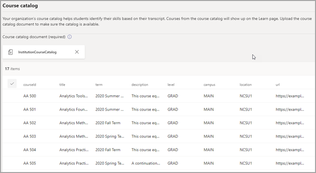

# Acquistare, configurare e abilitare Career Coach per Microsoft TeamsPurchase, configure, and enable Career Coach for Microsoft Teams

Career Coach è un'app Microsoft Teams per l'istruzione basata su LinkedIn che fornisce indicazioni personalizzate per gli studenti dell'istruzione superiore per esplorare il percorso di carriera.Career Coach is a Microsoft Teams for Education app powered by LinkedIn that provides personalized guidance for higher education students to navigate their career journey. Career Coach offre agli istituti di istruzione una soluzione di carriera unificata per gli studenti per scoprire il percorso di carriera, sviluppare competenze reali e creare la propria rete in un'unica posizione.Career Coach offers educational institutions a unified career solution for students to discover their career path, grow real-world skills, and build their network all in one place.

Altre informazioni su [Career Coach](https://aka.ms/career-coach).Learn more about [Career Coach](https://aka.ms/career-coach).

> [!NOTE]
> Usare le procedure consigliate e i suggerimenti utili in questa guida per abilitare le funzionalità di Career Coach per studenti, docenti e personale.Use the best practices and helpful tips in this guide to enable the capabilities of Career Coach for students, faculty, and staff. Vedere [l'articolo Guida alla pianificazione](https://support.microsoft.com/office/c5d0b934-bfcf-4fe7-8a85-ba7bbb1b6ad4) rapida.See the [Quick planning guide](https://support.microsoft.com/office/c5d0b934-bfcf-4fe7-8a85-ba7bbb1b6ad4) article.

## Esaminare i requisitiReview the requirements

Per abilitare Career Coach per il tuo istituto di istruzione, controlla cosa ti serve per attivare l'app.To enable Career Coach for your educational institution, review what you need to get the app up and running.

**Requisiti tecnici****Technical requirements**

  - Office 365 tenant con Azure Active DirectoryOffice 365 tenant with Azure Active Directory

  - Microsoft TeamsMicrosoft Teams

  - Connessioni all'account LinkedIn in Azure Active DirectoryLinkedIn account connections in Azure Active Directory

**Licenze****Licenses**

  - FacoltàFaculty 

  - StudentiStudents

> [!NOTE]
> Una licenza Career Coach Faculty deve essere assegnata all'amministratore IT che completa la configurazione.A Career Coach Faculty license must be assigned to the IT admin completing the configuration.

**Dati e file dell'istituto di istruzione****Data and files from your educational institution**

  - Dati del catalogo dei corsiCourse catalog data

  - Campi di studio offertiFields of study offered

  - Pagina LinkedIn dell'istituto di istruzioneEducational institution’s LinkedIn page

  - Abbonamento al campus di LinkedIn Learning (preferito)LinkedIn Learning campus subscription (preferred)

## Acquistare le licenze career coachPurchase the Career Coach licenses

Career Coach è disponibile in tutto il mondo (ad eccezione della Cina e della Russia) per istituti di istruzione superiore qualificati tramite Enrollment for Education Solutions (EES), Cloud Service Providers (CSP) e Microsoft 365 admin center (web direct).Career Coach is available worldwide (except China and Russia) for qualified higher education institutions through Enrollment for Education Solutions (EES), Cloud Service Providers (CSP), and Microsoft 365 admin center (web direct). Come app Microsoft Teams, i clienti devono avere Microsoft 365 A3/A5 o Office 365 A1/A3/A5.As a Microsoft Teams app, customers must have Microsoft 365 A3/A5 or Office 365 A1/A3/A5.

### Assegnare licenze per le app agli utentiAssign app licenses to users

Per istruzioni dettagliate, vedere [Assegnare licenze agli utenti.](/microsoft-365/admin/manage/assign-licenses-to-users)For step-by-step instructions, see [Assign licenses to users](/microsoft-365/admin/manage/assign-licenses-to-users).

### Attivare le connessioni all'account LinkedInTurn on LinkedIn account connections

Career Coach **richiede agli** utenti dell'istituto di istruzione di avere la possibilità di connettere il proprio account Microsoft 365 al proprio account LinkedIn, agevolato all'interno di Career CoachCareer Coach **requires** your educational institution’s users to have the ability to connect their Microsoft 365 account to their LinkedIn account that is facilitated within Career Coach

1. Accedere [all'interfaccia di amministrazione di Azure AD](https://aad.portal.azure.com/) con un account amministratore globale per l'organizzazione di Azure AD.Sign in to the [Azure AD admin center](https://aad.portal.azure.com/) with an account that's a global admin for the Azure AD organization.

2. Selezionare **Utenti**.Select **Users**.

3. Nella pagina **Utenti** selezionare **Impostazioni utente.**On the **Users** page, select **User settings**.

4. In **Connessioni account LinkedIn** consentire agli utenti di connettere i propri account per accedere alle connessioni LinkedIn all'interno di alcune app Microsoft.Under **LinkedIn account connections**, allow users to connect their accounts to access their LinkedIn connections within some Microsoft apps. Nessun dato viene condiviso finché gli utenti non acconsenteno a connettere i loro account.No data is shared until users consent to connect their accounts.

   - Selezionare **Sì** per abilitare il servizio per tutti gli utenti dell'istituto di istruzioneSelect **Yes** to enable the service for all users in your educational institution

   - Selezionare **Gruppo selezionato per** abilitare il servizio solo per un gruppo di utenti selezionati nell'istituto di istruzioneSelect **Selected group** to enable the service for only a group of selected users in your educational institution

   - Selezionare **No per** revocare il consenso a tutti gli utenti dell'istituto di istruzioneSelect **No** to withdraw consent from all users in your educational institution

Informazioni su come [integrare le connessioni degli account LinkedIn in Azure Active Directory](/azure/active-directory/enterprise-users/linkedin-integration)Learn how to [Integrate LinkedIn account connections in Azure Active Directory](/azure/active-directory/enterprise-users/linkedin-integration)

## Configurare Career Coach nell'interfaccia Teams di amministrazioneConfigure Career Coach in the Teams admin center

Usando le impostazioni di amministrazione nell'Microsoft Teams di amministrazione, è possibile configurare Career Coach per l'istituto di istruzione e abilitarlo per gli utenti.Using the admin settings in the Microsoft Teams admin center, you can configure Career Coach for your educational institution and enable it for users.

## Accedere alle impostazioni dell'app Career CoachAccess the Career Coach app settings

Usare la [pagina Gestisci app per](/microsoftteams/manage-apps) visualizzare le app Teams nel catalogo app dell'istituto di istruzione.Use the [Manage apps page](/microsoftteams/manage-apps) to view the Teams apps in your educational institution’s app catalog.

1. Accedere all'interfaccia **Teams di amministrazione.**Sign in to the **Teams admin center**.

2. Nel riquadro di spostamento sinistro selezionare Teams  >  **app Gestisci app.**In the left navigation, select **Teams apps** > **Manage apps**.  

    > [!NOTE]
    > Per accedere alla pagina, è necessario essere un amministratore globale o Teams del servizio.You must be a global admin or Teams service admin to access the page.

3. Cercare o cercare **Career Coach**.Search or browse for **Career Coach**.  

4. Selezionare **Career Coach** e quindi selezionare **Impostazioni.**Select **Career Coach**, and then select **Settings.**  

    

### Configurare le impostazioni dell'app Career CoachConfigure the Career Coach app settings

Career Coach ha cinque categorie di configurazione:Career Coach has five configuration categories:

- [Marchio e preferenzeBrand and preferences](#brand-and-preferences)

- [Configurazione di LinkedInLinkedIn configuration](#linkedin-configuration)

- [Catalogo dei corsiCourse catalog](#course-catalog)

- [Campi di studioFields of study](#fields-of-study)

- [PersonalizzazioneCustomization](#customization)

> [!NOTE]
> Il marchio e le preferenze, la configurazione di  LinkedIn, il catalogo dei corsi e i campi di studio sono necessari per abilitare in modo efficace l'app per studenti, docenti e personale.Brand and preferences, LinkedIn configuration, Course catalog, and Fields of study are **required** to effectively enable the app for students, faculty, and staff.

#### Marchio e preferenzeBrand and preferences

Impostare il nome, il logo e la lingua predefinita dell'istituto di istruzione nella pagina delle impostazioni del marchio e delle preferenze.Set your educational institution’s name, logo, and default language on the brand and preferences settings page.

##### Icona dell'istituto di istruzioneEducational institution icon

L'icona dell'istituto di istruzione viene usata in Career Coach per identificare contenuti univoci per l'istituto di istruzione, le risorse del catalogo dei corsi in tutta l'app e nella sezione esperienze reali del dashboard.The educational institution icon is used throughout Career Coach to identify content unique to your educational institution, course catalog resources throughout the app, and on the real-world experiences section of the dashboard. L'icona è formattata nel modo seguente:The icon is best formatted as:

 - PNG trasparenteA transparent PNG
 - Proporzioni di 1:1Aspect ratio of 1:1
 - Dimensioni massime di 64 px x 64 px.Maximum size of 64 px x 64 px.

##### Anteprima dell'istituto di istruzioneEducational institution thumbnail

L'icona dell'istituto di istruzione verrà usata per le risorse del catalogo dei corsi in tutta l'app quando un'immagine specifica non è disponibile per un corso.The educational institution icon will be used for course catalog resources throughout the app when a specific image isn't available for a course. L'icona è formattata nel modo seguente:The icon is best formatted as:

- Un PNGA PNG
- Proporzioni di 16:9Aspect ratio of 16:9
- Dimensioni massime di 360 px x 200 px.Maximum size of 360 px x 200 px.

#### Configurazione di LinkedInLinkedIn configuration

La configurazione di LinkedIn connette Career Coach ai dati degli ex allievi pubblici di LinkedIn.The LinkedIn configuration connects Career Coach with public alumni data from LinkedIn.

> [!NOTE]
> Career Coach non può essere abilitato senza la verifica della connessione alla pagina LinkedIn.Career Coach can't be enabled without the LinkedIn page connection verified.

##### Aggiungere e confermare la pagina LinkedInAdd and confirm the LinkedIn page

Determinare la pagina LinkedIn dell'istituto di istruzione.Determine the educational institution's LinkedIn page. Trovare la pagina LinkedIn cercando su LinkedIn o connettendosi con un membro del personale dei servizi professionali per determinare la pagina corretta da usare.Find the LinkedIn page by searching on LinkedIn or connecting with a career services staff member to determine the correct page to use.  
  
1. Accedere all'interfaccia **Teams di amministrazione.**Sign in to the **Teams admin center**.

1. Selezionare **Teams app gestisci** le  >  **app** Career  >  **Coach** Connessione  >  **LinkedIn**.Select **Teams apps** > **Manage apps** > **Career Coach** > **LinkedIn connection**.

2. Immettere l'URL della pagina LinkedIn dell'istituto di istruzione.Enter your educational institution's LinkedIn page URL.  

3. Selezionare **Applica**.Select **Apply**.

4. Copiare l'URL di verifica e condividerlo con la documentazione dell'amministratore della pagina LinkedIn dell'istituto [didattico.](https://www.linkedin.com/help/linkedin/answer/4783/linkedin-page-admins-overview?lang=en)Copy the verification URL and share it with your educational institution’s LinkedIn page admin [LinkedIn page admin documentation](https://www.linkedin.com/help/linkedin/answer/4783/linkedin-page-admins-overview?lang=en). Il collegamento di verifica scade dopo 30 giorni.The verification link expires after 30 days.  

     

#### Catalogo dei corsiCourse catalog

Il catalogo dei corsi rappresenta i corsi e le classi offerti agli studenti dall'istituto di istruzione.The course catalog represents the courses and classes offered to students by your educational institution. Questi corsi vengono usati all'interno dell'app in due aree:These courses are used within the app in two areas:

- I corsi vengono restituiti come parte delle risorse di apprendimento.Courses are returned as part of learning resources.  

- I corsi e i metadati del corso, come le descrizioni, vengono usati per aiutare gli studenti a identificare le proprie competenze quando caricano una trascrizione.Courses and course meta data, like descriptions, are used to help students identify their skills when they upload a transcript.  

Per creare il catalogo dei corsi, creare un elenco di tutti i corsi insegnati presso l'istituto di istruzione e caricarlo come file CSV.To create the course catalog, put together a list of all courses taught at your educational institution and upload it as a CSV file. L'app attinge dal catalogo dei corsi per identificare le competenze di uno studente dalla trascrizione e per suggerire corsi da intraprendere.The app draws from the course catalog to identify a student’s skills from their transcript and to suggest courses to take. 

> [!NOTE]
> Per informazioni sulla protezione delle  informazioni degli [studenti, vedere Posizione](location-of-data-in-teams.md) dei dati in Teams e Sicurezza e conformità.See [Location of data in Teams](location-of-data-in-teams.md) and [Security and compliance](security-compliance-overview.md) for information about protecting of student information. 

##### Formattazione e schema dei documenti del catalogo dei corsiCourse catalog documents formatting and schema

Il documento deve essere in formato CSV con una dimensione massima di 18 MB.The document needs to be in CSV format with a maximum size of 18 MB. Il documento deve contenere i campi obbligatori titolo del **corso,** **ID corso** e URL **del corso.**The document must contain the required fields **course title**, **course ID**, and **course URL**. L'inclusione dei campi consigliati migliora l'esperienza degli studenti grazie alla restituzione di risultati di ricerca migliori e di identificazione delle competenze.Including the recommended fields improves the experience for students by returning better search results and skill identification.

> [!NOTE]
> Iniziare con il [documento di catalogo del]( https://aka.ms/career-coach/docs/it-admins/sample-catalog) corso di esempio per iniziare.Start with the [sample course catalog]( https://aka.ms/career-coach/docs/it-admins/sample-catalog) document to get started.

La tabella seguente mostra gli elementi da includere nel catalogo dei corsi:The following table shows the items to include in the course catalog:

| NomeName             | StatoStatus      | TipoType   | DescrizioneDescription                                                                    |
|------------------|-------------|--------|--------------------------------------------------------------------------------|
| courseIdcourseId         | ObbligatorioRequired    | stringastring | In genere l'ID del corso (in genere è associato a ciò che viene generato nella trascrizione).Usually the course id (Typically maps to what is generated in the transcript). |
| titolotitle            | ObbligatorioRequired    | stringastring | In genere il titolo del corso.Usually the course title.                                                      |
| sourceLinksourceLink       | ObbligatorioRequired    | URLURL    | Collegamento sito Web alla pagina del corso.Website link to the course page.                                               |
| descrizionedescription      | Scelta consigliataRecommended | stringastring | Testo introduttivo per il corso.Introduction text for the course.                                              |
| lingualanguage         | Scelta consigliataRecommended | stringastring | Lingua del corso.Language of the course. Usare i codici lingua standard.Use standard language codes.                           |
| formatoformat           | Scelta consigliataRecommended | stringastring | Modalità di insegnamento, ad esempio online, video, di persona.Mode of teaching, e.g., online, video, in-person.                              |
| thumbnailLinkthumbnailLink    | Scelta consigliataRecommended | URLURL    | Collegamento anteprima all'immagine del corso.Thumbnail link to the course image.                                            |
| thumbnailAltTextthumbnailAltText | Scelta consigliataRecommended | stringastring | Testo alternativo per l'accessibilità per l'immagineAccessibility alt text for the image                                           |
| educationLeveleducationLevel   | Scelta consigliataRecommended | stringastring | Livello di studio, ad esempio.Study level, ex. Laureato/laureato.Undergraduate/Graduate.                                       |
| argomentitopics           | Scelta consigliataRecommended | stringastring | Argomenti o tag associati alle competenze insegnate nei corsi.Topics or tags that are associated with the skills the courses teach.          |

##### Aggiungere il catalogo dei corsiAdd the course catalog

1. Accedere all'interfaccia **Teams di amministrazione.**Sign in to the **Teams admin center**.

1. Selezionare **Teams app Gestisci** &gt; **app** &gt; **Career Coach** &gt; **Impostazioni** &gt; **Catalogo corsi.**  Select **Teams apps** &gt; **Manage apps** &gt; **Career Coach** &gt; **Settings** &gt;  **Course catalog**.

2. Upload corsi in formato CSV.Upload courses in CSV format.

4. Selezionare **Applica**.Select **Apply**.

   

#### Campi di studioFields of study

I campi di studio sono sinonimi di importanti aree di interesse, di laurea e di laurea.The fields of study are synonymous with major areas of interest, academic major, and degree. Questi titoli fanno riferimento agli studenti quando iniziano a usare l'app e iniziano a configurare il proprio profilo personalizzato.These titles are referenced by students when they start using the app and begin setting up their personalized profile.

Aggiungere tutti i campi di studio disponibili per gli studenti, ad esempio Ingegneria, Inglese, Business e così via.Add all fields of study available to students such as Engineering, English, Business, and so on. L'elenco dei campi consente agli studenti di individuare i campi di studio che potrebbero interessarli e di aggiungere l'area di interesse al proprio profilo.The list of fields lets students discover fields of study that may interest them and add their area of focus to their profile.

> [!NOTE]
> Iniziare con il [campo di esempio del documento di](https://aka.ms/career-coach/docs/it-admins/sample-fieldsofstudy) studio.Start with the [sample field of study](https://aka.ms/career-coach/docs/it-admins/sample-fieldsofstudy) document.
##### Aggiungere i campi di studioAdd the fields of study

1. Accedere all'interfaccia **Teams di amministrazione.**Sign in to the **Teams admin center**.
1. Selezionare **Teams app Gestisci** &gt; **app** &gt; **Career Coach** &gt; **Impostazioni** campi &gt; **di studio**.  Select **Teams apps** &gt; **Manage apps** &gt; **Career Coach** &gt; **Settings** &gt;  **Fields of study**.

2. Upload di studio in formato CSV.Upload field of study in CSV format.

3. Selezionare **Applica**.Select **Apply**.

#### PersonalizzazioneCustomization

Career Coach può essere personalizzato in modo da essere univoco per il tuo istituto di istruzione.Career Coach can be customized to be unique to your educational institution. La personalizzazione supporta l'aggiunta di esperienze al dashboard.The customization supports adding experiences to the dashboard. È consigliabile aggiungere collegamenti a bacheche di lavoro, eventi, servizi di carriera, eventi correlati alla carriera, club di studenti e qualsiasi altra risorsa che aiuti gli studenti a acquisire esperienza reale.It's recommended to add links to job boards, events, career services office, career-related events, student clubs, and any other resources that help students gain real-world experience.

##### Aggiungere esperienze personalizzateAdd customized experiences

1. Accedere all'interfaccia **Teams di amministrazione.**Sign in to the **Teams admin center**.

1. Selezionare **Teams app Gestisci** &gt; **app** &gt; **Career Coach**  >  **Impostazioni** &gt; **personalizzazione**.Select **Teams apps** &gt; **Manage apps** &gt; **Career Coach** > **Settings** &gt; **Customization**.

2. Aggiungere ogni URL, un titolo e una breve descrizione.Add each URL, a title, and short description.  
  
3. Selezionare **Applica**.Select **Apply**.

## Rendere disponibile Career Coach per l'organizzazioneMaking Career Coach available to your organization

Ora che Career Coach è stato configurato per la tua organizzazione.Now that Career Coach has been configured for your organization. Seguire questa procedura per assicurarsi che Career Coach sia disponibile per l'organizzazione in Microsoft Teams.Follow these steps to ensure that Career Coach is available to organization in Microsoft Teams.

### Abilitare l'appEnable the app

Dopo aver completato la configurazione, abilitare l'app per gli studenti e gli utenti con licenza in modo che abbia accesso a Career Coach.After you complete the configuration, enable the app for students and licensed users so they'll have access to Career Coach.  
  
> [!NOTE]
> È necessario avere autorizzazioni di amministratore globale o Teams di amministratore.You must have Global or Teams admin role permissions.

1. Accedere all'interfaccia **Teams di amministrazione.**Sign in to the **Teams admin center**.

1. Selezionare **Teams app Gestisci** &gt; **app** Career &gt; **Coach**.Select **Teams apps** &gt; **Manage apps** &gt; **Career Coach**.

2. Spostare l'interruttore Stato su **Consentito**.Move the Status toggle to **Allowed**.  

  > [!NOTE]
  > Consentito significa che l'app è disponibile per gli utenti dell'istituto di istruzione.Allowed means that the app is available for users in your educational institution. Bloccato significa che l'app non è disponibile per gli studenti.Blocked means that the app isn't available to students.

### Aggiungere Career Coach come app installataAdd Career Coach as an installed app

> [!NOTE]
> Questo passaggio assicura 1) che Career Coach sia configurato correttamente per l'organizzazione 2) che gli studenti trovino Career Coach.This step ensures 1) that Career Coach is properly configured for your organization 2) that students find Career Coach.

1. Accedere all'interfaccia **Teams di amministrazione.**Sign in to the **Teams admin center**.

2. Selezionare **Teams criteri di configurazione** delle &gt; **app** &gt; *.*Select **Teams apps** &gt;**Setup policies** &gt; *Your policy*. 

3. In App installate selezionare Aggiungi app.Under Installed apps, select Add apps.

4. Nel riquadro Aggiungi app installate cercare le app da installare automaticamente per gli utenti all'avvio Teams.In the Add installed apps pane, search for the apps you want to automatically install for users when they start Teams. È anche possibile filtrare le app in base ai criteri di autorizzazione delle app.You can also filter apps by app permission policy. Dopo aver scelto l'elenco di app, selezionare Aggiungi.When you've chosen your list of apps, select Add.

### Aggiungere l'appPin the app

L'aggiunta di Career Coach rende l'app più accessibile e visibile per gli studenti.Pinning Career Coach will make the app more accessible and visible for students.

1. Accedere all'interfaccia **Teams di amministrazione.**Sign in to the **Teams admin center**.

2. Selezionare **Teams criteri di configurazione** delle &gt; **app** &gt; *.*Select **Teams apps** &gt;**Setup policies** &gt; *Your policy*. 

3. In **App aggiunte** scegliere Aggiungi **app.**Under **Pinned apps**, choose **Add apps**.

4. Cerca **Career Coach** e quindi seleziona **Aggiungi**.Search for **Career Coach**, and then select **Add**.

5. Scegliere l'ordine in cui visualizzare l'app e selezionare **Salva.**Choose the order for the app to appear and select **Save**.

> [!NOTE]
> Gli studenti riceveranno una notifica Microsoft Teams che Career Coach è stato aggiunto.Students will be notified in Microsoft Teams that Career Coach has been pinned.

Riferimento [Gestire i criteri di configurazione delle app in Microsoft](/microsoftteams/teams-app-setup-policies) per altri dettagli.Reference [Manage app setup policies in Microsoft](/microsoftteams/teams-app-setup-policies) for additional details.

## RisorseResources

Le risorse seguenti ti aiuteranno a pianificare l'app Career Coach.The following resources will help you plan your Career Coach app.

- [Benvenuto in Microsoft TeamsWelcome to Microsoft Teams](Teams-overview.md)

- [Come implementare TeamsHow to roll out Teams](get-started-with-teams-resources-for-org-wide-rollout.md?tabs=SmallBusiness)

- [Panoramica dei team e i canali in Microsoft TeamsOverview of teams and channels in Microsoft Teams](teams-channels-overview.md)

- [Gestione delle app nell'Microsoft Teams di amministrazioneManaging apps in Microsoft Teams Admin Center](manage-apps.md)

- [Sicurezza, privacy e conformità in Microsoft TeamsSecurity, privacy, and compliance in Microsoft Teams](security-compliance-overview.md)

- [Kit di orientamento virtuale onlineOnline Virtual Orientation Kit](https://www.microsoft.com/education/remote-learning/virtual-orientation) 

- [Limiti e specifiche dei Teams canaliLimits and specification of Teams channels](limits-specifications-teams.md)

- [Posizione dei dati in Microsoft TeamsLocation of data in Microsoft Teams](location-of-data-in-teams.md)

- [Guida introduttiva alla formazione per gli amministratori per Microsoft TeamsGetting started with admin training for Microsoft Teams](ITAdmin-readiness.md)

- [Risoluzione dei problemi di TeamsTeams troubleshooting](/microsoftteams/troubleshoot/teams-welcome)

- [Gestire i criteri di autorizzazione app in Microsoft TeamsManage app permission policies in Microsoft Teams](teams-app-permission-policies.md)
