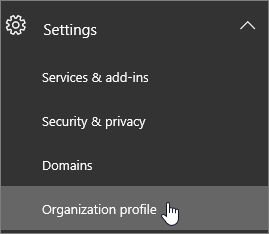

# Modificare la lingua predefinita per i messaggi di saluto e le e-mail

Se sei un [amministratore globale di Office 365](https://support.office.com/article/da585eea-f576-4f55-a1e0-87090b6aaa9d), puoi configurare Skype for Business per riprodurre il messaggio di saluto predefinito della segreteria in un'altra lingua. Il saluto di sistema predefinito è qualcosa come: "Per favore lascia un messaggio a Mario Rossi. Registra il messaggio dopo il segnale acustico. Al termine della registrazione, interrompi la chiamata o premi il tasto cancelletto per altre opzioni". 
  
 **Prima di tutto, leggi questa importante informazione:**
  
- **Le lingue disponibili sono determinate dalla località dell'organizzazione**. Ad esempio, se la tua organizzazione si trova negli Stati Uniti, puoi impostare inglese o spagnolo come lingua predefinita. Se la tua organizzazione si trova in Canada, puoi scegliere fra inglese e francese. Per l'elenco delle lingue disponibili, vedi la sezione [Lingue per saluti e messaggi della segreteria telefonica da Skype for Business](languages-for-voicemail-greetings-and-messages.md).
    
- **Non c'è modo di cambiare la lingua del sistema per una sola persona nell'organizzazione.** Puoi solo cambiare la lingua del saluto per tutti.
    
    > [!NOTE]
    > Gli utenti possono modificare la lingua del saluto attraverso le impostazioni dopo l'accesso. 
  
- **Vuoi registrare il messaggio in uscita della segreteria telefonica?** Vedi [Controllare le opzioni e la segreteria telefonica di Skype for Business](https://support.office.com/article/2deea7f8-831f-4e85-a0d4-b34da55945a8). Per Microsoft teams-gli utenti possono modificare le impostazioni della segreteria telefonica dalle [impostazioni del client desktop teams](https://support.office.com/article/manage-your-call-settings-in-teams-456cb611-3477-496f-b31a-6ab752a7595f)

- **Si desidera modificare la lingua della richiesta della segreteria telefonica?** Per Skype for business- [https://mysettings.lync.com/voicemail](https://mysettings.lync.com/voicemail) e scegli una nuova lingua in **lingua prompt**. Per Microsoft teams-gli utenti possono modificare le impostazioni della segreteria telefonica dalle [impostazioni del client desktop teams](https://support.office.com/article/manage-your-call-settings-in-teams-456cb611-3477-496f-b31a-6ab752a7595f)
    
## Cambiare la lingua di sistema per tutti i membri dell'organizzazione.

1. Accedere con l'account di [amministratore globale di Office 365](https://support.office.com/article/da585eea-f576-4f55-a1e0-87090b6aaa9d) all'indirizzo[https://portal.office.com/adminportal/home](https://portal.office.com/adminportal/home). 
    
2. Nell'interfaccia di amministrazione di Microsoft 365 scegliere **Impostazioni** > **organizzazione profilo**. 
    
     
  
3. Scegliere **Modifica**.
    
    
  
4. Scegli una lingua dall'elenco **Lingua preferita** per tutti i membri dell'organizzazione.
    
5. Scegli **Salva**.
    
## Articoli correlati per l'amministratore

- [Sistema telefonico e piani di chiamata](calling-plan-landing-page.md)
    
- [Configurare i piani per chiamate](set-up-calling-plans.md)
    
- [Pianificare il sistema telefonico in Office 365 con connettività PSTN locale in Skype for Business Server](https://go.microsoft.com/fwlink/?LinkId=717947)
    
## Argomenti correlati

- [Cambiare la lingua visualizzata e il fuso orario in Office 365 per le aziende](https://support.office.com/article/Change-your-display-language-and-time-zone-in-Office-365-for-Business-6f238bff-5252-441e-b32b-655d5d85d15b)
    
- [Aggiungere una lingua o impostare le preferenze di lingua di Office 2010 e versioni successive](https://support.office.com/article/Add-a-language-or-set-language-preferences-in-Office-663d9d94-ca99-4a0d-973e-7c4a6b8a827d)
    
- [Abilitare o cambiare la lingua del layout di tastiera](https://support.office.com/article/Enable-or-change-a-keyboard-layout-language-1c2242c0-fe15-4bc3-99bc-535de6f4f258)
    
  
 
