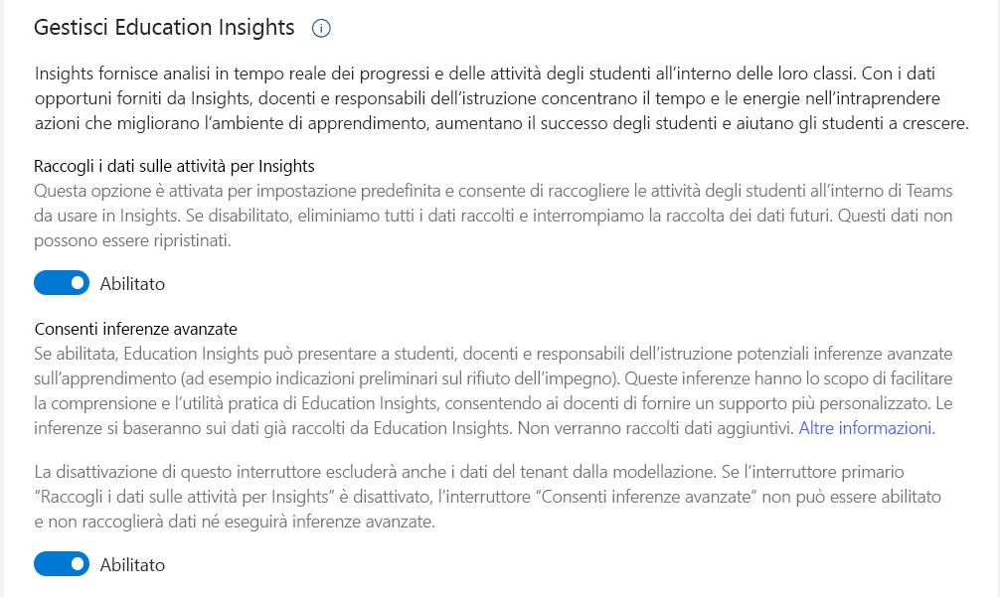

# Guida per amministratori IT a Insights per l’istruzione in Microsoft Teams

Questo documento illustra i passaggi necessari per iniziare a usare Insights per l’istruzione in Microsoft Teams e aiutare docenti e responsabili dell'istruzione ad adottare la piattaforma e a usare correttamente l'app.

## Panoramica

**Ogni studente ha esperienze, competenze ed esigenze diverse.** 
**Insights consente di capire i propri studenti e di rispondere alle loro esigenze.**

Insights fornisce analisi in tempo reale dei progressi e delle attività degli studenti all'interno delle loro classi. Con visualizzazioni facilmente assimilabili, le community scolastiche possono tenere traccia in modo proattivo e semplice delle esperienze degli studenti. I docenti e i responsabili dell'istruzione ricevono dati significativi e affidabili per prendere decisioni informate riguardo ai loro team di classe. Guidati da questi dati, i docenti hanno le informazioni necessarie per garantire che le esigenze emotive, sociali e accademiche dei loro studenti siano soddisfatte.

Le comunità scolastiche possono incanalare i propri sforzi per ottenere un impatto più significativo quando i docenti sanno quali strategie sono più efficaci per i loro studenti. Con i dati opportuni forniti da Insights, docenti e responsabili dell'istruzione concentrano il tempo e le energie nell'intraprendere azioni che migliorano l'ambiente di apprendimento, aumentano il successo degli studenti e aiutano gli studenti a crescere.

## Chi usa Insights?

### Docenti

Un docente è chiunque sia proprietario di un team di classe. I docenti possono includere insegnanti, docenti e professori.

I docenti accedono a Insights a livello di classe. Vedono l'attività degli studenti assegnati alle proprie classi, ma non possono accedere ai dati di altre classi. Insights aiuta i docenti a comprendere e supportare i propri studenti.

Non esistono prerequisiti per l'uso di Insights e i docenti devono solo aggiungere Insights alla barra delle app a sinistra o come scheda a ciascuna delle loro classi in Teams.

I docenti sono definiti secondo gli istituti di istruzione. I docenti devono appartenere a un istituto di istruzione ed essere proprietari del team di classe per visualizzare i dati in Insights.

### Responsabili dell'istruzione

I responsabili dell'istruzione sono tutti quei ruoli dell'istituto che necessitano di una visione organizzativa per comprendere l’impegno, i progressi, il benessere e così via degli studenti. I docenti possono anche essere responsabili dell'istruzione quando sono proprietari di un team di classe e hanno bisogno di qualcosa in più rispetto alla vista della loro classi, come ad esempio il capo di un dipartimento disciplinare.

I responsabili dell'istruzione possono includere dirigenti accademici, capi dipartimento, dirigenti distrettuali, presidi scolastici, dirigenti scolastici, consulenti, responsabili tematici, direttori di programmi, assistenti sociali e psicologi.

I responsabili dell'istruzione ottengono una visione dell'organizzazione che dipende dalle autorizzazioni assegnate dall'amministratore IT. Ad esempio, gli amministratori dei distretti scolastici possono vedere tutte gli istituti di istruzione a cui hanno accesso. Al contrario, un preside o un supervisore scolastico vede solo i livelli e le classi di tale istituto di istruzione.

Supponendo che un supervisore insegni anche, è considerato sia un docente che un dirigente scolastico e può accedere a entrambe le visualizzazioni di Insights (per docenti e responsabili dell'istruzione). In questo caso, Insights aiuta i responsabili dell'istruzione a supportare docenti e studenti.
A livello organizzativo, l'amministratore IT deve connettere il sistema informazioni degli studenti e assegnare autorizzazioni a ogni ruolo per accedere agli istituti o ai reparti a loro pertinenti.

I responsabili dell’istruzione vengono identificati in base agli istituti di istruzione e necessitano anche di *autorizzazioni esplicite* dall’amministratore globale IT per visualizzare i report Insights della propria organizzazione.

> [!NOTE]
> **Per quanto riguarda gli studenti:**
>
> Insights raccoglie i dati sull'attività degli studenti in Teams.
>
> Gli studenti sono membri di un team di classe in Teams. Sono identificati in base alla licenza e **non hanno accesso** all’app o alla scheda Insights (anche se sono i proprietari del team).
>
> Gli utenti guest *non possono* essere considerati studenti.

## Dove trovano Insights gli utenti?

Docenti e responsabili dell'istruzione possono accedere a Insights in modi diversi.

### Docenti

I docenti possono usare questi due metodi:

- [App personale](https://support.microsoft.com/office/747fd8d9-00b0-43e6-bacc-a1bf030b1867): nella barra delle app sinistra di Teams è disponibile una panoramica di tutte le classi attive, con la possibilità di approfondire i dati di una classe.
- [Schede](https://support.microsoft.com/office/1386d1b4-3641-4a23-9b9c-0c6c774c2b6c): Insights per classi specifiche di cui sono proprietari è disponibile in una scheda dal menu di spostamento in alto di un team di classe. Questa scheda consente ai docenti di accedere direttamente ai dati pertinenti quando si trova in tale classe in Teams per vedere i dati nel contesto della classe.

Insights mostra i dati sulle attività da tutti i canali in un team di classe, ma può essere aggiunto solo come scheda ai canali pubblici. La scheda riflette le attività dei membri del team di classe che non sono proprietari, inclusi i docenti che non sono proprietari del team di classe.

In entrambe le visualizzazioni, i docenti possono accedere ai dati della classe. Usando l'app personale, i docenti devono eseguire il drill-down fino a livello di classe, mentre la scheda fornisce l'accesso diretto ai dati della classe.

A livello di classe, se un docente è proprietario di un team di classe, Insights è disponibile senza altre azioni da parte dell'amministratore IT.

### Responsabili dell'istruzione

I responsabili dell'istruzione possono usare Insights come [app personale](https://support.microsoft.com/office/8738d1b1-4e1c-49bd-9e8d-b5292474c347) disponibile nella barra delle app a sinistra di Teams.

A livello organizzativo, l'amministratore IT deve connettere il sistema informazioni degli studenti e assegnare autorizzazioni a ogni ruolo per accedere agli istituti o ai reparti a loro pertinenti.

Ad esempio, un preside vede solo le classi del proprio istituto di istruzione o il capo di un dipartimento vede solo le classi del dipartimento.
I dati degli studenti vengono aggregati a livello di classe, dipartimento, istituto di istruzione e distretto e Microsoft fornisce informazioni approfondite a ogni livello (in base all'autorizzazione di ogni utente). I docenti e i responsabili dell'istruzione possono ingrandire per visualizzare i dati per i singoli studenti.

**Per aggiungere l'app Insights in Teams:**

- Selezionare "**...**" sulla barra dell'app.
- Cercare **Insights** e selezionarlo.
- Si aprirà una schermata con una descrizione. Selezionare **Aggiungi**.

  :::image type="content" source="media/insights-add-personal-app.png" alt-text="Aggiungere Insights a Teams.":::

- Fare clic con il pulsante destro del mouse sull'icona Insights e scegliere **Aggiungi**.

  :::image type="content" source="media/insights-pin-app.png" alt-text="Aggiungere l’app Insights.":::

> [!TIP]
> È anche possibile individuare l'app Insights tramite questo collegamento: [https://aka.ms/addInsights](https://aka.ms/addInsights)

## Quando viene usato Insights?

Insights supporta le community di apprendimento in tutto **il ciclo di apprendimento**. Con metriche in tempo reale su più dimensioni, Insights supporta un ciclo continuo di identificazione, riflessione, discussione e azione tra i membri della community dell'istituto di istruzione.

- **Identificare** come e quando gli studenti interagiscono con i docenti, i materiali del corso e i compagni e come eseguono le attività.
- **Riflettere** sul modo in cui gli input supportano gli studenti per ottenere successo, determinare le aree di crescita e dove è necessaria assistenza.
- **Discutere** i risultati con gli studenti e la community dell'istituto di istruzione per rafforzare le relazioni, la definizione degli obiettivi, l'autovalutazione, ottimizzare la collaborazione e migliorare i risultati.
- **Intraprendere azioni** per sviluppare interventi, fornire feedback sulle aree di crescita, modificare le strategie di insegnamento e identificare il supporto aggiuntivo richiesto.

:::image type="content" source="media/insights-learning-cycle.png" alt-text="Insights supporta le community di apprendimento durante tutto il ciclo di apprendimento.":::

## Come funziona Insights?

Insights produce potenti strumenti di analisi per aiutare i docenti a migliorare i risultati di apprendimento. L'operazione viene eseguita analizzando l'attività degli studenti all'interno di Teams e, facoltativamente, usando i dati del Sistema informativo degli studenti (SIS) forniti per contestualizzare e raggruppare l'attività.

Prima di iniziare a distribuire Insights per il proprio istituto, esaminare rapidamente il funzionamento di Insights, il nostro impegno per l'etica dei dati e le licenze richieste.

### Raccolta dei dati

I dati vengono raccolti per Insights dalle attività di studenti ed docenti in Teams. I dati guest non vengono raccolti.

Insights *non* visualizza i dati relativi ai docenti. L'analisi dei dati fornisce informazioni utili per aiutare nell'insegnamento e nell'apprendimento.

Al momento, i dati vengono raccolti dalle aree seguenti nei team di classe:

|Componenti dei team|Dati raccolti|
|---|---|
|**Attività**|Apertura, consegna e assegnazione dei voti alle attività.|
|**Impegno nel canale**|Visita di un canale, creazione di post, risposta e gradimento di un post, escluso il contenuto della chat.|
|**File**|Carico, download, accesso, modifica, commento e condivisione dei file, escluso il contenuto del file.|
|**Blocco appunti di OneNote per la classe**|Modificare una pagina o una sezione del Blocco appunti (escluso il contenuto della pagina).|
|**Riunioni**|Frequenza, escluso il contenuto della riunione.|
|**[Valutazione della lettura](https://support.microsoft.com/topic/e71705a2-a79a-4d7e-bcef-a1e0aa336017)**|Tasso di accuratezza, parole più impegnative e parole al minuto.|
|**[Reflect](reflect.md)**|Controlli (valori inclusi).|
|**Assistente alla carriera**|Lo studente ha fornito un corso di laurea (campo di studio) e un anno di scuola, attività degli studenti nell'app training per la carriera, tra cui: competenze, interesse per le competenze, interessi di carriera, interessi di apprendimento e attività correlate alla carriera.|

> [!NOTE]
> La maggior parte dei dati raccolti viene visualizzata in Insights entro pochi minuti. La partecipazione alle riunioni di classe (riunioni associate a uno dei canali di classe) compare alcune ore dopo la fine della riunione, in genere fino a 24 ore dopo.

> [!NOTE]
> I dati raccolti in Insights per l'istruzione vengono mantenuti finché l'amministratore IT non disattiva l'interruttore [Education Analytics](#turn-sds-for-insights-on-or-off) o la sottoscrizione Office per il tenant termina. La disattivazione di funzionalità specifiche in Teams non elimina i dati cronologici.

### Privacy e sicurezza

Education Insights, come parte di Microsoft 365, rispetta le normative nazionali, regionali e specifiche del settore per la raccolta e l'uso dei dati, tra cui [GDPR](/compliance/regulatory/gdpr) e il [Family Educational Rights and Privacy Act (FERPA)](/compliance/regulatory/offering-ferpa) che protegge la privacy dei record di istruzione degli studenti.

I dati appartengono all'istituto e Microsoft si limita solo a raccoglierli e ad archiviarli. Il personale Microsoft non può accedere ai dati o visualizzarli, se non per quanto consentito dalla conformità in modo controllato per gestire il servizio, ad esempio per il recupero dei dati.

> [!TIP]
>
> - Visitare il [Centro protezione Microsoft](https://www.microsoft.com/trust-center) per altre informazioni su come Microsoft protegge i dati dell’utente.
> - Visita [offerte di conformità Microsoft](/compliance/regulatory/offering-home) per scoprire in che modo Microsoft 365 aiuta l'istituto a soddisfare gli standard di conformità alle normative.

### Prestazioni e affidabilità

Insights è studiato per gestire un volume elevato di dati raccolti da Teams con prestazioni e affidabilità ottimali. Microsoft non può garantire la disponibilità al 100%, ma si impegna a essere disponibile quanto più possibile per raggiungere tale obiettivo.

Il processo di raccolta dei dati avviene in server distinti dall'installazione della scheda Insights in Teams. La scheda o l'app personale Insights non influisce sulle prestazioni delle applicazioni o sulla larghezza di banda di rete dei docenti e degli studenti che usano altre funzionalità di Teams.

> [!TIP]
> Per altre informazioni, vedere [Indicazioni per le situazioni di larghezza di banda ridotta per Teams per l'istruzione](edu-remote-low-bandwidth.md).

### Archiviazione di dati

Insights è attualmente distribuito in Europa e negli Stati Uniti. I dati per gli utenti basati in Europa sono archiviati in server in Europa. I dati per gli utenti basati in Australia e negli Stati Uniti sono archiviati in server negli Stati Uniti. I dati per gli utenti al di fuori dell'Europa, dell'Australia o degli Stati Uniti verranno archiviati in una delle nostre aree geografiche.

### Utilizzo dei dati in modo etico

Microsoft si impegna a usare i dati in modo responsabile ed etico. Insights segue i principi Microsoft per dati responsabili e intelligenza artificiale. Questo significa che siamo trasparenti sul modo in cui vengono usati i dati e mettiamo al primo posto gli interessi di docenti e studenti.  Microsoft usa gli standard più elevati in materia di sicurezza e privacy, monitora continuamente l'affidabilità e l'accuratezza e assicura la conformità continua per gli istituti di istruzione.

Microsoft ha creato Insights da zero per garantire la protezione dei dati. Siamo consapevoli della potenziale riservatezza dell'uso di questi dati e ci preoccupiamo dei dati e della privacy degli utenti.

#### Dati a supporto dell’apprendimento

Insights mette in evidenza l'apprendimento degli studenti e il coinvolgimento digitale. I dati supportano l'apprendimento e mostrano il livello di coinvolgimento degli studenti sulla piattaforma di apprendimento digitale. Sebbene sia possibile eseguire il drill-down al singolo livello per le attività di classe, Microsoft **non assegna alcun valore positivo o negativo** a queste azioni. Lo scopo dei dati raccolti è supportare studenti e docenti per ottenere il massimo.

I docenti conoscono e comprendono meglio i loro studenti. Le informazioni presentate in Insights possono essere utili per **fornire supporto agli studenti** in uno scenario di apprendimento digitale. Replica le informazioni disponibili in un'esperienza di persona. Si supponga ad esempio che uno studente non sia stato attivo durante un periodo specifico o non abbia completato in tempo tutte le attività la settimana scorsa. I dati vengono mostrati al docente per fornire i giusti stimoli o per controllare lo studente. Il docente rimane responsabile dell’interazione con lo studente o la relativa famiglia, o i relativi tutori, per determinare il motivo per cui è stata o non è stata rilevata una determinata attività.

Insights è stato progettato per supportare studenti e docenti nel sistema dell'ambiente di apprendimento digitale. Insights **non acquisisce direttamente i dati relativi ai docenti**. Oltre ai dati dei singoli studenti, fornisce aggregazioni delle attività degli studenti e dei risultati per uno specifico docente per consentire ai responsabili dell'istruzione di supportare studenti e docenti.

### Licenze

Per accedere a Insights, gli utenti devono avere una licenza A1, A3 o A5 per Microsoft 365 per istituti di istruzione.

*Insights per l'istruzione Premium* è un aggiornamento a pagamento che offre ai responsabili dell'istruzione una visualizzazione a livello di organizzazione dei dati Insights per l'istruzione e un accesso esteso alle visualizzazioni dei dati cronologici per i docenti. Gli istituti di istruzione idonei possono acquistare una licenza per il componente aggiuntivo *Insights per l'istruzione Premium* tramite Enrollment for Education Solutions (EES), Microsoft Cloud Service Provider (CSP) e l'interfaccia di amministrazione di Microsoft 365 (web direct).

Il componente aggiuntivo di Insights per l'istruzione Premium sarà disponibile per le organizzazioni in base all'acquisto delle licenze per tutti gli studenti digitalmente attivi nel tenant.

## Integrazione del sistema informativo degli studenti (SIS)

Fornendo un maggiore numero di dati a Insights, il supporto dei docenti nei confronti degli studenti migliorerà e allo stesso tempo anche il supporto dei responsabili per l’istruzione verso i docenti.

Per fornire informazioni approfondite a livello di organizzazione, è necessario usare [School Data Sync (SDS)](/SchoolDataSync) in modo da connettersi al sistema informativo degli studenti (SIS) per far sì che Insights abbia la struttura gerarchica del sistema didattico mappata correttamente.

La visualizzazione di Insights a livello di classe come docente *non* richiede ciò, in quanto vengono usate la struttura e le autorizzazioni della classe di Teams.

Per altre informazioni, vedere [**Sincronizzare i dati del sistema informativo degli studenti (SIS) con Insights per l'istruzione**](education-insights-sis-data-sync.md).

## Gestione autorizzazioni

Gli amministratori IT possono fornire autorizzazioni a responsabili dell'istruzione, dirigenti di distretto, entità scolastici, insegnanti, consulenti, responsabili delle aree di apprendimento, responsabili del programma, assistenti sociali e assistenti sociali. I docenti ricevono *automaticamente* l'autorizzazione quando sono proprietari di un team di classe.

Per altre informazioni, leggere [**Gestione dell'accesso utenti a Education Insights**](education-insights-manage-access.md).

## Gestire i criteri di configurazione

L'amministratore IT può usare i criteri di configurazione dell'app per installare Insights per impostazione predefinita, per i docenti e i dirigenti all’avvio di Teams. Con i criteri di configurazione è possibile personalizzare Teams per evidenziare Insights, e aggiungerlo alla barra delle app.

Se i docenti vogliono accedere direttamente a ogni classe, possono installare manualmente la scheda Insights nel menu di spostamento in alto. Questa scheda consente ai docenti di accedere direttamente ai dati pertinenti quando si trova in tale classe in Teams per vedere i dati nel contesto della classe.

In entrambe le visualizzazioni, i docenti possono accedere ai dati della classe. Usando l'app personale, i docenti devono eseguire il drill-down fino a livello di classe, mentre la scheda fornisce l'accesso diretto ai dati della classe.

> [!TIP]
> Per altre informazioni, vedere [Criteri e pacchetti di criteri di Teams per l'istruzione](./policy-packages-edu.md).

## Incoraggiare l'adozione di Insights

Fare in modo che l’istituto di istruzione sia entusiasta di usare Insights.

Distribuire ai **docenti** il materiale seguente:

- Consultare la [pagina di supporto di Insights](https://support.microsoft.com/office/27b56255-90c0-47aa-bac3-1c9f50157181) per ulteriore assistenza.
- Diventare subito operativi: [ottenere il PDF di 1 pagina di Insights](https://aka.ms/insights/start).
- Leggere la [guida completa in PDF](https://aka.ms/insights/guide).
- Guardare le [esercitazioni dettagliate](https://aka.ms/insights/resources) su come usare Insights.
- Eseguire il training con il [corso gratuito di Insights](https://aka.ms/insights/course) disponibile in Microsoft Educator Center
- Infine, vedere [questo blog](https://techcommunity.microsoft.com/t5/education-blog/6-ways-to-be-insight-ful-and-support-student-engagement/ba-p/1903091) dedicato a Insights.

Materiale per i **responsabili dell'istruzione**:

- [Pagina di supporto di Insights per le organizzazioni nel settore dell'istruzione](https://support.microsoft.com/office/8738d1b1-4e1c-49bd-9e8d-b5292474c347).

### Attivare e disattivare Insights

Per impostazione predefinita, Insights è attivato, consentendo l'analisi delle attività degli studenti all'interno di Teams per usarle in Insights. È possibile rifiutare esplicitamente Insights, nel qual caso *tutti i dati raccolti per Insights vengono eliminati* e la raccolta dei dati viene interrotta. Se si riattiva Insights, la raccolta dei dati inizierà dal momento in cui il servizio viene riattivato.

Esistono due posizioni in cui è possibile controllare *Insights per l'istruzione*. Entrambe le opzioni hanno lo stesso risultato. Per i clienti che hanno eseguito la transizione da *SDS (versione classica)* a *SDS per il provisioning*, è disponibile solo l'opzione client di Teams.

#### Attivare e disattivare Insights dall'interfaccia di amministrazione di SDS

1. Aprire l'[interfaccia di amministrazione di SDS](https://sds.microsoft.com/).
1. Passare a **Impostazioni** > **Gestisci Insights per l'istruzione**.
1. Attivare o disattivare l'opzione **Raccogli i dati delle attività per Insights**.

#### Attivare e disattivare Insights dal client Teams

1. Se l'app personale *Insights per l'istruzione* non è stata aggiunta, seguire [queste istruzioni](class-insights.md#education-leaders) per aggiungerla.
1. Con un account amministratore di Microsoft 365, aprire la pagina delle **impostazioni di amministrazione** usando l'icona con i puntini di sospensione nell'angolo in alto a destra di *Insights per l'istruzione*.
1. Attivare o disattivare l'opzione **Raccogli i dati delle attività per Insights**.

> [!NOTE]
> Se Insights è stato disattivato, i dati raccolti vengono eliminati. I dati eliminati in seguito a un rifiuto esplicito non possono essere ripristinati in un secondo momento, anche se Insights viene riabilitato.

### Attivare e disattivare le inferenze avanzate in Insights

Quando l'interruttore **Consentire inferenze avanzate** per Insights per l'istruzione è attivato, può presentare a studenti, docenti e responsabili di istruzione inferenze avanzate sulle attività di apprendimento (ad esempio avvisi sul coinvolgimento). Queste inferenze consentono ai docenti di fornire un supporto maggiormente personalizzato agli studenti. L'interruttore controlla anche l'uso dei dati del tenant per la modellazione.

Attivando questo interruttore, non verranno raccolti altri dati oltre ai dati già raccolti da Insights per l'istruzione.

Esistono due posizioni in cui è possibile controllare le *inferenze avanzate*. Entrambe le opzioni hanno lo stesso risultato. Per i clienti che hanno eseguito la transizione da *SDS (versione classica)* a *SDS per il provisioning*, è disponibile solo l'opzione client di Teams.  

#### Attivare e disattivare le inferenze avanzate dall'interfaccia di amministrazione di SDS

1. Aprire l'[interfaccia di amministrazione di SDS](https://sds.microsoft.com/).
1. Passare a **Impostazioni** > **Gestisci Insights per l'istruzione**.
1. Attivare o disattivare l'opzione **Consenti inferenze avanzate**.

#### Attivare e disattivare le inferenze avanzate dal client di Teams

1. Se l'app personale *Insights per l'istruzione* non è stata aggiunta, seguire [queste istruzioni](class-insights.md#education-leaders) per aggiungerla.
1. Con un account amministratore di Microsoft 365, aprire la pagina delle **impostazioni di amministrazione** usando l'icona con i puntini di sospensione nell'angolo in alto a destra di *Insights per l'istruzione*.
1. Attivare o disattivare l'opzione **Consenti inferenze avanzate**.

> [!NOTE]
> Questa commutazione dipende da **Raccogli dati attività per Insights**. La disattivazione di **Raccogliere dati attività per Insights** disabiliterà anche l’interruttore **Consentire inferenze avanzate**.

### Disattivare o attivare SDS

School Data Sync (SDS) consente di automatizzare il processo di importazione e sincronizzazione dei dati del sistema informativo degli studenti (SIS) con Teams.

L'uso di Insights *non* richiede l'uso di SDS. Tuttavia, è possibile scegliere di non usare Insights in qualsiasi momento.

- Per disattivare l'uso di Insights di School Data Sync seguire le istruzioni in [Disabilitazione di SDS per Insights](/schooldatasync/how-to-deploy-sds-for-insights#disabling-sds-for-insights).

- Per riattivarlo, seguire le istruzioni in [Come distribuire SDS per Insights](/schooldatasync/how-to-deploy-sds-for-insights).

### Come eliminare i dati degli utenti da Insights per l'istruzione

Insights archivia le attività degli studenti e dei docenti eseguite in Microsoft Teams per l'istruzione.

Esistono due tipi di dati raccolti dalle informazioni dettagliate:

- **Dati in arrivo**: dati generati nell'ambito delle attività di apprendimento in classe.
- **Dati non in arrivo (privati)**: dati raccolti dall'attività degli studenti in Teams per l'istruzione che non fa parte dell'attività di apprendimento in classe.

I dati completi raccolti dai dati statistici sono elencati[qui](class-insights.md#data-collection).

Per fornire completezza e integrità dei dati per gli intervalli di tempo passati ai docenti e ai responsabili dell'istruzione, per impostazione predefinita Insights non elimina automaticamente i dati dal servizio quando vengono chiusi gli account utente di studenti o docenti. L'amministratore IT dell'organizzazione può richiedere l'eliminazione manuale dei dati di un utente (docente o studente) seguendo questa procedura:

- Aprire un [ticket di supporto](https://aka.ms/edusupport). Il ticket di supporto deve indicare chiaramente la richiesta di eliminazione DSR ai sensi del GDPR e contenere l'ID dell’oggetto utente da eliminare.
Non c'è alcuna possibilità di limitare il set di dati o la finestra temporale per l'eliminazione.
- Nella richiesta l'amministratore IT deve indicare chiaramente il tipo di dati da eliminare per l'utente, tra le opzioni seguenti:
  - Tutti i dati (in arrivo e privati)
  - Tutti i dati privati
  - Solo dati di career coach
- Una volta archiviato, il ticket di supporto attende in coda per una settimana per rispettare i criteri di conservazione minimi per la conformità. È possibile annullare l'operazione durante questo periodo.
- Dopo una settimana, il team Insights per l'istruzione verifica che tutti i dati relativi all'ID utente del tipo specifico come descritto in precedenza siano eliminati dal servizio. Il supporto Microsoft monitora il ticket e informerà l’utente quando il processo è stato completato, entro 28 giorni

## Risoluzione dei problemi

### Perché l'istituto non vede dati in Insights?

Se si tratta di un *nuovo* tenant e non sono *mai* stati visibili dati in Insights, controllare che il tenant sia **verificato come tenant per l'istruzione** per accedere a Insights. Contattare l'account manager Microsoft e chiedere di verificare che il tenant sia configurato correttamente.

Se non si ha un account manager, aprire un ticket. Passare all'[interfaccia di amministrazione di Microsoft 365](https://admin.microsoft.com/AdminPortal/) > **Supporto** > **Nuova richiesta di assistenza**.  Nel titolo del ticket scrivere: "Serve assistenza per la verifica per l'istruzione".

Verificare anche che la raccolta dei dati per Insights sia abilitata. Anche se è attivata per impostazione predefinita, l'amministratore IT potrebbe aver disattivato il servizio e quindi eliminato tutti i dati conservati in Insights.

Per verificarlo, aprire l'[interfaccia di amministrazione di SDS](https://sds.microsoft.com) e passare a **Impostazioni** > **Gestisci Insights per l’istruzione**. Controllare lo stato di ‘Raccogli dati attività per Insights’.

Se è disattivato, riattivarlo. Insights inizierà a raccogliere dati, ma per vederli nei report possono essere necessarie fino a 24 ore.

### Perché vengono visualizzati solo i dati di alcuni studenti o classi e non tutti?

I dati vengono raccolti solo per gli studenti *con licenza*, quindi il motivo più probabile è che si abbiano studenti guest che partecipano alle lezioni e i loro dati non vengono raccolti. È possibile che ne venga visualizzato il nome, ma senza dati.

Controllare lo stato degli studenti per assicurarsi che tutti dispongano di licenze per studenti.

### Perché i docenti non vedono i dati delle riunioni?

La visualizzazione dei dati delle riunioni nei report di Insights può richiedere fino a 24 ore. Quindi, verificare che sia trascorso tempo sufficiente.

Verificare anche che gli studenti non* abbiano [partecipato alla riunione della classe senza un account di Teams](https://support.microsoft.com/office/c6efc38f-4e03-4e79-b28f-e65a4c039508). In uno scenario di questo tipo, l'attività degli studenti non viene raccolta.

> [!TIP]
> Per i docenti che vogliono tenere traccia della partecipazione degli studenti, si può consigliare di inviare un messaggio durante la riunione chiedendo agli studenti di rispondere. In questo modo, entro pochi minuti la partecipazione verrà registrata.

> [!NOTE]
> Se non si è trovata una risposta alla propria domanda, [aprire un ticket di supporto](https://aka.ms/edusupport). Includere gli screenshot pertinenti che rappresentano il problema e la data in cui si è verificato. Aggiungere gli eventuali altri dati che si pensa potrebbero essere utili per risolvere il problema.

### Quali licenze occorrono per attivare Insights per l'istruzione Premium?

Per abilitare Insights per l'istruzione Premium per l'organizzazione, il tenant deve acquistare le licenze in base al numero di studenti digitalmente attivi nel tenant dell'organizzazione. Ovvero per tutti gli studenti che usano una classe di Teams come parte del lavoro dell'istituto di istruzione per attività come riunioni, comunicazioni, chat, attività, modifica di file, blocco appunti della classe o Reflect.
