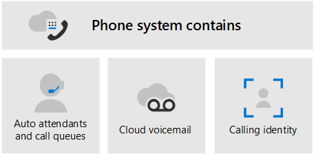

# Pianificare la soluzione vocale di Teams 

Questo articolo consente di decidere quale soluzione vocale Microsoft è adatta alla propria organizzazione. Dopo aver deciso, l'articolo fornisce una roadmap per il contenuto che consentirà di implementare la soluzione scelta. 

Si potrebbe desiderare il &mdash; sistema telefonico di soluzione più semplice con il piano di chiamata. Questa è la soluzione all-in-the-cloud di Microsoft che fornisce funzionalità PBX (Private Branch Exchange) e chiamate alla rete PSTN (Public Switched Telephone Network), come illustrato nel diagramma seguente. Con questa soluzione, Microsoft è il gestore PSTN.

Se rispondi sì alle seguenti, il sistema telefonico con il piano di chiamata è la soluzione giusta per te:

- Il piano di chiamata è disponibile nella tua area geografica.
- Non è necessario mantenere il gestore PSTN corrente.
- Si vuole usare l'accesso gestito da Microsoft alla rete PSTN.

Tuttavia, la situazione potrebbe essere più complessa. Ad esempio, potresti avere uffici in posizioni in cui il piano di chiamata non è disponibile. In alternativa, potrebbe essere necessaria una soluzione combinata che supporti una distribuzione complessa e multinazionale, con requisiti diversi per le diverse posizioni geografiche. Microsoft supporta una combinazione di soluzioni: 

- Sistema telefonico con un piano per le chiamate
- Sistema telefonico con il proprio gestore PSTN con routing diretto
- Una soluzione combinata che usa sia il sistema telefonico con il piano di chiamata che il sistema telefonico con routing diretto

## Cosa occorre leggere?

**Obbligatorio per tutti.** Alcune delle sezioni di questo articolo riguardano tutte le organizzazioni. Ad esempio, tutti dovrebbero leggere informazioni sul sistema telefonico e capire le opzioni per la connessione alla rete PSTN (Public Switched Telephone Network). 

| Obbligatorio per tutti | Descrizione |
| :------------|:-------|
| [**Sistema telefonico**](#phone-system) | Tecnologia Microsoft per l'abilitazione del controllo delle chiamate e delle funzionalità Private Branch Exchange (PBX) nel cloud Microsoft 365 con Microsoft teams. |
| [**Opzioni di connettività PSTN (Public Switched Telephone Network)**](#public-switched-telephone-network-connectivity-options) | Una scelta tra l'uso di Microsoft come gestore di telefonia o la connessione del proprio gestore di telefonia a Microsoft teams tramite routing diretto. In combinazione con il sistema telefonico, le opzioni di connettività PSTN consentono agli utenti di effettuare telefonate in tutto il mondo.|

**A seconda dei requisiti.** Alcune delle sezioni di questo articolo sono pertinenti a seconda della distribuzione e dei requisiti esistenti. Ad esempio, Location-Based routing è richiesto solo per i clienti di routing diretto in posizioni geografiche che non consentono l'esclusione dei pedaggi.

Prendere in considerazione le configurazioni aggiuntive che potrebbero essere necessarie:

| A seconda dei requisiti | Descrizione |
| :------------|:-------|
| [**Numeri di telefono da Microsoft**](#phone-numbers-from-microsoft) | Come ottenere e gestire i numeri di telefono da Microsoft e come trasferire i numeri esistenti a Microsoft. Leggere questo articolo se è necessario ottenere i numeri di telefono per il piano di chiamate Microsoft, trasferire i numeri esistenti, ottenere numeri di servizio e così via. |
| [**Dial plan e routing delle chiamate**](#dial-plans-and-call-routing) | Come configurare e gestire i dial plan che traducono i numeri di telefono comunicati in un formato alternativo (in genere formato E. 164) per l'autorizzazione alle chiamate e il routing delle chiamate. Leggere questo articolo per informazioni sui dial plan e se è necessario specificare i dial plan per l'organizzazione.|
| [**Chiamate di emergenza**](#emergency-calling) | Come gestire e configurare le chiamate di emergenza &mdash; a seconda dell'opzione di connettività PSTN. Leggere questa sezione se si usa Microsoft Calling Plan o Direct routing ed è necessario capire come gestire le chiamate di emergenza per l'organizzazione. |
| [**Routing basato sulla posizione per il routing diretto**](#location-based-routing-for-direct-routing) |Come usare Location-Based routing (LBR) per limitare l'esclusione dei pedaggi per gli utenti di Microsoft teams in base alla loro posizione geografica. Leggere questa sezione se l'organizzazione usa il routing diretto in una posizione che non consente l'esclusione dei pedaggi.
| [**Topologia di rete per le caratteristiche vocali cloud**](#network-topology-for-voice-features) | Se l'organizzazione sta distribuendo Location-Based routing (LBR) per il routing diretto o le chiamate di emergenza dinamiche, è necessario configurare le impostazioni di rete per l'uso con queste funzionalità in Microsoft teams. Leggere questa sezione se si implementa LBR per il routing diretto o se si implementano chiamate di emergenza dinamiche con il piano di chiamata o il routing diretto. |
| [**Eseguire la migrazione della soluzione vocale esistente**](#migrate-your-existing-voice-solution-to-teams) | Cosa è necessario pensare quando si esegue la migrazione della soluzione vocale a teams.  Leggere questa sezione se si esegue la migrazione da una soluzione vocale esistente a teams. 

> [!Important]
> Questo articolo si incentra sulle soluzioni vocali con Microsoft teams. Mentre le soluzioni con Skype for business online sono ancora disponibili (come descritto in soluzioni per la [telefonia Microsoft](https://docs.microsoft.com/SkypeForBusiness/hybrid/msft-telephony-solutions)), è importante capire che Skype for business online verrà ritirato il 31 luglio 2021.  Dopo tale data, il servizio Skype for business online non sarà più accessibile. Inoltre, la connettività PSTN tra l'ambiente locale &mdash; sia tramite Skype for Business Server che Cloud Connector Edition &mdash; e Skype for business online non saranno più supportate. Questo articolo introduce le soluzioni vocali di teams e come è possibile connettere la rete di telefonia locale, se necessario, ai team usando il routing diretto.

## Sistema telefonico

Sistema telefonico è la tecnologia Microsoft per l'abilitazione del controllo delle chiamate e delle funzionalità Private Branch Exchange (PBX) in Microsoft 365 o Office 365 cloud con Microsoft teams.

Sistema telefonico compatibile con team o client Skype for business e dispositivi certificati. Il sistema telefonico consente di sostituire il sistema PBX esistente con un set di funzionalità fornite direttamente da Microsoft 365 o Office 365. 

Le chiamate tra gli utenti dell'organizzazione vengono gestite internamente all'interno del sistema telefonico e non vanno mai alla rete PSTN (Public Switched Telephone Network). Questo si applica alle chiamate tra gli utenti dell'organizzazione situate in aree geografiche diverse, eliminando i costi interurbani per queste chiamate interne.

Questo articolo introduce le caratteristiche e le funzionalità chiave del sistema telefonico seguente e le decisioni di distribuzione che è necessario prendere in considerazione:

- [Operatori automatici e code delle chiamate](#auto-attendants-and-call-queues)
- [Cloud Voicemail](#cloud-voicemail)
- [Chiamata dell'identità](#calling-identity)

Per informazioni su tutte le caratteristiche del sistema telefonico e su come configurare il sistema telefonico, vedere gli articoli seguenti:

- [Vantaggi offerti dal Sistema telefonico](here-s-what-you-get-with-phone-system.md)
- [Configurare il sistema telefonico nell'organizzazione](setting-up-your-phone-system.md) 
  Descrive come acquistare e assegnare licenze di sistema telefonico, gestire i numeri di telefono e configurare i crediti di comunicazione per i numeri verdi. 

Per informazioni sulla gestione dei dispositivi supportati, vedere [gestire i dispositivi in Microsoft teams](devices/device-management.md) e [Teams Marketplace](https://www.microsoft.com/microsoft-365/microsoft-teams/across-devices?ms.url=officecomteamsdevices&rtc=1).

### Operatori automatici e code di chiamata

Gli operatori automatici consentono di configurare le opzioni di menu per instradare le chiamate in base all'input del chiamante. Le code di chiamata sono aree di attesa per i chiamanti. Gli operatori automatici e le code di chiamata usati insieme possono facilmente instradare i chiamanti alla persona o al reparto appropriato dell'organizzazione.

Per informazioni sugli operatori automatici e sulle code di chiamata, vedere gli articoli seguenti:

- [Pianificare gli operatori automatici di teams e le code di chiamata](plan-auto-attendant-call-queue.md)
- [Configurare un operatore automatico](create-a-phone-system-auto-attendant.md)
- [Creare una coda di chiamata](create-a-phone-system-call-queue.md) 
- [Case Study di Contoso: operatori automatici e code di chiamata](voice-case-study-call-queues.md) 
  Descrive in che modo una società multinazionale fittizia, contoso, ha implementato gli operatori automatici e le code di chiamata per la soluzione vocale.

### Cloud Voicemail

Cloud voicemail, alimentato da servizi di Azure voicemail, supporta i depositi della segreteria telefonica solo alle cassette postali di Exchange. Non supporta sistemi di posta elettronica di terze parti. 

Cloud Voicemail include la trascrizione della segreteria telefonica, che è abilitata per tutti gli utenti dell'organizzazione per impostazione predefinita. Le esigenze aziendali potrebbero richiedere la disattivazione della trascrizione della segreteria telefonica per utenti specifici o tutti nell'organizzazione.

Solo per gli utenti online, cloud Voicemail viene configurato automaticamente e provisionato per gli utenti dopo l'assegnazione di una licenza per il sistema telefonico. Per gli utenti del sistema telefonico con una cassetta postale di Exchange, sarà necessario eseguire passaggi di configurazione aggiuntivi. 

Per altre informazioni su cloud voicemail e sulla relativa configurazione, vedere gli articoli seguenti:

- [Configurare Cloud Voicemail](set-up-phone-system-voicemail.md)
- [Impostare i criteri per la segreteria telefonica nell'organizzazione](set-up-phone-system-voicemail.md#setting-voicemail-policies-in-your-organization)

### Chiamata dell'identità

Per impostazione predefinita, tutte le chiamate in uscita usano il numero di telefono assegnato come identità di chiamata (ID chiamante). Il destinatario della chiamata può identificare rapidamente il chiamante e decidere se accettare o rifiutare la chiamata. Per informazioni sulla configurazione dell'ID chiamante o per modificare o bloccare l'ID chiamante, vedere [impostare l'ID chiamante per un utente](set-the-caller-id-for-a-user.md). 

## Opzioni di connettività della rete telefonica pubblica commutata

Il sistema telefonico offre funzionalità PBX complete per l'organizzazione. Tuttavia, per consentire agli utenti di effettuare chiamate all'esterno dell'organizzazione, è necessario connettere il sistema telefonico alla rete PSTN (Public Switched Telephone Network). Per connettere il sistema telefonico alla rete PSTN, è possibile scegliere una delle opzioni seguenti:

- [**Sistema telefonico con un piano per le chiamate**](#phone-system-with-calling-plan). Una soluzione all-in-the-cloud con Microsoft come gestore PSTN.

- [**Sistema telefonico con il proprio gestore PSTN**](#phone-system-with-own-pstn-carrier-with-direct-routing) tramite routing diretto per connettere l'ambiente locale ai team.

È anche possibile scegliere una combinazione di opzioni, che consente di progettare una soluzione per un ambiente complesso oppure di gestire una migrazione a più passaggi (altre informazioni sulla migrazione in un secondo momento).

### Sistema telefonico con un piano per le chiamate 

Come descritto in precedenza in questo articolo, il sistema telefonico con Calling Plan è la soluzione vocale di Microsoft all-in-the-cloud per gli utenti di teams. Questa è l'opzione più semplice che connette Microsoft Phone System alla rete PSTN (Public Switched Telephone Network) per consentire le chiamate a telefoni fissi e cellulari in tutto il mondo. Con questa opzione, Microsoft fornisce la funzionalità PBX (Private Branch Exchange) per l'organizzazione e funge da gestore PSTN, come illustrato nel diagramma seguente:

Se rispondi sì alle seguenti, il sistema telefonico con il piano di chiamata è la soluzione giusta per te:

- Il piano di chiamata è disponibile nella tua area geografica.
- Non è necessario mantenere il gestore PSTN corrente.
- Si vuole usare l'accesso gestito da Microsoft alla rete PSTN.

Con questa opzione: 

- Si ottiene il sistema telefonico Microsoft con piani di chiamate nazionali o internazionali aggiunti che consentono di chiamare telefoni in tutto il mondo (a seconda del livello di servizio concesso in licenza).

- Non è necessario eseguire la distribuzione o la manutenzione di una distribuzione locale &mdash; perché il piano di chiamata funziona da Microsoft 365 o Office 365.

- Nota: se necessario, puoi scegliere di connettere un SBC (Session Border Controller) supportato tramite il routing diretto per l'interoperabilità con PBX di terze parti, dispositivi analogici e altre apparecchiature di telefonia di terze parti supportate da SBC.

Questa opzione richiede la connessione senza interruzioni a Microsoft 365 o Office 365.

Per altre informazioni sul piano delle chiamate, vedere gli articoli seguenti:

- [Qual è il piano di chiamata adatto alle proprie esigenze?](calling-plan-landing-page.md)
- [Come acquistare un piano di chiamata](calling-plans-for-office-365.md)
- [Disponibilità di Piano di chiamata in Paesi e aree geografiche](https://docs.microsoft.com/microsoftteams/country-and-region-availability-for-audio-conferencing-and-calling-plans/country-and-region-availability-for-audio-conferencing-and-calling-plans)
- [Configurare un piano per le chiamate](set-up-calling-plans.md)

### Sistema telefonico con il proprio gestore PSTN con routing diretto

Questa opzione connette il sistema telefonico Microsoft alla rete di telefonia usando il routing diretto, come illustrato nel diagramma seguente: 

Se rispondi sì alle domande seguenti, il sistema telefonico con routing diretto è la soluzione giusta per te:

- Si vuole usare teams con sistema telefonico.
- È necessario mantenere il gestore PSTN corrente.
- Si vuole mescolare il routing, con alcune chiamate che passano attraverso il piano di chiamata, alcune tramite il gestore.
- È necessario interagire con PBX e/o apparecchiature di terze parti, ad esempio i pagers generali degli Stati Uniti, i dispositivi analogici e così via.

Con questa opzione:

- Si connette il proprio SBC supportato a Microsoft Phone System senza bisogno di altri software locali.

- Puoi usare virtualmente qualsiasi gestore di telefonia con il sistema telefonico Microsoft.

- Puoi scegliere di configurare e gestire questa opzione oppure può essere configurata e gestita dal gestore o dal partner (Chiedi se il gestore o il partner offre questa opzione).

- È possibile configurare l'interoperabilità tra l'apparecchiatura per la telefonia &mdash; , ad esempio dispositivi PBX e analogici di terze parti &mdash; e sistema telefonico Microsoft.

Questa opzione richiede le operazioni seguenti:

- Connessione senza interruzioni a Microsoft 365 o Office 365.

- Distribuzione e gestione di un SBC supportato.

- Contratto con un vettore di terze parti.
  A meno che non venga distribuito come opzione per la connessione a PBX di terze parti, a dispositivi analogici o ad altre apparecchiature per la telefonia per gli utenti che si trovano nel sistema telefonico con un piano per le chiamate.

Per altre informazioni sul routing diretto, vedere gli articoli seguenti:

- [Instradamento diretto di Sistema telefonico](direct-routing-landing-page.md)
- [Pianificare Instradamento diretto](direct-routing-plan.md)
- [Configurare Instradamento diretto](direct-routing-configure.md)
- [Gestire i criteri di routing vocale per l'uso con routing diretto](manage-voice-routing-policies.md)
- [Pianificare l'instradamento basato sulla posizione per Instradamento diretto](location-based-routing-plan.md)
- [Elenco di Session Border Controller certificati per Instradamento diretto](direct-routing-border-controllers.md)

## Numeri di telefono da Microsoft

Microsoft ha due tipi di numeri di telefono disponibili: i numeri di *abbonato* (utente), che possono essere assegnati agli utenti dell'organizzazione e i numeri di *servizio* , disponibili come numeri di servizio a pagamento e a pagamento. I numeri di servizio hanno una capacità di chiamata concorrente più elevata rispetto ai numeri di abbonato e possono essere assegnati a servizi come audioconferenza, operatori automatici o code di chiamata.

Sarà necessario decidere:

- Quali posizioni utente richiedono nuovi numeri di telefono da Microsoft?
- Quale tipo di numero di telefono (abbonato o servizio) è necessario? 
- Come si trasferiscono I numeri di telefono esistenti in teams?

Per altre informazioni sulla gestione dei numeri di telefono nell'organizzazione, ad esempio per ottenere nuovi numeri o per trasferire i numeri in uscita, vedere gli articoli seguenti:

- [Gestire i numeri di telefono per la propria organizzazione](manage-phone-numbers-for-your-organization/manage-phone-numbers-for-your-organization.md) 
- [Diversi tipi di numeri di telefono usati per il piano chiamante](different-kinds-of-phone-numbers-used-for-calling-plans.md)
- [Recuperare numeri di telefono per gli utenti](getting-phone-numbers-for-your-users.md)
- [Trasferire i numeri di telefono in Microsoft Teams](phone-number-calling-plans/transfer-phone-numbers-to-teams.md)

## Dial plan e routing delle chiamate

Un dial plan è un set di regole di normalizzazione che traducono i numeri di telefono composti in un formato alternativo (in genere formato E. 164) per l'autorizzazione alle chiamate e il routing delle chiamate.

Sarà necessario decidere quanto segue: 

- L'organizzazione ha bisogno di un dial plan personalizzato?
- Quali utenti richiedono un dial plan personalizzato?
- Quale piano di dial tenant deve essere assegnato a ogni utente?

Per altre informazioni, vedere gli articoli seguenti: 

- [Che cosa sono i piani di chiamata?](what-are-dial-plans.md)
- [Pianificare i piani di chiamata del tenant](what-are-dial-plans.md#planning-for-tenant-dial-plans)
- [Creare e impostare piani di chiamata](create-and-manage-dial-plans.md)

## Chiamate di emergenza

La configurazione delle chiamate di emergenza è diversa a seconda dell'opzione di connettività PSTN: piano per chiamate Microsoft o routing diretto. Chiamate di emergenza dinamiche per Microsoft Calling Plan e Phone System Direct routing offre la possibilità di configurare e instradare telefonate di emergenza e informare il personale di sicurezza in base alla posizione corrente del client teams. Per altre informazioni sui concetti e la terminologia delle chiamate di emergenza e su come configurare le chiamate di emergenza dinamiche, vedere gli articoli seguenti:

- [Gestire le chiamate di emergenza](what-are-emergency-locations-addresses-and-call-routing.md)
- [Pianificare e configurare chiamate di emergenza dinamiche](configure-dynamic-emergency-calling.md)
- [Case Study di Contoso: chiamate di emergenza](voice-case-study-emergency-calling.md) 
  Descrive in che modo una società multinazionale fittizia, contoso, ha implementato le chiamate di emergenza per l'organizzazione.

## Location-Based routing per il routing diretto

In alcuni paesi e aree geografiche è vietato aggirare il provider PSTN (Public Switched Telephone Network) per ridurre i costi delle chiamate interurbane. Location-Based routing per il routing diretto consente di limitare l'esclusione dei pedaggi per gli utenti di Microsoft teams in base alla loro posizione geografica. Per altre informazioni su come pianificare e configurare Location-Based routing (LBR), vedere gli articoli seguenti:

- [Pianificare l'instradamento basato sulla posizione per Instradamento diretto](location-based-routing-plan.md)
- [Configurare le impostazioni di rete per l'instradamento basato sulla posizione](location-based-routing-configure-network-settings.md)
- [Abilitare l'instradamento basato sulla posizione per Instradamento diretto](location-based-routing-enable.md)
- [Case Study di Contoso: routing Location-Based](voice-case-study-location-based-routing.md) 
  Descrive in che modo una società multinazionale fittizia, contoso, ha implementato Location-Based routing per l'organizzazione.

## Topologia di rete per le funzionalità vocali

Se si sta distribuendo chiamate di emergenza dinamiche o Location-Based routing per il routing diretto, è necessario configurare le impostazioni di rete per l'uso con queste funzionalità in Microsoft teams. Per informazioni su come configurare le impostazioni di rete per le aree di rete, i siti di rete, le subnet di rete e gli indirizzi IP attendibili, vedere gli articoli seguenti:

- [Impostazioni di rete per le caratteristiche vocali cloud in Microsoft teams-concetti e terminologia](cloud-voice-network-settings.md)
- [Gestire la topologia di rete per le funzionalità vocali di cloud in Microsoft Teams](manage-your-network-topology.md)

## Eseguire la migrazione della soluzione vocale esistente a teams

Per un'organizzazione che esegue l'aggiornamento a teams, l'obiettivo finale è quello di trasferire tutti gli utenti alla modalità TeamsOnly. L'uso del sistema telefonico con teams è supportato solo quando l'utente è in modalità TeamsOnly. Se sono necessarie informazioni di base sull'aggiornamento a teams, iniziare da qui:

- [Guida introduttiva all'aggiornamento di Microsoft Teams](upgrade-start-here.md)
- [Informazioni sul framework di aggiornamento](upgrade-framework.md)
- [Eseguire l'aggiornamento da Skype for business a teams — per gli amministratori IT](upgrade-to-teams-on-prem-overview.md)

Quando si esegue la migrazione della soluzione vocale, quando si passa alla modalità TeamsOnly sono disponibili quattro possibili scenari di chiamata:

- [**Un utente in Skype for business online con un piano di chiamata Microsoft**](upgrade-to-teams-on-prem-pstn-considerations.md#from-skype-for-business-online-with-microsoft-calling-plans). Dopo l'aggiornamento, questo utente continuerà ad avere un piano per le chiamate Microsoft.

- **[Un utente in Skype for business online con funzionalità vocali locali](upgrade-to-teams-on-prem-pstn-considerations.md#from-skype-for-business-online-with-on-premises-voice) tramite Skype for business locale o Cloud Connector Edition**. L'aggiornamento dell'utente ai team deve essere coordinato con la migrazione dell'utente per indirizzare il routing per garantire che l'utente di TeamsOnly abbia funzionalità PSTN.

- **[Un utente in Skype for business locale con Enterprise Voice](upgrade-to-teams-on-prem-pstn-considerations.md#from-skype-for-business-server-on-premises-with-enterprise-voice-to-direct-routing), che si sposterà in online e continuerà a mantenere la connettività PSTN locale**. La migrazione di questo utente a teams richiede lo spostamento dell'account Skype for business locale dell'utente nel cloud e il coordinamento di tale spostamento con la migrazione dell'utente al routing diretto. 

- **[Un utente in Skype for business locale con Enterprise Voice](upgrade-to-teams-on-prem-pstn-considerations.md#from-skype-for-business-server-on-premises-with-enterprise-voice-to-microsoft-calling-plan), che si sposterà in online e userà un piano di chiamata Microsoft**.  La migrazione di questo utente a teams richiede lo spostamento dell'account Skype for business locale dell'utente nel cloud e il coordinamento di tale spostamento con una a) la porta del numero di telefono di tale utente in un piano di chiamata Microsoft o B) che assegna un nuovo numero di abbonato dalle aree disponibili.

Per altre informazioni su come implementare la migrazione vocale per ognuno di questi scenari, &mdash; incluse le informazioni su quando è necessario configurare la connettività ibrida e come eseguire la migrazione degli utenti con la funzionalità vocale locale per il routing diretto, &mdash; vedere gli articoli seguenti:

- [Considerazioni PSTN quando si esegue l'aggiornamento a teams, per gli amministratori IT](upgrade-to-teams-on-prem-pstn-considerations.md)

- [Case Study per la migrazione vocale contoso](voice-case-study-overview.md) 
  Il case study descrive in che modo una società multinazionale fittizia, contoso, ha implementato una soluzione per la voce teams per la propria organizzazione. Contiene gli articoli seguenti:

  - [Piano di aggiornamento Teams](voice-case-study-migration-plan.md)
  - [Sistema telefonico e opzioni di connettività PSTN](voice-case-study-phone-system.md)
  - [Implementazione del routing basato sulla posizione](voice-case-study-location-based-routing.md)
  - [Chiamate di emergenza](voice-case-study-emergency-calling.md)
  - [Operatori automatici e code delle chiamate](voice-case-study-call-queues.md)
  - [Audioconferenza](voice-case-study-audio-conferencing.md)

