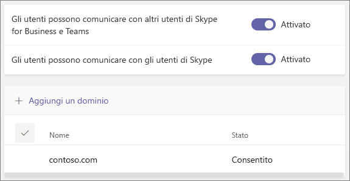

# Chiamare, chattare e collaborare con persone esterne all'organizzazione in Microsoft TeamsCall, chat, and collaborate with people outside your organization in Microsoft Teams

Se è necessario comunicare e collaborare con persone esterne all'organizzazione, è possibile scegliere tra le due opzioni disponibili in Microsoft Teams:When you need to communicate and collaborate with people outside your organization, Microsoft Teams has two options:

- **Accesso esterno**: tipo di federazione che consente agli utenti di trovare, chiamare e chattare con persone di altre organizzazioni.**External access** - A type of federation that allows users to find, call, and chat with people in other organizations. Queste persone non possono essere aggiunte ai team a meno che non vengano invitate come guest.These people cannot be added to teams unless they are invited as guests.
- **Accesso guest**: consente di invitare persone esterne all'organizzazione a partecipare a un team.**Guest access** - Guest access allows you to invite people from outside your organization to join a team. Le persone invitate ottengono un account guest in Azure Active Directory.Invited people get a guest account in Azure Active Directory.

Tenere presente che Teams consente di invitare alle riunioni anche persone esterne all'organizzazione.Note that Teams allows you to invite people outside your organization to meetings. Per questa operazione non è necessario configurare l'accesso esterno o guest.This does not require external or guest access to be configured.

## Accesso esterno (federazione)External access (federation)

Configurare l'accesso esterno se è necessario trovare, chiamare, chattare e configurare riunioni con persone esterne all'organizzazione che usano Teams, Skype for Business (online o in locale) o Skype.Set up external access if you need to find, call, chat, and set up meetings with people outside your organization who use Teams, Skype for Business (online or on premises) or Skype. 

Per impostazione predefinita, l'accesso esterno è abilitato per tutti i domini.By default, external access is enabled for all domains. È possibile limitare l'accesso esterno consentendo o bloccando domini specifici o disattivandolo.You can restrict external access by allowing or blocking specific domains or by turning it off.

Per configurare l'accesso esterno, vedere [Gestire l'accesso esterno](manage-external-access.md).To configure external access, see [Manage external access](manage-external-access.md). 

## Accesso guestGuest access

Usare l'accesso guest per aggiungere una persona esterna all'organizzazione a un team, in cui potrà chattare, chiamare, partecipare alle riunioni e collaborare ai file.Use guest access to add a person from outside your organization to a team, where they can chat, call, meet, and collaborate on files. Un utente guest può usufruire di quasi tutte le stesse funzionalità di Teams di un membro del team nativo.A guest can be given nearly all the same Teams capabilities as a native team member.

Gli utenti guest vengono aggiunti all'istanza di Azure Active Directory dell'organizzazione come utenti B2B e devono accedere a Teams usando l'account guest.Guests are added to your organization's Azure Active Directory as B2B users and must sign in to Teams using their guest account. Questo significa che per accedere all'organizzazione potrebbero doversi disconnettere dalla propria organizzazione.This means that they may have to sign out of their own organization to sign in to your organization.

Per configurare l'accesso guest per Teams, vedere [Collaborare con gli utenti guest in un team](https://docs.microsoft.com/microsoft-365/solutions/collaborate-as-team).To configure guest access for Teams, see [Collaborate with guests in a team](https://docs.microsoft.com/microsoft-365/solutions/collaborate-as-team).

## Confronto tra accesso esterno e accesso guestCompare external and guest access

Le tabelle seguenti mostrano le differenze nell'uso dell'accesso esterno (federazione) e di quello guest.The following tables show the differences between using external access (federation) and guests. In entrambi i casi le persone che non fanno parte dell'organizzazione vengono identificate come esterne per gli utenti.In both cases, people outside your organization are identified to your users as being external.

### Operazioni eseguibili dagli utentiThings your users can do

| Gli utenti possonoUsers can | Utenti con accesso esternoExternal access users | Utenti guestGuests |
|---------|-----------------------|--------------------|
| Chattare con utenti di altre organizzazioniChat with someone in another organization | SìYes | SìYes |
| Chiamare utenti di altre organizzazioniCall someone in another organization | SìYes | SìYes |
| Vedere se una persona di un'altra organizzazione è disponibile per chiamate o chatSee if someone from another organization is available for call or chat | SìYes | Sì1Yes1 |
| Cercare persone in altre organizzazioniSearch for people in other organizations | Sì2Yes2 | NoNo |
| Condividere fileShare files | NoNo | SìYes |
| Visualizzare il messaggio fuori sede diSee the out-of-office message of | NoNo | SìYes |
| Bloccare utenti di altre organizzazioniBlock someone in another organization someone in another organization | NoNo | SìYes |
| Usare le @menzioniUse @mentions | Sì3Yes3 | SìYes |

### Operazioni eseguibili da persone esterne all'organizzazioneThings people outside your organization can do

| Le persone esterne all'organizzazione possonoPeople outside your organization can | Utenti con accesso esternoExternal access users | Utenti guestGuests |
|---------|-----------------------|--------------------|
| Accedere alle risorse di TeamsAccess Teams resources | NoNo | SìYes |
| Essere aggiunti a una chat di gruppoBe added to a group chat | NoNo | SìYes |
| Essere invitati a una riunioneBe invited to a meeting | SìYes | SìYes |
| Effettuare chiamate privateMake private calls | SìYes | Sì5Yes5 |
| Visualizzare il numero di telefono dei partecipanti alla riunione con accesso tramite telefonoView the phone number for dial-in meeting participants | No4No4 | SìYes |
| Usare il video IPUse IP video | SìYes | Sì5Yes5 |
| Usare la condivisione dello schermoUse screen sharing | Sì3Yes3 | Sì5Yes5 |
| Usare Riunione immediataUse meet now | NoNo | Sì5Yes5 |
| Modificare i messaggi inviatiEdit sent messages | Sì3Yes3 | Sì5Yes5 |
| Eliminare i messaggi inviatiDelete sent messages | Sì3Yes3 | Sì5Yes5 |
| Usare Giphy nelle conversazioniUse Giphy in conversation | Sì3Yes3 | Sì5Yes5 |
| Usare meme nelle conversazioniUse memes in conversation | Sì3Yes3 | Sì5Yes5 |
| Usare adesivi nelle conversazioniUse stickers in conversation | Sì3Yes3 | Sì5Yes5 |
| La presenza viene visualizzataPresence is displayed | SìYes | SìYes |
| Usare le @menzioniUse @mentions | Sì3Yes3 | SìYes |

 

1 A condizione che l'utente sia stato aggiunto come guest e che sia stato eseguito l'accesso con l'account guest.1 Provided that the user has been added as a guest and is signed with the guest account. 
2Solo tramite posta elettronica o indirizzo SIP (Session Initiation Protocol).2 Only by email or Session Initiation Protocol (SIP) address. 
3 Chat 1:1 supportata per utenti Solo Teams a utenti Solo Teams di due organizzazioni diverse.3 Supported for 1:1 chat for Teams Only to Teams Only users from two different organizations.  
4 Per impostazione predefinita, i partecipanti esterni non possono vedere i numeri di telefono dei partecipanti che hanno eseguito l'accesso tramite telefono.4 By default, external participants can't see the phone numbers of dialed-in participants. Se si vuole mantenere la privacy di tali numeri di telefono, selezionare **Toni** per **Tipo di annuncio in entrata/uscita**, in modo da evitare che i numeri vengano letti da Teams.If you want to maintain the privacy of these phone numbers, select **Tones** for **Entry/exit announcement type** (this prevents the numbers from being read out by Teams). Per altre informazioni, vedere [Attivare o disattivare i messaggi di entrata e di uscita per le riunioni in Microsoft Teams](turn-on-or-off-entry-and-exit-announcements-for-meetings-in-teams.md).To learn more, read [Turn on or off entry and exit announcements for meetings in Microsoft Teams](turn-on-or-off-entry-and-exit-announcements-for-meetings-in-teams.md).  
5 Sono consentiti per impostazione predefinita, ma possono essere disattivati dall'amministratore di Teams5 Allowed by default, but can be turned off by the Teams admin

## Argomenti correlatiRelated topics

[Accesso esterno in TeamsExternal access in Teams](manage-external-access.md)

[Accesso guest in TeamsGuest access in Teams](guest-access.md)

