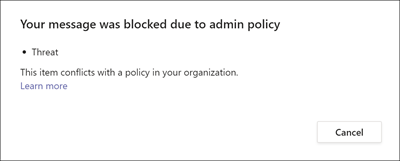

# Conformità alle comunicazioni con Microsoft Teams

La conformità alle comunicazioni è una soluzione di rischio insider in Microsoft 365 che consente di ridurre al minimo i rischi di comunicazione consentendo di rilevare, acquisire e agire in base a messaggi inappropriati nell'organizzazione.

Per Microsoft Teams, la conformità alle  comunicazioni consente di identificare i seguenti tipi di contenuto inappropriato nei canali Teams, nei canali Teams privati o nelle chat 1:1 e di gruppo:

- Linguaggio offensivo, profano e molesto
- Immagini per adulti, racy e gory
- Condivisione di informazioni riservate

Per altre informazioni sulla conformità delle comunicazioni e su come configurare i criteri per l'organizzazione, vedere Conformità alle comunicazioni [in Microsoft 365](/microsoft-365/compliance/communication-compliance).

## Come usare la conformità alle comunicazioni in Microsoft Teams

La conformità e la Microsoft Teams comunicazioni sono strettamente integrate e consentono di ridurre al minimo i rischi di comunicazione all'interno dell'organizzazione. Dopo aver configurato i primi criteri di conformità per le comunicazioni, è possibile gestire attivamente i messaggi Microsoft Teams e il contenuto inappropriati contrassegnati automaticamente negli avvisi.

### Introduzione

Introduzione alla conformità delle comunicazioni in  Microsoft Teams inizia con la pianificazione e la creazione di criteri predefiniti o personalizzati per identificare le attività degli utenti inappropriati nei canali Teams o in 1:1 e gruppi. Tenere presente che è necessario configurare [alcune](/microsoft-365/compliance/communication-compliance-configure) autorizzazioni e prerequisiti di base nell'ambito del processo di configurazione.

Teams amministratori possono configurare i criteri di conformità delle comunicazioni ai livelli seguenti:

- **Livello utente:** i criteri di questo livello si applicano a un singolo Teams utente o possono essere applicati a tutti Teams utenti dell'organizzazione. Questi criteri riguardano i messaggi che questi utenti possono inviare in chat 1:1 o di gruppo. Le comunicazioni chat per gli utenti vengono monitorate automaticamente in Microsoft Teams in cui gli utenti sono membri.
- **Teams livello:** i criteri di questo livello si applicano a un canale Microsoft Team, incluso un canale privato. Questi criteri riguardano solo i messaggi inviati nel Teams canale.

### Agire in base ai messaggi inappropriati in Microsoft Teams

Dopo aver configurato i criteri e aver ricevuto avvisi di conformità alle comunicazioni per i messaggi Microsoft Teams, è il momento che i revisori della conformità dell'organizzazione eseempano un'azione su questi messaggi. I revisori possono aiutare a proteggere l'organizzazione esaminando gli avvisi di conformità alle comunicazioni e rimuovendo i messaggi contrassegnati dalla visualizzazione Microsoft Teams.

I messaggi e i contenuti rimossi vengono sostituiti con notifiche per gli utenti che spiegano che il messaggio o il contenuto è stato rimosso e quali criteri sono applicabili alla rimozione. Il mittente del messaggio o del contenuto rimosso viene inoltre informato dello stato di rimozione e fornisce il contenuto originale del messaggio per il contesto relativo alla rimozione. Il mittente può anche visualizzare la condizione specifica dei criteri applicabile alla rimozione del messaggio.

Esempio di suggerimento per i criteri visualizzato dal mittente:

Esempio di notifica delle condizioni dei criteri visualizzata dal mittente:

Esempio di suggerimento per i criteri visualizzato dal destinatario:

