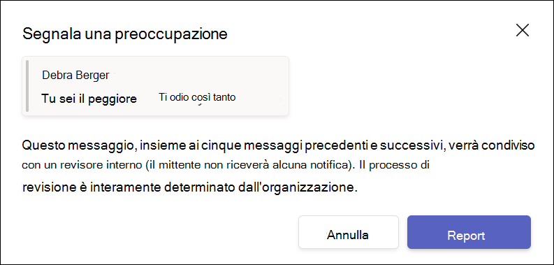

# Conformità delle comunicazioni con Microsoft Teams

Conformità delle comunicazioni Microsoft Purview è una soluzione per il rischio Insider di Microsoft 365 che consente di ridurre al minimo i rischi per le comunicazioni, consentendo di rilevare, acquisire e agire su messaggi non appropriati nell'organizzazione.

Per Microsoft Teams, la conformità alle comunicazioni aiuta a identificare i [seguenti tipi](/microsoft-365/compliance/communication-compliance-feature-reference) di contenuto inappropriato nei canali di Teams, nei canali privati di Teams o nelle chat 1:1 e di gruppo:

- Linguaggio offensivo, profano e molesto
- Immagini adulte, ghiacciate e gory
- Condivisione di informazioni riservate

Per altre informazioni sulla conformità alle comunicazioni e su come configurare i criteri per l'organizzazione, vedere [Informazioni sulla conformità alle comunicazioni](/microsoft-365/compliance/communication-compliance).

## Come usare la conformità alle comunicazioni in Microsoft Teams

La conformità alle comunicazioni e Microsoft Teams sono strettamente integrati e possono contribuire a ridurre al minimo i rischi di comunicazione nell'organizzazione. Dopo aver configurato i primi criteri di conformità delle comunicazioni, è possibile gestire attivamente i messaggi e i contenuti inappropriati di Microsoft Teams contrassegnati automaticamente negli avvisi.

### Introduzione

Iniziare a usare la conformità alle comunicazioni in Microsoft Teams inizia con la [pianificazione](/microsoft-365/compliance/communication-compliance-plan) e la creazione di criteri predefiniti o personalizzati per identificare le attività utente non appropriate nei canali di Teams o in 1:1 e gruppi. Tenere presente che è necessario [configurare](/microsoft-365/compliance/communication-compliance-configure) alcune autorizzazioni e prerequisiti di base nell'ambito del processo di configurazione.

Gli amministratori di Teams possono configurare i criteri di conformità delle comunicazioni ai livelli seguenti:

- **Livello utente**: i criteri a questo livello si applicano a un singolo utente di Teams o possono essere applicati a tutti gli utenti di Teams nell'organizzazione. Questi criteri coprono i messaggi che questi utenti possono inviare in chat 1:1 o di gruppo. Le comunicazioni chat per gli utenti vengono monitorate automaticamente in tutti i team di Microsoft Teams in cui gli utenti sono membri.
- **Livello di Teams**: i criteri a questo livello si applicano a un canale di Microsoft Teams, incluso un canale privato. Questi criteri coprono i messaggi inviati solo nel canale di Teams.

### Segnalare un problema in Microsoft Teams

>[!NOTE]
>La disponibilità per i messaggi segnalati dall'utente per le organizzazioni con licenza e utilizzando [la conformità alle comunicazioni](/microsoft-365/compliance/communication-compliance-configure#subscriptions-and-licensing) e Microsoft Teams è iniziata a maggio 2022. Questa funzionalità sarà disponibile entro il 31 agosto 2022 per tutte le organizzazioni con licenza e che usano la conformità alle comunicazioni fino a luglio 2022. Per le organizzazioni che iniziano a usare la conformità alle comunicazioni dopo luglio 2022, la disponibilità dei criteri per i messaggi segnalati dagli utenti può richiedere fino a 30 giorni dalla data della licenza e dal primo utilizzo della conformità alle comunicazioni.

L'opzione *Segnala un problema* per i messaggi di chat personali e di gruppo di Teams è abilitata per impostazione predefinita e può essere controllata tramite i criteri di messaggistica di [Teams nell'interfaccia di amministrazione di Teams](/microsoftteams/manage-teams-in-modern-portal). In questo modo gli utenti dell'organizzazione possono inviare messaggi di chat interna inappropriati per la revisione da parte dei revisori della conformità delle comunicazioni per i criteri. Per altre informazioni sui messaggi segnalati dall'utente nella conformità alle comunicazioni, vedere [Criteri di conformità delle comunicazioni](/microsoft-365/compliance/communication-compliance-policies#user-reported-messages-policy).

Dopo aver inviato il messaggio per la revisione, l'utente riceve una conferma dell'invio in Microsoft Teams. Gli altri partecipanti alla chat non vedono questa notifica.

Gli utenti dell'organizzazione ottengono automaticamente i criteri globali, a meno che non vengano creati e assegnati criteri personalizzati. Modificare le impostazioni nel criterio globale o creare e assegnare uno o più criteri personalizzati per attivare o disattivare questa caratteristica. Per altre informazioni, vedere [Gestire i criteri di messaggistica in Teams](/microsoftteams/messaging-policies-in-teams).

### Agire su messaggi inappropriati in Microsoft Teams

Dopo aver configurato i criteri e aver ricevuto avvisi di conformità delle comunicazioni per i messaggi di Microsoft Teams, i revisori della conformità dell'organizzazione devono intervenire su questi messaggi. Verranno inclusi anche i messaggi segnalati dall'utente, se abilitati per l'organizzazione. I revisori possono proteggere l'organizzazione esaminando gli avvisi di conformità delle comunicazioni e rimuovendo i messaggi contrassegnati dalla visualizzazione in Microsoft Teams.

I messaggi e il contenuto rimossi vengono sostituiti con notifiche per gli spettatori che spiegano che il messaggio o il contenuto è stato rimosso e quali criteri sono applicabili alla rimozione. Il mittente del messaggio o del contenuto rimosso riceve anche una notifica dello stato di rimozione e fornisce il contenuto originale del messaggio per il contesto relativo alla rimozione. Il mittente può anche visualizzare la condizione dei criteri specifici che si applica alla rimozione dei messaggi.

Esempio di suggerimento per i criteri visualizzato dal mittente:

Esempio di notifica dei criteri visualizzata dal mittente:

Esempio di suggerimento per i criteri visualizzato dal destinatario:

