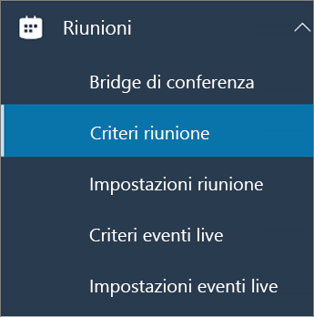
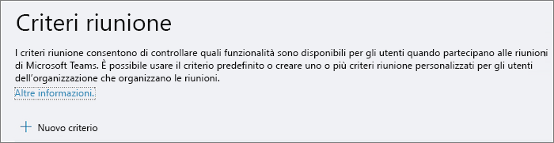
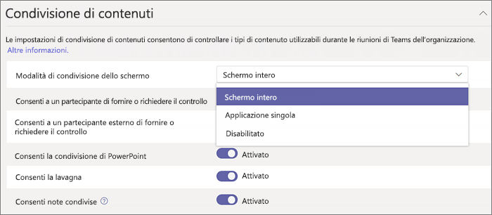

Configurare la condivisione desktop in Microsoft Teams
============================================

Condivisione desktop consente agli utenti di presentare una schermata o un'app durante una riunione o una chat. Gli amministratori possono configurare la condivisione dello schermo in Microsoft teams per consentire agli utenti di condividere un'intera schermata, un'app o un file. Puoi consentire agli utenti di dare o richiedere il controllo, concedere la condivisione di PowerPoint, aggiungere una lavagna e consentire le note condivise. È anche possibile specificare se gli utenti anonimi o esterni possono richiedere il controllo della schermata condivisa.

Per configurare la condivisione dello schermo, è possibile creare un nuovo criterio per le riunioni e assegnarlo agli utenti che si vuole gestire.

**Nell'interfaccia di amministrazione di Microsoft Teams**

1. Selezionare **** > **criteri riunione**riunioni.

    

2. Nella pagina **criteri riunione** selezionare **nuovo criterio**.

    

3. Assegnare un titolo univoco ai criteri e immettere una breve descrizione.

4. In **condivisione contenuto**scegliere una **modalità di condivisione dello schermo** nell'elenco a discesa:

   - **Intero schermo** : consente agli utenti di condividere l'intero desktop.
   - **Singola applicazione** : consente agli utenti di limitare la condivisione dello schermo a una singola applicazione attiva.
   - **Disabled** -disattiva la condivisione dello schermo.

    

5. Attivare o disattivare le impostazioni seguenti:

    - **Consentire a un partecipante di dare o richiedere il controllo** , consente ai membri del team di concedere o richiedere il controllo del desktop o dell'applicazione del relatore.
    - **Consentire a un partecipante esterno di dare o richiedere il controllo** , consente agli utenti esterni (federati) di concedere o richiedere il controllo del desktop o dell'applicazione del relatore.
    - **Consenti condivisione di PowerPoint** : consente agli utenti di creare riunioni che consentano la carica e la condivisione delle presentazioni di PowerPoint.
    - **Consenti lavagna** : consente agli utenti di condividere una lavagna.
    - **Consenti note condivise** : consente agli utenti di prendere note condivise.

6. Fai clic su **Salva**.

## Usare PowerShell per configurare il desktop condiviso

Puoi anche usare il cmdlet [set-CsTeamsMeetingPolicy](https://docs.microsoft.com/en-us/powershell/module/skype/set-csteamsmeetingpolicy?view=skype-ps) per controllare la condivisione del desktop. Impostare i parametri seguenti:

- Descrizione
- ScreenSharingMode
- AllowParticipantGiveRequestControl
- AllowExternalParticipantGiveRequestControl
- AllowPowerPointSharing
- AllowWhiteboard
- AllowSharedNotes

[Altre informazioni sull'uso del cmdlet csTeamsMeetingPolicy](https://docs.microsoft.com/en-us/powershell/module/skype/set-csteamsmeetingpolicy?view=skype-ps).

