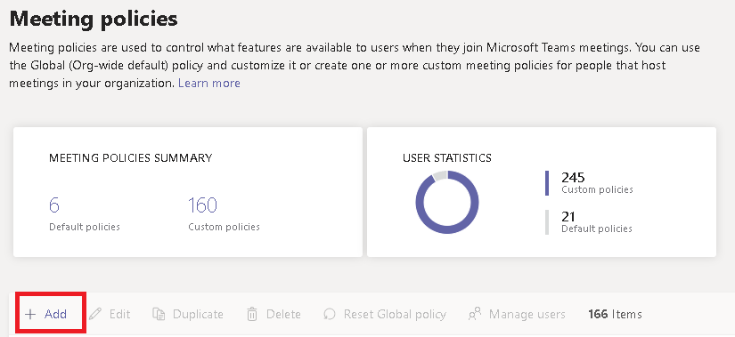

Configurare la condivisione desktop in Microsoft TeamsConfigure desktop sharing in Microsoft Teams
============================================

La condivisione del desktop consente agli utenti di presentare una schermata o un'app durante una riunione o in una chat.Desktop sharing lets users present a screen or app during a meeting or chat. Gli amministratori possono configurare la condivisione dello schermo in Microsoft Teams per consentire agli utenti di condividere l'intero schermo, un'app o un file.Admins can configure screen sharing in Microsoft Teams to let users share an entire screen, an app, or a file. È possibile consentire agli utenti di fornire o richiedere il controllo, consentire la condivisione di PowerPoint, aggiungere una lavagna e consentire le note condivise.You can let users give or request control, allow PowerPoint sharing, add a whiteboard, and allow shared notes. Inoltre, è possibile configurare se consentire agli utenti esterni o anonimi di richiedere il controllo dello schermo condiviso.You can also configure whether anonymous or external users can request control of the shared screen. I partecipanti esterni nelle riunioni di Teams possono essere classificati come segue:External participants in Teams meetings can be categorized as follows:

- Utente anonimoAnonymous user
- Utenti guestGuest users
- Utente B2BB2B user
- Utente federatoFederated user

Per configurare la condivisione dello schermo, creare un nuovo criterio riunioni e assegnarlo agli utenti da gestire.To configure screen sharing, you create a new meetings policy and then assign it to the users you want to manage.

**Nell'[interfaccia di amministrazione di Microsoft Teams](https://admin.teams.microsoft.com/)****In the [Microsoft Teams admin center](https://admin.teams.microsoft.com/)**

1. Selezionare **Riunioni** > **Criteri riunione**.Select **Meetings** > **Meeting policies**.

    

2. Nella pagina **Criteri riunione** selezionare **Aggiungi.**On the **Meeting policies** page, select **Add**.

    

3. Assegnare un titolo univoco al criterio e immettere una breve descrizione.Give your policy a unique title and enter a brief description.

4. In **Condivisione di contenuti**, scegliere una **Modalità di condivisione dello schermo** nell'elenco a discesa:Under **Content sharing**, choose a **Screen sharing mode** from the drop-down list:

   - **Schermo intero**: consente agli utenti di condividere l'intero desktop.**Entire screen** – lets users share their entire desktop.
   - **Applicazione singola**: consente agli utenti di limitare la condivisione dello schermo a una singola applicazione attiva.**Single application** – lets users limit screen sharing to a single active application.
   - **Disabilitata**: disabilita la condivisione dello schermo.**Disabled** – Turns off screen sharing.

    

  > [!Note]
  > Non è necessario abilitare il criterio di chiamata per consentire agli utenti di usare la condivisione dello schermo dalla chat.You don't have to enable the calling policy in order for users to use screen share from chat. Tuttavia, l'audio viene disattivato finché l'audio non viene riattivato.However, their audio is turned off until they unmute themselves. Inoltre, l'utente che condivide lo schermo può fare clic **su Aggiungi audio** per abilitare l'audio.In addition, the user sharing the screen can click **Add Audio** to enable audio. Se il criterio di chiamata è disabilitato, gli utenti non saranno in grado di aggiungere audio alla condivisione dello schermo da una sessione di chat.If the calling policy is disabled, users won't be able to add audio to the screen share from a chat session.

5. Abilitare o disabilitare le impostazioni seguenti:Turn the following settings on or off:

    - **Consentire a un partecipante di concedere o richiedere il controllo**: consente ai membri del team di concedere o richiedere il controllo dell'applicazione o del desktop del relatore.**Allow a participant to give or request control** – lets members of the team give or request control of the presenter's desktop or application.
    - **Consentire a un partecipante esterno di concedere o richiedere il controllo.** Si tratta di un criterio per utente.**Allow an external participant to give or request control** – This is a per-user policy. Se un'organizzazione ha impostato questa opzione per un utente, non controlla cosa possono fare i partecipanti esterni, indipendentemente dall'impostazione configurata dall'organizzatore della riunione.Whether an organization has this set for a user doesn't control what external participants can do, regardless of what the meeting organizer has set. Questo parametro controlla se i partecipanti esterni possono ricevere o richiedere il controllo dello schermo del relatore, a seconda delle impostazioni configurate dal relatore nei criteri di riunione dell'organizzazione.This parameter controls whether external participants can be given control or request control of the sharer's screen, depending on what the sharer has set within their organization's meeting policies.
    - **Consentire la condivisione di PowerPoint**: consente di creare riunioni nelle quali è possibile caricare e condividere le presentazioni di PowerPoint.**Allow PowerPoint sharing** - lets users create meetings that allow PowerPoint presentations to be uploaded and shared.
    - **Consentire la lavagna**: consente agli utenti di condividere una lavagna.**Allow whiteboard** – lets users share a whiteboard.
    - **Consentire le note condivise**: consente agli utenti di creare note condivise.**Allow shared notes** – lets users take shared notes.

6. Fare clic su **Salva**.Click **Save**.

## Usare PowerShell per configurare il desktop condivisoUse PowerShell to configure shared desktop

Inoltre, è possibile usare il cmdlet [Set-CsTeamsMeetingPolicy](https://docs.microsoft.com/powershell/module/skype/set-csteamsmeetingpolicy?view=skype-ps) per controllare la condivisione del desktop.You can also use the [Set-CsTeamsMeetingPolicy](https://docs.microsoft.com/powershell/module/skype/set-csteamsmeetingpolicy?view=skype-ps) cmdlet to control desktop sharing. Impostare i seguenti parametri:Set the following parameters:

- DescrizioneDescription
- ScreenSharingModeScreenSharingMode
- AllowPrivateCallingAllowPrivateCalling
- AllowParticipantGiveRequestControlAllowParticipantGiveRequestControl
- AllowExternalParticipantGiveRequestControlAllowExternalParticipantGiveRequestControl
- AllowPowerPointSharingAllowPowerPointSharing
- AllowWhiteboardAllowWhiteboard
- AllowSharedNotesAllowSharedNotes

[Altre informazioni sull'utilizzo del cmdlet csTeamsMeetingPolicy](https://docs.microsoft.com/powershell/module/skype/set-csteamsmeetingpolicy?view=skype-ps).[Learn more about using the csTeamsMeetingPolicy cmdlet](https://docs.microsoft.com/powershell/module/skype/set-csteamsmeetingpolicy?view=skype-ps).
