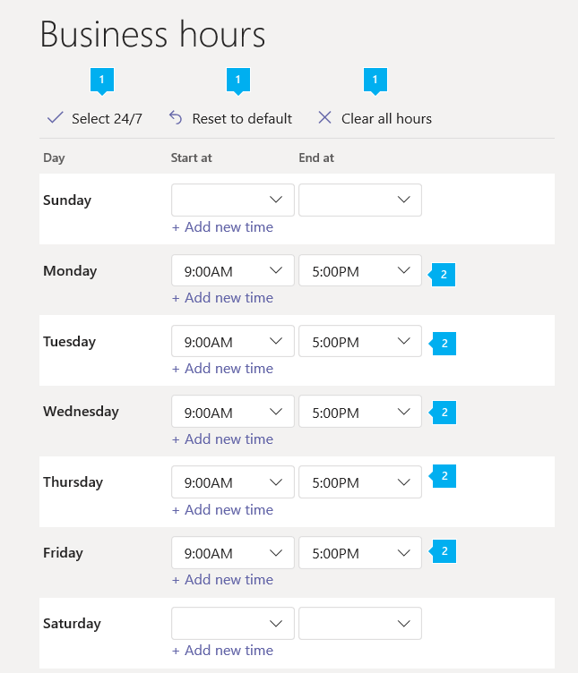

# Configurare un operatore automatico cloud

Gli operatori automatici consentono agli utenti che chiamano l'organizzazione e spostano un sistema di menu per accedervi al reparto di destra, alla coda di chiamata, alla persona o all'operatore. Puoi creare un operatore automatico per l'organizzazione usando l'interfaccia di amministrazione di Microsoft teams. Per creare un nuovo operatore automatico, passa a **voce** nella barra di spostamento sinistra e quindi seleziona **operatori** > automatici**Aggiungi nuovo**.

Per altre informazioni sugli operatori automatici, vedere [che cosa sono gli operatori automatici di cloud?](/microsoftteams/what-are-phone-system-auto-attendants)

> [!NOTE]
> Questo articolo si applica sia a Microsoft teams che a Skype for business online.

## Passaggio 1-per iniziare

- Per avere un account di risorse associato, è necessario un operatore automatico. Vedere [gestire gli account delle risorse in teams](manage-resource-accounts.md) per informazioni dettagliate sugli account delle risorse e tutte le licenze necessarie.

> [!TIP]
> Per reindirizzare le chiamate a un operatore o a un'opzione di menu che è un utente online con una licenza di **sistema telefonico** , sarà necessario abilitarle per VoIP aziendale. Vedere [assegnare licenze di Skype for business](/skypeforbusiness/skype-for-business-and-microsoft-teams-add-on-licensing/assign-skype-for-business-and-microsoft-teams-licenses) o [assegnare licenze di Microsoft teams](assign-teams-licenses.md). Puoi anche utilizzare Windows PowerShell. Ad esempio, Esegui:`Set-CsUser -identity "Amos Marble" -EnterpriseVoiceEnabled $true`

## Fase 2 - Creare un nuovo operatore automatico

> [!IMPORTANT]
> Ogni operatore automatico è necessario per avere un [account di risorse](manage-resource-accounts.md)associato. Devi prima creare l'account della risorsa, quindi puoi associarlo all'operatore automatico.

### Uso dell'interfaccia di amministrazione di Microsoft Teams

Nell'interfaccia di **amministrazione di Microsoft teams**fare clic su**operatore automatico** **vocale** > , quindi fare clic su **+ nuovo**:

#### Pagina informazioni generali

* * *

**Nome** Immettere un nome visualizzato descrittivo per l'operatore automatico. Il nome è obbligatorio e può contenere fino a 64 caratteri, inclusi gli spazi. Sarà elencato nella colonna **Nome** della scheda **Operatori automatici**.

* * *

**Account risorse** Fare clic su questo pulsante per selezionare uno o più account risorse per connettersi al nuovo operatore automatico. Tutti gli operatori automatici devono avere un account di risorse associato. Un account delle risorse può avere un numero di telefono associato all'account, ma potrebbe non. Un operatore automatico di primo livello ha in genere un account di risorse con un numero di telefono assegnato, ma l'operatore automatico annidato (usato come menu di livello 2 a cui si connette l'operatore automatico di prima livello) potrebbe non avere un numero di telefono assegnato al proprio account di risorse.

* * *

**Fuso orario** È necessario impostare il fuso orario per l'operatore automatico, che non deve necessariamente corrispondere al fuso orario dell'indirizzo principale indicato per l'organizzazione. Ciascun operatore automatico può avere un fuso orario diverso, e l'orario di ufficio fissato per l'operatore automatico verrà impostato in base al fuso orario che selezioni qui.

* * *

**Lingua** Seleziona la lingua che vuoi utilizzare per l'operatore automatico tra una delle lingue disponibili elencate. La lingua impostata qui è la lingua che l'operatore automatico userà per interagire con le persone che chiamano l'operatore automatico e tutte le richieste di sistema verranno riprodotte in questa lingua.

* * *

**Operatore** È un'impostazione facoltativa per l'operatore automatico. Tuttavia, puoi impostare l'opzione **operator** per le persone che chiamano in grado di uscire dai menu per parlare con una persona per aiutarle.

Il tasto 0 viene assegnato automaticamente alla funzione Operatore.

Se si configura questa impostazione, è anche necessario comunicare agli utenti che chiamano questa opzione è disponibile nelle **Opzioni del menu modifica** della pagina **Gestione chiamate orari di ufficio** . Se si imposta un operatore nell'operatore automatico, sarà necessario immettere il testo del prompt corrispondente nei **chiamanti si sente** la casella o si modifica il file audio per includere questa opzione. Ad esempio: "Per contattare un operatore, premere zero".

Puoi impostare la funzione Operatore a una delle persone seguenti.

- **Persona nell'azienda** con una licenza di **Sistema telefonico** abilitata per Enterprise Voice o con Piani di chiamata di Office 365 assegnati.

     > [!Note]
     > Una **Persona nell'azienda** può essere un utente in linea o un utente ospitato in locale con Skype per Business Server 2015 o Lync Server 2013.

- Una **coda di chiamata** configurata.
- Puoi impostarla in modo che la persona che chiama può essere passata alla segreteria. A questo scopo, seleziona **persona nella tua azienda** e imposta le chiamate di questa persona da inoltrare direttamente alla segreteria telefonica.

* * *

**Abilitare gli input vocali** Il riconoscimento vocale è disponibile se questa opzione è selezionata. Le persone che chiamano in grado di usare l'input vocale nella [lingua impostata](set-auto-attendant-languages-for-audio-conferencing-in-teams.md). È possibile disabilitare il riconoscimento vocale impostandolo su disattivato se si vuole consentire solo agli utenti di usare la tastiera del telefono.

* * *

Dopo aver completato le selezioni, fare clic su **Avanti**.

#### Pagina orari di ufficio

Per impostazione predefinita, gli orari di ufficio sono impostati dalle 9.00 alle 17.00, dal lunedì al venerdì.  Tutti gli orari che non sono inclusi nell'orario di ufficio sono considerati orario di chiusura. È possibile fare clic su **seleziona 24/7** per impostare tutte le ore lavorative. A meno che non si selezioni l'opzione **seleziona 24/7** , verrà usata la pagina **Impostazioni chiamate dopo ora** per configurare la gestione delle chiamate dopo le ore lavorative per l'operatore automatico.

* * *

Per impostazione predefinita, le ore lavorative sono impostate su lunedì a venerdì, 9:00 AM-5:00 PM. Selezionare **Cancella tutte le ore per deselezionare** tutte le ore nella programmazione. Quando si seleziona **Reimposta per impostazione predefinita**, le ore lavorative verranno reimpostate dal lunedì al venerdì, 9:00 am-5:00 PM.

* * *

Per modificare l'orario di ufficio, evidenzia l'orario di ufficio che desideri impostare con il calendario. Il calendario consente di selezionare gli orari di ufficio in intervalli di 30 minuti e gli orari di ufficio selezionati verranno impostati in base al fuso orario impostato nella pagina **informazioni generali** . Per impostare una pausa (ad esempio la pausa pranzo), deseleziona o trascina per deselezionare l'orario in questione sul calendario. È possibile impostare più interruzioni in orari di ufficio.

* * *

Dopo aver completato le selezioni, fare clic su **Avanti**.

#### Impostazioni delle chiamate in orario di ufficio

> [!TIP]
> Se si usa una programmazione per orari di ufficio personalizzati, è anche necessario configurare la consegna delle chiamate dopo l'orario di ufficio con la pagina **after hours handling** , che fornisce le stesse opzioni **delle impostazioni delle chiamate in orario di ufficio**.

È possibile configurare i messaggi di saluto, le richieste e i menu che gli utenti che chiamano al numero di telefono dell'operatore automatico della propria organizzazione si sentano durante l'orario di ufficio.

* * *

**Messaggio di saluto** Un saluto per le ore lavorative è facoltativo e può essere impostato su **Nessun saluto**. In questo caso, il chiamante non sente alcun messaggio o saluto prima che la chiamata venga gestita da una delle azioni selezionate. È possibile caricare un file audio (nel formato con estensione wav, mp3 o .wma) o creare un messaggio di saluto personalizzato utilizzando la sintesi vocale.

- **Nessun saluto** Nessun messaggio di saluto verrà riprodotto quando gli utenti chiamano il numero di telefono dell'operatore automatico.
- **Caricare un file audio** Se si sceglie questo record, registrare il messaggio di saluto e quindi caricare il file audio (in formato WAV, MP3 o WMA).
- **Digitare un messaggio di saluto** Se si sceglie questa opzione, immettere il testo da leggere per il sistema (fino a 1000 caratteri). Ad esempio, è possibile immettere "Benvenuti alla Contoso. La tua chiamata è importante per noi." nella casella **I chiamanti udiranno**.

* * *

È possibile selezionare cosa avviene alle chiamate in arrivo durante l'orario di ufficio. È possibile scegliere tra le azioni seguenti:

- **Disconnettere** Se selezionata, la persona che chiama verrà disconnessa dopo aver ascoltato una saluto di orario di ufficio.
- **Reindirizzare una chiamata** Ciò consente di inviare automaticamente la chiamata a:
  - **Persona in società** con una licenza di **sistema telefonico** abilitata per i piani VoIP aziendale o per le chiamate assegnate in Office 365. Puoi impostarla in modo che la persona che chiama possa essere passata alla segreteria telefonica. A questo scopo, seleziona **persona in società** e imposta questa persona per inoltrare le chiamate direttamente alla segreteria telefonica.

    > [!Note]
    > La **persona in società** può essere un utente online o un utente ospitato in locale con Skype for Business Server 2015 o Lync Server 2013.

   - Un altro **operatore automatico**

   Puoi usare un operatore automatico esistente per creare un secondo livello di opzioni di menu che contiene un sottomenu. Questi sono denominati operatori automatici innestati. Per inviare la chiamata a un operatore automatico annidato, selezionare **persona in società** e assegnare un account di risorse, uno che ha già un operatore automatico associato o uno che verrà associato a un operatore automatico dopo aver creato questo operatore automatico.

- Le **Opzioni del menu** Riproduci possono essere usate anche per configurare un prompt che si vuole riprodurre.

* * *

**Messaggio del menu** Per creare il messaggio del menu principale, puoi utilizzare il sintetizzatore vocale o caricare un file audio (.wav, .mp3 o .wma). È possibile digitare il messaggio nella casella **imposta il menu di spostamento per** i chiamanti o registrare un file audio e dire, ad esempio: "per le vendite, dire o premere o dire 1. Per i servizi, premere o pronunciare 2. Per l'assistenza clienti, premere o pronunciare 3. Per contattare un operatore, premere o pronunciare 0. Per ascoltare di nuovo questo menu, premere il tasto asterisco o pronunciare Ripeti". **Digitare un messaggio di saluto** Se si è scelto questo articolo, è necessario immettere il testo che si vuole leggere dal sistema (fino a 1000 caratteri). **Carica un file audio** Se scegli questa opzione, dovrai registrare il messaggio di saluto e poi caricare il file audio (in formato .wav, .mp3 o .wma).

* * *

**Configurazione delle opzioni del menu** Le opzioni di menu che usano i pulsanti chiave sulla tastiera possono essere aggiunte o rimosse. Per aggiungere un'opzione di menu, premere **+ assegnazione di un tasto**di scelta rapida. Di seguito viene visualizzata una riga di opzioni corrispondente. Per eliminare un'opzione di menu, fare semplicemente clic a sinistra del tasto corrispondente sul controllo tastiera e fare clic sull'icona Elimina sopra. La riga di mapping dei tasti verrà rimossa.

> [!TIP]
> Sarà necessario aggiornare il menu richieste di testo o registrare di nuovo l'audio separatamente quando si aggiungono le opzioni di rimozione perché non verranno eseguite automaticamente per il prompt dei menu esistente.  
>
>Qualsiasi opzione di menu può essere aggiunta e rimossa in qualsiasi ordine e i mapping delle chiavi non devono essere continui. È possibile, ad esempio, creare un menu con i tasti 0, 1 e 3 mappato alle opzioni, mentre il tasto 2 non viene usato.

> [!NOTE]
> I tasti \* (Repeat) e \# (back) sono riservati dal sistema e non possono essere riassegnati. Se il riconoscimento vocale è abilitato, premendo * corrisponderà a "REPEAT" e # corrisponderà ai comandi vocali "back".

Per configurare le opzioni di menu, dopo aver selezionato il tasto o i tasti di scelta rapida, sarà necessario:

- Immettere il **comando vocale** dell'opzione. Questo può contenere fino a 64 caratteri e può includere più parole come "Customer Service" o "Operations and grounds". Se è abilitato il riconoscimento vocale, verrà riconosciuto automaticamente il nome e la persona chiamata sarà in grado di premere 3, dire "tre" oppure "Servizio clienti" per selezionare l'opzione mappata al tasto 3.
- Selezionare la posizione in cui deve essere inviata la chiamata se viene premuto il tasto corrispondente oppure l'opzione è selezionata tramite riconoscimento vocale. La chiamata può essere inviata a:

  - **Operatore** Se l'operatore è già stato configurato, viene automaticamente mappato al tasto 0, ma può anche essere eliminato o riassegnato a un tasto diverso. Se l'operatore non è impostato su nessun tasto, anche il comando vocale "Operatore" verrà disabilitato.
  - Una **Persona nell'azienda** con una licenza di **Sistema telefonico** abilitata per Enterprise Voice o con Piani di chiamata di Office 365 assegnati. Puoi impostarla in modo che la persona che chiama possa essere passata alla segreteria telefonica. A questo scopo, seleziona **persona nella tua azienda** e imposta questa persona per inoltrare le chiamate direttamente alla segreteria telefonica.

    > [!Note]
    > **La persona della società** può essere un utente online o un utente ospitato in locale con Skype for Business Server o Lync Server 2013.
    - Un altro **operatore automatico**

       Puoi usare un operatore automatico esistente per creare un secondo livello di opzioni di menu che contiene un sottomenu. Questi sono denominati operatori automatici innestati. Per inviare la chiamata a un operatore automatico annidato, selezionare **persona in società** e assegnare un account di risorse, uno che ha già un operatore automatico associato o uno che verrà associato a un operatore automatico dopo aver creato questo operatore automatico.

        > [!Note]
        > Gli **Orari d'ufficio** degli operatori automatici innestati (o di secondo livello) verranno inoltre utilizzate, incluso per le chiamate inviate da altri operatori automatici che sono stati configurati.

     - **coda di chiamata** L'uso di un'opzione coda di chiamata consente di trasferire la chiamata a una coda di chiamata esistente configurata. 

* * *

**Chiamata per nome** Se scegli questa opzione, consentirà agli utenti che accedono alla ricerca di persone nell'organizzazione tramite la ricerca nella directory. Puoi selezionare quali persone saranno elencate come disponibili o non disponibili per Chiamata per nome definendo queste opzioni nella pagina **Ambito chiamata**. Tutti gli utenti online con una licenza di **sistema telefonico** o qualsiasi utente ospitato in locale con Skype for Business Server o Lync Server 2013 possono essere trovati con la chiamata per nome.

* * *

Dopo aver completato le selezioni, fare clic su **Avanti**.

#### Impostazioni delle chiamate per le festività

È possibile aggiungere fino a 20 giorni festivi pianificati per ogni operatore automatico.

> [!TIP]
> Per creare festività, è possibile visualizzare le **Impostazioni** > **** a livello di organizzazione, oppure crearle come parte della creazione di un nuovo gestore chiamate.

Se sono già stati creati altri operatori automatici, è possibile che venga visualizzata un'opzione che consente di usare o modificare le informazioni necessarie in questo elenco. In caso contrario, devi creare un nuovo gestore chiamate.

Per aggiungere un nuovo gestore chiamate, fare clic su **+ nuovo gestore chiamate**.

* * *

Nella nuova finestra immettere un nome per il gestore della nuova chiamata nella parte superiore dello schermo.

Se il nome della tua vacanza esiste già nell'elenco **** a discesa festività, puoi usarlo. Se il nome di festività necessario non esiste già, selezionare **Crea nuova festività** nell'elenco a discesa e assegnare un nome e una data per la nuova festività nella nuova schermata visualizzata. Fare clic su **Salva** quando si è pronti.

I nomi delle festività possono essere formati da un massimo di 64 caratteri e devono essere univoci per l'operatore automatico stesso. Ad esempio, è possibile avere due festività denominate "Giorno del ringraziamento" nello stesso operatore automatico.

**Messaggio di saluto** Il messaggio di saluto è facoltativo e può essere impostato su **Nessun saluto**. In questo caso, il chiamante non udirà alcun messaggio o saluto prima che la chiamata venga gestita da una delle opzioni selezionate. È possibile caricare un file audio (nel formato con estensione wav, mp3 o .wma) o creare un messaggio di saluto personalizzato utilizzando la sintesi vocale.

- **Nessun saluto** Nessun messaggio di saluto verrà riprodotto quando gli utenti chiamano il numero di telefono dell'operatore automatico.
- **Caricare un file audio** Se si sceglie questo documento, registrare il messaggio di saluto e quindi caricare il file audio (in formato. wav,. mp3 o. WMA)
- **Digitare un messaggio di saluto** Se si sceglie questa opzione, immettere il testo da leggere per il sistema (fino a 1000 caratteri). Ad esempio, è possibile immettere "Buon anno! I nostri uffici sono chiusi." nella casella **digitare un messaggio di saluto** .

**Azioni** È possibile selezionare cosa succede alle chiamate che arrivano durante questa festività. È possibile scegliere tra le opzioni seguenti:

- **Disconnettere**  La persona chiamata verrà disconnessa dopo aver ascoltato il messaggio di saluto di festività.
- **Reindirizzare una chiamata** Ciò consente di inviare automaticamente la chiamata a:
  - Una **Persona nell'azienda** con una licenza di **Sistema telefonico** abilitata per Enterprise Voice o con Piani di chiamata di Office 365 assegnati. Puoi impostarla in modo che la persona che chiama possa essere passata alla segreteria telefonica. A questo scopo, seleziona **persona nella tua azienda**e imposta questa persona per inoltrare le chiamate direttamente alla segreteria telefonica.

    > [!Note]
    > Una **Persona nell'azienda** può essere un utente in linea o un utente ospitato in locale con Skype per Business Server 2015 o Lync Server 2013.

  - Una **coda di chiamata** per trasferire la chiamata a una coda di chiamata esistente configurata.
  - Un altro **operatore automatico**per creare un secondo livello di opzioni di menu che contiene un sottomenu. Questi sono denominati operatori automatici innestati.

    > [!Note]
    > Per impostazione predefinita, per tutte le chiamate in arrivo per un periodo di festività impostate per essere disconnesse dopo il messaggio di saluto (se esistenti), è necessario specificare un reindirizzamento se non si desidera un comportamento diverso.

#### Pagina Seleziona ambito di chiamata

In questa pagina è possibile configurare gli utenti dell'organizzazione che verranno elencati nella directory e disponibili per il nome della chiamata per ogni persona che chiama l'organizzazione.

* * *

 precedente con l'opzione **Includi** , sono disponibili due opzioni:

- **Tutti gli utenti online** Questa opzione permette di includere tutte le persone dell'organizzazione nella ricerca in elenco. Tutti gli utenti online con una licenza di **sistema telefonico** , nonché gli utenti ospitati in locale con Skype for Business Server o Lync Server 2013 che hanno piani di chiamata in Office 365, verranno elencati.
- **Gruppo utenti personalizzato** Se si usa questa opzione, è possibile cercare un gruppo, una lista di distribuzione o un gruppo di sicurezza di Office 365 creato nell'organizzazione e le persone aggiunte al gruppo di Office 365, alla lista di distribuzione o al gruppo di sicurezza che sono **utenti online con un Licenza di sistema telefonico** o ospitata in locale con Skype for Business Server 2015 o Lync server 2013. È possibile aggiungere più gruppi di Office 365, liste di distribuzione e gruppi di sicurezza.

* * *

Con l' **** opzione Escludi sono disponibili due opzioni:

- **Nessuno** Questa opzione indica che nessun utente online sarà escluso dalla ricerca in elenco.
- **Gruppo utenti personalizzato** Se si usa questa opzione, è possibile cercare un gruppo, una lista di distribuzione o un gruppo di sicurezza di Office 365 creato nell'organizzazione e tutti gli utenti aggiunti a questo gruppo di Office 365, a una lista di distribuzione o a gruppi di sicurezza verranno esclusi dalla ricerca nella directory. È possibile aggiungere più gruppi di Office 365, liste di distribuzione e gruppi di sicurezza.

> [!NOTE]
> Il nome di un nuovo utente può richiedere fino a 36 ore nella directory quando qualcuno usa la chiamata per nome con il riconoscimento vocale.

Dopo aver immesso tutti i campi obbligatori e configurato i menu e le opzioni di gestione delle chiamate, fare clic su **Invia**.

## Modifica e test degli operatori automatici

Dopo aver salvato il tuo operatore automatico, verrà elencato nella pagina **Operatori automatici**. In questo modo è possibile visualizzare rapidamente alcune delle opzioni configurate, ad esempio il nome, il numero di telefono, la lingua e lo stato.

Se si vogliono apportare modifiche a un operatore automatico, selezionare l'operatore automatico e quindi nel riquadro azioni fare clic su **modifica**.

È anche possibile inserire rapidamente una chiamata di test all'operatore automatico usando il pulsante **test** nel riquadro azioni.

## Cmdlet dell'operatore automatico

Puoi anche utilizzare Windows PowerShell per creare e configurare gli operatori automatici. Ecco i cmdlet necessari per gestire un operatore automatico:

- [New-CsAutoAttendant](https://docs.microsoft.com/powershell/module/skype/new-csautoattendant?view=skype-ps)  
- [Set-CsAutoAttendant](https://docs.microsoft.com/powershell/module/skype/set-csautoattendant?view=skype-ps)
- [Get-CsAutoAttendant](https://docs.microsoft.com/powershell/module/skype/new-csautoattendant?view=skype-ps)
- [Get-CsAutoAttendantHolidays](https://docs.microsoft.com/powershell/module/skype/get-csautoattendantholidays?view=skype-ps)
- [Remove-CsAutoAttendant](https://docs.microsoft.com/powershell/module/skype/remove-csautoattendant?view=skype-ps)
- [New-CsAutoAttendantMenu](https://docs.microsoft.com/powershell/module/skype/new-csautoattendantmenu?view=skype-ps)
- [New-CsOnlineAudioFile](https://docs.microsoft.com/powershell/module/skype/new-CsOnlineAudioFile?view=skype-ps)
- [New-CsAutoAttendantCallFlow](https://docs.microsoft.com/powershell/module/skype/New-CsAutoAttendantCallFlow?view=skype-ps)
- [Export-CsAutoAttendantHolidays](https://docs.microsoft.com/powershell/module/skype/export-csorganizationalautoattendantholidays?view=skype-ps)
- [New-CsOnlineTimeRange](https://docs.microsoft.com/powershell/module/skype/new-csonlinetimerange?view=skype-ps)
- [New-CsOnlineDateTimeRange](https://docs.microsoft.com/powershell/module/skype/new-csonlinedatetimerange?view=skype-ps)
- [New-CsOnlineSchedule](https://docs.microsoft.com/powershell/module/skype/New-CsOnlineSchedule?view=skype-ps)
- [Get-CsAutoAttendantSupportedTimeZone](https://docs.microsoft.com/powershell/module/skype/Get-CsAutoAttendantSupportedTimeZone?view=skype-ps)
- [New-CsAutoAttendantCallHandlingAssociation](https://docs.microsoft.com/powershell/module/skype/New-CsAutoAttendantCallHandlingAssociation?view=skype-ps)
- [Get-CsAutoAttendantSupportedLanguage](https://docs.microsoft.com/powershell/module/skype/Get-CsAutoAttendantSupportedLanguage?view=skype-ps)
- [Import-CsAutoAttendantHolidays](https://docs.microsoft.com/powershell/module/skype/import-csautoattendantholidays?view=skype-ps)
- [New-CsAutoAttendantCallableEntity](https://docs.microsoft.com/powershell/module/skype/New-CsAutoAttendantCallableEntity?view=skype-ps)

### Altre informazioni su Windows PowerShell

- Windows PowerShell is all about managing users and what users are allowed or not allowed to do. Con Windows PowerShell è possibile gestire Office 365 e Microsoft teams usando un unico punto di amministrazione in grado di semplificare il lavoro quotidiano, quando si hanno più attività da eseguire. Per iniziare a usare Windows PowerShell, vedere questi argomenti:

  - [Introduzione a Windows PowerShell e Skype for Business Online](/SkypeForBusiness/set-up-your-computer-for-windows-powershell/set-up-your-computer-for-windows-powershell)

  - [Sei motivi per utilizzare Windows PowerShell per gestire Office 365](https://docs.microsoft.com/en-us/office365/enterprise/powershell/why-you-need-to-use-office-365-powershell)

- Windows PowerShell offre numerosi vantaggi in termini di velocità, semplicità e produttività solo usando l'interfaccia di amministrazione di Microsoft 365, ad esempio quando si apportano modifiche all'impostazione per molti utenti contemporaneamente. Per informazioni su questi vantaggi, consulta i seguenti argomenti:

  - [Gestire Office 365 con Office 365 PowerShell](https://docs.microsoft.com/en-us/office365/enterprise/powershell/manage-office-365-with-office-365-powershell)

  - [Uso di Windows PowerShell per gestire Skype for Business online](/SkypeForBusiness/set-up-your-computer-for-windows-powershell/set-up-your-computer-for-windows-powershell)

## Argomenti correlati

[Ecco cosa offre il Sistema telefonico in Office 365](/MicrosoftTeams/here-s-what-you-get-with-phone-system)

[Recupero di numeri di telefono del servizio](/microsoftteams/getting-service-phone-numbers)

[Disponibilità di Audioconferenza e Piani per chiamate per Paese e area geografica](/microsoftteams/country-and-region-availability-for-audio-conferencing-and-calling-plans/country-and-region-availability-for-audio-conferencing-and-calling-plans)

[New-CsOrganizationalAutoAttendant](https://docs.microsoft.com/en-us/powershell/module/skype/new-csorganizationalautoattendant?view=skype-ps)  

[Cosa sono gli operatori automatici cloud?](what-are-phone-system-auto-attendants.md)

[Esempio per piccole imprese - Impostare un operatore automatico](/microsoftteams/tutorial-org-aa)  
