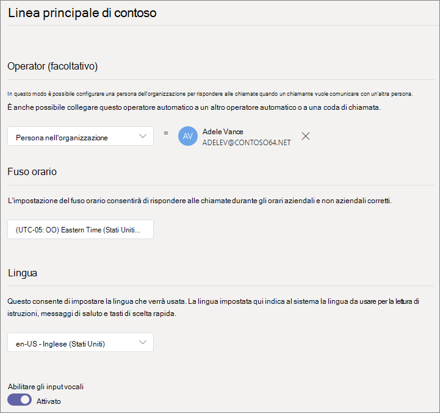
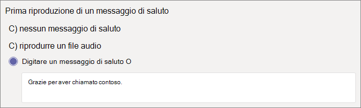
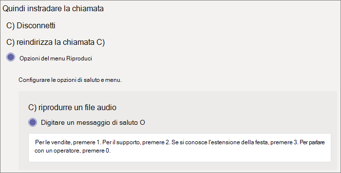
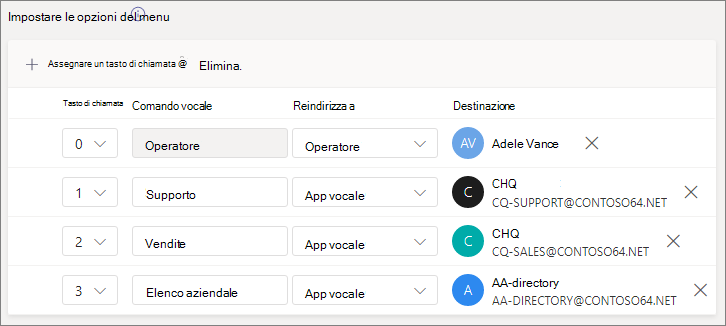
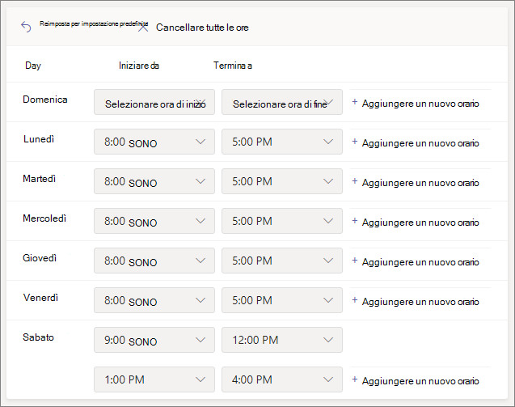
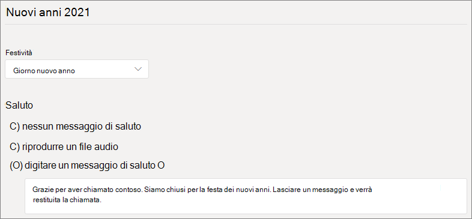
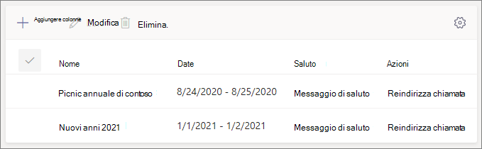
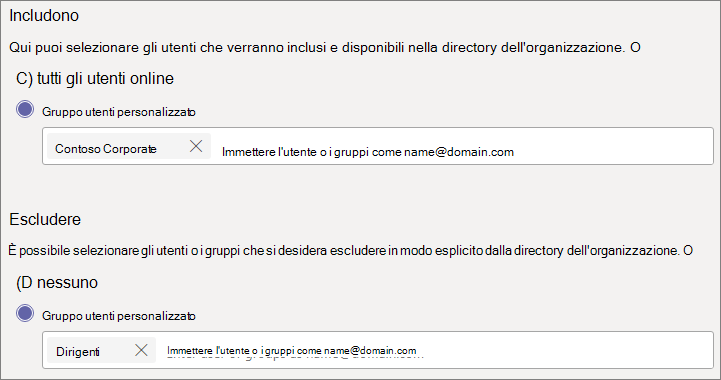
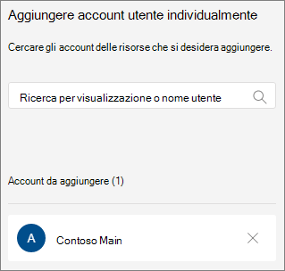

# Configurare un operatore automatico

Gli operatori automatici consentono alle persone di chiamare l'organizzazione e di spostarsi in un sistema di menu per parlare con il reparto di destra, la coda di chiamata, la persona o un operatore. È possibile creare operatori automatici per l'organizzazione con l'interfaccia di amministrazione di Microsoft teams o con PowerShell. 

Assicurarsi di aver letto [piano per gli operatori automatici di teams e le code di chiamata](plan-auto-attendant-call-queue.md) e aver seguito i [passaggi introduttivi](plan-auto-attendant-call-queue.md#getting-started) prima di seguire le procedure descritte in questo articolo.

Gli operatori automatici possono indirizzare le chiamate, in base all'input dei chiamanti, a una delle destinazioni seguenti:

- **Persona dell'organizzazione** : una persona dell'organizzazione che è in grado di ricevere chiamate vocali. Può trattarsi di un utente online o di un utente ospitato in locale con Skype for Business Server.
- **App vocale** : un altro operatore automatico o una coda di chiamata. Scegliere l'account delle risorse associato all'operatore automatico o alla coda di chiamata quando si sceglie questa destinazione.
- **Numero di telefono esterno** -qualsiasi numero di telefono. (Vedi [Dettagli tecnici del trasferimento esterno](create-a-phone-system-auto-attendant.md#external-phone-number-transfers---technical-details)).
- **Segreteria telefonica** : casella vocale associata a un gruppo Microsoft 365 specificato.
- **Operator** : l'operatore definito per l'operatore automatico. La definizione di un operatore è facoltativa. L'operatore può essere definito come una qualsiasi delle altre destinazioni in questo elenco.

Verrà richiesto di scegliere una di queste opzioni in varie fasi durante la configurazione di un operatore automatico.

Per configurare un operatore automatico, nell'interfaccia di amministrazione Team espandere **voce**, fare clic su **operatore automatico**e quindi fare clic su **Aggiungi**.

## Informazioni generali

1. Digitare un nome per l'operatore automatico nella casella nella parte superiore.

2. Se si vuole designare un operatore, specificare la destinazione per le chiamate all'operatore. Questa opzione è facoltativa (ma consigliata). Puoi impostare l'opzione **operator** per consentire ai chiamanti di uscire dai menu e parlare con una persona designata.

3. Specificare il fuso orario per l'operatore automatico. Il fuso orario viene usato per calcolare le ore lavorative se si [Crea un flusso di chiamata separato per le ore successive](#call-flow-for-after-hours).

4. Specificare una lingua per l'operatore automatico. Questa è la lingua che verrà usata per le istruzioni vocali generate dal sistema.

5. Scegliere se si desidera abilitare gli input vocali. Quando è abilitata, il nome di ogni opzione del menu diventa una parola chiave per il riconoscimento vocale. Ad esempio, i chiamanti possono pronunciare "uno" per selezionare l'opzione di menu mappata con il tasto 1 oppure possono dire "vendite" per selezionare l'opzione di menu denominata "Sales".

6. Fare clic su **Avanti**.

## Flusso delle chiamate

Scegliere se si vuole riprodurre un saluto quando l'operatore automatico risponde a una chiamata.

Se si seleziona **Riproduci un file audio** , è possibile usare il pulsante **Carica file** per caricare un messaggio di saluto registrato salvato come audio. WAV,. MP3 o. Formato WMA. La registrazione non può essere superiore a 5 MB.

Se si seleziona **digita un messaggio di saluto** , il sistema leggerà il testo del testo digitato (fino a 1000 caratteri) quando l'operatore automatico risponde a una chiamata.

Scegliere come si vuole instradare la chiamata.

Se si seleziona **Disconnetti**, l'operatore automatico bloccherà la chiamata.

Se si seleziona **reindirizza chiamata**, è possibile scegliere una delle destinazioni di routing delle chiamate.

Se si seleziona **Opzioni di menu Riproduci**, è possibile scegliere di **riprodurre un file audio** o **digitare un messaggio di saluto** e quindi scegliere tra le opzioni del menu e la ricerca nella directory.

### Opzioni di menu

Per le opzioni di chiamata, è possibile assegnare le chiavi di 0-9 sul tastierino telefonico a una delle destinazioni di routing delle chiamate. (I tasti \* (Repeat) e \# (back) sono riservati dal sistema e non possono essere riassegnati.

I mapping dei tasti non devono essere continui. È possibile, ad esempio, creare un menu con i tasti 0, 1 e 3 mappato alle opzioni, mentre il tasto 2 non viene usato.

È consigliabile eseguire il mapping della chiave 0 all'operatore se è stata configurata una. Se l'operatore non è impostato su un tasto qualsiasi, anche il comando vocale "operator" è disabilitato. 

Per ogni opzione di menu, specificare quanto segue:

- **Tasto** di scelta rapida: il tasto sulla tastiera del telefono per accedere a questa opzione. Se sono disponibili input vocali, i chiamanti possono anche pronunciare questo numero per accedere all'opzione.

- **Comando vocale** : definisce il comando vocale che può essere dato da un chiamante per accedere a questa opzione, se gli input vocali sono abilitati. Può contenere più parole come "Customer Service" o "Operations and grounds". Ad esempio, il chiamante può premere 2, dire "due" oppure dire "vendite" per selezionare l'opzione mappata al tasto 2. Questo testo viene inoltre eseguito tramite testo in sintesi vocale per la richiesta di conferma del servizio, che potrebbe essere simile a "trasferimento di una chiamata alle vendite".

- **Reindirizza a** -la destinazione di routing delle chiamate usata quando i chiamanti scelgono questa opzione. Se si reindirizza a un operatore automatico o a una coda di chiamata, scegliere l'account delle risorse associato.

### Ricerca directory

Se si assegnano i tasti di scelta alle destinazioni, è consigliabile scegliere **nessuno** per la **ricerca nella directory**. Se un chiamante tenta di chiamare un nome o un'estensione usando le chiavi assegnate a destinazioni specifiche, potrebbe essere instradato in modo imprevisto verso una destinazione prima di completare l'immissione del nome o dell'estensione. È consigliabile creare un operatore automatico distinto per la ricerca nella directory e avere il collegamento dell'operatore automatico principale tramite un tasto di chiamata.

Se non si assegnano i tasti di scelta rapida, scegliere un'opzione per la **ricerca nella directory**.

Chiamata **per nome** : se si abilita questa opzione, i chiamanti possono pronunciare il nome dell'utente o digitarlo sulla tastiera del telefono. Qualsiasi utente online con una licenza di sistema telefonico o qualsiasi utente ospitato in locale con Skype for Business Server è un utente idoneo e può essere trovato con chiamata per nome. Puoi impostare chi è e non è incluso nella directory nella pagina dell'ambito di [chiamata](#dial-scope) .

**Dial by Extension** : se si abilita questa opzione, i chiamanti possono connettersi con gli utenti dell'organizzazione componendo l'estensione del telefono. Qualsiasi utente online con una licenza di sistema telefonico o qualsiasi utente ospitato in locale con Skype for Business Server è un utente idoneo e può essere trovato con l' **estensione dial by**. Puoi impostare chi è e non è incluso nella directory nella pagina dell'ambito di [chiamata](#dial-scope) .

Gli utenti che si desidera rendere disponibili per la chiamata tramite estensione devono avere un'estensione specificata come parte di uno degli attributi di telefono seguenti definiti in Active Directory o in Azure Active Directory (vedere [aggiungere utenti singolarmente o in blocco](https://docs.microsoft.com/microsoft-365/admin/add-users/add-users) per altre informazioni).

- OfficePhone
- HomePhone
- Dispositivi mobili/MobilePhone
- TelephoneNumber/PhoneNumber
- OtherTelephone

Il formato obbligatorio per immettere l'estensione nel campo numero di telefono dell'utente è * + <phone number> ext = <extension> * o * + <phone number> x <extension> *.

È possibile impostare l'estensione nell'interfaccia di [amministrazione di Microsoft 365](https://admin.microsoft.com/) o nell'interfaccia di [amministrazione di Azure Active Directory](https://aad.portal.azure.com). Possono essere necessarie fino a 12 ore prima che le modifiche siano disponibili per gli operatori automatici e le code di chiamata.

> [!NOTE]
> Se si vogliono usare sia le funzionalità **di chiamata per nome** che per l' **estensione dial by** , è possibile assegnare un tasto di chiamata nell'operatore automatico principale per raggiungere un operatore automatico abilitato per il **nome della chiamata**. All'interno di tale operatore automatico è possibile assegnare il tasto 1 (senza lettere associate) per raggiungere la chiamata tramite l'operatore automatico **di estensione** .

Dopo aver selezionato un'opzione di **ricerca della directory** , fare clic su **Avanti**.

## Flusso delle chiamate per le ore successive

Gli orari di ufficio possono essere impostati per ogni operatore automatico. Se l'orario di ufficio non è impostato, tutti i giorni e tutte le ore del giorno sono considerati orario di ufficio perché il programma 24/7 è impostato come predefinito. Gli orari di ufficio possono essere impostati con interruzioni nel tempo durante il giorno e tutte le ore che non sono impostate come orari di ufficio sono considerate after-hours. È possibile impostare diverse opzioni di gestione delle chiamate in arrivo e i messaggi di saluto per le ore successive.

A seconda di come sono stati configurati gli operatori automatici e le code di chiamata, è possibile che sia necessario specificare il routing delle chiamate after-hours per gli operatori automatici con numeri di telefono diretti.

Se si vuole eseguire il routing delle chiamate separate per i chiamanti dopo le ore, specificare gli orari di ufficio per ogni giorno. Fare clic su **Aggiungi nuovo orario** per specificare più set di ore per un giorno specifico, ad esempio per specificare una pausa pranzo.

Dopo aver specificato gli orari di ufficio, scegliere le opzioni di routing delle chiamate per le ore successive. Le stesse opzioni sono disponibili per il routing delle chiamate in orario di ufficio specificato sopra.

Al termine, fare clic su **Avanti** .

## Flussi delle chiamate durante le festività

L'operatore automatico può avere un flusso di chiamata per ogni [festività configurata](set-up-holidays-in-teams.md). È possibile aggiungere fino a 20 giorni festivi pianificati per ogni operatore automatico.

1. Nella pagina delle impostazioni delle chiamate festive fare clic su **Aggiungi**.

2. Digitare un nome per l'impostazione festività.

3. Nell'elenco a discesa **festività** scegliere la festività che si vuole usare.

4. Scegliere il tipo di saluto che si vuole usare.

    

5. Scegliere se si vuole **disconnettere** o **reindirizzare** la chiamata.

6. Se si è scelto di reindirizzare, scegliere la destinazione di routing delle chiamate per la chiamata.

7. Fare clic su **Salva**.

Ripetere la procedura in base alle esigenze per ogni festività aggiuntiva.

Dopo aver aggiunto tutte le festività, fare clic su **Avanti**.

## Ambito di chiamata

L' *ambito di chiamata* definisce gli utenti disponibili nella directory quando un chiamante usa la chiamata per nome o il dial-by-Extension. Il valore predefinito di **tutti gli utenti online** include tutti gli utenti dell'organizzazione che sono utenti online con una licenza di sistema telefonico o ospitati in locale con Skype for Business Server.

È possibile includere o escludere utenti specifici selezionando un **gruppo di utenti personalizzato** in **Includi** o **Escludi** e scegliendo uno o più gruppi di Microsoft 365, liste di distribuzione o gruppi di sicurezza. Ad esempio, potresti voler escludere i dirigenti dell'organizzazione dalla directory di chiamata.

> [!NOTE]
> Per un nuovo utente potrebbe essere necessario un massimo di 36 ore per avere il nome elencato nella directory.

Dopo aver impostato l'ambito di chiamata, fare clic su **Avanti**.

## Account risorse

Tutti gli operatori automatici devono avere un account di risorse associato.  Per gli operatori automatici di primo livello sarà necessario almeno un account delle risorse con un numero di servizio associato. Se lo si desidera, è possibile assegnare più account di risorse a un operatore automatico, ognuno con un numero di servizio distinto.

Per aggiungere un account di risorse, fare clic su **Aggiungi account** e cercare l'account che si vuole aggiungere. Fare clic su **Aggiungi**e quindi su **Aggiungi**.

Dopo aver aggiunto gli account del servizio, fare clic su **Invia**. Viene completata la configurazione dell'operatore automatico.

## Trasferimenti di numeri di telefono esterni-dettagli tecnici

Quando si trasferiscono le chiamate a un numero di telefono esterno, l'account delle risorse associato all'operatore automatico o alla coda di chiamata deve avere un numero di telefono e un sistema telefonico Microsoft 365-licenza utente virtuale. Inoltre

- Per un account delle risorse con un numero di piano chiamante, assegnare una licenza per il [piano di chiamata](calling-plans-for-office-365.md) .
- Per un account delle risorse con un numero di routing diretto, assegnare un [criterio di routing vocale online](manage-voice-routing-policies.md).

Il numero di telefono in uscita visualizzato è determinato nel modo seguente:

  - Per chiamare i numeri del piano, viene visualizzato il numero di telefono del chiamante originale.
  - Per i numeri di routing diretti, il numero inviato si basa sull'impostazione P-Asserted-Identity (PAI) nell'SBC, come indicato di seguito:
    - Se impostato su disabilitato, viene visualizzato il numero di telefono del chiamante originale. Questa è l'impostazione predefinita e consigliata.
    - Se impostato su abilitato, viene visualizzato il numero di telefono dell'account risorse.

I trasferimenti tra Trunks del piano chiamante e trunk di routing diretto non sono supportati.

In un ambiente ibrido, per trasferire una chiamata di operatore automatico alla rete PSTN tramite l'integrazione PSTN di Skype for business, creare un nuovo utente locale con l'opzione inoltro di chiamata impostata sul numero PSTN. L'utente deve essere abilitato per VoIP aziendale e avere un criterio vocale assegnato. Per altre informazioni, vedere [trasferimento automatico delle chiamate di operatore in PSTN](https://docs.microsoft.com/SkypeForBusiness/plan/exchange-unified-messaging-online-migration-support#auto-attendant-call-transfer-to-pstn).

### Creare un operatore automatico con PowerShell

È anche possibile usare PowerShell per creare e configurare gli operatori automatici. Ecco i cmdlet necessari per gestire un operatore automatico:

- [New-CsAutoAttendant](https://docs.microsoft.com/powershell/module/skype/new-csautoattendant?view=skype-ps)  
- [Set-CsAutoAttendant](https://docs.microsoft.com/powershell/module/skype/set-csautoattendant?view=skype-ps)
- [Get-CsAutoAttendant](https://docs.microsoft.com/powershell/module/skype/get-csautoattendant?view=skype-ps)
- [Get-CsAutoAttendantHolidays](https://docs.microsoft.com/powershell/module/skype/get-csautoattendantholidays?view=skype-ps)
- [Remove-CsAutoAttendant](https://docs.microsoft.com/powershell/module/skype/remove-csautoattendant?view=skype-ps)
- [New-CsAutoAttendantMenu](https://docs.microsoft.com/powershell/module/skype/new-csautoattendantmenu?view=skype-ps)
- [New-CsOnlineAudioFile](https://docs.microsoft.com/powershell/module/skype/new-CsOnlineAudioFile?view=skype-ps)
- [New-CsAutoAttendantCallFlow](https://docs.microsoft.com/powershell/module/skype/New-CsAutoAttendantCallFlow?view=skype-ps)
- [Export-CsAutoAttendantHolidays](https://docs.microsoft.com/powershell/module/skype/export-csorganizationalautoattendantholidays?view=skype-ps)
- [New-CsOnlineTimeRange](https://docs.microsoft.com/powershell/module/skype/new-csonlinetimerange?view=skype-ps)
- [New-CsOnlineDateTimeRange](https://docs.microsoft.com/powershell/module/skype/new-csonlinedatetimerange?view=skype-ps)
- [New-CsOnlineSchedule](https://docs.microsoft.com/powershell/module/skype/New-CsOnlineSchedule?view=skype-ps)
- [Get-CsAutoAttendantSupportedTimeZone](https://docs.microsoft.com/powershell/module/skype/Get-CsAutoAttendantSupportedTimeZone?view=skype-ps)
- [New-CsAutoAttendantCallHandlingAssociation](https://docs.microsoft.com/powershell/module/skype/New-CsAutoAttendantCallHandlingAssociation?view=skype-ps)
- [Get-CsAutoAttendantSupportedLanguage](https://docs.microsoft.com/powershell/module/skype/Get-CsAutoAttendantSupportedLanguage?view=skype-ps)
- [Import-CsAutoAttendantHolidays](https://docs.microsoft.com/powershell/module/skype/import-csautoattendantholidays?view=skype-ps)
- [New-CsAutoAttendantCallableEntity](https://docs.microsoft.com/powershell/module/skype/New-CsAutoAttendantCallableEntity?view=skype-ps)

## Argomenti correlati

[Vantaggi offerti dal Sistema telefonico](/MicrosoftTeams/here-s-what-you-get-with-phone-system)

[Recuperare numeri di telefono del servizio](/microsoftteams/getting-service-phone-numbers).

[Disponibilità di Audioconferenza e Piani per chiamate per Paese e area geografica](/microsoftteams/country-and-region-availability-for-audio-conferencing-and-calling-plans/country-and-region-availability-for-audio-conferencing-and-calling-plans)

[Esempio di piccola impresa: configurare un operatore automatico](/microsoftteams/tutorial-org-aa) 

[Introduzione a Windows Powershell e Skype for Business online](/SkypeForBusiness/set-up-your-computer-for-windows-powershell/set-up-your-computer-for-windows-powershell)
