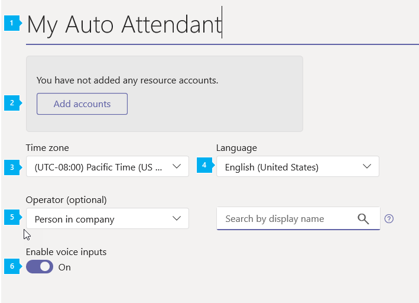
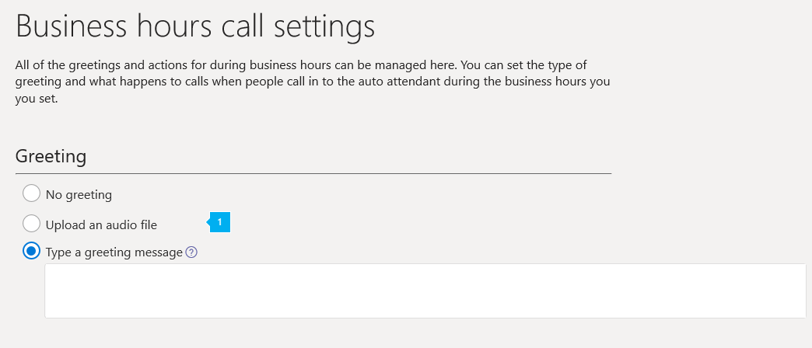
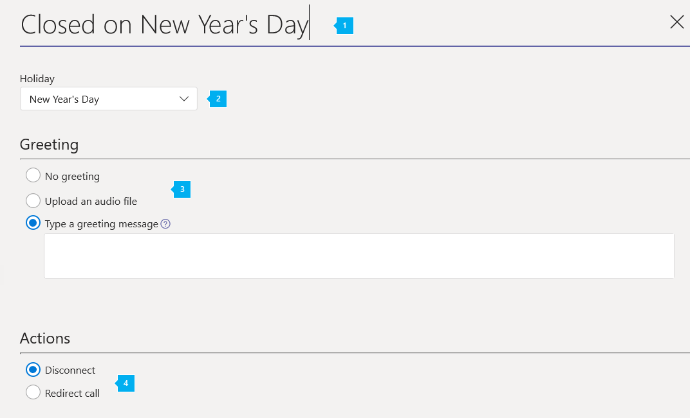

# Configurare un operatore automatico cloud

Gli operatori automatici consentono alle persone di chiamare l'organizzazione e di spostarsi in un sistema di menu per parlare con il reparto di destra, la coda di chiamata, la persona o un operatore. È possibile creare operatori automatici per l'organizzazione con l'interfaccia di amministrazione di Microsoft teams o con PowerShell. Per creare un operatore automatico, passa a **voce** nella barra di spostamento sinistra e quindi seleziona **operatori** > automatici**Aggiungi nuovo**.

Per altre informazioni sugli operatori automatici, vedere [che cosa sono gli operatori automatici di cloud?](/microsoftteams/what-are-phone-system-auto-attendants)

> [!NOTE]
> Questo articolo si applica sia a Microsoft teams che a Skype for business online.

I numeri di telefono non vengono assegnati direttamente all'operatore automatico, ma piuttosto a un [account delle risorse](manage-resource-accounts.md) associato all'operatore automatico.

Le implementazioni di operatore automatico spesso coinvolgono diversi operatori automatici. Un operatore automatico di *primo livello* ha in genere un account delle risorse con un numero di telefono assegnato. Un operatore automatico annidato viene usato come menu di secondo livello a cui l'operatore automatico di *primo livello* si connette come chiamata. Un operatore automatico *annidato* non è necessario per avere un numero di telefono assegnato al proprio account di risorse.

## Passaggio 1: iniziare

- Per avere un account di risorse associato, è necessario un operatore automatico. Vedere [gestire gli account delle risorse in teams](manage-resource-accounts.md) per informazioni dettagliate sugli account delle risorse e tutte le licenze necessarie. 
 
<!-- When you create a new auto attendant in Teams after October 10th, 2019, the required auto attendant is automatically created and linked with the new auto attendant. -->
 
> [!TIP]
> Per reindirizzare le chiamate a un operatore o a un'opzione di menu che è un utente online con una licenza di sistema telefonico, sarà necessario abilitarle per VoIP aziendale. Vedere [assegnare licenze di Skype for business](/skypeforbusiness/skype-for-business-and-microsoft-teams-add-on-licensing/assign-skype-for-business-and-microsoft-teams-licenses) o [assegnare licenze di Microsoft teams](assign-teams-licenses.md). Puoi anche utilizzare Windows PowerShell. Ad esempio, Esegui:`Set-CsUser -identity "Amos Marble" -EnterpriseVoiceEnabled $true`

## Passaggio 2: creare operatori automatici

> [!IMPORTANT]
> Ogni operatore automatico è necessario per avere un [account di risorse](manage-resource-accounts.md)associato. Devi prima creare l'account della risorsa, quindi puoi associarlo all'operatore automatico.

### Con l'interfaccia di amministrazione di Microsoft Teams

Nell'interfaccia di **amministrazione di Microsoft teams**fare clic su**operatore automatico** **vocale** > , quindi fare clic su **+ Aggiungi**:

#### Pagina informazioni generali

* * *

**nome** dello screenshot precedente immettere un nome visualizzato per l'operatore automatico. Il nome è obbligatorio e può contenere fino a 64 caratteri, inclusi gli spazi. Il **nome** indicato in questo articolo è elencato in una colonna della scheda **operatori automatici** .

* * *

  
 **operatore** screenshot precedente è facoltativo (ma consigliato). Puoi impostare l'opzione **operator** per consentire ai chiamanti di uscire dai menu e parlare con una persona designata.

Per impostazione predefinita, il tasto 0 viene assegnato all'operatore.

Se si imposta un operatore, indicare agli utenti che chiamano l'opzione in **modifica opzioni del menu** nella pagina **flusso di chiamata** . Se si imposta un operatore nell'operatore automatico, si immette il testo della richiesta corrispondente nei **chiamanti si sente** la casella o si modifica il file audio per includere questa opzione. Ad esempio: "Per contattare un operatore, premere zero".

Sono disponibili diversi modi per impostare l'operatore:

- **Nessun operatore** Disabilita le opzioni "operatore" e "premi 0". Questa è l'impostazione predefinita corrente.
- La **persona dell'organizzazione** assegna una persona con una licenza di sistema telefonico abilitata per i piani di chiamate aziendali o assegnati in Office 365. Puoi anche configurarlo in modo che il chiamante venga inviato alla segreteria telefonica. Per inviare un chiamante alla segreteria telefonica, selezionare **persona nell'organizzazione** e impostare le impostazioni dell'account per inviare chiamate direttamente alla segreteria telefonica.

     > [!Note]
     > **La persona dell'organizzazione** può essere un utente online o un utente ospitato in locale con Skype for Business Server.

- **App vocale**  Selezionare il nome dell'account della risorsa collegato a un operatore automatico o a una coda di chiamata già creata. I chiamanti che richiedono l'operatore vengono reindirizzati.  
<!--   

- **Auto attendant** Select the name of the resource account linked to an auto attendant that has already been created. Callers that request an operator are redirected there.
- **Call queue** Select the name of the resource account linked to a call queue that has already been created. Callers that request an operator are redirected there.

**Phone number (optional)** Enter the service phone number you want to assign to the new resource account this wizard creates and links to the new auto attendant. If you intend this auto attendant to be a nested auto attendant, it doesn't need a phone number. You can add one if for some reason you require several ways to connect to the auto attendant system.

> [!NOTE]
> Auto attendants created after October 10th, 2019 also create a new [resource account](manage-resource-accounts.md) that is associated with the auto attendant. If a phone number is applied to the auto attendant's resource account,  a Phone System - Virtual user license is applied to the resource account if one is available.
-->

* * *

 **fuso orario** precedente dello screenshot necessario per impostare il fuso orario per l'operatore automatico. L'impostazione può essere uguale al fuso orario dell'indirizzo principale elencato per l'organizzazione o a un fuso orario diverso. Ogni operatore automatico può avere un fuso orario diverso. L'orario di ufficio impostato per l'operatore automatico usa anche questo fuso orario. Assicurarsi di impostare il fuso orario giusto per evitare discrepanze tra le ore lavorative, poiché non tutte le aree hanno l'ora legale. 

* * *

  
 **lingua** dello screenshot precedente selezionare la lingua che si vuole usare per l'operatore automatico. L'operatore automatico usa quella lingua con i chiamanti e tutte le richieste di sistema vengono riprodotte in questa lingua.

 * * *

precedente consente di abilitare il riconoscimento vocale degli**input vocali** è disponibile se questa opzione è selezionata. I chiamanti possono usare l'input vocale nella [lingua impostata](set-auto-attendant-languages-for-audio-conferencing-in-teams.md). Se si vuole consentire solo agli utenti di usare la tastiera del telefono per effettuare le selezioni, è possibile abbandonare il riconoscimento vocale impostato su **disattivato**.

* * *  

Dopo aver completato le selezioni, fare clic su **Avanti**.

#### Flusso delle chiamate

> [!TIP]
> È possibile scegliere di configurare una pianificazione di orari di ufficio personalizzata con comportamenti diversi per il flusso delle chiamate durante e dopo le ore lavorative. Per impostare una pianificazione personalizzata, impostare il [flusso di chiamata facoltativo per le ore successive](#call-flow-for-after-hours). Per impostazione predefinita, un operatore automatico usa i flussi delle chiamate in orario di ufficio.

È possibile configurare i messaggi di saluto, le richieste e i menu personalizzati che gli utenti sentono quando raggiungono l'operatore automatico.

* * *

**Prima riproduzione di un messaggio di saluto** Un saluto è facoltativo e può essere impostato su **Nessun saluto**, **riprodurre un file audio**o **digitare un messaggio di saluto**.

> [!NOTE]
> Un saluto è molto utile per un operatore automatico di primo livello. Un operatore automatico annidato spesso non ha bisogno di un saluto.

 precedente se si seleziona **Nessun saluto**, il chiamante non sente un messaggio o un saluto prima che la chiamata venga gestita da una delle azioni selezionate in un secondo momento. 

<!-- You can also upload an audio file (in .wav, mp3 or .wma formats), or create a custom greeting using Text-to-Speech.-->

 precedente se si seleziona **Riproduci un file audio** , è possibile usare il pulsante **Carica file** per caricare un messaggio di saluto registrato salvato come audio. WAV,. MP3 o. Formato WMA. La registrazione non può essere superiore a 5 MB.

 precedente **digitare un messaggio di saluto** se si sceglie questa opzione, immettere il testo da leggere per il sistema (fino a 1000 caratteri) nel campo specificato. Ad esempio, immettere "Welcome to contoso. La tua chiamata è importante per noi." L'output viene creato tramite il software Text-to-Voice.

* * *

Puoi selezionare cosa succede accanto alle chiamate delle azioni seguenti nella sezione **quindi instrada la chiamata** . Le impostazioni sono le opzioni **Disconnetti**, **reindirizza chiamata**o **Riproduci menu**.

Se si seleziona **Disconnetti**, il chiamante viene disconnesso dopo la riproduzione del messaggio di saluto. 

 precedente reindirizza la **chiamata** invia il chiamante alla destinazione scelta senza scegliere Opzioni. Le impostazioni possibili sono:

  - **Persona nell'organizzazione** L'account scelto deve avere una licenza per il sistema telefonico abilitato per VoIP aziendale o avere un piano di chiamata assegnato in Office 365. È possibile configurarlo in modo che il chiamante possa essere inviato alla segreteria telefonica: selezionare **persona nell'organizzazione** e impostare l'account per inoltrare le chiamate direttamente alla segreteria telefonica.

  > [!Note]
  > La **persona dell'organizzazione** può essere un utente online o un utente ospitato in locale con Skype for Business Server.

  - **App vocale** Selezionare un operatore automatico o una coda di chiamata già configurata. Si cerca l'operatore automatico o la coda di chiamata in base al nome dell'account delle risorse associato al servizio.
  - **Segreteria telefonica** Selezionare il gruppo Office 365 che contiene gli utenti dell'organizzazione che devono accedere alla segreteria telefonica ricevuta dall'operatore automatico. I messaggi della segreteria telefonica vengono inviati al gruppo Office 365 specificato. Per accedere ai messaggi della segreteria telefonica, i membri del gruppo possono aprirli passando al gruppo in Outlook.

      Cambiare la **trascrizione** **su** attivato per abilitare la trascrizione vocale dei messaggi della segreteria telefonica.

 * * *

 precedente quando si selezionano le **Opzioni di menu Riproduci** , è possibile scegliere se usare un file audio o immettere il testo che verrà visualizzato come testo in vocale per assegnare le opzioni del menu di scelta rapida ai chiamanti. Selezionare questa opzione invece delle opzioni **reindirizza chiamata** o **Disconnetti** .

 precedente **Riproduci un file audio** consente di configurare le richieste e le opzioni per il chiamante. 
- Se si seleziona **Riproduci un file audio** , è possibile usare il pulsante **Carica file** per caricare un messaggio di saluto registrato salvato come audio. WAV,. MP3 o. Formato WMA. La registrazione non può essere superiore a 5 MB.

- **Digitare un messaggio di saluto** Se si sceglie questa opzione, immettere il testo che si desidera venga letto dal sistema (fino a 1000 caratteri) nel campo specificato. Ad esempio, immettere "Welcome to contoso. La tua chiamata è importante per noi." L'output viene creato tramite il software Text-to-Voice.

**Impostare le opzioni del menu** Il tastierino telefonico o i comandi vocali possono essere aggiunti o rimossi in questa finestra di dialogo. Per eliminare un'opzione di menu, rimuovere la voce del comando vocale e impostare **reindirizza su** torna per **selezionare**.

> [!TIP]
> Aggiornare il testo della richiesta di menu o registrare di nuovo le richieste audio quando si rimuovono le opzioni. Il prompt dei menu riprodotto per i chiamanti non viene aggiornato automaticamente.  
>
> Qualsiasi opzione di menu può essere aggiunta e rimossa in qualsiasi ordine e i mapping delle chiavi non devono essere continui. È possibile, ad esempio, creare un menu con i tasti 0, 1 e 3 mappato alle opzioni, mentre il tasto 2 non viene usato.

> [!NOTE]
> I tasti \* (Repeat) e \# (back) sono riservati dal sistema e non possono essere riassegnati. Se il riconoscimento vocale è abilitato, premendo * corrisponderà a "REPEAT" e # corrisponderà ai comandi vocali "back".

 precedente per configurare un'opzione di menu, fare clic sul **+ assegnare un tasto** di scelta rapida e immettere le informazioni per le opzioni seguenti:

  **comando vocale** dello screenshot precedente per un'opzione può avere un massimo di 64 caratteri e può contenere più parole come "Customer Service" o "Operations and grounds". Se il riconoscimento vocale è abilitato, il nome viene riconosciuto automaticamente e il chiamante è in grado di premere 3, pronunciare "tre" oppure dire "Customer Service" per selezionare l'opzione associata al tasto 3. Questo testo viene inoltre eseguito tramite testo in sintesi vocale per la richiesta di conferma del servizio, che potrebbe essere simile a "trasferimento di una chiamata all'operatore".

 precedente l'opzione **reindirizza a** imposta la posizione in cui si trova la chiamata se viene premuto il tasto corrispondente oppure l'opzione è selezionata tramite riconoscimento vocale. La chiamata può essere inviata a:

<!-- Is the Operator behavior changing here? Looks like operator is only an available option for dial key 0 -->

- **Operatore** Se un operatore è già configurato, l'opzione viene automaticamente mappata alla chiave 0, ma può anche essere eliminata o riassegnata a una chiave diversa. Il chiamante che seleziona questa opzione viene inviato all'operatore designato. Se operator non è impostato su un tasto qualsiasi, anche il comando vocale "operator" è disabilitato. 
- La **persona dell'organizzazione** può essere un utente online o un utente ospitato in locale con Skype for Business Server. L'utente deve avere una licenza per il sistema telefonico abilitata per i piani VoIP aziendale o per le chiamate assegnate in Office 365. Cercare la persona nel campo **Cerca in base al nome** .

- **App vocale** Selezionare un operatore automatico o una coda di chiamata già configurata. Si cerca l'operatore automatico o la coda di chiamata in base al nome dell'account delle risorse associato all'applicazione.

- **Segreteria telefonica** Selezionare il gruppo Office 365 che contiene gli utenti dell'organizzazione che devono accedere alla segreteria telefonica ricevuta dall'operatore automatico. I messaggi della segreteria telefonica vengono inviati al gruppo Office 365 specificato. Per accedere ai messaggi della segreteria telefonica, i membri del gruppo possono aprirli passando al gruppo in Outlook.

    Cambiare la **trascrizione** **su** attivato per abilitare la trascrizione vocale dei messaggi della segreteria telefonica.

<!-- - **Auto attendant** Select the name of an existing auto attendant in the **Search by name** field. You will also have to select a resource account associated to the auto attendant. The caller who selects this option is sent to that auto attendant.
- **Call queue** Select the name of an existing call queue in the **Search by name** field. You will also have to select a resource account associated to the call queue. The caller who selects this option is sent to that call queue, where the call is answered by a call agent.
- **External phone number** routes the caller to a designated phone number outside your local system.<!-- does this have prerequisites like direct routing?
- **Group Voicemail** routes the call to a voicemail box that you select.  -->

  **ricerca della directory** dello screenshot precedente in questa sezione è possibile abilitare la **chiamata per nome** e la chiamata per **estensione** per l'operatore automatico. È possibile impostare chi è e non è incluso in questi servizi nella pagina dell'ambito di chiamata facoltativa. La ricerca della directory è impostata su **None** per impostazione predefinita.

**Chiamata per nome** Se si abilita questa opzione, i chiamanti possono cercare gli utenti dell'organizzazione usando la chiamata in **base al nome**. Si dice che il nome dell'utente e il riconoscimento vocale corrispondano a un utente. È possibile impostare chi è e non è incluso in questi servizi nella pagina dell'ambito di chiamata facoltativa. Qualsiasi utente online con una licenza di sistema telefonico o qualsiasi utente ospitato in locale con Skype for Business Server è un utente idoneo e può essere trovato con chiamata per nome.

**Dial by Extension** Se si abilita questa opzione, i chiamanti possono connettersi con gli utenti dell'organizzazione immettendo l'estensione del telefono. È possibile selezionare gli utenti elencati come disponibili o non disponibili per l' **estensione dial by** nella pagina facoltativa dell'ambito di chiamata. Qualsiasi utente online con una licenza di sistema telefonico o qualsiasi utente ospitato in locale con Skype for Business Server è un utente idoneo e può essere trovato con l'estensione dial by.

> [!IMPORTANT]
> Attenersi alla seguente procedura:
>- Gli utenti che si desidera rendere disponibili per la chiamata tramite estensione devono avere un'estensione specificata come parte del numero di telefono o del numero di telefono cellulare assegnato nell'interfaccia di [amministrazione di Microsoft 365](https://docs.microsoft.com/office365/admin/add-users/add-users?view=o365-worldwide#use-the-new-admin-center-to-add-users).  Il formato necessario per immettere l'estensione nel campo numero di telefono dell'utente è `+<phonenumber>;ext=<extension>` o. `x<extension>`
>- L'assegnazione di un'estensione nell'interfaccia di amministrazione di teams non è attualmente supportata. È necessario usare il comando [set-MsolUser](https://docs.microsoft.com/powershell/module/msonline/set-msoluser?view=azureadps-1.0) di PowerShell o l'interfaccia di amministrazione di Microsoft 365.
>- Possono essere necessarie fino a 12 ore prima che siano disponibili modifiche agli attributi PhoneNumber e MobilePhone di AAD.
>- NON definire un'estensione per il LineUri di un utente. Questa operazione non è attualmente supportata.
>- Un operatore automatico può essere configurato per l'opzione Componi per nome o per chiamata tramite estensione, ma non entrambe.

> [!NOTE]
> Se si vogliono usare entrambe le funzionalità di chiamata per **nome** e chiamata per **estensione** , è possibile creare l'operatore automatico principale (abilitato per il **Dial-in per nome**) che richiede ai chiamanti di scegliere un'opzione di menu se conosce l'estensione dell'utente e impostare tale opzione per trasferire la chiamata a un operatore automatico abilitato per l'estensione di dial by.

* * *

<!--
**Instructions for callers** lets you choose **Use recorded call instructions** or **Write your call instructions**.  

If you choose **Use recorded call instructions**, you have the option to record and upload new or prerecorded sound files to play as menu instructions. The same app used in recording the auto attendant greeting is used here.

If you choose **Write your call instructions**, enter the script  you want the system to read (up to 1000 characters). For example, you might enter text that begins "Please choose from one of the following menu options ... " and provide a script written to reflect your configuration.
* * *  -->

Dopo aver completato le selezioni, è possibile fare clic su **Avanti** se si vogliono modificare le impostazioni avanzate o fare clic su **Invia** se si vogliono usare le impostazioni predefinite per elementi come:
- Flusso delle chiamate per le ore successive
- Flusso delle chiamate per le festività
- Ambito di chiamata
- Account risorse

Dato che è necessario che l'operatore automatico disponga di un account di risorse, è possibile scegliere di procedere alla pagina dell' **account delle risorse** e associare un account di risorse già configurato oppure creare un account risorse e associarlo all'operatore automatico, come descritto in gestire gli [account delle risorse in Microsoft teams](manage-resource-accounts.md). Non sarà possibile usare questo operatore automatico finché non è stato associato a un account di risorse. a tale scopo, fare clic sul pulsante **Avanti** nella parte inferiore dello schermo e quindi fare clic su **account risorse** nella barra di spostamento sinistra per accedere direttamente alla pagina account risorse e associare l'operatore automatico a un account di risorse.

#### Impostazioni avanzate (facoltativo)

Sono disponibili quattro schermate aggiuntive che è possibile configurare o abbandonare per impostazione predefinita mentre si sceglie.

##### Flusso delle chiamate per le ore successive

Per impostazione predefinita, gli orari di ufficio di un operatore automatico sono impostati su 9.00-17.00, dal lunedì al venerdì  <!--24/7-->e le opzioni flusso di chiamata per le chiamate *after hours* sono disabilitate perché tutte le ore sono considerate *orari di ufficio*. Quando si seleziona l'opzione **imposta orari di ufficio personalizzati** , il **flusso delle chiamate per la pagina after hours** configura le regole di gestione delle chiamate usate dall'operatore automatico dopo le ore. Le opzioni disponibili sono le stesse, la differenza è la possibilità di impostare una programmazione per menu e comportamenti diversi.

Un sistema di operatori automatici può essere necessario impostare solo dopo ore il comportamento di gestione delle chiamate per l'operatore automatico di primo livello. Gli operatori automatici annidati potrebbero anche non essere chiamati dall'operatore automatico di primo livello, ma in alternativa il sistema può definire il comportamento di after hours per ogni operatore automatico che usa.

Inizialmente, gli orari di ufficio sono definiti per iniziare da 12:00 AM e terminano alle 12:00 PM, da domenica a sabato. Tutte le ore che non si trovano durante le ore lavorative vengono considerate *dopo ore*.

 * * *

 precedente è possibile fare clic su **Seleziona 24/7** per impostare tutte le ore lavorative per l'operatore automatico.

 precedente selezionare l'opzione **Reimposta per impostazione predefinita** per ripristinare tutte le modifiche nella programmazione e tornare alla definizione predefinita degli orari di ufficio come da 9:00 a 5:00 PM dal lunedì al venerdì.

 precedente selezionare **Cancella tutte le ore** per cancellare completamente la programmazione. La selezione di questa opzione e l'impostazione delle ore non impostate non sono consigliate, quindi è consigliabile usare questa funzione solo se si vogliono ripristinare completamente gli orari di ufficio.

 precedente per personalizzare l'ora di inizio o di fine per un giorno della settimana, fare clic su **Start at** o **fine al** momento in cui si vuole reimpostare e selezionare la nuova ora nell'elenco visualizzato.   L'elenco consente di selezionare gli orari di ufficio in intervalli di 15 minuti e gli orari di ufficio selezionati in questo punto si basano sul fuso orario impostato nella pagina **informazioni generali** .

 <!-- The **Apply to all days** option can be used to reset all days of the week to match the settings for that day. This makes setting weekdays and weekends to different hours easier.-->

 precedente per configurare un'interruzione (ad esempio un'interruzione di pranzo), selezionare **Aggiungi nuova ora** per il giorno della settimana per creare una nuova riga di tabella e selezionare nuovi orari di inizio e fine. È possibile impostare più interruzioni in orari di ufficio.

Le opzioni di [flusso delle chiamate](#call-flow) disponibili dopo le ore sono le stesse delle opzioni disponibili durante l'orario di ufficio. Scorrere verso il basso nella pagina di immissione delle informazioni per impostare le opzioni del flusso delle chiamate orarie.

* * *

Dopo aver completato le selezioni, fare clic su **Avanti**. È anche possibile fare clic su **account risorse** nella barra di spostamento sinistra per accedere direttamente alla pagina account risorse e associare l'operatore automatico a un account di risorse.

##### Flusso delle chiamate durante le festività

È possibile aggiungere fino a 20 giorni festivi pianificati per ogni operatore automatico. L'organizzazione potrebbe avere già definito festività come descritto in [configurare le festività in Microsoft teams](set-up-holidays-in-teams.md). In caso contrario, verrà visualizzata la schermata seguente: 

 precedente per impostare un flusso di chiamata personalizzato per una festività nell'operatore automatico, fare clic su **+ Aggiungi** la schermata Visualizza **flusso chiamata nuova festività** .
> [!TIP]
> Per creare festività, è possibile accedere alla schermata durante **le** > **festività**a livello di organizzazione.  

* * *

 precedente immettere un **nome** per il nuovo flusso di chiamata.

 precedente se hai già creato le festività, le vedrai nel menu a discesa **festività** e potrai selezionarle. Potresti vedere un'opzione inutilizzata che puoi modificare in ciò che ti serve. In caso contrario, fare clic su **Aggiungi** nella parte inferiore dell'elenco a discesa per creare una nuova festività.  Vedere [configurare le festività in Microsoft teams](set-up-holidays-in-teams.md) per i passaggi usati per creare una festività. 

Un nome di flusso delle chiamate per le festività può essere lungo fino a 64 caratteri e deve essere univoco per l'organizzazione. Ad esempio, non è possibile avere due flussi di chiamate festivi denominati "thanksgiving" nella stessa organizzazione. L'operatore automatico può avere un flusso di chiamata per ogni festività configurata, ma potrebbe essere necessario disporre di un set di comportamenti comune diverso da un saluto personalizzato.

 precedente le opzioni di [saluto](#call-flow) disponibili per un flusso delle chiamate delle festività sono le stesse delle opzioni disponibili durante l'orario di ufficio. Anche le **azioni** eseguite dopo la riproduzione del messaggio di saluto sono simili, tranne per il fatto che l'unica azione disponibile consiste nel **disconnettersi** o **reindirizzare**e quando si sceglie l'opzione **reindirizza a** l'operatore non è una delle opzioni disponibili. Non è possibile configurare un menu specifico per un flusso delle festività.

> [!NOTE]
> Per impostazione predefinita, tutte le chiamate ricevute durante un periodo di festività sono impostate per **disconnettersi** dopo il messaggio di saluto (se presente), quindi devi specificare un redirect se vuoi un comportamento personalizzato.

Fare clic su Salva per completare la creazione del flusso delle chiamate festive. Dopo aver creato un flusso delle chiamate per le festività, verrà visualizzato nella schermata delle **chiamate durante le festività** .

Fare clic su **Avanti** per impostare l'ambito di chiamata, quindi di **nuovo** per apportare modifiche al flusso delle chiamate ora e **inviarlo** se è stato completato. È anche possibile fare clic su **account risorse** nella barra di spostamento sinistra per accedere direttamente alla pagina account risorse e associare l'operatore automatico a un account di risorse.

#### Ambito di chiamata

In questa pagina è possibile impostare chi è elencato nella directory e disponibile per il nome della chiamata quando una persona chiama l'organizzazione. La chiamata per nome è impostata su **disattivato** per impostazione predefinita in una schermata precedente. Tutti gli utenti con un'estensione saranno disponibili se in precedenza è stato selezionato **Componi per estensione** .

 screenshot precedente **include** le opzioni in questa sezione sono **tutti gli utenti online** o i gruppi di utenti **personalizzati**

Se si selezionano **tutti gli utenti online**, tutti gli utenti idonei sono inclusi nella ricerca nella directory.

**Gruppi di utenti personalizzati** Questa opzione consente di cercare e selezionare un gruppo, una lista di distribuzione o un gruppo di sicurezza di Office 365 già creato nell'organizzazione. Gli utenti vengono aggiunti alla directory se si trovano nel gruppo di Office 365 scelto, nella lista di distribuzione o nel gruppo di sicurezza e sono **utenti online con una licenza di sistema telefonico** o ospitati in locale con Skype for Business Server. È possibile aggiungere più gruppi di Office 365, liste di distribuzione e gruppi di sicurezza alla directory.

In questa pagina è possibile configurare gli utenti dell'organizzazione che verranno elencati nella directory e disponibili per il nome della chiamata per ogni persona che chiama l'organizzazione.

 precedente **esclude** le opzioni in questa sezione consente di escludere utenti o gruppi di utenti specifici dalla directory dell'organizzazione.

Se si seleziona **nessuno**, tutti gli utenti idonei saranno inclusi nella ricerca nella directory.

**Gruppo utenti personalizzato** È possibile cercare un gruppo, una lista di distribuzione o un gruppo di sicurezza di Office 365 creato nell'organizzazione. Gli utenti di tale gruppo sono esclusi dalla ricerca nella directory. È possibile aggiungere più gruppi di Office 365, liste di distribuzione e gruppi di sicurezza.

Se si lasciano le impostazioni predefinite quando l'opzione Componi per nome è abilitata, tutti gli utenti idonei sono inclusi nella ricerca nella directory.

> [!NOTE]
> Per un nuovo utente potrebbe essere necessario un massimo di 36 ore per avere il nome elencato nella directory. Quando qualcuno usa la chiamata per nome con il riconoscimento vocale, i nuovi account potrebbero non essere disponibili per questa funzionalità.

Dopo aver immesso tutti i campi obbligatori e aver configurato i menu e le opzioni di gestione delle chiamate, fare clic su **Avanti** per procedere con l'associazione di un account risorse.

#### Account risorse

Tutti gli operatori automatici devono avere un account di risorse associato.  Gli operatori automatici di primo livello avranno sicuramente bisogno di almeno un account delle risorse con un numero di servizio associato. Se lo si desidera, è possibile assegnare più account di risorse a un operatore automatico, ognuno con un numero di servizio distinto.

Se non è già stato configurato un account di risorse per l'operatore automatico, viene visualizzata la schermata seguente: 

 

 precedente per aggiungere uno o più account di risorse esistenti e non assegnati all'operatore automatico, fare clic su **Aggiungi account** e cercare e selezionarli dalle finestre di dialogo fornite.

 precedente per aggiungere un altro account di risorse, fare clic su **+ Aggiungi account**.

 L'account di risorse o gli account assegnati a questo operatore automatico sono visualizzati in un elenco.

## Modificare gli operatori automatici

Dopo aver salvato il nuovo operatore automatico, viene elencato nella pagina **operatore automatico** . Questa pagina consente di visualizzare rapidamente alcune delle opzioni configurate, ad esempio il nome, l'account di risorse associato, la lingua e l'operatore assegnato.

Se si vogliono modificare le impostazioni di operatore automatico, selezionare l'operatore automatico e quindi nel riquadro azioni fare clic su **modifica**.

<!-- To quickly place a test call to your auto attendant, click the **Test** button in the Action pane. -->

<!-- ## Summary view

You can use the Summary page to review the settings you've created.

Press the **Create** button to finish setup of your new auto attendant. -->

### Creare un operatore automatico con PowerShell

È anche possibile usare PowerShell per creare e configurare gli operatori automatici. Ecco i cmdlet necessari per gestire un operatore automatico:

- [New-CsAutoAttendant](https://docs.microsoft.com/powershell/module/skype/new-csautoattendant?view=skype-ps)  
- [Set-CsAutoAttendant](https://docs.microsoft.com/powershell/module/skype/set-csautoattendant?view=skype-ps)
- [Get-CsAutoAttendant](https://docs.microsoft.com/powershell/module/skype/new-csautoattendant?view=skype-ps)
- [Get-CsAutoAttendantHolidays](https://docs.microsoft.com/powershell/module/skype/get-csautoattendantholidays?view=skype-ps)
- [Remove-CsAutoAttendant](https://docs.microsoft.com/powershell/module/skype/remove-csautoattendant?view=skype-ps)
- [New-CsAutoAttendantMenu](https://docs.microsoft.com/powershell/module/skype/new-csautoattendantmenu?view=skype-ps)
- [New-CsOnlineAudioFile](https://docs.microsoft.com/powershell/module/skype/new-CsOnlineAudioFile?view=skype-ps)
- [New-CsAutoAttendantCallFlow](https://docs.microsoft.com/powershell/module/skype/New-CsAutoAttendantCallFlow?view=skype-ps)
- [Export-CsAutoAttendantHolidays](https://docs.microsoft.com/powershell/module/skype/export-csorganizationalautoattendantholidays?view=skype-ps)
- [New-CsOnlineTimeRange](https://docs.microsoft.com/powershell/module/skype/new-csonlinetimerange?view=skype-ps)
- [New-CsOnlineDateTimeRange](https://docs.microsoft.com/powershell/module/skype/new-csonlinedatetimerange?view=skype-ps)
- [New-CsOnlineSchedule](https://docs.microsoft.com/powershell/module/skype/New-CsOnlineSchedule?view=skype-ps)
- [Get-CsAutoAttendantSupportedTimeZone](https://docs.microsoft.com/powershell/module/skype/Get-CsAutoAttendantSupportedTimeZone?view=skype-ps)
- [New-CsAutoAttendantCallHandlingAssociation](https://docs.microsoft.com/powershell/module/skype/New-CsAutoAttendantCallHandlingAssociation?view=skype-ps)
- [Get-CsAutoAttendantSupportedLanguage](https://docs.microsoft.com/powershell/module/skype/Get-CsAutoAttendantSupportedLanguage?view=skype-ps)
- [Import-CsAutoAttendantHolidays](https://docs.microsoft.com/powershell/module/skype/import-csautoattendantholidays?view=skype-ps)
- [New-CsAutoAttendantCallableEntity](https://docs.microsoft.com/powershell/module/skype/New-CsAutoAttendantCallableEntity?view=skype-ps)

### Altre informazioni su Windows PowerShell

- Windows PowerShell is all about managing users and what users are allowed or not allowed to do. Con Windows PowerShell è possibile gestire Office 365 e Microsoft Teams da un unico punto di amministrazione in grado di semplificare il lavoro quotidiano. Per iniziare a usare Windows PowerShell, vedere questi argomenti:

  - [Introduzione a Windows PowerShell e Skype for Business Online](/SkypeForBusiness/set-up-your-computer-for-windows-powershell/set-up-your-computer-for-windows-powershell)

  - [Sei motivi per utilizzare Windows PowerShell per gestire Office 365](https://docs.microsoft.com/office365/enterprise/powershell/why-you-need-to-use-office-365-powershell)

- Windows PowerShell offre numerosi vantaggi in velocità, semplicità e produttività solo con l'interfaccia di amministrazione di Microsoft 365, ad esempio per apportare modifiche all'impostazione per molti utenti contemporaneamente. Per informazioni su questi vantaggi, consulta i seguenti argomenti:

  - [Gestire Office 365 con Office 365 PowerShell](https://docs.microsoft.com/office365/enterprise/powershell/manage-office-365-with-office-365-powershell)

  - [Uso di Windows PowerShell per gestire Skype for Business online](/SkypeForBusiness/set-up-your-computer-for-windows-powershell/set-up-your-computer-for-windows-powershell)

## Argomenti correlati

[Ecco cosa offre il Sistema telefonico in Office 365](/MicrosoftTeams/here-s-what-you-get-with-phone-system)

[Recuperare numeri di telefono del servizio](/microsoftteams/getting-service-phone-numbers).

[Disponibilità di Audioconferenza e Piani per chiamate per Paese e area geografica](/microsoftteams/country-and-region-availability-for-audio-conferencing-and-calling-plans/country-and-region-availability-for-audio-conferencing-and-calling-plans)

[New-CsOrganizationalAutoAttendant](https://docs.microsoft.com/powershell/module/skype/new-csorganizationalautoattendant?view=skype-ps)  

[Cosa sono gli operatori automatici cloud?](what-are-phone-system-auto-attendants.md)

[Esempio di piccola impresa: configurare un operatore automatico](/microsoftteams/tutorial-org-aa)  
